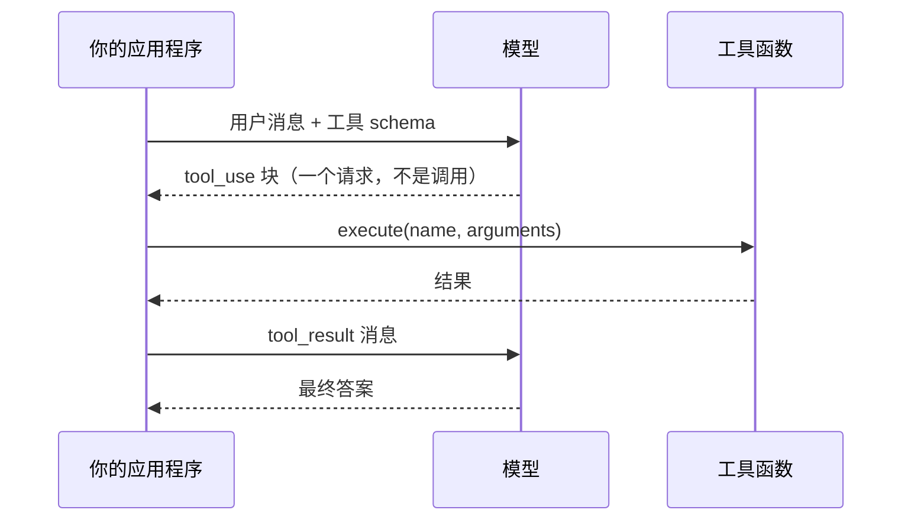

# 第 01 章 — 一次工具调用

## TL;DR

一次工具调用是每个智能体的原子单元。模型发出一个结构化请求，描述要运行哪个函数以及使用哪些参数；你的代码运行它；结果作为另一条消息反馈回来；模型写出最终答案。还没有循环，没有记忆，没有编排——只是一次往返。本章讲的是如何把这次往返做对。课程中的其他所有内容都是这同一机制的变体和堆叠。

---

## 为什么这很重要

问模型"4,892,769 的平方根是多少"，它会给出近似值。问它"东京现在的天气怎么样"，它会编造答案。这些不是 bug——对于一个没有计算器和网络的下一词预测器来说，这是正确的行为。

函数调用并不会让模型变得更聪明。它给了模型一种方式来向你的代码请求它自己做不到的事。模型决定*何时*请求，以及*用什么参数*；真正的工作发生在你能保证正确性的地方——你的代码中。一旦这个分工在你脑海中建立起来，你就会写出更好的工具，产出更少的问题智能体。

---

## 概念

### 模型写请求；你的代码做工作

想象一位能看懂餐厅但不会烹饪的厨师长。他写一张点单——"两个炒蛋，干面包"——交给厨房。厨房执行。菜肴端回来。厨师长摆盘上桌。

拥有工具的语言模型就是这位厨师长。他的"点单"是一个结构化的块，说明*调用哪个工具*以及*使用哪些参数*。它无法自己运行函数——什么都运行不了。你的应用程序就是厨房。

出了问题时，问题就变成了诊断：厨师长写了错误的订单，还是厨房做错了？两种不同的失败，两种不同的修复。一旦你能在脑海中区分它们，调试就不再像魔法一样难以捉摸。

### 四步循环



1. **描述工具。** 将用户消息连同工具定义列表一起发送——名称、描述、参数的 JSON Schema。
2. **模型发出请求。** 如果模型认为需要某个工具，响应中会包含一个结构化块——Anthropic 风格 API 中的 `tool_use`，OpenAI 风格中的 `tool_calls`——带有唯一的 `id`、工具名称和参数。
3. **你来执行。** 按名称查找函数，对照 schema 验证参数，运行它，捕获结果。
4. **反馈结果。** 发送引用同一 `id` 的 `tool_result` 消息。模型现在有了答案，写出最终回复。

```jsonc
// 模型在第 2 步发出的内容——一个请求，不是调用。
{ id: "call_abc", name: "get_weather", input: { city: "Tokyo" } }

// 你在第 4 步发回的内容——同一个 id，你的结果作为 content。
{ tool_use_id: "call_abc", content: "18°C, partly cloudy" }
```

无论工具是获取天气、查询数据库还是运行 shell 命令，协议都是一样的。线上格式不关心工具做什么；你关心。

### Schema 是契约

工具定义有三个模型可见的部分：

- **名称** — 模型用来调用它的标识符。
- **描述** — 告诉模型*何时使用它、何时不用，以及它返回什么*的散文。这是模型的唯一指引。模糊的描述（"获取天气"）会导致模型在错误的时机调用工具；精准的描述（"返回单个城市的当前状况；不要用于历史数据"）会减少错误。
- **输入 schema** — 每个参数的 JSON Schema：名称、类型、是否必填、每个字段的描述。

```jsonc
// 工具定义的形式——形状，而非特定 SDK。
{
  name: "get_weather",
  description: "Returns current conditions for a single city. \
                Use for weather questions; do not use for historical data.",
  input_schema: {
    type: "object",
    properties: { city: { type: "string", description: "e.g. 'Tokyo'" } },
    required: ["city"]
  }
}
```

让你的智能体用你自己的语言和技术栈写出你的第一个工具定义。它会做到的。读读它产出的内容，检查描述是否同时告诉了模型*何时*调用工具和*何时不*调用。生产智能体中一半的 bug 都源于描述没有说"不要用于 X"。

### Schema 和函数必须同步变更

工具调用中最常见的静默故障是 schema 漂移。你把代码中的参数从 `city` 改名为 `location`，但 schema 还是写着 `city`。模型忠实地发出 `{ "city": "Tokyo" }`。你的调度代码将其传给一个期待 `location` 的函数。函数在运行时崩溃——而看到 schema 的模型完全不知道为什么。

Schema 是你与模型签订的契约。违反契约，模型无从得知。将 schema 和处理函数视为一个整体；如果你修改其中一个，在同一次提交中修改另一个。Sebastian Raschka 关于编程智能体的演示对这一点阐述得尤为清晰——如果 schema 与处理函数的关系还让你感到模糊，值得一读。

### 坏输入和错误是消息，不是异常

模型发出的参数*大多数情况下*与 schema 匹配。有时它会发送一个字符串而非整数、省略一个标记为可选但实际上你的代码必需的字段，或者编造一个不在允许枚举中的值。函数本身也可能失败——文件未找到、网络超时、权限被拒绝。这些都不应该导致对话崩溃。

每个生产系统最终都会收敛到同一种模式：

- 执行前对照 schema 验证参数。
- 如果验证失败，将错误作为 `tool_result` 返回。不要抛出异常。
- 如果函数在运行时失败，也将*其*作为 `tool_result` 返回——附上对模型有用的消息，而不是堆栈跟踪。

模型非常擅长从它能读懂的错误中恢复。它无法从杀死进程的错误中恢复。将异常包装为 tool result，是智能体能够优雅重试与悄然停在任务中途的区别。

### 工具结果有形状

关于结果，有两点在你真正交付之前不会显而易见。

**`id` 的往返是强制性的。** 每个 `tool_use` 块都有一个 `id`。你的 `tool_result` 必须引用同一个 `id`。丢失了关联，模型就无法将结果与请求对应上——对话会以令人困惑的方式出错。这是机械性的操作，容易遗漏，值得写一个单元测试。

**大结果不属于内联。** 一个返回 50 KB 的 grep，或者返回 2 MB 的文件读取，会撑爆你的上下文窗口，破坏你的提示词缓存，让此后的每个轮次都变慢。生产中的模式是：如果结果超过某个阈值，就给模型发送一个摘要加一个指针，并将完整内容存放在模型需要时可以请求的地方。OpenCode 为此封装了一个专用的截断服务；Hermes Agent 为每个工具强制执行结果大小限制。你的智能体可以在十分钟内为你的技术栈构建出等价的实现。

### 值得了解的提供商特定开关

四步循环是通用的。各提供商在此基础上叠加了一些控制项和模式，以有用的方式改变循环的行为。六个在投入生产前值得了解：

- **`tool_choice`。** 每个请求控制模型是*必须*调用某个工具、*可以*调用任意工具、*不得*调用工具，还是*必须调用特定工具*。当你知道答案需要工具时（路由层），使用"必须调用 X"；想要纯文本时，使用"none"。Anthropic、OpenAI、Bedrock 和 Gemini 都以某种形式支持这一点。
- **并行工具调用。** 现代提供商允许模型在一次响应中发出多个 `tool_use` 块。OpenAI 提供了一个每请求的 `parallel_tool_calls: false` 开关，当你的下游无法处理乱序时可以关闭。第 02 章介绍循环如何调度多个调用；这个开关就在这里。
- **严格 schema 模式。** OpenAI 的 `strict: true`（以及其他地方的等价物）保证模型产出的参数与 JSON Schema 完全匹配。开启严格模式，你可以跳过一半的验证代码；关闭时，必须在调度边界处做防御。权衡：严格模式限制了 schema 可以表达的内容（支持的 JSON Schema 特性更少）。
- **结构化输出。** 工具调用的近亲。不是*用这些参数调用这个工具*，而是告诉模型*用这个 schema 的 JSON 格式来回复*。相同的 JSON Schema 规范；不同的机制（`response_format` 字段，而非工具定义）。当模型的最终答案是数据而非动作时使用它。
- **托管（内置）工具。** 提供商附带了他们自己执行的工具——网络搜索、代码执行、文件搜索、计算机使用。线上的 schema 和 tool-use 形状看起来一样，但结果返回时你的调度代码并没有运行。权衡：集成更简单，但对运行内容和计费方式的控制更少。
- **拒绝和内容过滤。** 模型可以以安全为由拒绝调用某个工具（或任何工具）。Anthropic 以 `refusal` 块的形式呈现这一点；OpenAI 以不同的内容类型或完成原因呈现。将拒绝视为任何其他工具结果——记录它，向用户展示，让循环继续。第 18 章涵盖更深层的威胁模型；本章只是希望你知道拒绝是存在的。

线上格式和确切的字段名称会变动；概念是稳定的。在你接入任何这些功能的当天，向你的智能体索取当前的提供商文档。

### 提供商各异，概念不变

Anthropic 使用 `tool_use` 和 `input`。OpenAI 使用 `tool_calls` 和 `arguments`。Bedrock 有自己的形状。更高层的 SDK（Vercel AI SDK、LangChain、Hermes Agent 和 OpenCode 中的自定义适配器）在它们之间做了规范化。字段名称会变化，机制——模型发出结构化请求、代码运行它、结果返回——在所有地方都是一样的。如果你能读懂一个提供商的文档，五分钟内就能读懂另一个的。

如果你在认真构建，就在工具后面隐藏一个小适配器，这样你的工具就不需要关心上周用的是哪个提供商。OpenCode 和 Hermes Agent 都正是这样做的；让你的智能体为你的技术栈搭建脚手架。

---

## 真实系统注记

- **OpenCode** 用一个小型 `Tool.define` 辅助函数定义带类型 schema 的工具，将每次调用追踪为一个类型化的生命周期对象，并通过专用服务截断大型输出。这是"干净的工具注册表看起来像什么"的最佳参考。
- **Hermes Agent** 使用 `ToolEntry` 对象，将 schema、处理函数和每个工具的结果大小限制捆绑在一起，并将工具错误分类为可恢复和致命两类，以便循环知道是否重试。
- **OpenClaw** 和 **Paperclip** 表明"工具"不必是本地函数。渠道适配器、工作流步骤、shell 命令，甚至对其他智能体的调用，都可以成为模型可以调用的工具——只要它们满足同一个名称+schema+结果的契约。

---

## 与你的智能体配对

以下提示词在本章效果很好：

- *"用我的语言和技术栈定义一个来自我项目的工具。让描述告诉模型何时使用它、何时不用。然后给我看模型调用它时会发出的确切 JSON。"*
- *"重命名处理函数中的一个字段，但不改 schema。模拟一次模型调用，精确展示失败是如何发生的——以及我应该在哪里捕获它。"*
- *"包装我的工具，使任何被抛出的异常都变成模型可以读取并从中重试的 `tool_result` 错误。给我展示前后对比。"*
- *"实现结果截断：如果工具返回超过 4 KB，就给模型发送摘要并将完整结果写入一个模型可以请求的临时文件。"*
- *"带我走一遍 OpenCode 如何定义和调度工具，然后用我的技术栈写出等价的实现——保持相同的形状，但使用我的惯用法。"*

---

## 接下来

一次工具调用是原子。第 02 章把它放入一个带有停止条件、重试和将调用链接为多步工作的循环中。那就是聊天机器人结束、智能体开始的边界。
