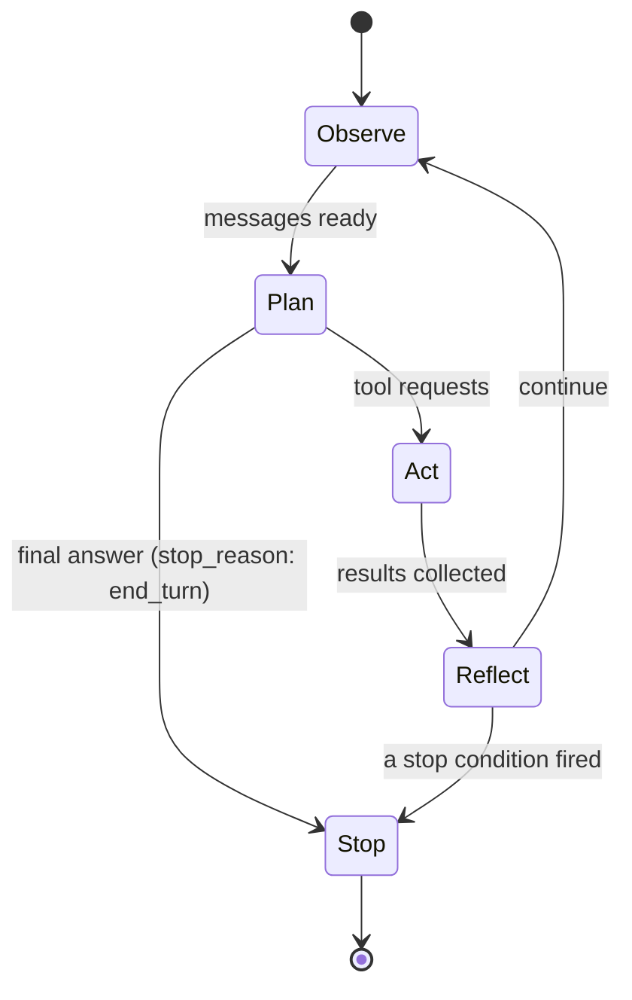
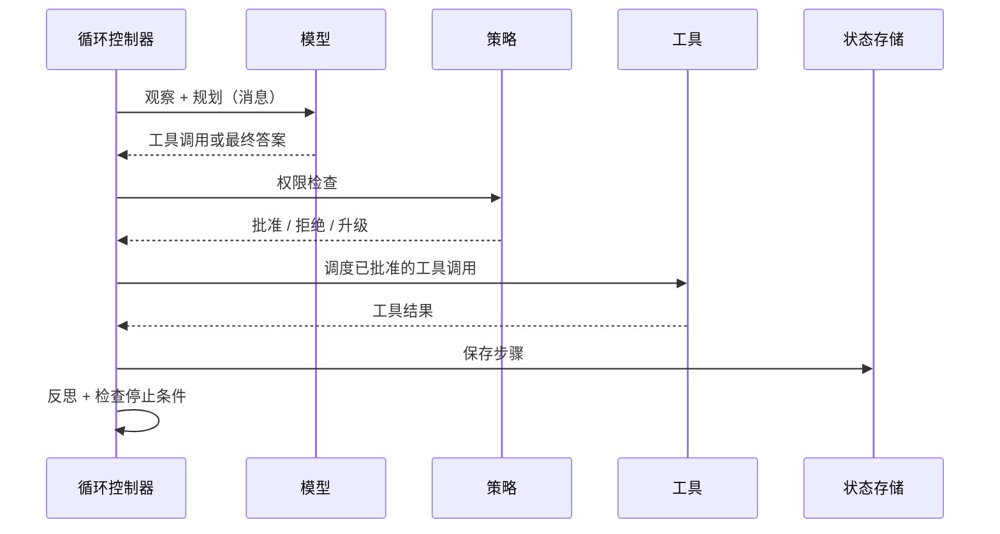

# 第 02 章 — 智能体循环

## TL;DR

第 01 章是一次工具调用。本章将这个调用包裹在一个循环中。模型发出工具请求，你的代码运行它，结果返回，模型再次决定——是继续调用另一个工具还是停止。难点不在于循环体；难点在于停止。停止条件设置错误，要么构建出一个思考到一半就退出的聊天机器人，要么构建出一个运行到账单爆炸的智能体。本章涵盖循环的形状、结束循环的各种方式、隐藏其中的故障模式，以及每个生产级能力——持久化、可观测性、权限、审批、压缩——最终附着其上的步骤边界。

---

## 为什么这很重要

一位同事递给你一个"演示中正常运行但在生产中会永远跑下去"的智能体。你读代码。循环在那里。模型发出工具调用。工具结果流回来。但没有任何东西告诉模型何时停止，也没有东西告诉循环当模型永远不说它完成时该怎么办。你加上 `if step > 20: break`。循环退出了——但现在它在回答到一半时退出。你把 break 移到模型回复之后。大多数时候它能干净地退出，但偶尔模型会在看似最终答案之后再发出一次工具调用，你会悄无声息地错过结果。你在这上面花了一天时间。

修复方法不是更多代码。修复方法是理解一个循环有*几种*结束方式，所有这些方式都必须在场，并且模型自身的 `stop_reason` 是主要信号——而非一个行计数器。

---

## 概念

### 一次工具调用很少够用

一个简单的问题——"东京天气怎么样"——一次调用就够了。一个真实的问题——"东京这周末天气适合野餐吗，如果是的话，我周六的日历有空吗？"——至少需要一次天气查询、一次日历查询，以及一次比较。两次调用，可能相互依赖，也许还需要第三次来澄清。你无法提前规划到底需要多少次调用；模型必须在每一步，根据它迄今学到的内容来决定。

这就是智能体循环：第 01 章的循环不断重复，每轮结束后都有一个决策点——继续，还是停止？

### 五个阶段

想象一个繁忙餐厅上菜时间的厨房。主厨（模型）喊出订单，厨房（你的工具）执行，主厨品尝回来的东西再喊下一轮——直到菜品摆盘送出去。副主厨（你的循环控制器）不决定菜品什么时候做好。主厨决定。但如果主厨沉默了，或者在盘子已经离开备餐台之后还在喊订单，副主厨需要一个备用方案——一个预算、一个计时器、一只按在铃上的手——来防止厨房陷入混乱。

随便叫它什么——ReAct、规划与执行、思考-行动-观察。在底层，同样的五个阶段总是出现：

- **观察（Observe）。** 收集模型需要的一切：用户消息、系统提示词、先前的工具结果、检索到的上下文。在实践中，这就是不断增长的消息数组。
- **规划（Plan）。** 调用模型。它返回工具请求、最终答案或问题。你的代码在这里不做决策；模型做。
- **行动（Act）。** 执行工具请求。一次调用或多次——与第 01 章写的调度相同，现在在循环内部。
- **反思（Reflect）。** 将工具结果附加到消息数组，带有匹配的 ID。模型现在可以看到发生了什么。
- **停止（Stop）。** 检查是否有停止条件触发。如果有，返回。如果没有，回到观察阶段。



### 循环实际携带的内容

循环不只是遍历消息数组。在迭代之间，它还持有：

- **迄今已花费的 token** — 用于预算检查。
- **步骤计数** — 用于迭代上限。
- **最近工具调用的简短历史** — 用于死循环检测（见下文）。
- **一个中止令牌** — 以便用户或系统的其他部分可以在循环中途取消。
- **系统提示词** — 在迭代之间保持字节稳定，以便前缀缓存持续命中（第 04 章解释了原因）。

只有当你第一次尝试从崩溃中*恢复*一个循环时，你才会意识到循环携带了多少内容。那是第 08 章要解决的问题。现在只需知道，消息数组不是全部故事。

### 停止条件是一个谱系，不是一个清单

每个生产循环使用多个停止条件，从最软到最硬分层叠加：

- **模型驱动的停止。** 模型不返回工具调用，完成原因为 `end_turn`（OpenAI 风格 API 中为 `stop`）。这是主要信号——模型认为自己完成了。
- **显式的 `final_answer` 工具。** 在注册表中添加一个 `final_answer(text)` 工具。使它成为模型提交结果的唯一合法方式。这强制实现有意识的结束，防止在答案存在后漂移到额外的调用，并为你提供一个干净的标准输出以供记录。
- **宽限调用（Grace call）。** 当预算即将耗尽时，一些系统给模型最后一轮，提示词中有这样的信息："你还有一轮；请收尾。" 模型通常会干净地结束。没有这个，硬上限会切断正在进行的思考。OpenClaw 是这一模式的最清晰参考。
- **步骤上限。** 迭代次数的硬性上限——通常是 10–50，长时间运行的助理系统有时约为 90。这是安全网，不是主要的停止方式。如果你的循环大多数时候在这里结束，说明上游有什么地方出了问题。
- **Token 或成本上限。** 当总 token 数或累积成本超过阈值时退出。返回迄今已产生的内容，标记为部分结果。

线上的形状：

```ts
// 最小化循环——形状，不是你的最终代码。
for (let step = 0; step < MAX_STEPS && totalTokens < TOKEN_BUDGET; step++) {
  const response = await llm.complete({ messages, tools });
  totalTokens += response.usage.totalTokens;

  // 模型驱动的停止或显式 final_answer。
  if (isFinalAnswer(response)) return finalize(response);

  // 行动 + 反思。
  for (const call of response.toolCalls) {
    const result = await dispatch(call.name, call.args);
    messages.push(toolResult(call.id, result));
  }
}
return partialResult(messages, "budget_exhausted");
```

让你的智能体将其翻译到你的技术栈，然后添加宽限调用行为，这样你就不会悄无声息地在思考到一半时被切断。

### 有时正确答案是压缩，而不是继续或停止

在每一步之后，循环实际上有三个选择，不是两个：继续到下一次迭代，因为某个条件触发而停止，或者*压缩*——暂停，缩小消息数组，然后继续。压缩在上下文窗口开始填满时触发；OpenCode 的会话处理器监控一个可用上下文计算，Hermes Agent 从 token 溢出检查触发压缩。具体的压缩机制——剪切什么、总结什么、逐字保留什么——属于第 05 章。*在这里*需要认识到的是，循环有第三个杠杆，而不只是一个开/关开关，并且步骤边界是它被拉动的地方。

### 错误也是轮次

当工具失败或模型发出格式错误的工具调用时，正确的做法——几乎总是——是将错误作为 `tool_result` 附加并继续循环。模型非常擅长读取错误，然后要么用更正的参数重试，要么转向不同的方法。从循环中抛出异常几乎永远不是正确答案。

两类错误需要关注：

- **瞬态的。** 网络故障、速率限制、模型过载。按退避策略重试（生产系统使用从几秒到两小时的调度）。在反复失败的情况下，回退到*兼容*的模型——一个支持相同工具 schema、拥有本轮所需上下文窗口大小，并满足任务推理能力和内容策略要求的模型。缺少主要模型的工具格式、上下文大小或策略一致性的回退，不是回退——而是另一种故障模式。Hermes Agent 和 OpenClaw 都提供了可配置的回退链；链的定义是兼容性声明的地方。
- **永久性的。** 凭证无效、schema 验证失败、工具不在注册表中。立即呈现。再多的重试也无法修复它。

每个值得研究的系统都收敛到相同的形状：先分类错误，然后路由到重试、回退或呈现。让你的智能体将 `classify_error(err) → action` 接入你的循环，并写测试证明每个类别都正确路由。

### 死循环及其检测方法

最常见的失控模式是*死循环*：模型连续三四次用相同参数调用同一个工具，得到同样无用的结果，却从未注意到自己卡住了。OpenCode 和 Hermes Agent 都提供了明确的检测——通常的规则是"如果最近三次工具调用具有相同的名称和相同的参数，就暂停并请求继续的许可"。

逐字节相等检查能捕获大多数情况。它捕获不了那种调用形状变化但没有实际进展的慢循环——`read(file, offset=0)` → `read(file, offset=100)` → `read(file, offset=200)` ——模型一直在"查看"但从未发现任何东西。对于这些情况，你需要一个跟踪自身进度的工具，或者一个启发式方法来判断消息数组在没有产生有用输出的情况下增长了多少。大多数团队从逐字节检查开始，加一个步骤上限，并接受成本预算会捕获更微妙的卡住状态。

### 一轮中的并行工具调用

现代提供商允许模型在单次响应中发出多个工具请求。如果这些工具是独立的且可以安全并发运行，你应该这样做——这会大幅减少挂钟延迟。OpenClaw 和 Hermes Agent 的模式是：将每个工具标记为 `concurrency_safe: true | false`，安全的工具在工作池（8 个 worker 是常见上限）上并行运行，不安全的则串行。只读工具是安全的。任何写入、发送或支付的操作都不是。

### 流式传输、部分增量和拒绝

现代提供商以块的形式流式传输响应：文本 token、推理块、工具调用块、完成原因，有时还有拒绝或安全停止。循环必须在行动之前将这些组装成一张连贯的图。只有在流式传输模式下才会出现的五个问题：

- **工具调用参数增量到达。** OpenAI 风格的流式传输将工具调用参数作为 JSON 字符串增量发出——`{"city"` 然后 `: "Tok` 然后 `yo"}` ——跨越多个事件。循环必须在解析和调度之前，积累给定工具调用 `id` 的所有增量。在部分片段上调度是最常见的流式传输 bug。
- **参数中格式错误的 JSON。** 即使在积累之后，模型也可能发出无法解析的 JSON——尾部逗号、未终止的字符串、没有值的键。将其视为任何其他可恢复错误：返回一个说明*"你的参数无法解析；错误如下；请重试"*的 `tool_result`，让下一轮纠正。模型很擅长在看到解析错误时修复自己的 JSON。
- **拒绝作为终止轮次。** 模型可以以安全为由拒绝调用某个工具（或任何工具）。Anthropic 发出 `refusal` 块；OpenAI 呈现不同的内容类型或完成原因。对于循环来说，以拒绝消息而非工具结果结束这一轮。记录它；向用户展示；不要对同一提示词盲目重试。
- **流式传输中途的安全停止。** 响应可能被提供商的内容过滤器截断——流以 `finish_reason` 为 `content_filter`（OpenAI）或其等价物结束。将其视为该轮的终止性失败；如果有用就呈现部分输出；不要盲目重试（同一过滤器会在同一输入上再次触发）。
- **流式传输中途的取消。** 下一小节中的中止令牌也适用于流，而不仅仅是下一个轮次边界。干净的取消停止从提供商读取，关闭连接，不提交任何半成品的工具调用。任何已调度的操作都会收到一个*"用户已取消"*的 tool_result。

线上格式因提供商而异；循环的响应形状——积累、验证、调度或呈现——在任何地方都是一样的。

### 中断和取消

用户按下 Ctrl-C、超时触发、父进程决定循环持续太久——所有这些都需要向内传播。模式是：每个循环持有一个中止令牌，每个长时间运行的步骤检查它，触发的令牌以部分结果干净地展开，而不是撕裂进程。"中断在工具调用中途到达"值得专门思考：让工具完成（或让它自己检查令牌），而不是让一个半完成的写入成为孤儿。

### 步骤边界是一切附着的地方

行动和反思之间的过渡——在结果被收集之后、被附加之前——是自然的检查点。在那个时刻，循环持有一个完整的工作单元：一个计划、一组工具调用、一组结果。五类生产能力挂靠在这个边界上：

- **持久化。** 保存状态。在崩溃中存活，不重复昂贵的工作。→ 第 08 章。
- **可观测性。** 每步发出一个结构化追踪：调用的工具、使用的 token、延迟、错误计数。→ 第 16 章。
- **权限检查。** 在调度之前设置行动阶段的门控。→ 第 03 章、第 12 章。
- **人类审批。** 在高风险操作之前暂停并等待批准。→ 第 12 章。
- **上下文压缩。** 裁剪过大的结果，去重，总结旧轮次。→ 第 05 章。



循环体很小。围绕它的边界才是生产系统真正所在的地方。

---

## 真实系统注记

- **OpenCode** 在 `SessionProcessor` 内部运行循环，为每一步的每个部分流式传输事件，通过工作池调度工具，并在上下文窗口开始填满时触发压缩。
- **Hermes Agent** 在 `run_conversation` 中运行类似的循环，迭代上限约为 90，有一个在速率限制错误时轮换 API 密钥的凭证池，以及用于上下文溢出恢复的回退模型链。
- **OpenClaw** 是宽限停止行为最清晰的参考：它计数迭代，在预算还剩一次时给模型一次*宽限调用*，然后才强制硬停止。
- **Paperclip** 本身不运行内部循环——适配器来做。它的工作是*循环的循环*：调度、心跳、从分钟到小时的重试策略、存活审查、持久运行日志。

---

## 与你的智能体配对

以下提示词在本章效果很好：

- *"将最小化循环伪代码翻译到我的技术栈。添加宽限调用行为和其他四个停止条件。告诉我每个条件在哪里触发。"*
- *"实现死循环检测：对最近三次工具调用做逐字节相等检查。带我走一个真实的卡住模式被捕获的测试用例，以及一个被遗漏的测试用例。"*
- *"将这些错误分类为瞬态或永久——速率限制、schema 验证失败、工具未找到、模型过载、凭证过期——将 `classify_error → action` 接入我的循环，并写测试。"*
- *"通过我的循环接入一个中止令牌。告诉我当用户在工具调用中途取消与在模型调用中途取消时分别发生什么，以及部分结果是如何形成的。"*
- *"带我走一遍 OpenCode 的 SessionProcessor 如何在继续、压缩和停止之间做决策。然后用我的技术栈写出等价的实现——保持相同的形状，使用我的惯用法。"*

---

## 接下来

你有了一个循环。循环接下来需要的是它可以信任的工具。第 03 章讲的是超越 schema 的契约——参数验证、副作用分类、幂等性、可恢复错误与致命错误的区别，以及为什么安全路径比安全代码更重要。
