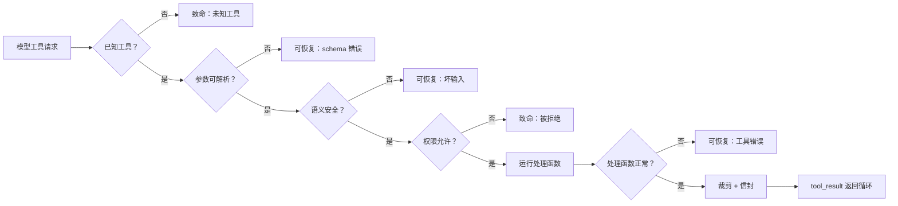

# 第 03 章 — 智能体可以信任的工具

## TL;DR

工具的 schema（第 01 章）是模型看到的内容。超越 schema 的契约是循环需要的内容。一个生产级工具还携带元数据——只读还是破坏性，是否可安全并行，是否幂等，是否开放世界——循环在调度前读取这些元数据。它经过一个有特定顺序的验证流水线：已知的、然后类型化的、然后语义安全的、然后被允许的、然后可执行的。它返回一个结果信封，使失败变成轮次而非崩溃。并且它为模型裁剪输出，同时为你保留完整版本。本章讲的是那些能将工具从"模型可以调用的函数"变为"智能体可以被信任使用的函数"的小型不变量。

---

## 为什么这很重要

三个简短场景。

你给智能体一个 shell 工具。模型将 `rm -rf` 写向错误的路径。没有权限门控，没有沙箱，没有办法在执行前检查命令。智能体做了你让它做的事：它调用了工具。

你给智能体一个电子邮件工具。一次瞬态网络故障使第一次调用超时。循环重试。客户收到了两封邮件。这次"发送"不是幂等的。

你给智能体一个部署工具。它很快返回 `"ok"`。模型认为成功并继续。三小时后你发现部署从未真正到达集群——API 静默地丢弃了请求，而工具返回了其乐观的默认值。

这些都不是模型的失败。它们是工具系统的失败。修复方法是将工具边界视为契约——带有元数据、验证、错误和结果，都是有意为之的形状。

---

## 概念

### 工具也是模型的思考方式

工具是模型的双手。不那么明显的是，工具也是模型的*词汇*。一个叫 `edit_file(path, new_content)` 的工具教会模型用编辑来推理。一个叫 `run_shell(command)` 的工具教它用 bash 来推理。一个叫 `book_meeting(participants, when)` 的工具教它推理日程安排。

因此，设计工具不仅仅是接口决策——也是提示词决策。每个工具名称和 schema 都在每轮的系统提示词中（第 04 章解释了为什么这对缓存很重要）。模型读取它们，内化它们，并伸手取用它们。一小组命名良好、schema 清晰的工具产生的推理，比一大组通用工具更为精准。*更少的手，更锋利的手。*

OpenCode 使这一点具体化：`explore` 智能体获得只读工具（搜索、读取、glob）；`build` 智能体增加了写入；专业智能体获得进一步定制的集合。模型不是通过获得更多工具变得更聪明的——而是通过获得*正确的*工具。

### 验证流水线

每次工具调用在触及真实副作用之前经过的五个阶段：



顺序很重要。便宜的检查先运行——*已知的*在*类型化的*之前，*类型化的*在*语义的*之前，*语义的*在*权限的*之前，*权限的*在*执行的*之前。在解析一个巨大的 JSON 块之后才拒绝权限会浪费 token。在处理函数已经打开文件之后才进行语义检查（路径在工作区内）已经太晚了。参考系统中的每个系统都大致收敛到这个顺序，即使它们对各阶段的命名不同。

每个阶段决定失败是否可恢复（模型可以读取错误并重试——schema 错误、错误路径、文件未找到）还是致命的（循环应该停止或升级——未知工具、权限被拒绝、凭证过期）。那个可恢复/致命的区分就是第 02 章的循环所读取的内容。

### 工具元数据——循环读取的标志，不是模型读取的

除了模型看到的 schema，每个工具还携带循环使用的一小组标志：

```ts
// 工具定义——schema 是模型的视角；其余部分是循环的视角。
{
  name: "edit_file",
  description: "Replace the contents of a single file in the workspace.",
  input_schema: { /* 模型的视角 */ },

  // 循环的视角。
  read_only:        false,
  destructive:      true,    // 权限门控 + 审批（第 12 章）
  concurrency_safe: false,   // 不能与兄弟任务并行运行（第 02 章）
  idempotent:       true,    // 瞬态失败时可安全重试
  open_world:       false    // 给定参数结果是确定性的
}
```

每个标志启用的能力：

- **`read_only`** — 适合受限模式智能体（例如不能改变状态的 `explore` 智能体）。
- **`destructive`** — 触发权限询问或人类审批（第 12 章）。
- **`concurrency_safe`** — 适合第 02 章中的并行调度工作池。
- **`idempotent`** — 循环可以在瞬态失败时重试同一调用，无需显式幂等键。
- **`open_world`** — 结果可能在调用之间变化（网络获取、时间、随机数）；harness 不应像缓存 `read_file` 那样缓存或去重它。

OpenCode 在其 `Tool.Def` 接口上编码了等价内容；Hermes Agent 在注册时附加类似的标志；OpenClaw 和 Paperclip 都按副作用类别对工具进行分类，以驱动其审批和重试策略。确切名称各异；*思想*——schema 供模型使用，元数据供循环使用——是通用的。

### 调度契约：工具可以假定什么

上面的元数据是循环从工具读取的内容。还有一个对称的方向：工具可以从循环读取什么。当你的处理函数被调用时，调度器已经完成了验证流水线第 1–4 阶段的工作。处理函数可以依赖它。工具接收一个 `ToolContext`（或 `ToolUseContext`），其中携带：

- **工作区根目录**和配置的沙箱路径——已解析完毕。
- **调用智能体的身份**（以便工具知道它在 `explore` 还是 `build` 下运行，并可以相应地调整行为）。
- **循环正在遵守的中止令牌**——长时间运行的工具应该定期检查它。
- **日志记录器和追踪器**，已预配置为当前步骤、工具名称和调用 id，因此工具的每一行日志都能追溯到追踪记录（第 16 章）。
- **harness 强制执行的每工具预算**（每次会话最大调用次数、最大返回字节数、每次调用最大挂钟时间）。

工具依赖这些。它不重新检查权限，不重新解析路径，不发明自己的日志文件。这种分离——*调度器负责边界，工具负责工作*——使双方都可以独立测试。OpenCode 的 `Tool.Def` 和 Hermes Agent 的 `ToolEntry` 都明确编码了这一点；OpenClaw 和 Paperclip 通过它们的钩子界面传递等价的上下文。

检验你的边界是否干净的一个有用测试：你能在单元测试中直接调用 `send_message({to, body}, ctx)`，而无需启动循环吗？如果可以，你的契约形状良好。如果不能，工具已经绕过调度器获取了它本应作为 `ctx` 的一部分接收的东西——你有一个泄漏，总有一天会为此付出代价。

### 验证前先消毒

在 schema 解析器看到模型的参数之前，有几个廉价的清理步骤值得先运行。模型可以发出技术上有效的 JSON 但操作上危险的字节：杂散的空字节、来自截断流的孤立代理对、从工具结果粘贴进来的 ANSI 转义序列、BOM、不匹配的行尾。Hermes Agent 的对话循环在进入时剥离这些；生产 shell 工具在各参考系统中直接拒绝任何包含 `\0` 的参数。

经验法则：*进入时消毒，输出时转义，永远不要颠倒顺序。*进入时，你是在保护流水线的其余部分免受奇怪字节的影响。输出时——将字符串传递给子进程、shell、SQL 驱动程序、模板引擎——你是在保护世界免受模型刚刚发出的任何内容的影响，无论它看起来多么干净。

### 验证不仅仅是"JSON 可解析"

Schema 验证是必要的，但不充分。模型可以发出解析干净但仍然错误的 JSON：

- 像 `../../etc/passwd` 这样的路径，字符串匹配工作区前缀，但在解析时会逃逸出去。
- 指向 `localhost:25` 的 URL，你的 URL 允许列表会拒绝。
- 解析为正整数但会撑爆你的上下文窗口的 `limit: 100000`。
- 像 `user_id: "self"` 这样的标识符，模型从训练数据中发明的，而非来自你的领域。

模式：*语义*检查与*schema*检查并列，并在处理函数*之前*运行。典型案例是路径安全——永远不要通过字符串前缀来决定路径是否在工作区内，也永远不要单独信任*文本*解析。`path.resolve` 是纯词法的：它看不到 `workspace/innocent_link` 是指向 `/etc/passwd` 的符号链接。一个不跟踪符号链接的工作区检查（通过 `realpath`、每组件带 `O_NOFOLLOW` 的 `openat`，或你平台的等价物）会放过错误的路径，处理函数会愉快地在边界之外读写：

```ts
// 解析符号链接，然后做结构性比较。单纯的文本解析不安全。
async function resolveInsideWorkspace(workspaceRoot, requestedPath) {
  // 解析根目录本身的符号链接——有时工作区是通过链接访问的。
  const root = await fs.realpath(workspaceRoot);

  const joined = path.resolve(root, requestedPath);

  // 如果目标存在，完全解析其符号链接。
  // 如果它尚不存在（即将被创建），解析最深层现有祖先的符号链接；
  // 永远不要操作未解析的路径。
  const real = await realpathOrParent(joined);

  const relative = path.relative(root, real);
  if (relative.startsWith("..") || path.isAbsolute(relative)) {
    return { ok: false, fatal: true,
             error: `Path is outside the workspace: ${requestedPath}` };
  }
  return { ok: true, value: real };
}
```

同样的形状适用于 URL 允许列表（解析到主机*并*在重定向后检查，永远不要信任输入 URL 本身）、shell 工具（将程序加入允许列表，永远不要用 `bash -c`），以及标识符（在信任之前在你的领域查找值）。教训可以推广：任何对名称——路径、URL、表、标识符——的*字符串形式*进行操作的检查，在你将名称解析到它实际指向的事物之前都是不完整的。生产智能体中每个工作区逃逸 bug 都可追溯到 `startsWith` 或缺少 `realpath`。

### 试运行是验证模式，不只是审批 UI

对于一个会改变世界的工具，*"你能描述你会做什么而不真正去做吗？"*本身就是一种验证模式。一个带有 `dry_run: true` 参数的 `delete_file` 工具，返回*"将删除 /workspace/foo.txt（143 字节，两周前最后修改）"*而不真正删除，可以在错误发生之前捕获它——无论是人为错误（你在审批对话框中误读了参数）还是模型错误（模型从陈旧的记忆中猜测了错误的路径）。

生产系统为审批 UX 使用这一功能（第 12 章涵盖了对话框），但底层机制——*工具可以预览自己的效果*——是一个验证原语。一次性内置它，你同时获得四样东西：更清晰的审批 UI、模型在破坏性操作前自我检查的路径、有用的调试界面，以及测试的脚手架。不是每个工具都需要它。读取操作不需要。任何破坏性的操作都应该有。

### 错误以消息形式返回，附带提示

第 02 章介绍了错误是轮次而非异常的规则。那个轮次的形状很重要。循环从工具结果中读取三样东西：

```ts
// 结果信封——循环看到的内容，无论成功还是失败。
type ToolResult =
  | { ok: true,  content: string,
                 meta?: { duration_ms, file_hash, exit_code } }
  | { ok: false, recoverable: boolean,
                 code: string, message: string, hint?: string };
```

`hint` 字段是秘密武器。一个光秃秃的错误消息——`"file not found"`——让模型开始猜测。一个带有提示的错误——`"file not found; available files in this directory: src/index.ts, src/util.ts"`——给模型指出下一步。Hermes Agent 的工具错误携带这种结构化指引，生产中领先的编程智能体也是如此。这几乎不费代价，但明显缩短了循环。

什么算作*致命的*取决于 harness 的恢复能力，而不是错误标签。当人类可以触达时，*权限被拒绝*可以是一个审批门控（第 12 章）。当工具是动态加载的或模型猜测了一个接近真实工具的名称时，*未知工具*可以是一次注册表刷新。*凭证过期*当 harness 有刷新路径时可以是一次凭证修复。工具报告它所知道的——错误代码和它无法访问的资源。循环决定是升级、询问、修复还是停止。为残余情况保留 `recoverable: false`：harness 没有恢复能力的任何情况。其他一切——包括从你角度看大多数"错误"——都是可恢复的，模型非常擅长从一个形状良好的消息中恢复。

### 幂等性是契约的一部分

重试在智能体系统中是正常的（第 02 章涵盖了瞬态错误和回退链）。任何有副作用的操作都需要是可安全重试的。标准模式是从调用派生的幂等键：

```ts
// 按操作意图限定键的范围——不仅仅是工具名称和参数。
const key = sha256(JSON.stringify({
  tool: "send_message",
  args,
  version: 1,
  // 范围：在不同轮次的刻意重复必须产生不同的哈希。
  // 当 API 暴露下游幂等令牌时优先使用；
  // 否则按用户认为他们正在执行的工作单元来限定范围。
  scope: args.idempotency_key ?? ctx.turn_id ?? ctx.run_id
})).slice(0, 32);

async function send_message(args, ctx) {
  const cached = await ctx.idempotency.get(key);
  if (cached) return ok(cached.result);

  const result = await ctx.messageClient.send(args);
  await ctx.idempotency.put(key, { result });
  return ok(result.messageId);
}
```

读取操作天然是幂等的——调用 `read_file` 两次返回相同的字节。写入、发送、支付、评论和工作流转换需要显式键。如果工具在其元数据中是 `idempotent: true` *并且*使用了这样的键，循环可以在任何瞬态失败时重试，无需事先询问你。

一个常让团队措手不及的小注意事项：键编码的是*意图*，不是*交付尝试*。对参数进行哈希，这样同一调用的重试就会命中缓存。对操作的范围进行哈希——轮次、运行，或下游幂等令牌——这样*刻意的*在不同轮次的重复（用户说*"实际上，再发一次同样的消息，是有意的"*）会产生不同的键并通过。单独对工具加参数进行哈希太粗糙了：它会对刻意的重发进行去重。如果下游系统有自己的幂等头（Stripe、大多数现代 HTTP API、每个构建良好的队列），将其穿透并让下游成为真相来源，而不是在其上面重新计算一个。

### 模型看到的与你保留的

工具结果有两个受众。模型需要紧凑的、结构化的、没有噪音的内容。你——以及之后的人工审计员——需要完整的内容。

模式：*为模型裁剪，完整持久化。*OpenCode 的截断服务将完整输出写入临时文件，返回摘要和指针；Hermes Agent 为每个工具强制执行最大结果大小；Paperclip 将长适配器输出分块存储为 64-KB 的块在其事件存储中。形状在它们之间是相同的：消息数组是*显示*界面，不是*存储*界面。

随之而来的三个习惯：

- **在内容旁边包含元数据。** `read_file` 的结果携带字节数和哈希；shell 命令携带退出代码和持续时间；网络调用携带状态码。模型往往从这些中获取的推理信息不亚于从正文中获取的。
- **使截断可见。** 静默裁剪教给模型一个虚假的视图。插入一个清晰的标记——`...[120 KB clipped; full result at <ref>]...`——这样模型就知道它没有得到完整内容，并可以在需要时请求更多。
- **注意静默成功陷阱。** 返回 `"ok"` 的工具并不能证明任何事情发生了。如果你能验证（回声行、哈希文件、重读资源），就在工具内部这样做，并将证明放入元数据。开头场景中的部署工具，如果它返回的是集群对资源的视图而非乐观的默认值，本可以捕获自身的失败。

### 输出 schema、版本控制和来源

第 01 章中的 schema 描述了工具的*输入*。生产工具还声明了*输出 schema*——它返回内容的形状——以及一些小契约，一旦你重放会话、升级工具或审计结果，这些都会有所回报。

- **输出 schema。** 在输入 schema 旁边声明结果形状。在裁剪之前对照它验证处理函数的返回值。如果下游 API 悄悄地从 `{ id, status }` 改为 `{ id, state }`，你希望在工具边界处得到一个可恢复的验证错误，而不是一个无声的通过，让模型之后错误地解读。输出 schema 也允许一个工具的结果干净地流入另一个工具的输入——当模型知道哪些字段会存在时，它推理得更好。
- **Schema 版本控制。** 每个工具携带一个版本。在输入*或*输出 schema 的任何破坏性更改时增加版本号。版本流入幂等键（上文）、提示词缓存指纹（第 04 章）和评估基准线（第 16 章），这样旧运行可以继续引用旧契约，而不是静默地接受新的。重命名参数是破坏性更改。添加带有默认值的可选参数不是。
- **依赖风险。** 工具的代码不是一个封闭系统——它导入库、与下游 API 通信，有时还调用系统二进制文件。每一个都是模型无法推理的失败面：降级的上游或库回归会变成令人困惑的错误，智能体会在上面循环。在注册表条目上声明外部依赖项（哪个 API、哪个库版本、哪个二进制文件），锁定它们，并将依赖失败映射到清晰的代码，如 `upstream_unavailable`，这样 `hint` 读起来是*"下游服务降级，请几分钟后重试"*，而不是堆栈跟踪片段。
- **结果来源。** 每个结果至少携带：工具名称和版本、时间戳、产生它的下游资源（API 端点、文件路径、DB 查询），以及所使用的身份或范围。模型很少需要所有这些；审计会话的人、重放它的工程师，以及为下一次部署设置关口的评估流水线都需要。完整持久化；从模型看到的版本中裁剪。

OpenCode 的工具生命周期对象在每次调度时携带版本和时序。Paperclip 的运行日志为每个步骤编码等价内容——适配器、版本、下游调用、持续时间。Hermes Agent 将工具版本戳记到每个内存支持的结果中，这样策展器（第 07 章）就可以在产生工具的契约移动后重新派生记忆。这个模式在系统被审计或重放过一次之后就变得通用了。

### 钩子括起每次调度

调度路径是一切想要观察或修改工具执行的内容的关口。系统间的模式——OpenCode 的总线事件、Hermes Agent 的 `pre_tool_call` / `post_tool_call` 钩子、OpenClaw 的插件生命周期、Paperclip 的适配器钩子——是相同的：围绕每次调用的一个小型有序回调列表。

团队几乎总是最终通过钩子接入的五件事：

- **追踪。** 围绕每次调用发出一个 span：工具名称、参数、持续时间、结果大小、错误。第 16 章在这里。
- **脱敏。** 在记录或展示之前，从参数和结果中清除 PII、密钥和凭证。
- **转换输入。** 注入默认值（`cwd`、locale、当前用户），规范化路径，附加安全标志。
- **转换输出。** 从终端输出中剥离 ANSI 转义，汇总二进制内容，附加计算出的元数据（哈希、字节数）。
- **成本和预算跟踪。** 计算结果消耗的 token，强制执行每工具调用预算，按第 17 章的成本账本记录。

两个小规则日后会有回报：前置钩子应该按注册顺序运行，后置钩子按相反顺序运行（像中间件一样），这样清理与设置匹配；任何改变参数或结果的钩子在名称上应该明确（`redact_secrets_in_result`，而不是 `process_result`）。第一天你不需要这些。第二周你会伸手去取所有的它们。早早地接入接缝；它们比事后改造更容易移除。

### 验证失败也是信号

你返回给模型的每个可恢复错误——schema 失败、路径逃逸、缺少参数、未知枚举——都是一个数据点。这些失败形态随时间变化，告诉你哪些工具描述不清楚、模型对哪些参数感到困惑，以及模型在哪些错误情况下伸手取用工具。用结构化方式记录它们（工具名称、失败阶段、模型发出的参数、错误代码），你就拥有了一个免费的评估界面。

一个小例子：如果 `read_file` 每天失败两次并出现*"file not found"*，而模型始终在一个入口点是 `app.ts` 的项目中请求 `src/index.js`，这不是模型失败——这是*描述*失败。工具描述应该提到项目的入口点约定，或者你应该添加一个 `find_entry_point` 辅助工具。没有结构化日志，你永远不会注意到这一点。

第 16 章完整涵盖了追踪流水线。验证边界是其最丰富的信号来源之一，也是最廉价的开始捕获信号的地方。从第一天起就这样做。

### 工具越少，推理越精准

值得重申，因为这是大多数团队忽视的最廉价的改进：拥有十二个清晰工具的智能体，胜过拥有三十个通用工具的智能体。每多一个工具，就是模型伸手取用错误工具的一次机会，是模型需要略读的一大块系统提示词，以及你必须考虑的一项权限。不确定时，减少工具。

OpenCode 的每智能体工具缩减是最清晰的参考：`explore` 智能体根本没有 `edit` 工具——它不可能做错误的事情，因为错误的事情不在桌面上。按智能体配置文件而不是全局地定义你的工具集。循环选择智能体；智能体选择工具。

二阶好处：当你的工具按智能体缩减时，你的验证面也缩小了。`explore` 智能体的所有工具都是 `read_only: true` 和 `concurrency_safe: true`，这意味着它可以无需权限检查就并行调度六个工具。`build` 智能体为其更广泛的权力付出更严格的门控代价。这种不对称是良好设计，不是摩擦。

---

## 真实系统注记

- **OpenCode** 是编程智能体环境中工具契约的最强参考：类型化 schema、按智能体注册表、驱动并行性和权限的元数据标志、用于结果的专用截断服务，以及围绕每次调度的总线事件。如果你要读一个生产代码库来学习本章的模式，就读这个。
- **Hermes Agent** 使用携带处理函数、schema、async 标志和每工具大小限制的 `ToolEntry`；在边界将错误分类为可恢复/瞬态/致命；在对话循环中消毒传入文本；并为并发安全工具运行线程池。
- **OpenClaw** 在每次调度周围插入 `pre_tool_call`、`post_tool_call` 和几个其他钩子点——对于生产系统如何将遥测、脱敏和权限 UX 接入一个边界，这是有用的学习材料。
- **Paperclip** 是这些契约被推到更高层级的例子：适配器是工具，运行日志是结果，审批是权限门控，分块事件存储是"为模型裁剪，完整持久化"在编排规模上的体现。

---

## 与你的智能体配对

以下提示词在本章效果很好：

- *"为我的工具定义添加元数据标志（read_only、destructive、concurrency_safe、idempotent、open_world）。告诉我我的循环应该如何根据每个标志分支，并为每个写一个小测试。"*
- *"我的工具接受来自模型的路径。用我的语言实现 `resolveInsideWorkspace`，然后写测试来覆盖 `..` 穿越、符号链接逃逸、绝对路径，以及包含 NUL 字节的路径。"*
- *"将每个工具结果包装在本章的信封形状中，包括 `hint` 字段。重写我现有的三个工具，使它们的错误消息给模型一些下一步可以做的事情。"*
- *"为我的 `send_message` 工具定义一个幂等键。给我展示原始调用和重试，并验证第二次调用是空操作。然后稍微改变参数，展示键现在不同了。"*
- *"为我的破坏性工具添加 `dry_run: true` 模式。展示预览输出看起来是什么样的，以及审批 UI 会如何渲染它。"*
- *"带我走一遍 OpenCode 的每智能体工具缩减是如何工作的。然后为我的项目设计两个智能体配置文件——一个只读，一个完整——并告诉我每个获得哪些工具以及为什么。"*

---

## 接下来

你现在拥有了循环可以信任的工具。向上的下一层是这些工具所在的提示词。第 04 章讲的是系统提示词是如何组装的，为什么它的逐字节稳定性是每次每个 token 都付费与只付一次的区别，以及压缩（第 05 章）为了避免破坏这种稳定性必须做什么。
