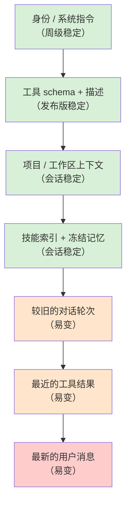

# 第 04 章 — 提示词、上下文与为此付费的缓存

## TL;DR

系统提示词不是一个字符串。它是一个有两部分的组装结构：一个不应该在轮次之间变化的稳定前缀（系统规则、工具 schema、项目上下文、冻结的记忆快照），以及一个会变化的易变尾部（最新的用户消息、最近的工具结果）。提供商缓存前缀，所以一个稳定的前缀只需付费一次，并在每个后续轮次中重复使用——而一个每轮改变哪怕一个字节的前缀每轮都要全额付费。本章讲的是如何组装提示词使缓存真正生效，什么会破坏它（几乎总是你没有注意到的东西），以及如何设计构建器使记忆更新、工具变更和压缩不会静默地使你刚刚付费换来的内容失效。

---

## 为什么这很重要

你上线了一个智能体。运行正常。两周后账单是你预期的四倍。你读取模型使用日志，注意到 `cache_read_input_tokens` 接近零，`cache_creation_input_tokens` 很高。提示词每轮都从头重建。你检查系统提示词——在顶部就是 `Date.now()`，那是你为了"助手知道当前时间"这个贴心功能加上去的。每轮都有不同的时间戳，每轮都是缓存未命中，每轮都全额付费。

修复只需要一行代码。但教训更大：缓存节省是隐形的，直到它们失效；提示词有六种方式可以静默地破坏它们。本章讲的是如何设计提示词使这种情况不会发生。

---

## 概念

### 提示词是一个组装结构

一个有用的心理模型：提示词是一个层的堆栈，从顶部最不可能改变的内容到底部最可能改变的内容排列。



稳定和易变之间的界线大致就是可缓存和不可缓存之间的界线。设计提示词主要是把东西放在那条线的正确一侧，并让它们待在那里。

OpenCode、Hermes Agent、OpenClaw 和领先的商业编程智能体都大致按照这个顺序构建系统提示词，并使用确定性合并，这样当没有有意义的变化时，调用之间的字节序列是相同的。

### 不变性规则

最令人惊讶的规则，也是大多数团队通过违反它来发现的：*系统提示词一旦构建就被冻结。*

如果一个工具在循环中途运行并写入 `MEMORY.md`，正在运行的系统提示词不会改变。更新在*下一个会话*时变得可见，而不是这个会话。Hermes Agent 明确强制执行这一点——文件支持的记忆更新故意不反映在正在运行的提示词中。领先的编程智能体也是如此。原因是机械性的：对前缀字节序列的任何更改都会使随后每个轮次的缓存失效。

这条规则有两个值得吸收的后果：

- **当且仅当没有任何东西在飞行中重写前缀时，你才能在长会话中保持提示词缓存温热。**后台记忆写入写到磁盘；它们在下一个会话开始时被读取。
- **"活的"提示词比冻结的提示词更贵**，往往贵很多倍。如果一个特性感觉需要实时提示词更新（"在每轮向模型展示当前时间"），就把它放在易变尾部，而不是稳定前缀。

### 缓存，用提供商中性的术语

提供商实际上缓存的是你消息流的*前缀*。如果下一个请求的前缀与上一个请求的前缀逐字节匹配，提供商就跳过重新处理那些 token，并以正常价格的一小部分向你收费。机制因提供商而异：

- **OpenAI 风格的 API** 自动缓存前缀。没有标记——如果你的 token 与早期请求匹配，你就获得折扣。
- **Anthropic 风格的 API** 需要显式的 `cache_control` 块。你最多可以标记四个断点；提供商独立缓存到每个断点。
- **其他提供商**（Bedrock、Gemini、Vertex）介于两者之间，通常通过你的 SDK 规范化层暴露。

无论如何，对于你的提示词构建器来说，规则是一样的：保持前缀字节相同，并把变化放在末尾。提供商差异在于你可以多积极地塑造缓存以及如何测量命中。

```ts
// Anthropic 风格的显式缓存——在稳定前缀末尾标记断点。
{
  system: [
    { type: "text", text: identitySection },
    { type: "text", text: toolSchemas },
    { type: "text", text: projectContext,
      cache_control: { type: "ephemeral" } }  // ← 缓存到这里
  ],
  messages: [ ...volatileTurns ]
}
```

### 四块滑动窗口

Anthropic 的缓存允许你在*消息*上放断点，而不只是在系统块上。在生产系统中出现的一种模式是*四块滑动窗口*：一个断点在系统提示词末尾，三个更多的断点在最近的几个用户/助手轮次上。Hermes Agent 的 `apply_anthropic_cache_control` 正是这样做的；领先的商业编程智能体也显示出相同的形状。

这能给你带来什么：一个永远保持系统提示词温热的长对话，*以及*每轮重新缓存最后两三个轮次，这样下一轮的有效新 token 成本大约是用户刚刚输入的内容加上最新的工具结果。没有这个，一个五十轮的对话在每一步都重新处理越来越大的最近历史；有了它，最近历史的开销大致保持不变。

第一天你不需要这个。第一次你看到成本随对话长度超线性增长时，你会用到它。

### 缓存 TTL：短、长和预热

缓存条目不会永久存活。截至 2026 年中，Anthropic 的临时缓存默认每个断点大约五分钟，以每 token 溢价为代价可以选择性地延长到约一小时；OpenAI 风格的自动缓存使用类似的提供商管理窗口。在你调整之前检查你的提供商的当前定价——这些数字会变。然而，架构上的权衡是稳定的：

- **短 TTL** 适用于连续轮次间隔秒或分钟的活跃会话。每次命中都会刷新条目，所以繁忙的对话永远不会看到过期。
- **长 TTL** 在会话是突发性的时候值得预付溢价——用户问一个问题，离开半小时，再回来。没有更长的 TTL，整个前缀会在他们返回时重新付费。
- **缓存预热**对于网关风格的系统来说是一种小众但有用的模式：在会话创建（或从磁盘恢复被驱逐后）发送一个小型无操作请求，在用户真正的第一条消息之前为缓存预热。一些生产网关对高价值会话透明地这样做。

正确的设置来自查看你真实流量中轮次之间的实际*时间*。如果你的 p50 轮次间隔在一分钟以内，默认 TTL 就够了。如果你的 p90 超过十分钟，长 TTL 溢价几乎肯定比让缓存冷却、在每次返回时重新全额付费更便宜。这个决策是数据驱动的——让你的智能体提取直方图并选择阈值；不要凭感觉估计。

### 什么会破坏缓存

几乎所有诱人的东西都是危险的。具体的常见罪魁祸首：

- **前缀中的 `Date.now()` 或任何时间戳。** 每轮都是新值。每轮都是缓存未命中。
- **工具注册表变更。** 添加或删除工具会改变 schema 字节，这些字节位于前缀的早期位置。按（智能体、模型）组合对 schema 数组进行记忆化，但要理解注册表变更是昂贵的。
- **非确定性顺序。** 如果你从 `Object.entries()` 或没有排序的文件系统遍历中组装提示词，顺序可能因运行时版本、操作系统而变化。OpenClaw 使用静态的 `CONTEXT_FILE_ORDER` 映射；Hermes Agent 使用固定的节列表。选择一个顺序并固定它。
- **更新正在运行提示词的后台记忆写入。** 已在不变性规则中涵盖——值得重述，因为这是最容易无意中引入的一个。
- **注入到共享前缀中的用户特定数据。** 如果多个用户访问同一个智能体，用户特定数据属于尾部；前缀应该是与用户无关的。
- **空白和格式漂移。** 一个多余的换行符就算一次未命中。如果你对提示词进行模板化，锁定空白。
- **依赖于语言环境的格式化**（数字上的 `toLocaleString()`，日期上的 `format()`），在不同机器上产生不同的字节。
- **包含会话 ID 的"会话开始"横幅。** 看起来无害，却会跨会话破坏缓存。
- **在你的提示词模板上运行的自动格式化器或 linter。** 一个保存时格式化的工具插入尾部换行或规范化引号，会在下次服务部署时静默地使每个已缓存的前缀失效。
- **高精度数字格式化。** 将分数或价格以完整的浮点精度渲染到前缀中，可能在不同机器或库版本上产生不同的最后几位数字。

最短的调试路径是在每个请求上记录一个指纹——渲染前缀的 SHA——并观察其在轮次之间的值。如果指纹在没有有意义的变化时发生了变化，你就有了一个泄漏。我们在本章中会再用两次这个指纹。

### 前缀漂移时的分层指纹

一个前缀级别的指纹捕获漂移；它不告诉你漂移*来自哪里*。廉价的升级是为前缀的每一层记录一个指纹，连同整体指纹：

```ts
debug: {
  prefixFingerprint:   sha(prefix.bytes).slice(0, 12),
  identityFingerprint: sha(prefix.identity).slice(0, 12),
  toolsFingerprint:    sha(prefix.toolSchemas).slice(0, 12),
  contextFingerprint:  sha(prefix.projectContext).slice(0, 12),
  memoryFingerprint:   sha(prefix.frozenMemory).slice(0, 12)
}
```

当整体哈希漂移时，每层的哈希将原因定位。工具哈希在部署间变化通常是启用工具的差异或描述编辑。上下文哈希在会话中变化通常是工作区遍历的重新排序或磁盘上的上下文文件被重写。记忆哈希在会话中变化是不变性规则被违反。每层的视图将*"缓存在某处出了问题"*变成*"有人编辑了工具描述"*——在一行日志里。

对于按层哈希缩小了嫌疑范围但没有指出确切字节的情况，将最近一次成功渲染的前缀存储到磁盘（或一个小的内存环形缓冲中），并对当前的前缀运行 `diff`。一个杂散的换行符、一个重新排序的键、一个高精度数字——所有这些都会立即显示出来。OpenCode 和 Hermes Agent 出于其他原因（压缩、会话恢复）已经持久化了渲染的前缀；把这变成一个调试界面只需要几行代码，不需要一个新系统。

这是当缓存命中率下降而*"什么都没改变"*时你伸手取用的工具。

### 工具 schema 是前缀的一部分

工具定义位于提示词顶部附近，它们往往很大。它们的变化也比人们预期的更频繁——启用一个新工具、调整描述、缩小枚举、添加参数，都会改变字节。生产系统中的模式：

- **按智能体配置文件对工具 schema 数组进行记忆化。** OpenCode 按（智能体、模型）组合这样做，这样相同的智能体共享相同的 schema 字符串。
- **固定顺序。** 工具应该每次以相同的顺序出现。按字母排序，或使用按插入顺序排列的注册表，但永远不要迭代无序哈希。
- **将工具描述编辑视为前缀变更。** 它们*就是*前缀变更。在会话边界而非会话中途推出它们。

这也是第 03 章的"工具越少，推理越精准"观点带来第二个红利的原因：工具越少意味着前缀字节越少，意味着缓存重用越多。

### 压缩是缓存的不连续性

第 02 章介绍了压缩作为每次迭代的一个结果，与继续和停止并列，相关技术推迟到第 05 章。*在这里*值得标注的是，压缩在它触发的那一轮打破了消息级别的缓存——消息数组已被重写，提供商从那个点开始看到一个新前缀。

一个有用的设计选择：在历史的*末尾*（将最旧的轮次总结为简短内容，保留最近的轮次不变）而不是中间进行压缩。尾部压缩为即将淘汰的内容牺牲缓存；中间压缩使从压缩点开始的所有内容失效，这可能是对话的大部分。OpenCode 的 `SessionCompaction.Service` 和 Hermes Agent 的 `ContextCompressor` 都以这种方式工作——它们保护一个最近轮次的窗口，只重写更旧的内容。

压缩触发器本身也是一个缓存感知的决策。急切地压缩（每五轮）频繁地消耗缓存；被动地压缩（仅当即将溢出时）使缓存保持更长时间温热。大多数系统收敛到被动压缩。

### 多智能体提示词变体，不会引发缓存爆炸

多智能体系统（第 10 章、第 14 章）每个智能体有不同的提示词——explore、build、plan、compaction、titler、summarizer。天真地说，这意味着 N 个不同的系统提示词和 N 个不同的缓存。保持缓存可共享的模式：

- **将真正共享的部分放在前面**——通用规则、基础工具注册表、项目上下文。
- **将智能体特定的覆盖放在第二位**——额外工具、权限规则、智能体角色、角色特定指令。
- **在两部分之间缓存**。

OpenCode 正是这种形状：一个两部分的系统数组，第一部分是模型家族规则，第二部分是智能体特定内容。第一部分在会话中的所有智能体之间保持缓存温热；只有第二部分在从 `explore` 切换到 `build` 时产生缓存未命中。节省效果会复利：在有频繁智能体切换的会话中（在编程工作流中很常见），共享部分可以命中缓存数千次。

### 项目上下文从某处来

图中的"项目 / 工作区上下文"层不会凭空出现。生产智能体通过在会话开始时运行一次的固定流水线来发现它：

- **从工作目录向上遍历**，查找上下文文件（`AGENTS.md`、项目级指令文件、`README.md`、仓库根标记）。领先的编程智能体通常在第一个 git 根或文件系统边界处停止。
- **按确定性顺序读取。** OpenClaw 的 `CONTEXT_FILE_ORDER` 是一个静态映射（`soul.md`、`identity.md`、`AGENTS.md`、`MEMORY.md`、`README.md` 按固定位置）；Hermes Agent 在 `build_system_prompt` 中使用固定的节列表。固定顺序使同一项目的两次运行之间的字节相同。
- **限制大小。** 一个 50-KB 的 `README.md` 推入前缀就是 50 KB 的第一次缓存未命中，以及 50 KB 的永久温热负担。截断，或在会话开始时用廉价模型汇总一次，并将汇总缓存到磁盘。
- **快照，然后冻结。** 会话开始时磁盘上的内容就是正在运行的提示词所看到的，句号。对这些文件的中途编辑影响下一个会话，而不是这个——与记忆相同的不变性规则。
- **尊重隐私边界。** 多用户智能体不得将用户特定文件读取到共享前缀中。要么为每个用户限定缓存范围（每个用户不同的缓存线），要么将用户数据保留在尾部。

OpenCode 通过每个项目的缓存解析项目范围的状态，这样两个项目的上下文不会渗入彼此的提示词。系统间的通用规则：*发现是构建器的一部分，而构建器就是你的指纹所覆盖的内容。*如果工作区遍历在会话间发现了新文件或磁盘上的文件发生了变化，你的指纹应该变化，你应该预期（并接受）缓存未命中。固定顺序和限制大小的要点是确保唯一的缓存未命中是*真正的*未命中——而不是文件系统遍历顺序的产物。

### 快照 vs. 实时：记忆进入提示词的方式

到第 05–07 章，大多数系统至少有两个记忆来源：

- **文件支持的记忆**（MEMORY.md、USER.md、技能文件）——在会话开始时读取，*烘焙到*系统提示词中，冻结。
- **外部或查询的记忆**（向量数据库、知识库、检索到的文档、新鲜搜索结果）——每轮获取，存在于*易变尾部*，而非前缀。

这种分离*因为*缓存而存在。任何必须新鲜查询的东西都无法安全缓存；任何可以加载一次并保持稳定的东西都可以。Hermes Agent 明确做出了这种区分：`MemoryManager.prefetch_all()` 在循环开始之前运行一次，它返回的内容被折叠到冻结的前缀中；中途循环记忆查询作为工具结果添加在尾部。

规则：如果你的记忆层想在前缀中，就冻结它。如果它想是实时的，就接受尾部。试图两者兼得——对"稳定"前缀进行实时更新——是团队意外摧毁其缓存命中率的最常见方式。

### 缓存和恢复按钮是同一件事

值得注意的副作用：保持缓存温热的规范与让会话恢复工作的规范是相同的。冻结的前缀、确定性的构建、稳定的字节序列——这些正是从磁盘重新水化智能体并继续而不出现意外所需要的。

如果你能证明你的前缀指纹在进程重启后是相同的，你就可以在温热缓存下恢复。Hermes Agent 的 `SessionDB` 中持久化的系统提示词就是为了这个目的——网关可以停止和重启智能体，而不为自己的前缀重新付费。Paperclip 的适配器会话编解码器在更高层提供相同的目的：编排器存储的不透明状态，使下一次心跳能够逐字节地从上一次停下的地方继续。

这就是为什么跳过第 04 章规范的团队要付双倍代价：他们的缓存命中率很差*而且*他们的恢复故事很脆弱。这两个是从两个角度看的同一个问题，它们共享一个修复。我们将在第 08 章继续讨论这个问题。

### 缓存命中率是可观测性

一个你不测量的缓存是一个你无法信任的缓存。提供商在每个响应上返回使用字段；跟踪它们并随时间观察其比率：

```ts
// 缓存命中率——有多少比例的输入 token 来自缓存。
type Usage = {
  input_tokens: number;
  cache_read_input_tokens?: number;     // 一次命中
  cache_creation_input_tokens?: number; // 第一次，全额付费
  output_tokens: number;
};

function cacheHitRatio(usages: Usage[]) {
  const cached  = sum(usages.map(u => u.cache_read_input_tokens     ?? 0));
  const created = sum(usages.map(u => u.cache_creation_input_tokens ?? 0));
  const fresh   = sum(usages.map(u => u.input_tokens));
  return cached / Math.max(cached + created + fresh, 1);
}
```

按会话和按智能体绘制这个数字。对于稳定的多轮工作流，正确值通常在 60% 到 95% 之间。当它下降时，第一件要检查的事情是上一小节的前缀指纹；第二件是是否有版本发布改变了工具描述、指令或上下文文件。

这个指标属于第 16 章的追踪流水线。越早接入，就越能在下一个 `Date.now()` 等价物账单来临之前更快地发现它。

### 提示词构建器契约

一个干净的提示词构建器有两个方法和一个调试辅助：

```ts
type PromptBuilder = {
  buildStablePrefix(session: Session): Promise<StablePrefix>;
  buildVolatileTail(run: RunState):   Promise<Message[]>;
};

async function buildRequest(s: Session, r: RunState, b: PromptBuilder) {
  const prefix = await b.buildStablePrefix(s);
  const tail   = await b.buildVolatileTail(r);
  return {
    system:   prefix.blocks,
    messages: tail,
    debug:    { prefixFingerprint: prefix.sha256 }  // 每个请求上记录
  };
}
```

契约强制执行规范。稳定的走一条路，易变的走另一条；任何偷偷溜入错误半部分的内容都会被类型系统或指纹捕获。指纹是某些东西静默移动时的确凿证据——一行日志，能捕获任何单元测试都不会发现的回归。

Hermes Agent 进一步将渲染的前缀持久化到其 SessionDB 中。当网关驱逐内存中的智能体，下一条用户消息重建它时，*完全相同的字节*被重放，缓存在驱逐后依然命中。这是网关风格架构的黄金标准，在这种架构中智能体不在内存中持久存在。如果你不能持久化完整前缀，至少持久化指纹和产生它的输入——这样当缓存未命中时，你可以证明这是构建器 bug 还是合理的变更。

---

## 真实系统注记

- **OpenCode** 使用一个两部分系统数组（模型家族规则 + 智能体特定覆盖），在 Anthropic 缓存的调用间保持它，按（智能体、模型）组合对工具 schema 进行记忆化，并有一个 `SessionCompaction.Service`，在总结旧历史时保护一个最近轮次的窗口。
- **Hermes Agent** 是端到端缓存感知设计的最强参考：文件支持的记忆是在会话开始时烘焙到提示词中的冻结快照，系统提示词被持久化在 `SessionDB` 中以在智能体驱逐后存活，以及一个四块滑动窗口的 `cache_control` 断点（系统 + 最后三条消息）使最近轮次可以重新缓存。
- **OpenClaw** 通过静态的 `CONTEXT_FILE_ORDER` 映射（`soul.md`、`identity.md`、`AGENTS.md`、`MEMORY.md`、`README.md` 始终在相同位置）维护缓存稳定性，并隔离提供商特定的提示词文件，这样模型家族的变更不会使其他提供商的缓存失效。
- **Paperclip** 本身不构建内部系统提示词——适配器来做——但它不透明地持久化会话参数，以便适配器可以在心跳间重放它们。编排层面的教训：提示词连续性是一个状态管理问题，而不是字符串构建问题。

---

## 与你的智能体配对

以下提示词在本章效果很好：

- *"审计我当前的系统提示词。识别每个可能在调用之间移动的部分——时间戳、语言环境格式化、非确定性排序、用户特定数据、会话 ID——并重写构建器使前缀字节稳定。"*
- *"将渲染稳定前缀的 SHA-256 指纹添加到每个请求日志中。运行一个真实的十轮会话，并在每轮显示指纹。如果它漂移，找出原因。"*
- *"实现四块滑动窗口模式：在我的系统提示词末尾一个 `cache_control` 断点，在最近的用户/助手消息上三个更多断点。然后在二十轮对话中绘制 `cache_read_input_tokens` vs. `cache_creation_input_tokens`。"*
- *"将我的提示词组装重构为两部分系统数组——模型家族规则在前，智能体特定覆盖在后。添加第二个智能体配置文件，并展示缓存的前半部分在它们之间是共享的。"*
- *"我的智能体有一个在会话中途更新的 `MEMORY.md` 文件。修改循环使更新被写到磁盘但正在运行的系统提示词保持冻结。用指纹验证记忆写入后前缀字节没有改变。"*
- *"带我走一遍 Hermes Agent 如何在 SessionDB 中持久化其系统提示词，并在智能体驱逐后逐字节重放它。然后为我的技术栈实现等价的方案——即使是一个能在进程重启后存活的最小版本。"*
- *"提取我最近五十个会话中轮次之间时间的直方图。使用 p50 和 p90 来推荐缓存 TTL 设置，并附上数学计算——比较长 TTL 溢价的成本与冷返回时重新缓存的成本。"*

---

## 接下来

你现在有了一个设计为保持缓存温热且可重现的提示词。下一个问题是它所坐落的易变尾部——每轮增长的对话历史、工具结果和工作记忆。第 05 章介绍了如何在不破坏你刚刚构建的缓存的情况下保持尾部不爆炸；第 06–07 章介绍了反馈回*下一个*会话前缀的更长期记忆，这正是本章的规范开始为你带来回报的地方。
