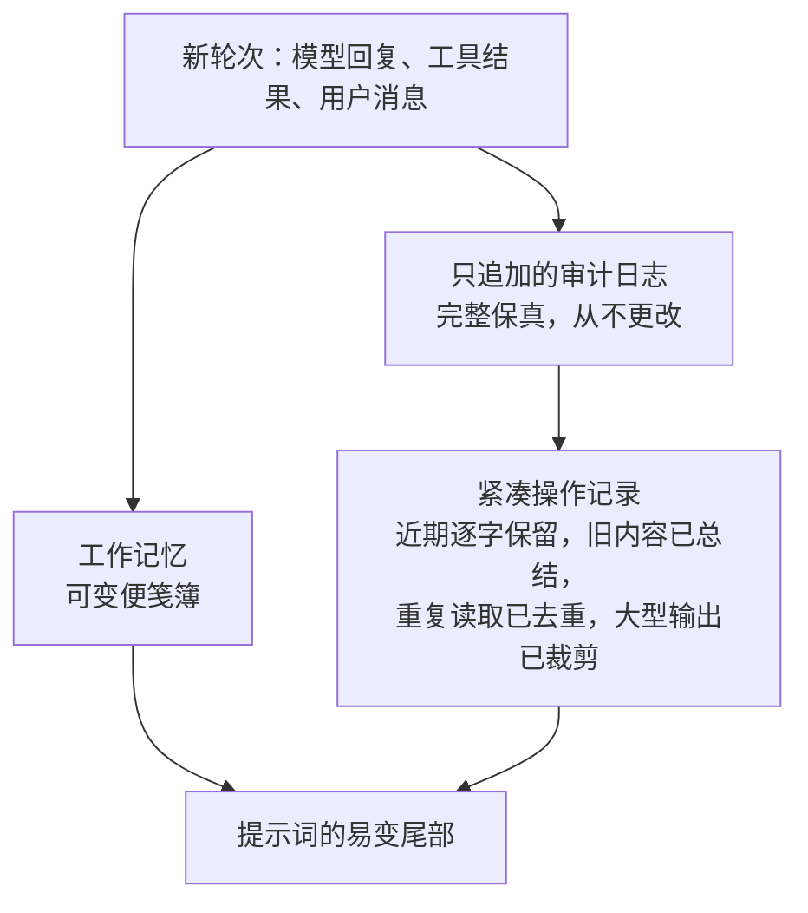

# 第 05 章 — 短期记忆

## TL;DR

短期记忆是第 04 章中存在于提示词易变尾部的一切内容——对话记录、最近的工具结果，以及智能体用来跟踪当前任务的小型便笺簿。它是每轮都会增长的那一层，也是循环运行时间长了之后最先崩溃的那一层。本章介绍三种记忆视图（只追加的审计日志、紧凑操作视图、可变便笺簿），以及生产系统用于在不丢失模型所需内容的情况下保持操作视图小巧的半打技术：裁剪工具输出、去重重复读取、非对称压缩、中途总结、两阶段折叠再压缩，以及按工具制定的处置规则。

---

## 为什么这很重要

你的智能体已经运行了四十轮。每次文件读取、每次 grep、每次网络获取、每次模型轮次——所有内容都坐在提示词里。每轮的成本在线性增长。然后模型返回 `prompt_too_long`。你添加了一个总结旧轮次的步骤。下一轮有效了。再下一轮，总结本身也太长了。你添加了一个总结总结的步骤。现在模型已经忘记了原始任务，智能体在解决三轮之前的问题。

短期记忆做得不好时是隐形的，直到它爆炸；做得好时也是隐形的，因为它从不爆炸。本章讲的是这两者之间的区别。

---

## 概念

### 三种视图，不是一种

生产智能体没有*一个*记录。它有三个。



- **只追加的审计日志**是真相。每次模型轮次、每次工具调用、每次工具结果，完整保留。你从不编辑它。它是支持恢复（第 08 章）以及审计员日后想要查看的内容。
- **紧凑操作记录**是模型在下一轮实际看到的内容。每次组装提示词时都从审计日志重新构建——裁剪、去重、总结。它是一个*视图*，不是一个*存储*。
- **工作记忆**是智能体为当前任务维护的小型可变便笺簿——目标、当前计划、已读文件、待解问题。每步都可以覆写。

将这三者分开是使本章中其他一切得以工作的设计。编辑审计日志，你的恢复就会中断；让操作记录无限增长，你的循环就会死掉；让工作记忆成为另一份记录，你就制造了同样的问题两次。

OpenCode 用 `SessionTable` 和 `PartTable` 明确编码了这种分离，用于审计日志，以及按需产生操作视图的压缩服务。Hermes Agent 使用带 FTS5 的 SQLite `messages` 表用于审计，以及 `ContextCompressor` 产生紧凑视图。形状是相同的。

### 在边界处裁剪工具输出

单一最高杠杆的操作：在大型工具输出*进入*操作记录之前裁剪它们。一个 50 KB 的 grep 结果，从现在开始到对话结束的每一轮都占用 50 KB 的上下文。

```ts
// 用可见的省略标记裁剪。静默截断给模型一个虚假的视图。
function clip(text: string, maxChars = 2_000): string {
  if (text.length <= maxChars) return text;
  const half = Math.floor(maxChars / 2);
  return [
    text.slice(0, half),
    `\n[... ${text.length - maxChars} chars omitted; full result available via <ref> ...]\n`,
    text.slice(-half),
  ].join("");
}
```

来自生产的两条规则：标记必须可见（模型需要知道它被裁剪了，否则它会认为自己拥有完整内容进行推理），完整结果必须存放在模型在真正需要更多时可以请求的地方——临时文件、附件、单独的检索工具。OpenCode 的截断服务将完整结果写入磁盘并返回摘要加指针；Hermes Agent 为每个工具注册表条目强制执行 `max_result_size_chars`。两者都是相同形状的变体。存储是有其自身生命周期的持久化存储——当指针过期时、附件在哪里被垃圾回收、当模型请求已消失的 `<ref>` 时会发生什么——这些是第 08 章的问题，不是本章的。

### 去重重复读取

如果模型在第 3 轮和第 17 轮读取了同一个文件，操作记录不需要两者。丢弃早先的，保留最新的：

```ts
// 最新优先去重：每个（工具、输入）对只保留最近的结果。
// 跳过标记为 open_world 的工具（第 03 章）——它们的结果在调用之间不稳定。
function dedupeRepeatedReads(messages: TranscriptMessage[], registry) {
  const stable = (m) => m.role === "tool" && !registry[m.toolName]?.open_world;

  const latest = new Map<string, number>();
  messages.forEach((m, i) => {
    if (!stable(m)) return;
    const key = JSON.stringify({ tool: m.toolName, input: m.toolInput });
    latest.set(key, i);
  });
  return messages.filter((m, i) => {
    if (!stable(m)) return true;  // 用户/助手轮次，或开放世界工具：保留
    const key = JSON.stringify({ tool: m.toolName, input: m.toolInput });
    return latest.get(key) === i;
  });
}
```

键是按（工具、输入）的，不是按文本的——基于文本的启发式方法既脆弱又有损失。语义：以相同参数对同一工具的最近一次调用取代早先的调用。对于做大量 `read_file` 的编程智能体来说，在裁剪之后这是单一最大的节省。

去重只有当工具的结果*给定输入是稳定的*时才安全。对相同 URL 的 `web_fetch` 在第 3 轮和第 17 轮可能返回不同的字节；对两次调用之间被编辑的文件的 `read_file` 不再与早先的读取匹配；`now()` 或 `random()` 本来就是不同的。第 03 章的 `open_world: true` 元数据是标记这些的方式，去重跳过它们——可变内容的早先读取仍然记录了当时重要的状态。如果你的工具返回可变状态而你没有将其标记为 `open_world`，你的去重就在静默地丢弃早先的快照，模型认为最新的快照从一直以来都是真实的。

一个有用的副作用：去重也是死循环信号。连续三次相同工具相同输入的调用是第 02 章用于检测卡住循环的相同特征。同样的扫描找到两者——折叠重复项，如果太多就暂停。

### 非对称压缩：保护两端，压缩中间

一个扁平策略（"保留最后 8 轮，总结其余"）在一定程度上有效，但会泄漏重要信息。生产系统中的模式是*非对称的*：在最近的轮次窗口保持完整保真，在*最早的*轮次保持小窗口的完整保真，并总结中间的一切。

- **OpenCode** 使用 `DEFAULT_TAIL_TURNS = 2`——最后两轮不受任何压缩的保护。
- **Hermes Agent** 的 `ContextCompressor` 保护前 *N* 轮和后 *N* 轮；只有中间部分被总结。
- 一旦被推过四十轮，同样的形状就会出现在每个设计良好的系统中。

两端都受保护的原因：*开头*携带了模型不断回头参考的任务框架（原始目标、关键约束、用户的实际问题），*末尾*携带了模型现在正在推理的最新状态。中间是模型已经完成推理的内容——事实还在，原始轮次不在了。

### 中途总结

当裁剪和去重不够时，你就总结。标准模式使用廉价的辅助模型将记录的中间部分压缩成一个简短的参考块：

```ts
// 压缩在内容中插入总结块，模型可以读取。
async function compactTranscript(messages, opts) {
  const { keepHead = 2, keepTail = 6, summarizer } = opts;
  if (messages.length <= keepHead + keepTail) return messages;

  const head   = messages.slice(0, keepHead);
  const middle = messages.slice(keepHead, -keepTail);
  const tail   = messages.slice(-keepTail);

  const summary = await summarizer.summarize({
    purpose: "Preserve facts needed to continue the task. Reference only.",
    messages: middle,
  });

  return [
    ...head,
    { role: "user",
      content: `[SUMMARY of ${middle.length} earlier turns]\n${summary}` },
    ...tail,
  ];
}
```

在实践中重要的三个细节：

- **总结器是不同的模型。** OpenCode 运行一个没有工具、固定 token 预算的专用 `compaction` 智能体；Hermes Agent 调用配置了更便宜、更快模型的 `auxiliary_client`。压缩是少数几个运行*不那么*强大的模型是正确选择的地方之一：它在每个长会话上运行，质量门槛是"保留事实"，而且成本差异会复利。
- **总结目的是明确的。** *"保留继续任务所需的事实"*产生有用的总结；*"总结对话"*产生无用的总结。告诉辅助模型它在保留什么以及它的输出扮演什么角色。
- **总结是内容，不是元数据。** 模型在下一轮作为提示词的一部分读取它。清晰的标记（`[SUMMARY of N earlier turns]`）让模型明确地推理它没有原始内容的事实——*"我没有那些轮次的详情；如果需要，让我重新获取。"*

### 什么是好的总结

总结本身是一门小艺术。糟糕的总结比没有总结更糟——它以自信的语气告诉模型略微错误的事实，没有办法验证。三个属性区分了有用的总结和有害的总结：

- **保留具体信息，丢弃泛泛而谈。** *"用户想要升级他们的认证库"*丢失了依赖名称；*"用户正在从 `next-auth@4` 迁移到 `next-auth@5`，已经更新了 `app/api/auth/[...nextauth]/route.ts`"*才是模型需要的。事实、文件路径、标识符、日期、决策——这些是承重部分。
- **标注什么是重建的，什么是观察到的。** *"智能体尝试运行测试套件；从记录来看结果不清楚"*胜过*"测试通过了"*，当"测试通过"这个说法来自推断而非直接工具结果时。好的总结器标注不确定性而不是把它抹平。
- **在重要的地方保留原话。** 当用户说*"完全按照 Stripe 的方式"*时，总结应该引用，而不是转述。转述的用户意图在每次传递时都会漂移；引用的用户意图保持不变。
- **结构化总结，不要只是叙述。** 生产总结器收敛到三个部分——*已确立的事实*（已解决的文件路径、标识符、结果）、*已做出的决定*（附带推理）、以及*未解决的问题*（智能体无法确认的事情、用户还没有回答的事情）。一个扁平段落把三者混在一起，强迫模型每轮都重新略读。结构化的告诉模型从哪里开始，以及什么应该作为参考、什么应该作为行动。

总结器的系统提示词比模型选择更重要。一个小的、提示词良好的总结器产生比一个大的、提示词很差的总结器更紧凑的总结。OpenCode 和 Hermes Agent 都明确投资于这个提示词，而且成本在每个长会话上都会得到回报。

### 压缩触发器：主动和被动

压缩在什么时候触发？两种策略，都在生产中使用：

- **主动的（token 阈值）。** 每步之后，将操作记录的 token 数与 `context_limit − max_output − safety_buffer` 比较。如果超过，在下一次调用之前压缩。OpenCode 的 `isOverflow()` 检查在每步之后运行；安全缓冲通常是几千 token。优点：压缩从不在不好的时刻发生，用户在轮次延迟上不为此付费。
- **被动的（prompt-too-long）。** 按原样发送下一个请求。如果提供商返回 `prompt_too_long`，捕获它，运行更激进的压缩遍，重试。优点：你不为总结器调用付费，直到你真正需要它。缺点：用户在触发它的那轮等待更长时间。

大多数团队收敛到主动压缩，有被动回退作为安全网。第三个杠杆——**模型回退**——在同一个抽屉里：当上下文紧张时，切换到具有更大窗口的模型（第 17 章涵盖路由）。当压缩会丢失你无法承受失去的信息时使用它。

### 压缩边界标记

压缩在操作记录中插入一个标记——OpenCode 的 `CompactionPart`，Hermes Agent 的 `SUMMARY_PREFIX` 块。标记是模型可以读取的*内容*，不是不可见的元数据。这对两个原因很重要：

- 模型可以推理自己的缺口。*"我没有消息 5 到消息 30 之间的轮次的详情，因为它们被压缩了；如果我需要它们，让我重新读取文件。"*没有标记，记录中表面上的跳跃可能会让模型完全忽略旧上下文或编造它。
- 标记是操作记录和审计日志可以被对账的接缝。调试智能体运行的人在操作视图中找到标记，并在磁盘上的审计日志中查找原始轮次。

标记应该是明确的和简短的——单行说明什么被总结了、跨越了多少轮。任何更长的内容都是模型每轮必须略读的噪音。

### 先折叠，再总结

便宜的操作先于昂贵的操作。两阶段模式：当上下文开始增长时，先运行激进的裁剪和去重（"折叠"）；只有在此之后记录仍然太大，才触发总结器。Hermes Agent 和领先的商业编程智能体都这样做——先是小的、机械的、免费的操作；LLM 驱动的总结第二步。

原因：折叠是确定性的，没有每轮成本，往往完全解决压力。总结需要额外的模型调用。将总结器留到真正需要时才使用，平均来说使压缩保持便宜——大多数"压缩事件"从不到达第二阶段。

### 压缩方法对比

细看，"压缩"不是一种技术而是一系列技术，每种都有不同的成本/质量权衡。生产中出现的六种：

| 方法 | 它做什么 | 成本 | 它丢失了什么 |
|---|---|---|---|
| **裁剪** | 截断超过大小阈值的任何单个工具结果；插入可见标记；将完整结果保存在磁盘上。 | 实际上免费，确定性的。 | 一个结果内的详细信息。模型可以通过指针重新获取。 |
| **最新优先去重** | 丢弃相同（工具、输入）调用的早先重复项。 | 实际上免费，确定性的。 | 模型仍在使用的任何东西——根据定义，后来的调用取代了早先的。 |
| **历史剪切** | 丢弃过去固定深度的整个旧轮次（通常是旧工具结果）；保留模型推理轮次。 | 免费。 | 旧工具结果的详细信息；周围的推理得到保留。 |
| **非对称总结** | 辅助 LLM 将记录中间部分压缩成单个参考块；头和尾轮次保持逐字。 | 每次压缩一次辅助模型调用。 | 中间的粒度结构；如果总结形状良好，事实得到保留。 |
| **微压缩** | 与总结相同，但在更小的窗口上——每次只处理最旧的几轮，重复进行。 | 每个长会话几次小型辅助调用。 | 每次传递丢失得更少；在多次传递中漂移的机会更多。 |
| **会话轮换** | 以总结所有重要内容的交接块开始一个新会话；通过 `parent_session_id` 链接。 | 一个新的提示词缓存（第 04 章成本）；一个新的审计日志。 | 任何未在交接块中捕获的内容。第 04 章的缓存温度。 |

在生产中，这些不是替代品，而是一条*流水线*。长时间运行会话的典型序列：每次工具插入时裁剪→每次模型调用前去重→剪切超过某个深度的旧轮次→当阈值被触发时总结中间→当总结已经运行了两三次时轮换会话。每种方法在下一种触发之前为你争取时间。

设计决策不是"我选哪个"，而是"以什么顺序，用什么阈值"。让你的智能体为你的技术栈写出流水线，并记录每次压缩事件触发了哪种方法——一周真实会话中的直方图告诉你你的阈值是否合理，哪种方法在承担重任，哪种你可能可以放弃。

### 压缩也是可观测性

一个你不测量的压缩流水线是一个你无法调整的流水线。每次压缩事件值得记录的三件事：

- **触发了哪种方法**——裁剪、去重、剪切、总结、微压缩或轮换。一周会话中的直方图告诉你你的阈值是否校准好了。如果总结在每个长会话中触发，而剪切从不触发，你的剪切阈值可能太宽松了。
- **之前和之后的 token 数**——每种方法的压缩比。对于成本预测以及在有人调整了总结器提示词、比率悄然变差时捕获回归，这很有用。
- **模型在总结内容之后多少轮后开始引用它**——如果模型反复重新获取被总结掉的东西，你的总结遗漏了事实。如果模型从不引用被总结的内容，你可能总结得太急了，可以将阈值推得更高。

这个指标流属于第 16 章的追踪流水线，与第 04 章的缓存命中率并列。它们一起告诉你你精心设计的提示词架构是否在生产中真正得到了回报，还是说三个版本之前某些东西悄然退化了。

### 不是所有工具结果都是平等的

不同的工具在操作记录中应该有不同的处置策略：

- **技能结果和结构化工具输出**通常短小且信号丰富。逐字保留它们。
- **Shell 日志、原始文件转储、网络抓取内容**长且一旦消费后信号低。在插入时激进裁剪；几轮后如果模型已经继续了就完全丢弃。
- **补丁和差异**是中等信号，需要保持可见几轮以支持后续编辑。保留直到补丁被应用或拒绝，然后丢弃。
- **图像附件**通常很重但恰好在一次被引用时信号丰富。在它们被引用的那轮保留，然后在后续轮次丢弃或压缩为文字描述。

OpenCode 的压缩明确保护技能工具结果不被丢弃；Paperclip 单独存储适配器输出块并在操作记录中引用它们。一个有用的练习：将你拥有的每个工具分类为 `keep_verbatim`、`clip_on_insert` 或 `drop_after_consumed`，并将策略与第 03 章的元数据一起烘焙到工具注册表中。压缩器读取策略；你不再逐轮争论"我是否应该丢弃这个"。

### 会话轮换：当对话成为新对话

对于很长的会话，即使是激进的压缩也会丢失太多。下一步：轮换到新会话，携带一个总结所有重要内容的*交接*块，并通过 `parent_session_id` 将新会话链接回旧的。

Hermes Agent 这样做——`ContextCompressor` 可以通过 SessionDB 中的 `parent_session_id` 生成一个链接的新会话 id，这样完整的谱系是可追溯的。Paperclip 的 `evaluateSessionCompaction()` 根据每个会话的最大运行次数、最大原始输入 token 和最大会话时间来决定是否轮换；在轮换时，它写一个交接 markdown 块来明确地桥接缺口。

轮换比压缩更重——新会话有一个新系统提示词和新缓存（第 04 章的成本）——但它是长时间运行智能体最干净的重置。权衡：轮换给你一个干净的石板，但让你失去了你积累的缓存温度。当总结不再足够时使用它；当一次压缩遍就够时不要使用它。

### 子智能体记忆是它自己的

当父循环委托给子智能体（第 10 章）时，子智能体获得自己的短期记忆。父智能体*看不到*子智能体的中间轮次；子智能体只看到父智能体传给它的提示词加上它自己的工具产生的内容。OpenCode 的 `task` 工具创建一个具有父上下文的过滤片段的子会话；OpenClaw 的 `sessions_spawn` 做同样的事情。

这是设计如此。如果子智能体用自己的工具调用填满父智能体的记录，会使压缩变得更难，并让中间噪音污染父智能体的推理。子智能体返回单个观察结果——其最终答案——父智能体的记录只记录那个。

推论，这会让人们措手不及：如果你想让父智能体知道子智能体的中间工作，子智能体必须在其最终答案中包含它。子智能体私下保留的任何内容对父智能体永远不可见。

### 冻结快照，重述

存在于*系统提示词*中的记忆文件——`MEMORY.md`、`USER.md`、智能体注记、技能索引——在会话开始时被捕获，在会话中不会改变。这条规则在第 04 章中建立，在这里再次适用。易变尾部（本章）是中途会话变更所在的地方；稳定前缀（第 04 章）是会话开始冻结所在的地方。分界线是缓存断点。

如果你想让一块记忆是实时的，把它放在尾部（工具结果、工作记忆）。如果你想让它缓存温热，把它放在前缀（记忆文件、系统指令）。试图两者兼得——实时更新也是缓存的——每轮产生一次昂贵的缓存未命中。这种配对——第 04 章的前缀和本章的尾部——是提示词上下文的整个架构。其他一切都是记账。

---

## 真实系统注记

- **OpenCode** 是三视图规范的最强参考：`SessionTable` 和 `PartTable` 持有只追加的审计，`Truncate.Service` 在边界裁剪工具结果，`SessionCompaction.Service` 在 `isOverflow` 触发时主动运行，`CompactionPart` 是操作记录中可见的边界标记。专用的 `compaction` 智能体（没有工具，固定预算）是辅助模型模式的好模板。
- **Hermes Agent** 有最干净的中途总结流水线：`ContextCompressor` 保护头和尾轮次，通过 `auxiliary_client.call_llm()` 以明确的仅参考标记总结中间，并且当总结单独不够时可以通过 `parent_session_id` 轮换到新会话。非常长的会话最多三次压缩遍。
- **OpenClaw** 将每个会话的记录作为 JSONL 文件存储（每个会话一个文件）用于审计日志，并在会话开始时将 MEMORY.md 注入提示词作为冻结快照——与第 04 章相同的不变性规则，应用于记忆文件。
- **Paperclip** 是压缩被推到编排层级的例子：`evaluateSessionCompaction()` 监视最大运行次数、最大输入 token 和会话年龄，然后在任何阈值被越过时用交接 markdown 块轮换智能体的会话 id。相同的形状，在堆栈上高出一层。

---

## 与你的智能体配对

以下提示词在本章效果很好：

- *"在我的项目中建立三视图分离：磁盘上的只追加审计日志、一个按需构建紧凑操作记录的函数，以及一个循环可以读写的工作记忆结构。告诉我单个轮次如何流经三者。"*
- *"为每个工具结果添加可见标记裁剪。然后写一个测试，验证模型可以通过引用请求完整结果并取回原始字节。"*
- *"实现按（工具名称、工具输入）JSON 相等的最新优先去重。在我最近二十轮的会话中运行它，并精确报告记录大小下降了多少。"*
- *"构建非对称压缩：以完整保真保留前 2 轮和后 6 轮，通过更便宜的模型总结中间。告诉我插入到记录中的边界标记，以及读取它的下一轮模型。"*
- *"连接一个主动压缩触发器，当操作记录达到 `context_limit − max_output − 4 KB` 时触发。添加一个被动回退，在 `prompt_too_long` 错误时运行更激进的遍。打印每次压缩事件触发了哪个触发器。"*
- *"将我的注册表中的每个工具分类为 `keep_verbatim | clip_on_insert | drop_after_consumed`。更新操作记录构建器以遵守这些策略，并告诉我在真实会话中的大小影响。"*
- *"我的智能体有时运行超过 200 轮。实现会话轮换，创建通过 `parent_session_id` 链接的新会话，写一个交接 markdown 块桥接两者，并在下一条用户消息之前为新会话的提示词缓存预热。"*
- *"添加压缩可观测性：记录触发了哪种方法（裁剪/去重/剪切/总结/微压缩/轮换）、之前和之后的 token 数，以及多少轮后模型第一次引用被总结的内容。绘制我最近一周会话的直方图，告诉我我的阈值是否校准良好。"*

---

## 接下来

你现在有了一个紧凑的、去重的、总结的操作记录，不会撑爆上下文窗口。这些内容都不会在下一个会话中存活。

第 06 章讲的是*确实*能存活的记忆——你在运行之间持久化什么，模型如何再次找到它，以及向量索引、全文搜索和混合检索如何比较。第 07 章讲的是如何安全地写入那段记忆，不让它被污染或随时间漂移。
