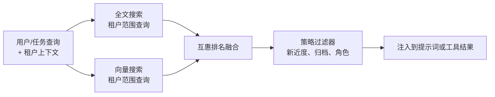

# 第 06 章 — 长期记忆召回

## TL;DR

短期记忆（第 05 章）是模型现在看到的内容。长期召回是当前运行中有用的内容如何在下一次运行前存活——以及你如何再次找到它。有三种检索范式（语义向量搜索、全文搜索、精心策划的知识），三个检索可以挂钩到循环的地方（前缀中作为冻结快照、易变尾部中作为工具结果、在会话开始时预获取），以及一个将所有这些联系在一起的设计约束：你放入前缀的任何内容都必须在轮次之间保持字节稳定，否则你会失去第 04 章的缓存。本章讲的是如何选择正确的组合——不是"添加一个向量数据库"，而是正确的上下文，通过正确的机制检索，注入到正确的位置。

---

## 为什么这很重要

没有长期记忆的智能体，每次会话都要重新学习相同的项目事实、用户偏好和先前的失败。具有错误记忆的智能体静默地检索错误的内容——一个向量搜索在用户询问特定错误代码时自信地返回一个释义，一个关键字搜索错过了在会话之间被改写的所有内容。两者都悄然失败，都教给模型错误的内容，都很容易被误诊为*模型很糟糕*。

有效的检索是其故障模式可见的检索。本章讲的是三种主要机制、它们如何失败，以及如何组合它们使单一故障不会成为静默的错误答案。

---

## 概念

### 长期记忆实际上是什么

在生产系统中，"长期记忆"通常是四种叠加在一起的东西：

- **普通 markdown 文件** — `MEMORY.md`、`USER.md`、智能体注记、技能文件。人类可读、人类可编辑，在会话开始时冻结到系统提示词中。Hermes Agent 和 OpenClaw 都以这种形状为中心。
- **结构化表** — SQLite（`sessions`、`messages`，带 FTS5 索引），更大的系统中是 Postgres。审计记录的只追加存储；可查询用于召回。
- **向量索引** — 可选的，通过 `sqlite-vec`、`pgvector` 或专用存储在顶层叠加。当关键字搜索不够时用于语义相似性。
- **外部提供商** — Honcho、Mem0、来自云提供商的自定义检索服务或 MCP 工具，封装以上任何内容。

单独的 markdown 文件可以承载一个小型单用户智能体——一个用户、一台机器、几条笔记的个人助理，文件就够用了。当你需要跨会话搜索、审计历史或超出单用户规模时，结构化表就变得至关重要——这是大多数生产路径。向量索引和外部提供商在顶层叠加；没有它们你也可以构建一个有能力的智能体，而且大多数路径第一天不需要它们。

### 按访问模式选择存储形状

| 形状 | 最适合 | 更新 | 检索 |
|---|---|---|---|
| Markdown 文件 | 身份、用户模型、项目规则、技能内容 | 人类或策展器 | 在会话开始时读取整个文件 |
| 结构化表（+ FTS） | 审计日志、会话搜索、按 ID 查找 | 只追加 | SQL 查询、全文搜索 |
| 向量索引 | 语义召回、释义查询 | 追加 + 嵌入 | k 近邻 |
| 外部提供商 | 跨产品记忆、大规模知识 | API 推送 | API 查询 |

第一列也是在添加层之前要问的问题：*我的智能体需要记住什么，而上面的层还没有处理？*如果答案是没有，你就不需要那一层。大多数生产智能体落在"markdown + SQLite+FTS"，只有当释义查询变得常见时才考虑向量。

### 三种检索范式

你从三种主要技术中选择并组合它们：

- **向量搜索**嵌入文本并检索近邻向量。在释义、类似的过去问题、概念性问题上表现出色。在精确标识符上表现不佳——工单号、错误代码、提交哈希、函数名称。
- **全文搜索**（BM25 或 FTS5）索引精确词项。在 ID、代码、文件名、精确短语上表现出色。在释义和概念性查询上表现不佳。
- **精心策划的知识**是一小组维护的 markdown 页面。当知识集有界且值得手工编辑时表现出色。在规模上表现不佳——处理不了数千个事实。

```ts
// 三种范式都实现相同的形状——背后是不同的存储。
type Retriever = {
  search(query: string, opts: {
    tenantId: string;
    topK?: number;
    filters?: Record<string, unknown>;
  }): Promise<Array<{
    id: string;
    text: string;
    score: number;
    metadata: Record<string, unknown>;
  }>>;
};
```

单一的 `Retriever` 接口让你可以交换实现或叠加它们。

`tenantId` 过滤器不是可选的——检索是数据访问，一个将一个用户的记忆召回到另一个用户的会话中的智能体是一个安全事件，而不是一个 bug。在存储层强制执行它（没有租户就拒绝查询），而不是在调用点（在那里一个简单的 bug 就会让它被跳过）。

### 混合检索，默认方案

对于大多数智能体来说，向量和全文搜索一起比任何一个单独的效果都好。标准合并是互惠排名融合（Reciprocal Rank Fusion，RRF）：



租户范围是*查询时*的谓词，而不是合并后的过滤器——搜索本身拒绝返回跨租户的行。任何在合并后过滤的内容（新近度提升、归档拒绝、基于角色的可见性）是策略，不是访问控制。混淆两者是 bug 模式：位于检索下游的租户过滤器已经在内存中有了跨租户的行，这在大多数威胁模型下与泄漏是一回事。

```ts
// RRF：不需要训练数据，让在多个列表中都出现的记录浮出。
function rrf(rankedLists: Array<Array<{ id: string }>>, k = 60) {
  const scores = new Map<string, number>();
  for (const list of rankedLists) {
    list.forEach((r, idx) => {
      scores.set(r.id, (scores.get(r.id) ?? 0) + 1 / (k + idx + 1));
    });
  }
  return [...scores.entries()]
    .map(([id, score]) => ({ id, score }))
    .sort((a, b) => b.score - a.score);
}
```

RRF 奖励出现在多个列表中的记录，同时仍然让一个强信号将结果浮出。它不需要训练，只需要相同形状的两个排名列表。接入后，并行运行向量和 FTS，并将两个输出都提供给融合器——这是整个记忆堆栈中最廉价的质量改进之一。

### 排名不仅仅是相似性

纯相似度分数通常会把错误的条目浮出。两年前的语义上完美的匹配，通常不如上周的略微弱的匹配有用。生产系统在排名结果时依赖三个额外信号：

- **新近度。** 应用于基础分数的小型线性或指数衰减。相同余弦相似度下，昨天的条目胜过去年的。Hermes Agent 的会话搜索在加权新近度的情况下总结结果；OpenClaw 在向量和 FTS 命中的基础上叠加新近度提升。
- **置信度。** 在相同相似度下，标记为 `user-confirmed` 的条目排在 `agent-inferred` 之上。标记来自第 07 章的写入路径，但检索层是它发挥价值的地方。
- **访问频率。** 智能体本月查阅了三十次的条目，可能比没人碰过的条目更有用。跟踪 `last_accessed_at` 并将其纳入，便宜而有效。

RRF 之后的小型重排序器——新近度 + 置信度 + 访问频率——通常比更换底层向量模型更能提升感知质量。让你的智能体接入一个，并记录每次查询的排名变化；直方图告诉你哪个信号在做工作，哪个是死重。

同样的重排序器也是你完全拒绝候选的地方。访问频率为零、置信度为 `agent-inferred`、年龄超过 90 天的条目几乎总是噪音。在它到达提示词之前丢弃它，而不是让模型来判断。

### 检索在循环中的位置

检索不是单一的钩子点。三种放置选择，每种都有不同的权衡：

- **在前缀中，在会话开始时（冻结的）。** 读取一次，烘焙到系统提示词中，在会话中冻结。在每个后续轮次上缓存温热、便宜。被 `MEMORY.md`、`USER.md`、技能索引、项目上下文使用。约束：你在这里注入的任何内容在会话中途不能改变，否则会破坏第 04 章的缓存。
- **在易变尾部中，作为工具结果。** 模型在运行时决定调用 `search_memory` 或 `session_search` 工具。结果以工具消息的形式返回。实时、查询时、没有缓存惩罚（结果反正存在于尾部）。最适合依赖于对话刚刚发现的内容的查询。
- **在会话开始时预获取，注入到第一条用户消息中。** harness 在循环开始之前查询外部提供商（Honcho、自定义服务）；结果作为一个带围栏的块进入*尾部*。Hermes Agent 的 `MemoryManager.prefetch_all()` 就是这种形状。这是一个折中——没有每轮额外工具调用的新鲜数据，但在第一轮要支付缓存未命中的代价。

大多数生产智能体使用全部三种。对每块记忆的决策：*这在会话中会变化吗？如果不会，前缀。如果会，工具结果。如果它是外部的、慢的但需要在前期准备好，预获取。*

### 技能索引模式——渐进式披露

前缀中最常见的记忆块是*技能索引*：一个 `(skill_name, one-line description)` 对的列表，无论存在多少技能，只占几百个 token。任何技能的完整内容都通过 `skill_view(name)` 工具按需加载。

这是渐进式披露。模型每轮看到索引（便宜、缓存温热）。只有当它实际决定使用某个技能时，才支付完整内容的成本。Hermes Agent 和 OpenClaw 都用 `~/.hermes/skills/` 或 `~/.openclaw/skills/` 中的 markdown 文件实现这一点；YAML frontmatter（`name`、`description`、`version`、`platforms`）成为索引条目。

```ts
// 提示词在会话开始时看到的内容。
function buildSkillIndex(skills: SkillFile[]): string {
  return skills
    .filter(s => !s.archived)
    .map(s => `- ${s.name}: ${s.description}`)
    .join("\n");
}

// 模型想要完整技能体时调用的工具。
const skillViewTool = {
  name: "skill_view",
  description: "Load the full content of a skill by name.",
  input_schema: {
    type: "object",
    properties: { name: { type: "string" } },
    required: ["name"]
  }
};
```

这个模式可以推广。任何条目有简短摘要的记忆存储都可以这样暴露——维基、FAQ 数据库、运行手册、项目 README。第 14 章深入探讨技能作为设计单元；本章讲的是它们所依托的*检索模式*。

### 记忆命名空间

记忆是数据，数据需要范围。真实系统沿四个轴分离它：

- **按用户/按租户** — 最重要的边界。越界会在客户之间泄漏数据。
- **按项目/按工作区** — 编程智能体通常限定在一个项目中；在调试项目 A 时写入的记忆不应该在项目 B 的工作中出现。
- **按智能体角色** — explore 智能体和 build 智能体可以共享记忆；审计智能体和生产智能体不应该。
- **按环境** — 预发布环境和生产环境永远不应该共享记忆。预发布环境中写入了误导性事实的测试场景不得在真实的生产会话中出现。

具体机制各异。Hermes Agent 使用工作区范围的 MEMORY.md 文件。OpenCode 通过 `InstanceState` 解析每个项目的状态。Paperclip 通过 `companies` 表有明确的多租户，其他所有内容都有行级范围。可扩展的形状：每次记忆查询都带一个*租户上下文*参数，存储层拒绝没有租户上下文的查询。"默认"命名空间是一个等待被利用的安全漏洞；即使在开发中也不要发布一个。

除了范围，记忆还有*生命周期*：条目在用户请求时被删除，被 TTL 过期，被策展器软删除等待审查。检索层必须在查询边界处遵守这些状态——从向量索引返回的软删除条目与租户泄漏是同一类正确性 bug。第 07 章涵盖写入端机制（策展器生命周期、删除标记、归档）；第 18 章涵盖同意、被遗忘权、保留策略和审计义务。第 06 章的工作是拒绝返回那些层标记为禁止访问的内容。

### 提示词中的记忆：格式和预算

记忆如何进入前缀比人们预期的更重要。常见形状：

- **分隔的 markdown 节。** Hermes Agent 和 OpenClaw 用 `§`（节号）分隔 MEMORY.md 条目，这样模型可以识别条目边界，而无需依赖布局。
- **YAML frontmatter。** 技能文件使用 `name`、`description`、`version` 块，提示词构建器可以机械地读取。
- **围栏块。** 外部记忆查询结果通常作为 `<memory-context>...</memory-context>` 围栏注入；智能体 UI 可以从用户可见的显示中剥离它们，同时在模型的视图中保留它们。

大小预算是真实的。一个每次会话都推入前缀的 50-KB `MEMORY.md` 是 50 KB 的缓存温热负担——如果它真正承载重量就好，如果大多是噪音就很昂贵。选择一个软上限（前缀中总记忆 10–20 KB 是合理的起点），让第 07 章的策展器强制执行它。智能体在"10 KB 的聚焦笔记"和"50 KB 的积累垃圾"之间感觉不到区别，除了在延迟和成本上——可能还有推理质量上，因为前缀中的更多噪音是模型每轮必须略读的更多噪音。

### 外部记忆提供商

任何超出本地文件和 SQLite 的东西都是外部记忆提供商——Honcho、Mem0、来自云提供商的向量服务、你自己的检索 API。系统间的模式：提供商作为插件注册，从上面三个放置钩子之一被调用，它们的结果遵循相同的 `Retriever` 形状。

Hermes Agent 明确强制执行的一个有用规范：*每个召回目的一个提供商*。为同一目的混合两个提供商往往产生模型无法裁决的不一致、矛盾的召回。如果你需要单一目的的冗余，将一个作为主要，另一个作为你在日志中比较的影子，而不是并行注入。服务于真正*不同*目的的两个提供商——一个用于用户偏好，一个用于组织知识库——是可以的；规范是按目的，而不是全局按会话。

延迟也很重要。一个在会话开始时增加 800 毫秒的外部提供商是可以接受的；一个在*每轮*增加 800 毫秒的则不行。本章前面的放置规则直接回答了这个问题：慢速提供商属于预获取路径或工具调用路径，绝对不要作为模型在等待的每轮同步查找。

### 嵌入模型迁移

向量召回与特定的嵌入模型绑定，而该模型将被替换——来自供应商的新版本、切换到更便宜或自托管的嵌入器、端点被弃用。当嵌入改变时，你索引中的每个向量都在错误的空间中，召回质量悄然下降。

有效的迁移形状：

- **在每条记录上打上嵌入模型的戳**（`model: "text-embedding-3-small@2024-01"`）。否则你不会记得哪个模型写了哪些向量，而一个混合模型的半迁移索引会给出无意义的分数。
- **在后台重新嵌入；双写新索引。** 在新索引完全填充之前，保持旧索引服务查询。长时间迁移是可以的；半填充的索引服务实时查询则不行。
- **原子切换查询路径。** 一旦新索引在一组已知良好查询的保留集上得到验证，翻转读取路径。保留旧索引以备恢复窗口，以防新模型在保留集错过的某些内容上出现退化。

第一天就为此做计划——至少在每个嵌入旁边持久化模型版本——这样你就不会在弃用端点关闭的那天才发现问题。外部提供商（Honcho、Mem0、托管向量存储）在内部处理这个，这是使用它们的更好理由之一；如果你运行自己的索引，你拥有迁移。

### 检索作为可观测性

一个你不测量的召回层，其静默失败只有在用户抱怨时才会发现。三个从第一天就值得接入的测量，与早期章节的缓存命中和压缩信号并行：

- **空手率。** 有多少比例的检索返回了零结果？如果很高，你的存储是稀疏的或你的查询是错误的。如果是零，你可能在过度注入噪音。
- **触达率。** 模型在下一轮实际引用了多少比例的*注入*记忆条目？如果模型从不触达你注入的内容，你的检索在传递错误的上下文。Hermes Agent 和领先的编程智能体都正是为此目的记录 `last_accessed_at`。
- **租户完整性。** 一个在租户 A 中、应该匹配仅在租户 B 中写入的条目的合成查询，*永远不应该*返回那个条目。将此作为生产中的持续测试运行，而不仅仅是在部署时。

这些指标属于第 16 章的追踪流水线，与早期章节的缓存命中率和压缩方法直方图并列。它们一起告诉你你精心设计的前缀和尾部是否真正为模型服务——或者只是在花费 token。

### 子智能体召回边界

当父智能体委托给子智能体（第 10 章）时，召回是边界决策之一。三种常见策略：

- **子智能体继承父智能体的命名空间。** 子智能体看到相同的记忆和技能索引。便宜且一致；如果子智能体是短暂的实验，其"教训"不应成为永久召回，则有污染风险。
- **子智能体获得一个范围限定的切片。** 子智能体只看到为其角色标记的记忆（`explore`、`build`、特定技能家族）。OpenCode 的每智能体工具集自然地推广到每智能体记忆集。
- **子智能体什么都得不到。** 子智能体只接收父智能体传给它的提示词；其他一切都不可见。对于一次性计算有用；如果子智能体重做父智能体的记忆本可以跳过的工作，则有风险。

按智能体配置文件选择，而不是全局选择。检索层应该接受*智能体身份*连同租户——相同的 `Retriever` 接口，多一个过滤维度。

### 陈旧索引和会话连续性

会话开始时正确的记忆索引，到第十五轮可能已经陈旧。几个值得监视的情况：

- **策展器在会话中途归档的技能。** 正在运行的提示词中的索引仍然提到它们；文件已经消失。智能体调用 `skill_view(name)` 得到"未找到"。在工具中优雅地处理这个，而不是重建前缀。
- **本次会话中写入的记忆。** 它在磁盘上但在正在运行的提示词中不可见（在会话开始时冻结）。下次会话开始时变得可见。不要告诉智能体其他情况。
- **会话之间的外部提供商更新。** 新条目落地。下一次会话开始时获取它们；当前会话不会。

这是缓存约束的反面：稳定性为你带来廉价的轮次，代价是轻微的陈旧。大多数团队接受这种权衡，并在工具层优雅地恢复，而不是与它斗争。

### 缓存约束，重述

本章中的一切都由第 04 章的一条规则塑造：你注入到系统提示词中的任何内容都成为缓存前缀的一部分，缓存需要字节稳定的字节。记忆的实际含义：

- **前缀中的文件在会话开始时冻结。** 中途写入下次会话可见，不是这次。第 07 章涵盖写入路径；冻结规则在这里，因为它约束了你可以把什么放在哪里。
- **前缀中的外部提供商结果在会话之间变化时会破坏缓存。** 要么接受会话开始时的缓存未命中（Hermes Agent 这样做），要么将这些结果推入尾部作为工具结果。
- **技能索引在文件列表改变之前是稳定的。** 如果第 07 章的策展器在会话中途归档了一个技能，这个变化直到下次会话开始才可见。这是设计如此。

召回层和提示词构建器层不是独立的关切——它们是从两个角度看的同一个关切。如果你从这两章中只内化一条规则，让它是这条。

---

## 真实系统注记

- **Hermes Agent** 是分层记忆的最强参考：文件支持的 `MEMORY.md` 和 `USER.md`、SQLite+FTS5 会话存储、通过 `sqlite-vec` 的可选向量索引、通过 Honcho 的可选外部提供商，全部统一在一个 `MemoryManager` 下，在循环前预获取，并暴露 `session_search` 工具用于实时查询。
- **OpenClaw** 提供相同的形状：每个工作区的 `MEMORY.md`、JSONL 会话记录、用于语义搜索的可选 `active-memory` 插件，以及确定性文件顺序，使缓存前缀在会话之间保持字节稳定。
- **OpenCode** 以会话存储和项目范围的状态（`InstanceState`）为中心，还有一个隐藏的 git 快照仓库，跟踪每步的文件变化，为回退 UI 提供支持。教训：长期召回可以是代码状态，而不仅仅是文本——磁盘上的文件及其提交历史也是记忆。
- **Paperclip** 是长期记忆的工作流控制平面版本：`issues`、`agents`、`runs`、`approvals`、`cost_events` ——全部持久化，全部可查询，全部按公司范围。这是在组织流程层面的召回，相同的形状应用于不同的领域。

---

## 与你的智能体配对

以下提示词在本章效果很好：

- *"给我构建一个 `Retriever` 接口和三个实现：通过 sqlite-vec 的向量，通过 FTS5 的全文搜索，和一个 markdown 维基。将它们接入同一个 RRF 组合器。告诉我一个查询返回三个排名列表和融合输出的情况。"*
- *"选择我的智能体需要的三个具体记忆块（用户偏好、上周的错误代码和项目规则）。告诉我哪种检索方法处理每一个，以及它应该在循环中的什么位置注入——前缀、工具结果还是预获取。"*
- *"实现技能索引模式：提示词构建器从每个技能文件读取 YAML frontmatter，并产生每技能一行的索引。模型调用 `skill_view(name)` 加载完整内容。告诉我两者，然后添加文件在会话中途被归档的情况。"*
- *"为我的检索层添加租户范围。写一个测试，证明租户 A 中的查询不能返回租户 B 写入的任何条目，即使在故意格式错误的输入下。"*
- *"分析我的系统提示词记忆部分在十个会话中的大小。如果它平均超过 15 KB，提议将什么从前缀移到按需工具结果模式，并估算成本差异。"*
- *"带我走一遍 Hermes Agent 的 `MemoryManager.prefetch_all()`。然后为我的技术栈实现等价方案：在会话开始时的外部提供商查询，其结果作为围栏块注入第一条用户消息。"*
- *"设置 A/B 日志：对同一组查询使用仅向量 vs 仅 FTS vs 混合（RRF）。将我最近一周的会话通过三者运行，并按查询类型报告哪种策略最常检索到正确内容。"*
- *"添加检索可观测性：空手率、触达率（模型实际使用了我注入的内容吗？），和租户完整性测试。每天绘制这三者，告诉我哪个在退化。"*
- *"在我的混合流水线中添加一个重排序器，在 RRF 分数之上提升新近度和用户确认的条目。记录排名变化，告诉我重排序器是否在做真正的工作或只是在打乱平局分数。"*

---

## 接下来

你现在知道记忆在哪里、如何检索它、如何对返回的内容进行排名，以及它如何适应第 04 章的缓存规范。

更难的问题是首先向记忆写什么——以及如何防止它腐烂。第 07 章涵盖写入模式、记忆边界处的安全过滤器、原子写入和并发写入者竞争、冲突解决、保持记忆精简的策展器生命周期，以及子智能体被允许和不被允许写回父智能体的内容。
