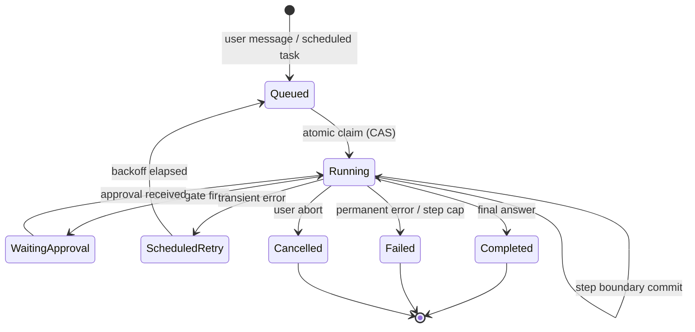
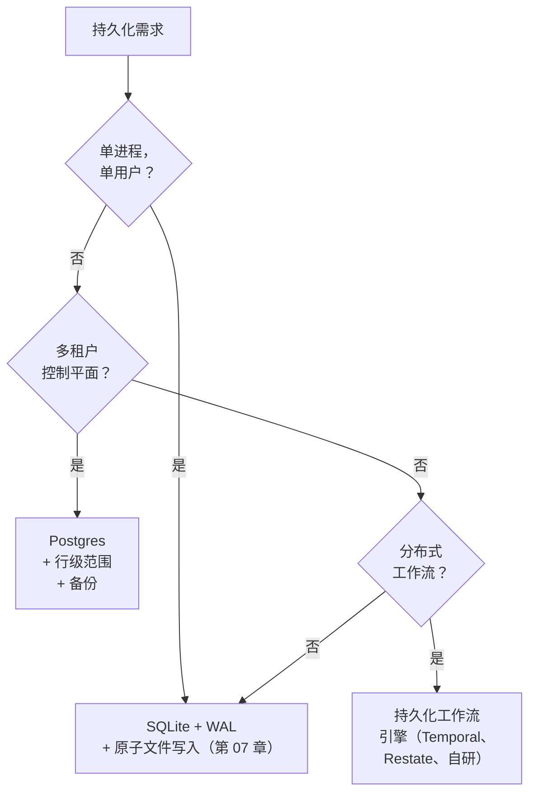

# 第 08 章 — 状态与持久化

## TL;DR

长时间运行的智能体应该在进程重启、节点故障或循环中途的部署中存活——不重做已经完成的昂贵工作，也不重复执行破坏性操作。本章讲的是持久化执行：什么在运行时算作状态（消息数组、正在进行的工具调用、中止令牌、凭证、提示词指纹），步骤边界提交在哪里，运行状态机和比较并交换（CAS）声明如何协调多个进程，心跳和孤儿清理器对挂起工作的作用，如何在 SQLite、Postgres 和持久化工作流引擎之间选择，以及崩溃恢复、恢复和用户点击"恢复"按钮之间的区别。

---

## 为什么这很重要

一个编程智能体已经运行了四十分钟。它读取了五十个文件，进行了十二次编辑，生成了三个拉取请求描述。部署上线了。进程重启。智能体在内存中丢失了中止令牌，但检查点显示它在第 23 步。在重放时你发现智能体重新发送了一个拉取请求描述，因为发布描述的工具不是幂等的，harness 重试了它。你的团队的 GitHub 现在有了一个重复的 PR。模型是好的。智能体的代码是好的。持久化层泄漏了。

这类故障在开发中不会出现——它在你第一次在负载下进行真正的部署时出现。代价以可靠性或本章讲到的细心工作来支付。

---

## 概念

### 对智能体来说"持久化"实际上意味着什么

并非所有运行时状态都是相同的。在编写任何代码之前，一个有用的清单：

- **消息数组** — 每次模型轮次、每次工具调用、每次工具结果。只追加，持久化，重放的真相来源。（这是第 05 章的审计日志，从运行时角度看。）
- **工具执行状态** — 对每次工具调用：待处理、运行中、已完成、失败。在 OpenCode 的 `ToolPart.status`、Paperclip 的 `heartbeat_runs.status`、Hermes Agent 的内联结果中。
- **进行中的副作用** — *已开始*但尚未返回的写入、发送、支付。最难恢复的状态；最容易判断错误的。
- **工作记忆** — 第 05 章的小型可变便笺簿。必须在崩溃后持久化，因为从记录重建它可能无法完全重现。
- **中止令牌** — 一个进程本地信号。*在重启后不会存活。*如果失控运行只通过中止令牌停止，崩溃会让它们继续运行。
- **身份验证配置文件和凭证** — 必须在启动时重新加载或可从凭证池重建。Hermes Agent 将它们存储在 `~/.hermes/agents/<id>/auth-profiles.json` 下；Paperclip 在 Postgres 中存储加密行，在主密钥文件后面。
- **提示词指纹** — 第 04 章的 SHA。必须通过存储往返，以便重建的系统提示词是字节相同的，缓存在重启后存活。
- **成本和 token 账本** — 预算上限的运行总计（第 17 章）。Hermes Agent 在恢复时从消息日志重新计算；Paperclip 在 `cost_events` 表中单独持久化以供审计。如果预算必须*跨*重启强制执行，账本需要自己的持久化——从日志重新计算是可以的，直到日志被部分压缩，那时就不行了。

持久化运行时是对上面每个项目都有明确策略的运行时：提交前持久化、提交后持久化、在恢复时重建，或接受丢失。没有"默认"答案；按项目选择，写下来，让你的智能体从列表生成持久化代码。

### 步骤边界作为提交点

一步是一次完整的循环迭代：模型调用→任何工具调度→反思。提交点位于反思和停止之间——与第 02 章识别为一切附着的地方相同的边界。步骤完成后，在循环让步之前，三件事应该在磁盘上：

- 追加到审计日志的新消息。
- 工具执行状态转变为终止值。
- 工作记忆和任何成本/使用计数器更新。

OpenCode 在每个 `LLM.stream()` 周期后刷新；Hermes Agent 在 `_flush_messages_to_session_db` 形式的写入中做同样的事情；Paperclip 按 `heartbeat_run_events` 行提交。模式是通用的：在让步控制权之前写入。在其写入持久化之前返回给调用者的步骤是一个可能丢失的步骤。

```ts
// 步骤边界提交持有的内容。
type Checkpoint = {
  sessionId:           string;
  stepIndex:           number;
  status:              "running" | "waiting_for_approval"
                     | "completed" | "failed";
  messageRange:        [number, number];   // 在这一步追加的
  workingMemory:       WorkingMemory;
  tokensSpent:         number;
  costSpent:           number;
  promptFingerprint:   string;             // 第 04 章
  lastError?:          string;
  committedAt:         string;
};
```

不要将密钥写入检查点——存储密钥*引用*并在运行时解析它们。不要将重试计数器写入消息日志——它们属于检查点，在那里更新。

### 运行状态机

运行是用户消息（或预定触发器）和其终止答案之间的工作单元。每个生产系统都用明确的状态机对此建模。隐式转换是智能体系统中一半的重复副作用 bug 的来源。



Paperclip 几乎完全编码了这一点——`heartbeat_runs.status IN (queued, running, completed, failed, cancelled, scheduled_retry)`。规则：

- 每次依赖当前状态的转换都需要条件更新——`UPDATE ... WHERE status = <expected>` 是最低限度。典型的竞争是 `queued → running`（两个 worker 争夺同一行），下一小节将详细介绍该模式，但同样的 `WHERE` 子句保护审批（`running → waiting_approval`）、中止（`running → cancelled`）、重试转换，以及免受并发覆盖的终止写入。基于在你下面已经改变的状态进行的转换是一个丢失的更新——相同的 bug，不同的标签。
- `running → terminal` 一旦赢得就是*幂等的*：在已经终止的行上设置相同终止状态的重复提交是空操作，这是重放或重试时的预期行为。
- 终止状态永远不会回转。需要重试的 `failed` 运行产生一个新的运行，带有链接回来的 `parent_run_id`——永远不会原地复活。

这一层上大多数智能体 bug 是状态机 bug：让相同工作发生两次的隐式转换，或让运行卡住的缺失转换。

### 崩溃恢复 vs 恢复 vs "恢复按钮"

这三个听起来相似，行为却大相径庭。

- **崩溃恢复**是*相同意图，新进程体*。部署重启了；用户期望工作继续。系统提示词不变；如果前缀通过磁盘逐字节往返*并且*提供商的 TTL 没有过期*并且*你路由到相同的模型和区域，缓存*可能*是热的（缓存是按提供商、按模型、通常按区域的——第 04 章有详情）。进行中的工具调用需要仔细分类处理。
- **恢复**是*相同的会话，稍后的时间*。用户关闭了标签页，几小时后回来了。缓存可能已经过期（第 04 章 TTL）。系统提示词可能在访问之间被编辑。审计日志干净地重放，但世界可能已经继续前进。
- **"恢复按钮"**是继续已暂停会话的*显式用户操作*。用户知道有一个间隙；系统有更多自由度来请求确认、呈现发生了什么，以及在适当时重置工作记忆。

混淆这些会产生微妙的 bug。崩溃恢复对*安全重放的工作*应该是静默和积极的——只读操作、标记为 `idempotent: true` 的工具（第 03 章），以及由发件箱支持的副作用。其他任何东西都通过下一小节的进行中分类处理路由，不可重放的工具调用向用户呈现而不是静默重试。恢复应该尽可能保留缓存，在无法保留时接受代价。恢复按钮应该*向*用户展示他们在哪里以及什么即将重新运行。

### 崩溃时进行中的工具调用

本章中最难的情况。工具调用已开始；结果从未返回；进程死亡了。重启时，存在四个选项，按偏好顺序：

1. **工具在元数据中标记为 `idempotent: true`（第 03 章）。** 重放它。第二次调用返回相同结果。
2. **工具有外部幂等键。** 用相同的键重放它；下游系统进行去重。
3. **工具在执行前写入了持久的发件箱。** 重放读取发件箱；如果意图被标记为已完成，跳过；否则用相同的键重试。
4. **工具重放不安全。** 将运行标记为失败，向用户呈现。一个尴尬的*"这发生了吗？"*比一封重复的电子邮件要好。

第 03 章的元数据标志是让 harness 不用思考就能选择正确选项的东西。没有这些标志的工具默认为（4）：大声失败，问用户，永远不要静默重试。相反——默认重试——就是重复 PR 的发生方式。

### 比较并交换的原子声明

任何跨多个进程运行的东西——选取排队工作的心跳调度器、在同一会话上竞争的两个 API 服务器——都需要原子声明。跨数据库的模式是相同的：对状态列进行比较并交换。

```sql
-- 原子地声明一个排队的运行。只有在赢得竞争时才返回行。
UPDATE runs
   SET status      = 'running',
       claimed_by  = :worker_id,
       claimed_at  = now()
 WHERE id     = :run_id
   AND status = 'queued'
RETURNING *;
```

如果 `UPDATE` 影响了零行，另一个 worker 先声明了它；继续前进。如果它影响了一行，你拥有该工作，直到你将其转变为终止状态或你的租约超时。Paperclip 在 `heartbeat_runs` 上使用这种形状；在 Postgres 风格的技术栈中，事务内的 `SELECT ... FOR UPDATE` 是等价的；在带 WAL 的 SQLite 中，相同的 `UPDATE ... WHERE status=...` 有效，因为写入者是串行化的。

对于单进程系统（单用户模式的 Hermes Agent，OpenCode 开发服务器），CAS 是过度的。对于任何*可能*稍后水平扩展的东西，从第一天就接入它——代价是一列和一个 `WHERE` 子句；事后改造的代价要高得多。

### 心跳和孤儿恢复

没有心跳的声明是一个缓慢的泄漏——worker 死了，运行保持"运行中"，没有其他东西接手它。生产系统将声明与两个额外列配对：

- **`last_heartbeat_at`** — worker 在运行活跃时每隔几秒更新这个。
- **`lease_expires_at`** — 当超过这个时间没有看到心跳时，运行被假定为孤儿。

清理服务定期扫描 `lease_expires_at < now()` 的运行，要么将它们重新排队（`status → queued`，新尝试），要么在重试计数耗尽后将它们标记为失败。Paperclip 的 `reapOrphanedRuns()` 正是这样；它在清除租约之前还确认操作系统 PID 已经死亡，以处理心跳只是慢而不是消失的情况。

两个调整常数是诚实的权衡：

- **心跳间隔。** 更短更快地检测孤儿，但写入流量更多。Paperclip 每隔几秒写入一次。
- **租约超时。** 更长容忍慢速工具（30 分钟的编译）；更短恢复更快。Paperclip 默认为六小时，并让适配器按工作负载调整。

清理器对分布式智能体来说不是奢侈品。它是唯一能防止单个崩溃的 worker 让工作永久卡住的东西。

清理器本身也需要活跃度。将其作为带有自己心跳的自己的作业运行，否则每个其他 worker 都可以在启动时竞争成为清理器。Paperclip 通过相同的 CAS 模式选举单个清理器——`service_locks` 小表中的一行，被声明和刷新。

### 只追加事件日志 vs 每步快照

两种持久化形状出现在系统中，通常组合使用：

- **只追加事件日志。** 每步写入新行；当前状态通过按顺序读取所有行来计算。Hermes Agent 的 `messages` 表是这样；Paperclip 的 `heartbeat_run_events` 是这样；OpenCode 的 `PartTable` 大多是这样。
- **每步快照。** 每步写入*整个*状态对象，覆盖上一个。恢复更快（不需要重放）；磁盘占用更大；更难审计，因为中间值丢失了。

大多数生产智能体对审计日志做只追加（因为第 05 章无论如何都需要完整记录），对工作记忆和检查点元数据做每步快照（因为这些需要快速随机访问和小占用）。组合操作成本低廉，既给你审计故事又给你恢复故事，而不重复任何一个。

### 选择存储



SQLite 承载了大量的生产重量。Hermes Agent 和 OpenCode 都是 SQLite 支持的，并运行真实的工作负载。原因：WAL 模式给你并发读者和单个写入者而无需任何配置，`fsync` 使其持久化，而文件只是一个文件——易于复制、易于备份、易于用 CLI 检查。

当*多个进程*必须协调写入、当你需要数据库强制执行的*多租户*行范围、或当你需要*调度器*在节点之间唤醒延迟作业时，超越 SQLite。Paperclip 选择 Postgres 正是这样：它是一个需要所有三个的控制平面。持久化工作流引擎（Temporal、Restate、自研等价物）是其上方的一步——当智能体本身的逻辑最好表达为具有必须重放安全的任意副作用步骤的工作流时有用。

WAL 模式不是免费的。它在 `.db` 旁边添加了 `-wal` 和 `-shm` 文件，在繁重的写入阶段大约使磁盘使用翻倍。对于移动或边缘智能体，普通日志模式可能是正确的选择。Hermes Agent 的 `apply_wal_with_fallback` 处理 WAL 不可用的情况（NFS、SMB），并优雅地回退到 `journal_mode=DELETE`。

### 步骤边界的幂等性，不只是工具

第 03 章涵盖了工具级幂等键。步骤级幂等性是不同的保证：*相同的步骤，重放，必须产生相同的可观察效果。*

```ts
function stepIdempotencyKey(c: {
  sessionId: string; stepIndex: number; action: string;
}) {
  return sha256(`${c.sessionId}:${c.stepIndex}:${c.action}`).slice(0, 32);
}
```

两种模式在此之上：

- **发件箱模式。** 在发出副作用之前，将*意图*（及其幂等键）写入持久化表。副作用成功后，将意图标记为已完成。重放时，harness 首先读取表：已完成的意图被跳过；未完成的用相同键重试。这将*决定*的持久性与*交付*的持久性解耦。
- **完成标记。** 对非分布式系统的更简单版本：检查点上的 `step_complete` 布尔值。一旦设置，步骤永远不会重新运行，即使其中的某些子动作从未返回值。诚实的局限性：标记告诉你关于*你自己的*提交，而不是世界的。如果副作用穿越了一个网络，进程死在调用着陆和标记被持久化之间，恢复无法知道哪个发生了。盲目跳过有丢失工作的风险；盲目重试有做两次的风险。正确的做法是*对账*——询问下游系统调用是否成功——这正是发件箱模式的作用，这也是为什么一旦副作用离开你的进程，完成标记就不够了。

大多数生产智能体使用第二种；发件箱模式在副作用跨越你不能完全信任的网络边界时出现（第三方 API、消息队列、本身也会崩溃的下游服务）。

### 压缩链遇到恢复

第 05 章介绍了会话轮换：当压缩不再够时，创建新会话，通过 `parent_session_id` 链接回旧的。从持久化角度看，这也是一个*恢复原语*。失败的长时间运行会话可以被一个以总结父状态的交接块开始的新会话替换；审计日志仍然可以一路追溯，而新会话的缓存在没有拖着旧会话负担的情况下新鲜预热。

推论：永远不要删除一个父会话，因为它的子会话恢复了它。归档它，标记它为已取代，但链必须保持完整。恢复、审计和回滚都依赖于它。第 07 章的"永不修剪审计日志"规则在这里也适用——不同的角度，相同的规范。

### 操作存储：备份、恢复、迁移

没有备份的状态是将会丢失的状态。模式：

- **备份。** Paperclip 定期发送带有可配置保留窗口的 `pg_dump`。SQLite 支持的系统应该按计划运行 `VACUUM INTO` 快照并复制文件。最低限度是每日完整快照；更好是增量 WAL 备份。低于"每日"的任何东西都是你在事故后会讲的故事。
- **恢复。** 始终恢复*一致的*快照——永远不要将选择性的行从备份恢复到实时存储，除非你能证明它们不违反状态机。恢复还必须遵守第 07 章的删除标记——在用户请求或保留策略下删除的内容在旧快照被恢复时仍然保持删除，否则你刚刚复活了你承诺删除的数据。恢复很少见；在需要之前排练它，最好作为部署清单的一部分。
- **Schema 迁移。** Schema 在部署之间改变。OpenCode 和 Paperclip 使用 Drizzle 迁移；Hermes Agent 用 `schema_version` 行明确版本化 schema。前向路径是有据可查的；*后向*路径几乎从不是。默认为添加性迁移（带默认值的新列），为显式数据清理部署保留破坏性迁移。
- **迁移中的进行中运行。** 在 schema v3 下写入的检查点在 v4 下可能不能干净地反序列化，如果 v4 删除或重命名了一列。用写入它的 schema 版本戳记每个检查点（`checkpointSchemaVersion: 3`）。使恢复路径版本感知——应用每版本的强制转换将检查点向前推进，当强制转换不可能时大声失败，而不是静默地产生损坏的运行。对于破坏性迁移，首先*排空*进行中的运行：停止队列，等待活动运行终止或被取消，然后迁移。五分钟的暂停吞吐量胜过三天调试半迁移的检查点。

### "恢复按钮"实际上需要什么

如果你发布了一个标有*"恢复"*的按钮，用户期望的不仅仅是崩溃恢复。他们期待对*我在哪里，即将发生什么？*的诚实回答。具体来说：

- 会话必须可以从磁盘完整加载——审计日志、检查点、工作记忆、成本账本，一路追溯。
- 系统提示词必须逐字节重建，或者必须告知用户缓存将支付重建成本（第 04 章）。
- 上一次尝试中进行中的工具调用必须被分类（幂等/发件箱/不安全）并在循环继续之前呈现。
- 用户应该能够看到*智能体上次做了什么*以及*它接下来打算做什么*——最后完成的步骤和下一个计划的动作。

这是第 05、06、07 和 08 章*共同*使成为可能的系统。记忆在正确的地方存活，审计日志以正确的顺序重放，缓存在可能的地方保持温热，用户看到一幅连贯的图景，而不是*"你的智能体崩溃了；点击这里。"*恢复按钮是表面；其下的一切就是本章的内容。

---

## 真实系统注记

- **OpenCode** 是编程智能体环境中嵌入式持久化的最强参考：带 Drizzle 迁移的 SQLite + WAL，只追加的 `SessionTable` / `PartTable` / `SyncEvent`，支持回退 UI 的隐藏 git 快照仓库，以及*不*在重启后存活的每会话中止控制器（刻意——中断只在运行时）。
- **Paperclip** 是控制平面级别分布式持久化的参考：带 `SELECT ... FOR UPDATE` 的 Postgres 用于原子声明，带明确转换的 `heartbeat_runs` 状态机，`reapOrphanedRuns` 清理器在清除租约之前确认操作系统 PID 的活跃性，每个表上的多租户范围，带保留期的预定 `pg_dump` 备份，以及适配器进程隔离，使父级崩溃不影响子级运行。
- **Hermes Agent** 是第 04 章应用于这里的缓存-恢复二元性的参考：`SessionDB.sessions.system_prompt` 持久化字节相同的提示词，使被驱逐然后恢复的智能体重放热缓存，`apply_wal_with_fallback` 处理 WAL 不友好的文件系统，以及 cron 调度器的基于文件的锁显示最简单可能的咨询锁模式。
- **OpenClaw** 存储每个会话的 JSONL 记录加上凭证和记忆状态，说明了一个基于文件的持久化模型，对于单用户多渠道使用无需数据库即可扩展。好提醒"持久化"在工作负载合适的情况下不需要数据库。

---

## 与你的智能体配对

以下提示词在本章效果很好：

- *"逐项清点我的运行时状态——消息数组、工具状态、进行中的副作用、工作记忆、中止令牌、凭证、提示词指纹。对于每一个，告诉我我当前的存储是否持久化它，并在没有的地方提议修复。"*
- *"用明确的 `status` 列和 CAS 声明实现本章的运行状态机。编写一个压力测试，让两个 worker 在同一个排队的运行上竞争，并验证其中恰好一个获胜。"*
- *"为我的运行添加心跳和孤儿清理器。清理器应该在清除卡住的租约之前确认操作系统 PID 的活跃性。为我的工作负载调整心跳间隔和租约超时，并用三个要点解释权衡。"*
- *"按第 03 章的 `idempotent` 标志对我的所有工具进行分类。然后编写使用该标志决定重放 vs 跳过并询问的崩溃后恢复逻辑。用故意在工具中途注入的崩溃来测试它。"*
- *"为一个特定的外部副作用（发送 Slack 消息）接入发件箱模式。写意图，发送，标记已完成。在每对之间注入崩溃，并验证恢复时的结果。"*
- *"分析十个真实会话中我的检查点负载。如果平均超过 50 KB，提议应该从每步快照移动到只追加日志的内容。"*
- *"将崩溃恢复 vs 恢复 vs 恢复按钮实现为三种不同的代码路径。告诉我每种情况下哪个触发：部署后进程重启、用户 24 小时后返回、用户点击失败运行上的恢复。"*
- *"写恢复排练：停止我的服务，恢复昨天的快照，重新启动，证明状态机是一致的。端到端计时，以便我知道实际事故会花多长时间。"*

---

## 接下来

你现在有了一个在重启后存活、跨进程协调工作、并在不重复执行破坏性工作两次的情况下干净恢复的运行时。

上一层是*规划*——智能体如何在执行之前决定跨多个步骤做什么。第 09 章涵盖四种规划形状（无计划、清单、规划-执行-重规划、依赖图），每种何时有帮助、何时有害，以及隐藏在最简单选择中的故障模式。
