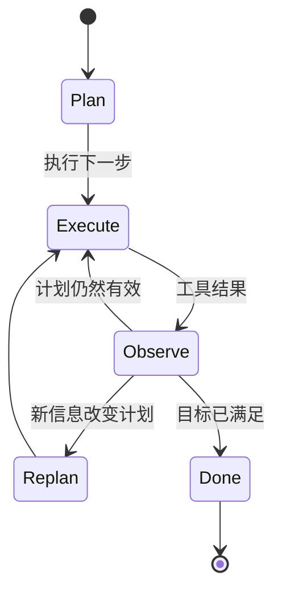

# 第九章 — 规划模式

## 简述

有些任务模型一步就能回答，有些需要三步，有些需要三十步。规划（Planning）是决定任务属于哪种类型、以及如何构建智能体执行路径的层次。本章涵盖生产环境中出现的四种规划形态（无规划、检查清单、规划-执行-重规划、依赖图），设计决策的选择依据（隐式 vs 显式、仅规划 vs 构建、谁来编辑计划），捕获过时计划的重规划触发器，以及每种形态中隐藏的失败模式。目标：选择最简单且适合任务的规划模式——并在任务需要升级时及时识别。

---

## 为什么重要

没有规划，智能体会陷入混乱——反复读取相同文件，在第 4 步走错方向却毫无察觉，调用工具完成上一个工具已完成的工作。规划*过多*，同样的智能体会花费大量 token 来提出一个 20 步的蓝图，但第一个工具结果与其矛盾时，整个蓝图就会失效。代价体现在 token、延迟，以及（最糟糕的）自信地给出错误问题答案上。

修复方法不是"总是多规划"，而是将规划形态与任务匹配，并知道何时重规划。本章其余内容就是这四种形态及其周围的规则。

---

## 核心概念

### 四种形态并排对比

在深入讲解之前，先有一个有用的思维导图：


通常可以通过两个问题来判断任务需要哪种形态：*目标有多明确？* 以及 *第 1 步的结果改变第 2 步计划的可能性有多大？* 高确定性、低偏差的任务适合前两种形态；后两种适合路径真正不确定或有独立分支的任务。

### 形态 1 — 无规划

智能体选择一个工具，运行它，然后要么给出答案，要么选择下一个工具。这是简短问答、一次性查找、简单转换任务的默认方式。OpenClaw 的响应式流程以及大多数主流商业智能体在聊天模式下，当任务规模足够小时就使用这种方式——*"当前安装的 node 版本是什么？"* 不需要规划。

快速、低成本、灵活。但在真正的多步骤任务上容易陷入混乱。

### 形态 2 — 检查清单

模型在行动前先写一个简短的有序列表，并在执行过程中逐项划掉。OpenCode 的 `TodoWriteTool` 是最清晰的参考：模型在工作内存中维护一个 Markdown 检查清单；提示词构建器每轮将当前列表注入其中。Hermes Agent 通过技能形态的任务笔记实现类似效果。

```ts
// 检查清单工具返回的内容。列表是模型下一轮读取的内容。
type ChecklistPlan = {
  objective: string;
  steps: Array<{
    id:     string;
    text:   string;
    status: "pending" | "in_progress" | "done" | "skipped";
  }>;
};
```

适合：3-8 个有序步骤，模型可以合理地将整个计划保持在脑海中，但进度跟踪有帮助。列表就是记忆；模型对照它进行自我纠正。

### 形态 3 — 规划-执行-重规划

模型提出一个计划，执行一步或多步，观察结果，如果结果改变了情况，则*重新提出*计划。大多数主流商业智能体在处理非平凡任务时以这种交互模式工作；Paperclip 的 `plan_only` 执行模式是这个模式的"先规划后执行"的专用部分。



适合：调查、调试、研究——任何在第 3 步完成之前无法知道第 5 步是什么的情况。代价是每次重规划事件都要额外调用一次模型；好处是智能体不会被束缚在过时的计划上。

### 形态 4 — 依赖图

对于有独立分支的任务（并行审查三个文件；从三个来源获取并合并），将计划表示为有向图，并行执行可运行节点。在实践中，这种形态位于纯规划之上一层，在委托（第 10 章）中——可运行节点通常变成子智能体调用。

```ts
// 可运行 = 待处理 + 所有依赖已完成。简单调度器。
function runnableNodes(nodes: PlanNode[]) {
  const done = new Set(
    nodes.filter(n => n.status === "done").map(n => n.id)
  );
  return nodes.filter(n =>
    n.status === "pending" && n.dependsOn.every(id => done.has(id))
  );
}
```

适合：有明确并行性和汇合点的工作流。不适合：任何看起来是线性的情况，此时图只是为了复杂而复杂。

### 选择形态

| 任务形态 | 规划形态 |
|---|---|
| 一个明显的行动 | 无规划 |
| 3-8 个有序步骤 | 检查清单 |
| 不确定路径；结果改变下一步 | 规划-执行-重规划 |
| 有汇合点的独立分支 | 依赖图 |

需要注意两种反模式：因为依赖图看起来复杂而选择它，但其实检查清单就够了；以及在任务明显需要结构时仍停留在"无规划"模式。模型会顺从两者——你的设计必须推回去。

### 计划作为记忆，而非漂浮在消息中的文本

计划只是文本——但存放位置很重要。它可以存放在三个地方：

- **在工具结果中。** 模型调用了 `todo_write`；结果是新列表；列表像其他工具结果一样出现在易变的尾部。
- **在工作内存中**（第 5 章的可变草稿区）。列表是 `WorkingMemory.currentPlan` 的一部分，提示词构建器每轮渲染它。
- **在用户可以编辑的单独文件中**（`plan.md`，OpenCode 的 `plan.ts` 流程）。智能体和用户共享该工件；任何一方都可以修改。

将计划跨轮次保存在同一个地方，这样模型就知道去哪里查找。不要有时写入文件，有时在工具结果中返回；选择一个方式。Hermes Agent 将任务计划保存在技能文件中；OpenCode 将它们保存在 todo 工具中；主流商业智能体倾向于将它们保存在每轮重新渲染到提示词中的工作内存中。

### 仅规划智能体 vs 构建智能体

真实的生产系统做了一个有用的分离：*规划*的智能体使用与*构建*的智能体不同的工具集。OpenCode 注册了独立的 `plan` 和 `build` 智能体配置文件；Paperclip 通过 `planning_mode_directive` 将问题路由到规划者或构建者。形态如下：

- **仅规划智能体。** 只读工具，无编辑，无 Shell，输出是结构化计划。通常廉价的模型就足够了。
- **构建智能体。** 完整工具访问权限，包括写入、编辑、Shell。昂贵的模型在这里。

交接：规划者的计划得到批准（由用户或策略），然后构建智能体以该计划为起始上下文运行。当规划者和构建者是不同的智能体时，这是第 10 章的领域；在单智能体设置中，同一个智能体在轮次之间切换模式。

### 隐式 vs 显式计划

有些智能体从不写计划——它们只是不断选择下一个工具。其他的则将写计划作为第一个行动。隐式在小任务上更快；显式可以尽早发现脆弱假设的失败模式。一个有用的默认值：*如果任务描述命名了两个或更多可交付物，则需要显式计划；否则让模型每轮决定。*

朝这个方向最便宜的提示：在多步骤任务的系统提示中包含短语"*从写你的计划开始*"。模型通常会遵守，而它写的计划本身就是一个有用的信号——如果模型无法表达一个计划，那么任务就是规格不足的。

### 何时重规划

四个信号意味着"计划不再有效"：

- **新信息** — 与计划假设矛盾的工具结果。
- **失败步骤** — 出错或返回意外输出的步骤。注意第 2 章中的死循环特征：同一步骤以同样方式失败三次意味着重规划，而非重试。
- **范围蔓延** — 用户添加了新需求；现有计划未涵盖。
- **过时假设** — 计划写成时假设文件在 `path/A`；现在在 `path/B`。最难检测：智能体必须明确*检查*假设，而不是假设它仍然成立。

```ts
// 廉价防御：在每步之前检查前提条件。
async function preconditionsHold(step: PlanStep, ctx: AgentContext) {
  for (const check of step.preconditions ?? []) {
    if (!(await check(ctx))) return false;
  }
  return true;
}
```

重规划本身并非免费——它需要一次模型调用。当错误代价高时（触碰生产数据），积极地重规划；当代价低时（研究摘要），惰性地重规划。

### 计划即状态

计划存在于工作内存（第 5 章）中，并与其余运行时状态（第 8 章）一起存档。崩溃后，恢复应该拿起计划和已完成步骤列表——*不是*重新制定计划并重新执行已完成的步骤。这就是第 8 章步骤边界提交如何防止规划层双重执行的方式。

```ts
type PlanningCheckpoint = {
  goal:              string;
  plan:              ChecklistPlan | { nodes: PlanNode[] };
  completedStepIds:  string[];
  lastReplanReason?: string;
  lastReplanAt?:     string;
};
```

连接持久化时，将计划包含在检查点中。连接恢复时，在第一次模型调用*之前*加载它，这样模型就知道它处于任务中途。

### 检查并选择 vs 预先规划

关于"无规划"和"规划-执行-重规划"之间的模糊性，有一个有用的框架：在每一步，智能体可以*检查*当前状态并选择下一步（响应式），也可以*承诺*一个计划好的下一步（声明式）。它们并不互斥——大多数生产智能体是混合体。

- **检查并选择。** 低延迟，灵活，适合探索。权衡：模型可能会失去对高层目标的追踪，追逐局部最优。
- **预先规划。** 起始延迟更高（计划需要一次模型调用），但智能体锚定在目标上；下游步骤继承框架。权衡：当世界在计划下面发生变化时会变得刚性。

通常最有效的混合方式：预先规划足以确立工作的*形态*（三到七步），然后在每个步骤内检查并选择。计划是脚手架；每步决策来填充它。

### 计划抽象级别

50 步的计划是规格，不是计划。1 步的计划根本不是计划。正确的粒度介于两种反形态之间：

- **过于详细。** 四十七步。第一步失败，整个计划就无效了；维护成本主导一切。
- **过于模糊。** *"修复 bug。"* 没有提供智能体可以执行的结构。

一个有用规则：**每个计划步骤应该映射到一两次工具调用。** 如果一步需要智能体在行动前思考一段话，就分解它。如果一步是*"用参数 Y 调用工具 X"*，那是实现，不是计划——让模型推导它。大多数生产智能体对于中等复杂任务收敛到 5-12 步。

一个具体对比，同一任务（登录回归）：

| 粒度 | 示例步骤 |
|---|---|
| 过于模糊 | *"修复登录 bug。"* — 没有命名资源，没有结果。智能体无处开始。 |
| 过于详细 | *"调用 `read_file({path: 'src/auth.ts'})`；定位第 42 行；调用 `write_file(...)` 将 `userId` 改为 `user.id`；调用 `run_shell({cmd: 'npm test'})`。"* — 这是实现，不是计划；第一次失败使其下面的所有内容都无效。 |
| 可检查的里程碑 | *"在开发服务器上重现登录失败流程；在 `src/auth.ts` 中追踪 500 错误到问题字段；修复字段引用；重新运行认证单元和集成测试。"* — 每步命名一个结果和一个资源；智能体选择工具。 |

中间行是模型在运行时被*允许做的*，不是计划*所针对的*。底行才是计划：智能体有足够的结构来行动，你有足够的结构来在不读代码的情况下中途检查。

### 计划修订用户体验

如果用户可以中途编辑计划，你会获得更好的反馈循环——这也是保持智能体诚实的最廉价方式之一。模式：

- 计划存在于用户可以看到的地方（文件、UI 面板、聊天消息）。
- 智能体每轮开始时重新读取计划。
- 用户的编辑对下一轮可见，可能触发重规划。

OpenCode 的 `plan.md` 文件是用户可编辑的。主流商业智能体通常在 UI 中渲染计划并接受内联编辑。这在计划只存在于模型工作内存中的系统中几乎缺失——这是一个遗漏的机会。如果你能给用户一个计划的控制柄，就这样做。

### 规划也是可观测性

与前面章节中的缓存、压缩、检索和内存指标并行，三个规划测量指标值得从第一天就开始记录：

- **重规划率** — 触发重规划的步骤比例。太高（>30%）意味着计划抽象是错误的；太低（<5%）通常意味着智能体忽略了本应触发重规划的新鲜信息。
- **计划 vs 执行偏差** — 会话结束时，将最初提出的计划与实际发生的事情进行比较。大偏差是规划器产生低价值计划而执行器忽略它们的信号；小偏差但结果差意味着计划一开始就是错的。
- **首次行动时间** — 用户消息到智能体调用第一个工具之间的时间。如果规划器在做任何事情之前始终花费两次模型调用，你可能对小任务过度规划了；如果它从不规划，你可能对大任务规划不足。

这些指标属于第 16 章的追踪管道，与前面章节的指标并列。它们共同告诉你你的规划形态是否与你的流量匹配——或者某个团队是否在检查清单就够用时还在使用图。

### 失败模式

| 失败 | 症状 | 修复 |
|---|---|---|
| 过度规划 | 模型花轮次完善计划，从不执行 | 限制规划轮次；在 N 次后要求执行 |
| 规划不足 | 漂移；智能体解决了错误的子问题 | 如果任务看起来是多步骤的，要求显式计划 |
| 计划过于详细 | 一次失败使整个计划无效 | 分解到每步 1-2 次工具调用 |
| 计划过于模糊 | 智能体无法对其采取行动 | 拒绝步骤不命名具体结果和资源的计划——*什么*改变，*在哪里*，而不是调用哪个工具 |
| 过时计划 | 计划写成时假设 X；X 现在是假的 | 在每步之前添加前提条件检查 |
| 计划从未被重读 | 模型凭记忆执行，忽略编辑 | 每轮将计划渲染到提示词中 |

每个都是一件小事需要防御；它们共同构成了你在生产环境中会看到的大多数规划 bug。

---

## 真实系统说明

- **OpenCode** 在编码智能体上下文中提供了明确的规划原语：具有不同工具集的独立 `plan` 和 `build` 智能体配置文件，用于模型维护的检查清单计划的 `TodoWriteTool`，以及用于用户可以编辑的基于文件的计划的 `plan.ts` 流程。
- **Paperclip** 在编排层面表达规划：`planning_mode_directive` 在仅规划和构建模式之间切换问题；恢复问题可以为狭窄任务请求更轻量的模型。监督者（心跳服务）将工作路由到规划者或构建者智能体。
- **Hermes Agent** 将计划保存在技能和工作内存中：长期运行任务变成带有步骤列表的技能文件；定时触发的工作针对预先写好的轻量计划加上第 5 章的持久状态运行。
- **OpenClaw** 更具响应性——规划存在于底层智能体运行时内部，而非渠道适配器层——这使它成为"无规划"极端的有用参考，以及思考何时规划是不必要的噪音的参考。

---

## 与你的智能体配对

一些在本章中效果很好的提示：

- *"查看我最近二十次智能体运行。按四种规划形态（无规划/检查清单/规划-执行-重规划/依赖图）对每次进行分类，告诉我哪些运行对该任务使用了错误的形态，以及原因。"*
- *"实现一个 `todo_write` 工具，在工作内存中维护一个检查清单。每轮在提示词顶部渲染当前列表。给我看一次模型在完成步骤时划掉它们的运行。"*
- *"为我的计划步骤添加前提条件检查。在每步运行之前，验证其所做的假设——文件存在、测试仍然失败、分支是最新的。失败时，触发重规划并记录原因。"*
- *"将我的智能体拆分为 `plan` 配置文件（只读，廉价模型）和 `build` 配置文件（完整工具，昂贵模型）。连接交接：规划者输出一个计划，用户批准，构建者执行。给我看两个智能体的系统提示以及中间的批准界面。"*
- *"让我的计划可供用户编辑。在侧面板中渲染它；让用户以文本形式编辑它；确保智能体每轮开始时重新读取它，如果用户更改了它则重规划。"*
- *"分析我上周会话的重规划频率。如果智能体在超过 30% 的步骤上重规划，计划抽象级别是错误的——提出如何粗化步骤。如果少于 5%，它可能过于刚性——提出如何放轻它。"*

---

## 接下来

你现在知道何时规划以及如何表达计划了。下一个问题是：当计划需要*另一个智能体*来执行其中一部分时该怎么办。第 10 章涵盖委托——父智能体递给子智能体的数据包、返回的结果合约、递归上限、隔离模式，以及何时委托是正确的选择，而非使用工具。
