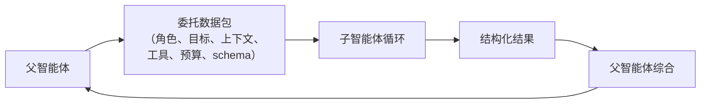
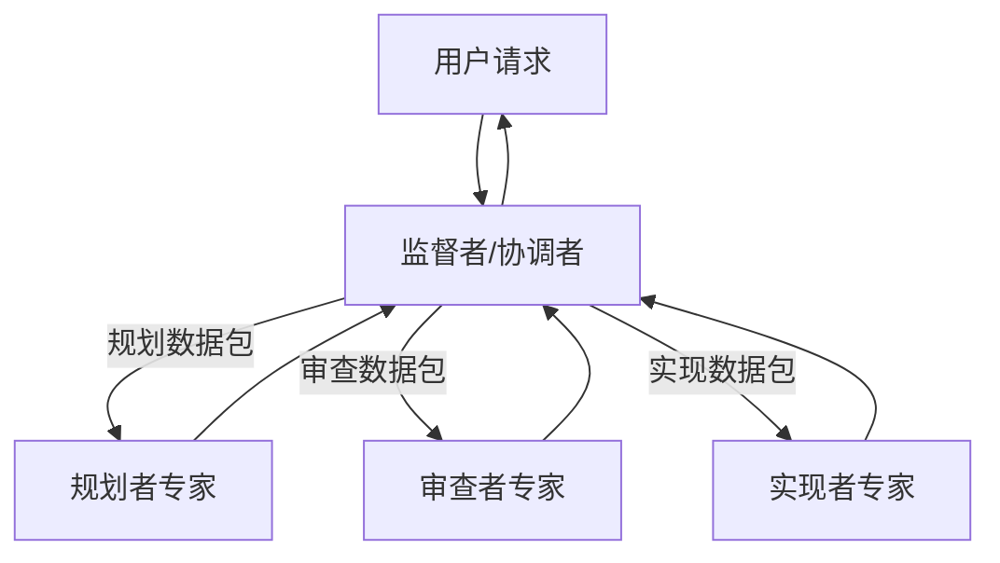

# 第十章 — 多智能体委托

## 简述

多智能体系统是一个智能体（父智能体）将另一个智能体（子智能体）作为有界工作单元运行。做得好，它可以隔离子任务，使父智能体的上下文保持干净，子智能体可以使用不同的工具集、模型或信任边界。做得不好，它会产生一个含糊的*"研究一下这个"*，带有无限工具且无输出合约，你会调试一个星期。本章涵盖委托数据包、结果合约、同步 vs 异步以及顺序 vs 并行模式、递归上限和隔离模式、监督者 vs 专家拓扑，以及如何决定委托是否是正确的选择，还是只是一个更昂贵的工具调用。

---

## 为什么重要

第一次构建多智能体系统时，你会同时发现三件事：子智能体使用的 token 比预期多，返回的文本比你想要的多，做出了你无法审计的决定。每一个都是合约失败。数据包是模糊的。结果 schema 不存在。审计跟踪是隐式的。

第二次的好处是学习它的理由：精心设计的委托是让智能体专业化的最廉价方式。父智能体保持通用；子智能体获得紧密的角色、小型工具集和适合任务的模型。整个系统的成本比单一的全知智能体更低，推理也更好。

---

## 核心概念

### 何时委托（何时不委托）

当以下至少一个条件成立时，选择委托：

- 子任务需要**自己的上下文** — 不同的系统提示、不同的记忆、不同的焦点。
- 子任务应该**隔离副作用** — 工作树、沙箱、独立的信任边界。
- 子任务需要**不同的模型或工具集** — 廉价模型用于狭窄查找，昂贵模型用于深度推理。
- 子任务与其他子任务**可安全并行** — 三个并行审查，然后综合。

*不要*委托当：

- 确定性工具可以回答问题时。
- 技能可以教父智能体自己做时。
- 子智能体无论如何都需要父智能体的完整上下文（你会为上下文付双倍代价）。
- 子任务太小，无法证明另一个模型循环的合理性（委托有设置成本——系统提示、工具列表、数据包构建）。

大多数团队跳过的最廉价改进：询问每个委托是否在替换一个成本更低的工具调用。

### 委托数据包

父智能体发送给子智能体的是一个*数据包*，而不是转录：

```ts
type DelegationPacket = {
  role:            string;       // "researcher" | "reviewer" | "implementer" | ...
  objective:       string;       // 子任务，用散文描述
  context:         string;       // 过滤后的切片，不是父智能体的完整转录
  allowedTools:    string[];     // 比父智能体更严格
  constraints:     string[];     // "不要在 /tmp 之外写入"，"最多 10 次文件读取"
  maxSteps:        number;       // 硬性上限
  budget?:         { tokens?: number; cost?: number };
  outputSchema:    JsonSchema;   // 结果必须是什么样的
  remainingDepth:  number;       // 剩余的委托深度（见递归上限）
};
```

生产中的一些规则：

- **默认不要转储父智能体转录。** 总结，或挑选子智能体实际需要的几条消息。转储会增加 token 成本、提示注入面，以及子智能体偏离任务的可能性。
- **收紧工具列表。** 审查者子智能体只获得读取工具。实现者获得限于工作树的写入权限。外部研究者获得网络工具但没有 Shell。
- **传递剩余委托深度。** 每次生成都减少它。当它达到零时，不再生成。



### 结果合约

返回的内容必须是可检查的。裸段落是等待发生的合约失败。生产系统最终会选择如下内容：

```ts
type ResearchResult = {
  answer:       string;
  evidence:     Array<{ source: string; quote: string }>;
  uncertainty:  "low" | "medium" | "high";
  followups:    string[];
  toolsUsed:    string[];      // 用于审计（第 16 章）
  cost?:        number;        // 用于父智能体的预算汇总
};

function validateAgainstSchema(result: unknown, schema: JsonSchema) {
  // 如果结果不匹配则拒绝子智能体的输出。
  // 输出错误是可恢复的错误——父智能体可以重试
  // 带有纠正提示，或者直接报错。
}
```

结构化输出让父智能体进行机械推理：验证 schema、评分置信度、跨兄弟比较、展示给用户。非结构化输出迫使父智能体再次调用模型来解释它们——每次委托都有第二个隐藏成本。

### 同步 vs 异步；顺序 vs 并行

两个正交轴：

- **同步** — 父智能体等待子智能体。大多数生产设置（OpenCode 的 `task` 工具，Hermes Agent 的 `delegate_task`）。
- **异步** — 子智能体在后台线程或进程中运行。Hermes Agent 的 `spawn_background_review_thread` 是标准参考；Paperclip 的心跳调度在系统级别是异步的。

- **顺序** — 父智能体委托 A，等待，然后委托 B。A 的结果影响 B。
- **并行** — 父智能体同时生成 A、B、C；它们独立运行；父智能体在全部返回时综合。

```ts
// 并行，当输入真正独立时。
const [api, ui, db] = await Promise.all([
  delegate(apiReviewPacket, ctx),
  delegate(uiReviewPacket, ctx),
  delegate(dbReviewPacket, ctx),
]);
const final = await synthesize([api, ui, db], ctx);

// 顺序，当一个结果决定下一个数据包时。
const investigation = await delegate(investigationPacket, ctx);
const patchPlan      = await delegate(buildPatchPlanPacket(investigation), ctx);
const final          = await synthesize([investigation, patchPlan], ctx);
```

并行节省挂钟时间；顺序保持推理有序。混合使用——收集阶段并行，综合阶段顺序。

### 递归上限与深度-1 默认值

可以生成自己子智能体的子智能体是等待发生的栈溢出。生产中的三种模式：

- **深度-1 默认**（最常见的生产选择）：父智能体可以生成子智能体；子智能体不能继续生成。最安全、最简单，这是你应该开始的方式，除非具体需求迫使你改变。
- **有界深度**（OpenClaw 在深度 5）：允许到一个小限制；耗尽时抛出异常。
- **拓扑上限**（Paperclip）：循环内根本不允许生成；调度器调度；智能体的父/子关系作为数据跟踪，而不是栈帧。

```ts
function assertCanSpawnChild(ctx: AgentContext) {
  if (ctx.remainingDelegationDepth <= 0) {
    throw new Error("委托深度耗尽；扁平化或通过监督者移交");
  }
}
```

一个微妙的陷阱：深度上限通常基于计数，但在深度 N-1 的两个子智能体可以各自生成一个子智能体，使深度 N 的有效工作量翻倍。如果成本比嵌套更重要，切换到*基于成本*的上限——总生成的 token，而不是嵌套计数。

### 隔离模式

每个子智能体获得什么级别的分离：

| 模式 | 隔离什么 | 成本 | 何时使用 |
|---|---|---|---|
| **同进程，共享内存** | 仅系统提示和工具集 | 最低 | 快速专家查询 |
| **独立会话，共享存储** | 内存命名空间，审计日志 | 低 | 大多数子智能体使用场景 |
| **工作树** | 文件系统（每个子智能体的 git 工作树） | 中 | 不应触碰主分支的代码编辑 |
| **沙箱** | OS 级别隔离（Docker、Modal、Vercel） | 高 | 不受信任的执行 |
| **独立进程/适配器** | 完整进程边界 | 最高 | 不同运行时；渠道适配器风格 |

OpenCode 支持工作树隔离。Hermes Agent 的工具环境（`tools/environments/`）在每个工具级别支持 Docker、SSH、Modal、Vercel Sandbox。Paperclip 在独立进程中运行每个适配器。选择是信任和预算决策：更高的隔离成本更高，但包含更多。

内存和召回方面——子智能体可以读取和写入什么——由第 6 章（召回边界）和第 7 章（写回边界）覆盖。在两者之间选择相同的答案；混合策略（子智能体可以读取一切但什么都不写）通常有效；相反（可写但不可读）几乎从不奏效。

### 在共享工件上并行工作

当子智能体在相关工件上并行运行时（三个审查者在同一代码库上，两个实现者编辑同一文档的不同部分），在生成之前选择一个协调形态。两种模式几乎涵盖所有情况：

- **隔离编辑 + 综合时合并。** 每个子智能体在自己的工作树、沙箱或命名空间中工作；父智能体在全部返回时合并输出。重叠作为合并失败出现，在单一点解决——由父智能体的综合步骤（当编辑不重叠时确定性合并），由审查者专家（当它们干净地重叠时语义合并），或由用户（当重叠是真实的）。这是更安全的默认值；它将冲突推到一个解决点，而不是让兄弟在共享状态中竞争。
- **共享黑板。** 一个小型结构化存储（JSON 文件、Redis hash、数据库行），兄弟可以在运行期间读取和写入——对于*"我已经检查了 `auth.ts`，跳过它"*式的协调很有用。黑板继承了第 7 章（原子写入）和第 8 章（CAS 转换）的锁定和 CAS 规范；没有这些的黑板是伪装成协调模式的竞争条件。

特别是对于编码智能体，工作树隔离加上后综合合并步骤是已确立的模式：每个子智能体获得自己的检出，父智能体并排检查差异，合并要么是确定性的（无重叠），要么是为了解决而浮出（检测到重叠）。让并行子智能体在单一 repo 状态上竞争是最昂贵的多智能体编码 bug 类型——部分的、相互不一致的编辑，每个文件看起来合理，但在集成时失败。一个额外工作树的成本远小于解开这种情况的成本。

### 监督者 vs 专家拓扑

两种角色在系统中反复出现：

- **监督者/协调者**决定谁运行，以什么顺序，以什么输入。通常是主智能体循环。Paperclip 的心跳服务是控制平面级别的监督者。
- **专家**是有紧密范围的子智能体，具有狭窄的工具集和明确的角色——`explore`、`review`、`summarize`、`extract`。专家不决定做什么；监督者决定。



可扩展的模式：命名你的专家。每个都有系统提示、工具列表、结果 schema 和一行描述。监督者按名称选择。OpenCode 的内置智能体配置文件（`build`、`plan`、`general`、`explore`）是标准参考；随着新的专家需求出现，你通常会为每个项目添加一些自定义配置文件。

### 每个子智能体的限制

父智能体对专家施加的每个限制也是第 4 章的收益。具有三个工具的专家拥有更短的系统提示（跨专家的缓存重用更多）。具有更廉价模型的专家每次调用成本更低。节省在许多委托中累积。

实际上：

- **工具。** 每个角色的显式白名单；默认拒绝。（第 3 章的元数据标志告诉监督者哪些工具对哪些专家是安全的。）
- **模型。** 廉价且快速用于狭窄任务；推理模型用于真正困难的子问题。
- **记忆。** 按第 6 章限定范围；通常读取父智能体的命名空间，写入自己的。
- **批准门。** 如果专家可以采取破坏性行动，它继承父智能体的权限规则——第 12 章涵盖该门。

### 上下文移交

子智能体最大的单一成本是父智能体传递给它的上下文。三种模式，从最便宜到最丰富：

- **新系统提示 + 仅目标。** 子智能体干净开始。最便宜。当目标包含所有上下文时有效。
- **摘要移交。** 父智能体的压缩（第 5 章）将相关轮次摘要为一个 `<context>` 块。中等成本；通常是正确的。
- **过滤的转录切片。** 父智能体选择最后 N 轮或所有匹配某些过滤器的轮次。最昂贵；保留给子智能体真正需要原始措辞的情况。

第 5 章的一个有用规则：父智能体的*压缩*操作转录通常是比完整审计日志更好的移交起点。压缩已经选择了重要的内容。

### 子智能体输出规范

当一句话就够时写段落的专家是 token 泄漏。父智能体应该强制执行：

- **简洁的最终答案。** 几句话，或一个结构化对象。任何更长的都是综合失败。
- **无中间噪音。** 默认情况下，父智能体不应该在其提示词上下文中看到子智能体的工具调用或推理——只有最终答案。（OpenCode 的 `task` 工具这样做；Hermes Agent 的 `StreamingContextScrubber` 对父智能体视图隐藏注入的记忆。）这是一个*提示词上下文*规则，不是*审计*规则：子智能体的工具调用、推理和中间轮次仍然记录到审计日志（第 5 章）和追踪管道（第 16 章），并可供调试、重放和事后审查。对父智能体的提示词隐藏以节省 token 并保持父智能体专注；但永远不要对操作者隐藏。
- **需要时引用证据。** 每个承重声明都有父智能体可以检查的来源。

训练为简洁的专家通常采用与第 5 章摘要者相同的方式训练：系统提示中的明确目的、结构化输出 schema、综合步骤的低温度。模型可以做到；父智能体必须要求这样做。

### 子智能体失败处理

子智能体可能以三种可区分的方式失败：

- **可恢复**（例如，schema 验证失败）。父智能体使用纠正提示重试，上限为 1-2 次尝试。
- **永久性**（例如，工具不可用，凭据无效）。父智能体显示失败，要么尝试不同的专家，要么向用户报告失败。
- **静默的**（例如，输出验证通过但答案是错的）。最难。防御措施在于结果 schema（置信度字段、引用、结构化字段）和交叉验证（第二个子智能体审查第一个）。

随时间追踪子智能体成功率。30% 时间失败的专家要么范围界定不佳，要么指向了错误的任务；无论如何，这都是值得尽早捕获的第 16 章信号。

### 长期运行控制平面中的监督者

一种值得单独提及的模式，因为它看起来不像子智能体：一个存在于智能体循环*之外*、跨许多运行的监督者。Paperclip 的心跳服务恰好是这样的。它调度、重试、监视孤儿、强制预算，并将工作路由到智能体。它监督的"智能体"不是进程内子智能体——它们是可能跨越分钟或小时的完整智能体运行。

这种模式对于工作超出单次智能体调用的生产系统很重要：长期运行的自动化、多步骤审批、异步用户交互。监督者是持久层；智能体是工作者。第 8 章的持久化和状态机是它所立足的基础。将监督者本身视为第 8 章运行：状态机、原子声明、心跳、收割者。

### 后台子智能体

最简单的非阻塞委托：一个守护线程，在成功轮次后运行，并写回到记忆或技能中。Hermes Agent 的后台审查分支是标准参考（从记忆写入角度在第 7 章中涵盖）。用于*"决定是否记住本次会话的任何内容"*或*"在后台摘要今天的工作"*——而不是用户等待的任何事情。

需要遵守的约束：

- 后台子智能体应该使用不同（通常更廉价）的模型。
- 受限工具集——通常只有记忆和技能工具。
- 它们的结果在*下次会话*中可见，而不是这次。第 4 章的缓存规则反过来适用：不要从后台进程改变正在运行的提示词。

### 验证和交叉检查

一个更近期的模式，在参考资料中尚未广泛存在，但值得标记：生成*第二个*子智能体，其唯一工作是针对相同上下文审查第一个子智能体的输出。审查者专家获得原始数据包加上第一个子智能体的结果，并返回*批准*或*这个答案的问题*。对抗静默失败的廉价保险。

两个实际说明：保持审查者的工具集比工作者更严格（通常只读），并将审查者预算设定为工作者成本的一小部分——审查者成本超过其审查工作的不值得调用。

---

## 真实系统说明

- **OpenCode** 提供了最清晰的进程内委托参考：一个 `task` 工具，生成带过滤上下文的子会话，以及一个 `Agent.Service.handleSubtask` 流程，向父智能体返回单个结构化观察。内置 `build`/`plan`/`general`/`explore` 配置文件展示了监督者/专家分割。
- **Hermes Agent** 是两种风格的参考：用于内联子智能体的同步 `delegate_task` 和用于具有严格受限工具白名单的异步后台子智能体的 `spawn_background_review_thread`。
- **Paperclip** 是控制平面模式：监督者（心跳调度器）将问题路由到智能体，跟踪 `parent_run_id` 血统，并跨运行强制预算和审批。恢复任务可以通过 `assigneeAdapterOverrides` 在编排级别请求更轻量的模型——每个子智能体的模型选择。
- **OpenClaw** 将渠道适配器用作跨进程边界的委托形式：入站消息调度到底层智能体运行时；适配器是边界。对于*"子智能体是不同进程"*的有用参考。

---

## 与你的智能体配对

一些在本章中效果很好的提示：

- *"对于我当前调用的每个工具，决定它是应该保持为工具还是变成对专家子智能体的委托。应用本章的四个标准并解释每个决定。"*
- *"为我的项目设计两个专家子智能体：一个 `reviewer`（只读，廉价模型，简洁结构化输出）和一个 `implementer`（工作树隔离，昂贵模型）。写两个系统提示和结果 schema，加上决定何时调用每个的监督者逻辑。"*
- *"将本章的委托数据包连接到我的代码库。添加 `remainingDepth` 字段和 `assertCanSpawnChild` 守卫。写一个测试，证明深度为 2 的嵌套生成以有用的错误消息干净地失败。"*
- *"将我的一个多步骤研究任务重构为并行委托，最后有一个综合步骤。将挂钟时间和总成本与顺序版本进行比较。"*
- *"从上周挑选三个常见的子智能体失败。将每个分类为可恢复/永久/静默的。对于每个类别，写父智能体端的处理代码，并给我展示它生成的审计跟踪。"*
- *"添加一个后台审查子智能体，在每次成功轮次后运行，工具白名单为 `{memory, skill_manage}`。确保它的写入只在下次会话中对父智能体可见（第 4 章规则）。用前缀指纹验证。"*
- *"对于我的智能体，按专家记录上个月的子智能体成功率。如果任何专家失败率超过 20%，提出收紧范围或使用不同模型的建议。"*
- *"实现一个审查者子智能体，在我的 `implementer` 专家的任何输出返回给父智能体之前进行双重检查。将审查者预算设定为实现者 token 花费的 30%；如果审查者不同意则拒绝并重试。"*

---

## 接下来

你现在有了一个可以规划的父智能体，一种将子智能体工作表示为有界数据包的方式，以及保持委托专注的规范。第 11 章将第 1-10 章的所有内容作为单一框架整合在一起——循环、工具注册表、提示词构建器、记忆层、持久化引擎、规划器、委托接口——组成一个你可以根据自己的技术栈调整的可组合架构。
