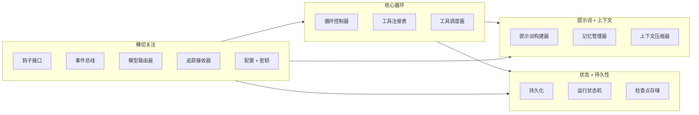
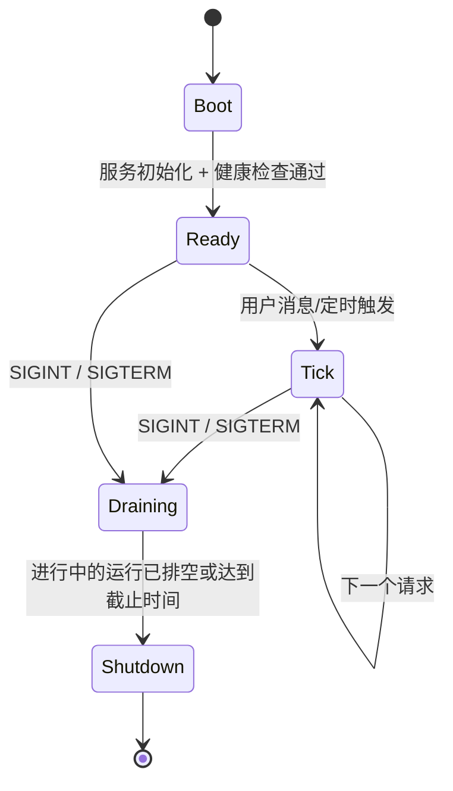
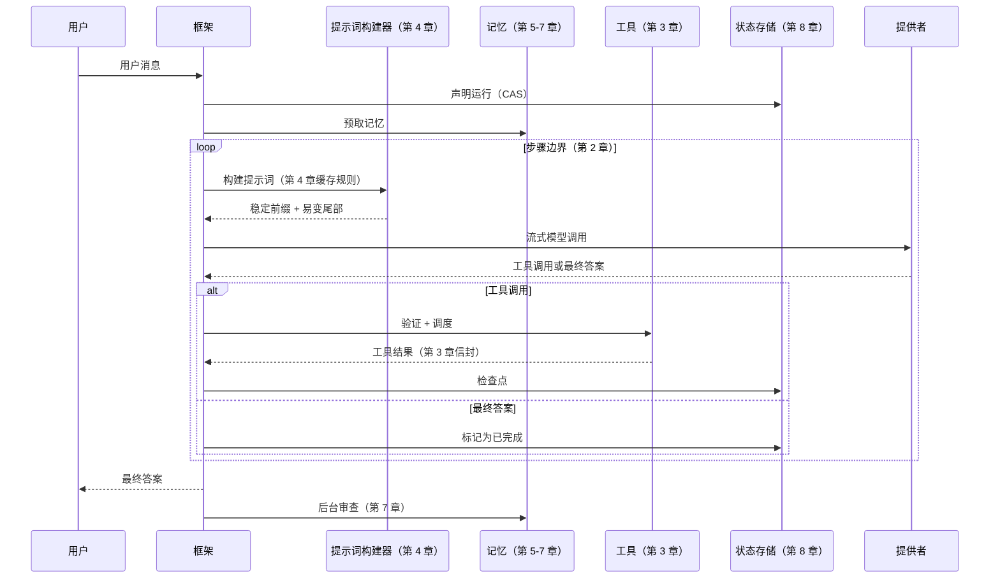

# 第十一章 — 智能体框架（Harness）

## 简述

框架（Harness）是模型周围的运行时。从第 1-10 章开始，每章都是关于它的一个部分：循环、工具、提示词、记忆、持久化、规划、委托。本章是将这些部分组合成一个具有清晰生命周期（启动 → 轮次 → 关闭）、明确定义的扩展钩子接口、不泄露密钥的配置模型，以及框架本身与使用它的应用代码之间清晰边界的单一程序。模型带来判断；框架带来结构。本章结束时，你应该能够看任何生产智能体，说出其组件、生命周期，以及什么接入了哪里。

---

## 为什么重要

了解框架是什么可以避免三种失败模式。

第一种：你将工具调度器内联写在循环中，将提示词构建器内联写在调度器中，将记忆层内联写在提示词构建器中。六周后，你无法扩展任何一个部分而不破坏其他部分。框架的存在是为了让每章的组件有一个干净的接口和一个已知的位置。

第二种：你有很好的组件，但没有生命周期。数据库在第一次工具调用后连接，插件加载器在第一次模型调用后运行，心跳在迁移完成之前启动。框架定义了一个启动序列，使这不再令人意外。

第三种——Anthropic 在其长期运行应用文章中很好地表达了这一点：*框架中的每个组件都编码了模型无法独立完成某事的假设。* 没有这个框架，框架会在底层模型早已不再需要这些功能之后继续累积特性。框架不是永久纪念碑；它是应该随着模型发展而发展的脚手架。

---

## 核心概念

### 框架是什么，不是什么

框架拥有：循环、提示词构建器、工具注册表和调度器、记忆管理器、持久化层、钩子系统、总线、模型路由器。加上将它们全部连接在一起的生命周期。

框架*不*拥有：智能体相信什么、它积累的具体技能、特定工具的提示词、解决哪些任务的业务逻辑。这些是应用代码。同一个框架应该能够今天托管一个探索智能体，明天托管一个客户支持智能体，下周托管一个分析智能体——框架本身不做任何改变。

一个有用规则：如果删除某个特性会破坏*这个系统能解决什么任务*，那它是应用代码。如果删除它会破坏*这个系统如何运行*，那它是框架。Paperclip 是这种分割最清晰的参考——Paperclip 本身不调用模型；它生成适配器进程（应用程序）并协调它们。OpenCode 同样将服务器/服务（框架）与智能体定义（应用程序）分开。

### 组件清单

每个生产框架都有的十项服务，加上几个可选服务：



每个块都是你已经读过的章节。第 1 章——循环体；第 2 章——循环控制器；第 3 章——工具注册表 + 调度器；第 4 章——提示词构建器；第 5 章——记忆管理器 + 压缩器；第 6-7 章——记忆存储 + 写入器；第 8 章——持久化 + 运行状态 + 检查点存储；第 9 章——规划器（循环之上的一层）；第 10 章——委托（监督者在循环中，专家由它生成）。钩子、总线、路由器、追踪接收器和配置是横切管道——接下来介绍。

框架就是这张图。各章是各个部分。

### 组合：服务如何连接

三种模式出现在生产框架中，大致按正式程度递增：

- **闭包工厂。** 每个服务都是一个接受依赖并返回方法对象的函数。连接在 `main`/`app.ts` 中一次完成。Paperclip 使用这种方式——小型、明确、通过传递假对象易于测试。
- **服务注册表。** 组件在启动时在类型化注册表中注册自己；消费者按名称查找。当有许多类似的事物（工具、智能体、提供者）时很有用。
- **分层依赖注入。** 每个服务通过类型签名声明其依赖；运行时按顺序解析它们。OpenCode 为此使用 Effect 的 `Layer.effect`。

选择一个并坚持它。最糟糕的框架是混合所有三种的——一些服务是注入的，一些是注册的，一些是作为单例导入的。服务在构建时是异步的还是同步的也同样：选择一个约定并坚持它。

```ts
// 类型化框架——服务作为字段，所有依赖都是显式的。
type Harness = {
  config:        Config;
  bus:           EventBus;
  hooks:         HookRunner;
  tracer:        TraceSink;
  prompt:        PromptBuilder;     // 第 4 章
  memory:        MemoryManager;     // 第 5-7 章
  tools:         ToolRegistry;      // 第 3 章
  loop:          LoopController;    // 第 2 章
  state:         RunStateStore;     // 第 8 章
  checkpoints:   CheckpointStore;   // 第 8 章
  router:        ModelRouter;       // 第 17 章（前瞻）
};
```

### 生命周期：启动、轮次、关闭



三个阶段，每个都有自己的规则。大多数框架 bug 存在于它们之间的边界——在启动完成之前使用的服务，在排空开始之后接受的请求，不等待运行状态机检查点的关闭。

### 启动顺序

启动序列不是任意的——每一步都依赖于前一步。在生产系统中有效的顺序：

1. 加载并解析配置文件（带环境变量覆盖）。
2. 验证配置 schema；快速失败并显示*所有*错误。
3. 替换环境变量并解析 `$secret:` 引用。
4. 打开数据库；运行任何待处理的迁移。
5. 初始化存储服务（会话、转录、记忆存储）。
6. **发现插件**，从打包和用户路径；加载每个插件的*清单*——它贡献的工具、智能体配置文件、钩子处理器和命令——但尚未激活它。
7. 按确定性顺序构建工具注册表：内置工具，然后是插件贡献的，然后是配置声明的（第 4 章的缓存规则适用——顺序在启动时固定，不会更改）。
8. 以同样方式构建智能体注册表：内置配置文件，然后是插件配置文件，然后是配置配置文件。
9. **针对现在稳定的注册表激活插件钩子**；这是第二个阶段。
10. 启动可选子系统（调度器、MCP 服务器、WebSocket 总线、cron）。
11. 运行健康检查——DB 可达，模型提供者可达，插件握手 OK。
12. 翻转就绪标志；开始接受流量。

两阶段形态是承重细节。插件*贡献给*工具和智能体注册表，因此在加载插件清单之前无法构建注册表；但插件钩子需要*针对*稳定的注册表*触发*，因此在构建注册表之前不能激活它们。将插件加载拆分为发现-清单（第 6 步）和激活-钩子（第 9 步）是解决依赖关系而不使注册表在运行时可变（这会破坏第 4 章的缓存稳定性）的最简单方式。

两个值得区分的标志：*存活性*（进程还活着吗？）和*就绪性*（它接受流量吗？）。它们是对负载均衡器或监督者的独立信号。混淆它们是智能体系统中一半部署时中断的来源。

### 一个完整的轮次

一个轮次 = 一条用户消息 → 一个最终答案。每章的贡献都出现了：



每个箭头都是一个钩子点。LLM 前后钩子包围模型调用。工具前后钩子包围调度。会话开始和会话结束钩子包围整个轮次。插件通过在这些点注册处理器来扩展框架，无需修改循环。

### 优雅关闭

信号处理器——SIGINT 或 SIGTERM——将框架切换到排空模式。在排空时：

- 新请求被拒绝（或排队，取决于策略）。
- 进行中的运行有一个截止时间（通常是几分钟）来到达步骤边界并干净地存档。
- 在截止时间之后，存活的运行在状态机（第 8 章）中被标记为 `cancelled`；它们的租约将由下一个实例的收割者收割。
- 待处理的后台审查分支被合并或标记为已放弃。
- 数据库连接池排空；总线关闭；进程退出。

跳过优雅关闭的代价是不可见的，直到某天一次部署中断了十个长期运行的智能体会话；下一个实例然后必须弄清楚发生了什么。第 8 章的收割者涵盖了恢复；本章涵盖了*预防*。

### 钩子接口

钩子是框架的扩展 API。六个生命周期点涵盖了大多数生产需求：

| 钩子 | 何时触发 | 用途 |
|---|---|---|
| `pre_session` | 会话开始时一次 | 注入身份，设置命名空间，启动预取 |
| `pre_llm_call` | 每次模型调用之前 | 最后机会提示词变更，门控，脱敏 |
| `post_llm_call` | 每次模型调用之后 | Token 计数，脱敏，计划提取 |
| `pre_tool_call` | 每次工具调度之前 | 权限检查（第 12 章），参数转换 |
| `post_tool_call` | 每次工具返回之后 | 脱敏密钥，附加元数据，记录 |
| `post_session` | 会话结束时一次 | 后台审查（第 7 章），成本汇总，归档 |

框架按注册顺序触发每个钩子，传递一个类型化的上下文对象。插件返回一个指令（`continue`、`modify`、`deny`）以及任何副作用（日志、事件），这些副作用通过框架而不是直接改变共享状态。Hermes Agent 和 OpenClaw 都以这种方式注册钩子；OpenCode 的总线事件模型是近亲。

两条生产规则：

- **钩子必须是幂等的。** 重试步骤（第 8 章）再次触发相同的钩子。如果钩子写入计数器，用幂等键递增。
- **失败开放 vs 失败关闭取决于钩子的工作。** *观察性*钩子（追踪、指标、普通记录、事后转换）是失败开放的：记录失败并继续循环。*门控*钩子——安全（第 18 章）、审批（第 12 章）、脱敏、策略——必须失败关闭：失败的审批钩子意味着行动*未*被批准；失败的脱敏钩子意味着未脱敏的字节永远不会到达下一阶段；失败的策略钩子意味着操作被拒绝。在注册时为每个钩子打上其失败语义标签；框架根据标签路由失败。将所有钩子默认为失败开放是伪装成弹性的漏洞。

### 提供者抽象（及其泄漏）

框架将提供者封装在统一接口之后，这样循环、工具和提示词就不关心是哪个。实际上这是一个*有泄漏*的抽象，有三个已知的漏洞：

- **工具 schema 格式**因提供者而异（Anthropic 使用 `input_schema`；OpenAI 使用 `function.parameters`）。适配器在输入时规范化。
- **流式事件**不同（Anthropic 发出 `content_block_delta` 和 `tool_use`；OpenAI 发出 `choice.delta.tool_calls[i].function.arguments` 片段）。每个提供者都有自己的传输适配器。
- **缓存控制语法**是特定于提供者的（第 4 章详细涵盖了 Anthropic 的显式标记和 OpenAI 的自动前缀形状）。只在拥有它的适配器内部应用；对不支持标记的提供者透传。

```ts
// 干净的提供者接口在每个框架循环之后。
// metadata() 是能力协商——框架询问提供者支持什么
// 并适应请求，而不是硬编码它。
interface ModelProvider {
  stream(req: ModelRequest): AsyncIterable<ProviderEvent>;
  countTokens(text: string): number;
  metadata(): {
    contextWindow:             number;
    maxOutput:                 number;
    supportsCacheControl:      boolean;
    supportsParallelToolCalls: boolean;
    supportsStructuredOutputs: boolean;
    supportsHostedTools:       boolean;
    refusalShape:              "block" | "finish_reason" | "none";
  };
}
```

这是*能力协商*：框架在启动时（以及配置重新加载时）读取元数据，并相应地路由/适应，而不是硬编码每个提供者支持什么。新的提供者能力无需代码更改就能到达；缺少的能力表现为路由器拒绝将该请求路由到该提供者，而不是循环深处的运行时失败。

框架通过模型路由器（第 17 章领域）选择提供者；循环只看到接口。当提供者失败时，路由器回退到下一个*兼容的*提供者——相同的工具 schema 方言，至少是这一轮需要的上下文窗口，以及推理和策略一致性（第 2 章在循环的错误处理规则中涵盖了这个规范）。缺少主要提供者能力的回退不是回退；它是不同的失败模式。凭据池（在 429 上轮换 API 密钥）也在路由器中——Hermes Agent 和 Paperclip 都实现了这一点。

### 配置

框架的配置接口通常如下所示：

- **文件。** YAML、JSON 或 TOML；在启动时加载一次。热重载是可选的且有风险——它可以通过在运行中间改变工具描述来破坏缓存（第 4 章）。
- **环境变量覆盖。** 每个键都可以被环境变量覆盖。环境变量优先于文件。使用有文档记录的带前缀的命名约定；随机的无前缀环境变量会变成调试陷阱。
- **密钥引用。** 存储在其他地方的敏感值——密钥链、AWS Secrets Manager、加密文件。配置保存 `$secret:NAME` 指针，在运行时解析；密钥从不出现在加载的配置对象中。
- **Schema 验证。** Pydantic、zod、JSON Schema——选择一个。在启动时失败于验证错误，一次显示*所有*错误。如果配置无效，智能体不应该启动。
- **插件贡献。** 插件可以用自己的键扩展 schema，在加载时合并。

一个值得预防的常见 bug：将包含已解析密钥的配置值写入磁盘。序列化器应该重新发出 `$secret:` 引用，从不发出已解析的值。用单元检查来测试这一点——序列化并 grep 已知的密钥材料。

### 会话、运行、子智能体——词汇表

四个工作单元术语在系统中反复出现；固定它们的含义以保持代码和文档对齐：

- **会话** — 一个参与者在一个渠道在一个工作区中的对话线程。有稳定的 ID；持久化转录 + 状态；可以恢复（第 8 章）。
- **运行** — 循环的一次调用。有开始、结束、最终状态（成功/失败/取消）。一个会话在其生命周期内包含许多运行。
- **子智能体** — 由父智能体生成的子运行（第 10 章）。看到父智能体上下文的过滤切片；返回单个观察。
- **心跳** — 控制平面使用的唤醒滴答（Paperclip）：监督者定期唤醒并检查每个会话是否有工作要做。心跳可能会也可能不会导致运行。

OpenCode 的 `SessionID` 和 `RunID` 品牌类型是保持这些清晰的最干净参考；Paperclip 的 `issues`/`heartbeat_runs`/`agent_task_sessions` schema 是最彻底的。

### 实例状态和租户范围

服务多个项目、用户或租户的框架需要*实例状态*——每个项目而非全局的范围服务。OpenCode 的 `InstanceState.make()` 就是这个模式：服务按 `(project, agent)` 组合懒加载并缓存。Paperclip 的多租户更进一步——每个表都有 `company_id`，每个查询都携带它。

可扩展的形态：在每个框架操作的边界，查找当前 `(tenant, project, agent)` 的实例并通过它路由。永远不要从请求处理器访问全局服务。回头咬你的泄漏是一个用户看到另一个用户的记忆，因为全局单例被共享了。第 6 章的命名空间规则和第 8 章的租户范围状态机都依赖于这个规范。

### 总线和流式接口

生产框架保持分离的两个相邻关注点：

- **内部事件总线**让插件和可观测性订阅框架事件（`session_started`、`tool_completed`、`run_failed`），而不改变共享状态。大多数框架运行简单的进程内发布/订阅；总线*默认不持久*——需要在重启后存活的事件单独持久化（第 8 章）。
- **流式接口**向 UI（TUI、Web、CLI）传递 token、工具事件和状态更新。Server-Sent Events 和 WebSocket 都很常见。框架将总线事件扇出到按会话过滤的连接客户端。

保持两者分开。总线用于进程内发布/订阅；流式接口是网络面。混合它们会产生尴尬的耦合——每个 UI 事件都变成全局总线事件，总线在负载下变成序列化点。

### 健康和就绪

两个从第一天就值得发布的探针：

- **存活性** — 进程还活着吗？便宜：一个简单的 HTTP 200，没有依赖。
- **就绪性** — 框架准备好提供真实流量吗？检查 DB、模型提供者（每分钟缓存一次小型测试调用，避免锤击它）、插件握手，以及启动时任何关键钩子错误。

第一个月就能回本的三个指标：活跃运行数、队列深度、每分钟错误率。这些属于第 16 章的追踪管道，但值得从框架级别一开始就连接。

### 更简单的框架更持久

Anthropic 的*长期运行的智能体应用的框架设计*文章提到了一个有用规则：*框架中的每个组件都编码了模型无法独自完成某事的假设。* 随着模型改进，这些假设会减弱。上个季度赚取了自己位置的组件本季度可能是不必要的开销。

两个实际后果：

- **每年审计你的框架。** 对于每个组件，问：*当前模型还需要这个吗？* 删除不再有回报的内容。Anthropic 注意到他们在更强的模型可以处理更长的连贯工作而不需要它时删除了他们的"冲刺"分解层。
- **以同样的规范添加复杂性。** 每个新框架组件都应该解决一个*已测量*的失败模式，而不是理论上的。投机性添加的组件几乎从不被移除。

目标不是最复杂的框架。而是可靠处理你的工作负载的最简单框架。本章的模式是*可用的*清单，不是*必须存在的*清单。

---

## 真实系统说明

- **OpenCode** 是嵌入式框架的最强端到端参考：使用 Effect Layers 的类型化服务组合，清晰的会话/运行分离，每个系列的提供者传输适配器，SSE 事件总线，以及每个项目的 `InstanceState` 模式。将其作为编码智能体的"默认"框架形状阅读。
- **Hermes Agent** 是框架 + 网关分离的参考：内部智能体循环独立于渠道适配器（Telegram、CLI、cron），因此同一个框架服务于许多接口。插件钩子接口（`pre_llm_call`、`post_tool_call` 等）形态良好，值得借鉴。
- **Paperclip** 是控制平面框架：它不直接调用模型；它通过具有明确运行状态机、原子声明和收割者（第 8 章）的心跳调度器协调*其他*框架（适配器进程）。多租户、多进程生产部署的最强参考。
- **OpenClaw** 提供了在个人助手框架上最干净的渠道网关抽象——专门用于网关/框架边界研究的有用参考。

外部参考：Anthropic 的*"长期运行的智能体应用的框架设计"*（anthropic.com/engineering）是关于上下文重置 vs 压缩（第 5 章领域）、评估者智能体（第 10 章的验证模式）以及框架复杂性应该跟踪模型能力这一原则的最佳短读。

---

## 与你的智能体配对

一些在本章中效果很好的提示：

- *"绘制我当前智能体代码的组件图。识别每个组件实现了第 1-10 章的哪一章，并标记在一个文件中实现了两章关注点的任何内容。"*
- *"将我智能体的启动代码重新排序为本章的启动序列。验证健康和就绪可以独立失败——给我展示一个不会杀死进程的失败就绪检查。"*
- *"连接六个生命周期钩子（`pre_session`、`pre_llm_call`、`post_llm_call`、`pre_tool_call`、`post_tool_call`、`post_session`）。添加一个样本插件，记录每个带时间的事件。验证插件可以不修改循环地添加。"*
- *"实现优雅关闭：SIGINT 触发排空模式，进行中的运行最多 60 秒来完成，任何仍在运行的被标记为在运行状态机（第 8 章）中取消。用故意卡住的运行验证。"*
- *"将我的提供者集成重构为每个系列一个适配器的 `ModelProvider` 接口。确认循环现在针对没有网络访问的模拟提供者编译。使用模拟进行单元测试。"*
- *"根据 Anthropic 的规则审计我的框架：'每个组件编码了模型无法做到的假设。'对于每个组件，命名该假设。根据当前前沿模型可以可靠完成的事情，提出一个要删除或简化的组件。"*
- *"添加租户范围：每个触及状态的服务都接受一个租户上下文。写一个测试，证明租户 A 的请求不能访问租户 B 的会话、记忆或运行状态。"*
- *"设置框架的事件总线和一个监听它的 SSE 流式端点。给我展示一个会话，其 token 实时流到浏览器，同时插件在总线上订阅相同的事件。"*

---

## 接下来

你现在有了架构、生命周期和扩展接口。剩余章节添加了生产智能体需要发布的层次：人在循环中审批（第 12 章）、连接器和 MCP（第 13 章）、技能和子智能体设计作为单元（第 14 章）、后端基础设施（第 15 章）、可观测性（第 16 章）、成本和延迟策略（第 17 章）、安全和对抗性输入（第 18 章）以及运营（第 19 章）。每个都是插入到你现在拥有的框架形状的组件或关注点。

第 12 章接下来：在采取高风险行动之前暂停循环并询问人类的门控。
