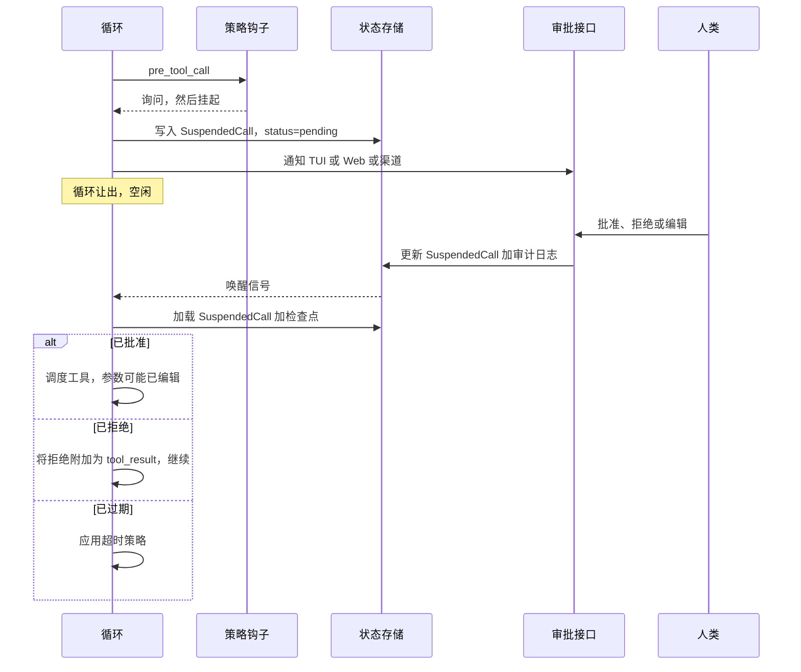

# 第十二章 — 人在循环中（Human-in-the-Loop）

## 简述

人在循环中（HITL）不是*"不确定时就问用户。"* 它是针对高影响行动的结构化控制接口：干净地暂停、持久化状态、呈现足够的上下文供决策、收集决策、审计它、并从完全相同的地方恢复。本章关于机制——三动作规则集（允许/询问/拒绝）、审批接口（内联 TUI、Web 仪表板、异步渠道）、与第 8 章 `WaitingApproval` 状态绑定的挂起恢复协议、人类实际看到的有效负载、有时限审批和超时策略、多审批者工作流、可信自动化的逃生通道，以及当人类说不时发生什么。

---

## 为什么重要

一个你可能见过的简短场景。你的智能体很有帮助且能干。它拥有读取文件、写入文件、发送消息和部署代码的工具。某天模型发出一个工具调用，删除了错误的目录。该行动是明确的；调用在语法上是有效的；用户输入了*"清理构建目录"*，模型广泛地解释了它。没有审批门。智能体做了你允许它做的事。

HITL 是说：行动不是全部平等的。读取文件和删除目录不是相同的操作；它们的审批接口也不应该相同。模型在*什么*上可以很聪明；人类仍然是*应该*的正确判断者。

本章是关于在不将每次工具调用都变成令人烦恼的复选框的情况下做到这一点。

---

## 核心概念

### 允许/询问/拒绝 — 三动作规则集

在 `references/` 中的生产系统中，审批原语的形态是相同的：一个规则列表，每个都有一个模式和三个动作之一。最后匹配的获胜。

```ts
type PermissionRule = {
  match:   { tool: string; argsPattern?: Record<string, string> };
  action:  "allow" | "ask" | "deny";
  scope?:  "call" | "session" | "forever";
};

// 示例规则集：允许读取，询问 src/ 下的写入，拒绝删除。
const rules: PermissionRule[] = [
  { match: { tool: "read_file" },                                action: "allow" },
  { match: { tool: "write_file", argsPattern: { path: "src/**" } }, action: "ask"   },
  { match: { tool: "delete_*" },                                  action: "deny"  },
];
```

三条需要记住的规则：

- **最后匹配获胜。** 后面的、更具体的规则覆盖前面的广泛规则。OpenCode 的 `Permission.evaluate` 就是这样做的。
- **`ask` 是任何破坏性操作的默认**——交叉参考第 3 章中的 `destructive: true` 元数据标志。运行时将任何标记为破坏性的工具提升为 `ask`，除非明确的 `allow` 规则覆盖它。
- **`deny` 在运行中的会话内是不可覆盖的。** 用户可以编辑配置并重启，但运行中的循环绝对遵守 `deny`。

整个机制在第 11 章的钩子接口中作为 `pre_tool_call` 钩子存在。钩子读取规则集，做出决定，要么让调用继续，排队审批，要么作为工具结果返回拒绝。

### 审批接口

*批准什么*是一件事。*人类在哪里看到它*是使 HITL 实用的事。三个接口占主导地位：

| 接口 | 延迟 | 最适合 | 失败模式 |
|---|---|---|---|
| **内联 TUI 提示** | 秒 | 交互式编码，开发工作流 | 用户不在——循环无限阻塞 |
| **Web 仪表板** | 秒-分钟 | 多用户系统，治理流程 | 在繁忙队列中错过通知 |
| **异步渠道**（Slack、Telegram、邮件） | 分钟-小时 | 长期运行的自动化，非工作时间工作 | 回复链让智能体和人类困惑 |

生产系统通常支持多个。OpenCode 提供内联 TUI + Web；Hermes Agent 添加异步渠道，以便长期运行的 cron 任务可以请求审批并在用户数小时后回复时继续；Paperclip 倾向于带邮件/Slack 通知的 Web 仪表板。每个智能体的选择：选择与用户在询问时实际存在时相匹配的接口。

生产规则：*延迟预算越长，有效负载必须越丰富。* 内联 TUI 提示可以依赖用户记住刚刚发生了什么。数小时后的邮件审批必须是自包含的。

### 挂起协议

当循环等待审批时，第 8 章的运行状态机移动到 `WaitingApproval`。在暂停之前必须在磁盘上的内容：

- 待处理的工具调用（名称、参数、调度的幂等键）。
- 对运行、会话、用户以及需要其决定的行为者的引用。
- 原因——模型尝试完成什么，一句话。
- 到期时间戳（见下方*有时限审批*）。
- 工具产生的任何干运行预览的快照。

```ts
// 挂起时框架持久化的内容。第 8 章的检查点用这个扩展。
type SuspendedCall = {
  approvalId:        string;
  runId:             string;
  sessionId:         string;
  actorId:           string;
  toolName:          string;
  proposedArgs:      unknown;
  dryRunPreview?:    string;
  reason:            string;
  riskTier:          "read" | "reversible" | "external" | "high_impact";
  createdAt:         string;
  expiresAt:         string;
  status:            "pending" | "approved" | "rejected" | "edited" | "expired";
};
```

恢复是反向的。当审批到达时，框架读取该行，根据 schema（第 3 章）验证决定，然后重新调度（可能已编辑的）调用，或将拒绝作为工具结果返回给循环。循环从它暂停的确切步骤边界恢复——第 8 章的幂等步骤规则适用。



### 人类实际看到什么

有效负载是*"是的，我批准"*和*"等等，什么？"*之间的区别。每个审批接口应该显示：

- 一句话普通语言的建议行动。
- 确切的参数，为接口格式化（TUI 中的 JSON，Web 中的表单，聊天中的代码块）。
- 工具支持时的干运行预览——*"将删除 `/workspace/build`（143 个文件，2.4 GB）。"*（第 3 章的干运行模式。）
- 智能体提出该行动的原因——由模型明确生成为*面向用户的理由*，与工具调用一起，可选地由计划步骤名称（第 9 章）和工具的确定性元数据（第 3 章描述和风险层）增强。*不要*从模型隐藏或最近的推理中提取这个：一些提供者不公开它，公开的内容并不总是与行动一致，推理跟踪是攻击面（第 18 章——来自先前工具结果的提示注入形状的文本可以在那里被反射）。人类看到的理由应该来自模型*为人类*写的字段，而不是其思想的窗口。
- 风险层和提升到 `ask` 的任何标志。
- 审批到期前的剩余时间。

OpenCode 的审批对话框为 `edit_file` 渲染差异；Paperclip 的包括原始问题和利益相关者列表；主流商业编码智能体显示昂贵操作的估计 token/成本影响。偷取适合你接口的东西。

### 审批范围

大多数审批实际上不是关于*这一次调用*。它们是关于*这种调用，往后如何*。真实系统提供的三个范围：

| 范围 | 持续到 | 何时使用 |
|---|---|---|
| **仅此调用** | 调用完成 | 真正一次性的高影响行动 |
| **此会话** | 会话结束或轮换 | 一次任务期间的重复调用 |
| **永久（限定范围）** | 用户从单个界面撤销 | 可信工具，严格限定为安全用例 |

UI 通常是*批准*下的一组按钮。存储：

- **此调用** — `SuspendedCall` 行被更新；没有其他变化。
- **此会话** — 会话的 `permission_overrides` 映射获得新条目；后续调用在全局规则集之前对照它匹配。
- **永久** — 用户的配置获得新的 `allow` 规则，在下次会话开始时生效。*信任是有范围的，不是无限的*：规则由工具名称、MCP 服务器和版本（如果是外部的——第 13 章）、租户或工作区以及参数类（特定路径通配符、枚举值、URL 上的域）绑定。点击了 `web_fetch` 对 `docs.example.com` 的*信任*的用户没有批准任何 URL 的 `web_fetch`。规则应该引用工具定义的指纹，以便描述重写或版本升级触发新的询问，而不是静默地继承旧的信任。用户必须能够从单个界面撤销任何*永久*规则，而不是通过编辑 YAML——可撤销性是使广泛范围可以生存的安全阀。

要避免的陷阱：因为 UI 默认为更广泛的范围而静默地将*此会话*提升为*永久*。在每个对话框上使范围明确。默认为更窄的范围；扩展是明确的点击。

### 计划模式审批 — 批准一次，执行多次

当智能体处于计划模式（第 9 章）时，最便宜的 HITL 是*批准计划，然后执行*。计划本身就是审批有效负载——用户看到步骤，批准工作的形态，执行者无需逐步询问就可以继续。

机制：规划者生成一个计划，每个步骤按风险层*以及它打算使用的具体参数*标记——路径、标识符、目标资源、预期差异。审批对话框显示计划。批准后，框架插入一个会话范围的 `allow`，*以计划的参数为界*，而不仅仅是工具名称。声称*编辑 `src/auth.ts`* 的计划产生一个 `edit_file` 的 allow，其 `path = src/auth.ts`（对于差异形态的工具，还有差异大小或范围限制），而不是无限制的 `edit_file` allow。如果计划没有预料到，执行者仍然会询问；通过将建议调用的参数形态与绑定进行比较来检测漂移——具有新参数的相同工具名称是*漂移*，而不是*匹配*。

Paperclip 通过 `executionPolicy = planning_mode` 实现了这个；OpenCode 的 `plan` 智能体写了一个 `.opencode/plans/<name>.md`，在用户批准后，变成了构建智能体匹配工具的参数绑定会话范围允许。

规范：不要让执行者偏离计划太远。如果计划说*编辑 `src/auth.ts` 和 `src/db.ts`*，执行者提议编辑 `src/payments.ts`，计划范围审批不涵盖它——升级回用户。参数绑定是机械地强制执行这一点的；没有它，*"相同工具，不同文件"*会溜过去，审批变成许可证而不是合约。

### 编辑而不是批准

人类的正确回应通常既不是*是*也不是*否*，而是*不完全是，改成这样*。生产系统将这作为一等行动。

```ts
type ApprovalDecision =
  | { kind: "approved" }
  | { kind: "rejected"; reason?: string }
  | { kind: "edited"; replacementArgs: unknown }
  | { kind: "expired" };

// 在 `edited` 时，在调度之前根据工具的 schema（第 3 章）验证。
function applyEdit(decision: ApprovalDecision, tool: ToolDefinition) {
  if (decision.kind !== "edited") return decision;
  const parsed = tool.schema.safeParse(decision.replacementArgs);
  if (!parsed.ok) {
    return {
      kind: "rejected",
      reason: `编辑的参数 schema 验证失败：${parsed.error}`
    };
  }
  return decision;
}
```

OpenCode 的审批对话框包含一个打开内联 JSON 编辑器的*编辑*按钮。Hermes Agent 的交互式 TUI 让用户在批准之前重写建议的 Shell 命令。主流商业编码智能体显示差异预览，让用户在说是之前调整建议的文件内容。

生产中的两个模式：根据相同的工具 schema 验证编辑（模型发出的调用通过了验证；人类编辑的调用也应该），并将编辑与原始一起记录，以便审计跟踪显示两者。

### 危险默认检测

有时工具在配置中标记为 `allow`，但*特定调用*以模型无法预期注意到的方式存在风险。框架基于启发式将 `allow` 提升为 `ask`：

- **大影响。** 删除 >100 个文件；写入 >1 MB；批量操作影响 >N 条记录。
- **风险路径。** 任何触碰 `.git`、`.env`、`node_modules`、`/etc`、生产配置文件的东西。
- **非工作时间执行。** 凌晨 3 点的 cron 触发破坏性操作受到额外审查。
- **跨租户或跨工作区操作**（第 6 章命名空间规则）。
- **环境中的生产形状凭据**（包含 `PROD`、`LIVE` 的环境变量）。

```ts
// 将任何匹配的调用从 allow → ask 提升，无论配置如何。
function dangerousDefault(call: ToolCall, ctx: AgentContext): boolean {
  if (call.name === "delete_files" && call.args.paths.length > 100) return true;
  if (touchesProtectedPath(call.args.path))                          return true;
  if (ctx.now.getUTCHours() < 6 && call.tool.destructive)            return true;
  if (looksLikeProductionEnv(ctx.env))                               return true;
  return false;
}
```

Hermes Agent 的 `ToolCallGuardrailController` 和 Paperclip 的心跳级别检查都实现了变体。阈值各不相同；原则不变——这些是通过类型检查、通过策略，但仍然受益于人类一眼的调用。

### 有时限审批

审批不会永远存在。框架必须实现并在三个策略之间选择：

- **到期时自动拒绝。** 最安全。请求超时，模型收到拒绝，循环继续而不采取行动。
- **到期时继续。** 对于阻塞比行动更糟糕的低风险操作，最务实。很少是正确的默认值。
- **到期时升级。** 治理形态：超时将请求路由到备用审批者或更高权限用户。Paperclip 的多审批者流程就是这样做的。

正确的默认是**自动拒绝**，*继续*只对操作者明确选择的工具可用。默认为*继续*是一个陷阱——被遗忘的审批变成静默执行。

一个有用的生产细节：审批接口显示倒计时。当它达到零时，接口本身显示结果（被拒绝/升级）。审计日志将到期记录为一等事件，而不是静默超时。

### 子智能体审批继承

当父智能体委托（第 10 章）时，问题变成：父智能体的审批是否涵盖子智能体？三种策略：

- **继承。** 子智能体以父智能体的会话范围审批运行。最便宜；当子智能体范围窄时安全。
- **仅继承 `allow`。** 从父智能体继承明确的允许；任何 `ask` 在子智能体级别重新询问。大多数生产系统默认在这里。
- **无继承。** 子智能体从规则集开始，句号。最安全；最嘈杂。

OpenCode 默认为*仅继承 allow*；主流商业编码智能体遵循相同的默认。选择的规则：子智能体越隔离（独立工作树，新鲜上下文），继承越合理；子智能体越强大（写入、Shell、网络），重新询问越多。

### 多审批者工作流

对于共享系统中的高风险行动，一个审批是不够的。模式（在 Paperclip 的 `issue_approvals` 表中最清晰）：

- 行动需要来自角色列表的签署（`author`、`project_lead`、`security`）。
- 每个签署都记录有时间戳、角色、决定和可选评论。
- 只有当所有必需的签署都是 `approved` 时，行动才继续。
- 任何单个 `rejected` 立即停止链。
- 任何单个签署的超时都会升级到备用审批者。

这是治理，不是交互式 HITL。当风险证明运营成本合理时的正确工具——部署、账户关闭、跨团队变更。对其他所有事情都是错误的工具；如果签署链对常规操作触发，它们将被忽略。

### 自主模式 — 显式逃生通道

有些工作负载根本不应该有人在循环中：定时触发的常规工作、沙箱探索、CI 检查。框架应该*明确*支持这一点，而不是作为错误配置的副作用：

```yaml
# 框架配置的摘录。
permissions:
  mode: autonomous              # 明确的；永远不从缺少 TTY 推断
  on_destructive: auto_deny     # 永远不静默允许，永远不静默询问
  approval_log: enabled         # 仍然审计，即使没有人批准
```

三条规则：模式在配置中是**明确的**（没有隐式的*"没有 TTY 就没有审批"*）；破坏性行动仍然有一个默认（这里是自动拒绝）而不是静默允许；审计日志仍然记录*本来会询问的*事件，以便操作者可以审查交互式运行会提示什么。

诚实的框架：*自主模式是选择退出人类审查，而不是选择退出问责制。* 日志必须保留。

### 审批作为审计跟踪

每次审批——批准、拒绝、编辑、到期——都是值得保留的事件。最少记录：

- **谁** — 行为者 ID、审查者 ID、来源接口（TUI、Web、渠道）。
- **什么** — 工具名称、参数（或如果参数包含密钥则是哈希）、风险层。
- **何时** — 创建、决定、到期时间戳。
- **为什么** — 智能体提出的原因，审查者给出其决定的原因（如果有）。
- **如何** — 决定形状：批准/拒绝/编辑（带差异）。

这是第 16 章将转换为可观测性的相同日志。这也是事后事件审查会首先要求的内容。Hermes Agent 写入结构化 JSON 条目；Paperclip 在专用审批表中持久化它们；OpenCode 使用下游收集器可以持久化的总线事件。

### 拒绝后审批——说不后发生什么

拒绝是一个轮次，不是一个异常。框架向循环返回工具结果：

```ts
{
  ok: false,
  recoverable: true,
  code: "user_denied_action",
  message: "用户拒绝了此行动。",
  hint: "尝试不同的方法，或询问用户他们更喜欢什么。",
}
```

模型读取拒绝并决定下一步——通常是：提出不同的行动，向用户寻求指导，总结它尝试了什么并停止。交叉参考第 3 章的 `hint` 字段：有用的拒绝消息告诉模型*什么样的替代方案是可接受的*，而不仅仅是*不*。

智能体*不*应该做的：静默放弃用户的目标。被拒绝的步骤几乎从不意味着被拒绝的*任务*。循环应该提出不同的路径或浮出僵局——永远不要消失。

---

## 真实系统说明

- **OpenCode** 是内联审批接口最清晰的参考：带 `allow`/`ask`/`deny`、最后匹配获胜评估、范围感知审批（调用/会话/永久）以及打开 JSON 编辑器的*编辑*按钮的权限规则集。总线事件模型将审批干净地集成到第 11 章的框架中。
- **Paperclip** 是多审批者和异步渠道参考：专用 `issue_approvals` 表、签署链、超时升级、带 Slack 和邮件通知的 Web 仪表板。组织治理的最强参考。
- **Hermes Agent** 是个人助手上下文中异步渠道 HITL 的参考：Telegram 或 Slack 审批消息到达、等待，并在人类回复时恢复智能体。`--quiet-mode` 标志加上结构化日志显示如何在不失去问责制的情况下设计自主模式。
- **OpenClaw** 提供了渠道网关版本：通过聊天渠道的审批与仪表板中的审批不同，渠道适配器为媒介塑造有效负载。值得研究接口 vs 有效负载分离。

---

## 与你的智能体配对

一些在本章中效果很好的提示：

- *"将我所有的工具按风险层分类（读取/可逆/外部/高影响），并为每个提出默认行动（允许/询问/拒绝）。然后将权限规则集写成 YAML 并根据我的实际工具注册表验证它。"*
- *"实现挂起协议：当审批触发时，写入一个 `SuspendedCall` 行，将运行转换为 `WaitingApproval`（第 8 章），并通知审批接口。批准/拒绝/编辑/到期时，从确切的步骤边界恢复。用故意延迟的审批测试。"*
- *"通过 Slack 添加异步渠道审批。智能体发布审批有效负载；人类回复*是/否/编辑*；循环在回复到达时恢复。处理人类数小时后、会话已轮换后回复的情况。"*
- *"实现危险默认启发式：大删除、受保护路径、非工作时间、生产形状环境变量。每个将 `allow` 提升为 `ask`。给我展示我历史中本来会升级的五个真实工具调用。"*
- *"添加三种超时策略（自动拒绝/继续/升级），让我按工具层配置它们。用故意过期的审批验证，正确的策略触发，审计日志记录*已过期*——而不是静默的。"*
- *"连接审批审计记录：每次批准/拒绝/编辑/到期写入一个结构化行，包含谁、什么、何时、为什么、如何。对我上周的审批运行它，告诉我哪些工具询问过于频繁（UX 摩擦），哪些从不询问（可能被错误分类的风险）。"*
- *"重构我的子智能体生成（第 10 章），使父智能体的会话范围 `allow` 规则被子智能体继承，但 `ask` 规则在子智能体级别重新询问。用提出破坏性行动的子智能体验证——确保父智能体之前的允许不涵盖它。"*
- *"构建一个*永久信任此工具*按钮，向我的用户配置添加明确的 `allow` 规则。验证规则已写入、持久化，并在下次会话的权限评估中可见，对话框中有明确的范围标签，以便用户知道他们即将选择什么。"*

---

## 接下来

你现在有了高影响行动的控制接口：规则集、一组审批接口、挂起恢复协议、有时限审批，以及事后回答*谁、什么、何时、为什么*问题的审计日志。第 13 章涵盖接口下面的层——连接器和 MCP。第一次连接到第三方 MCP 服务器时，本章的审批门就是询问你是否信任它的东西。
