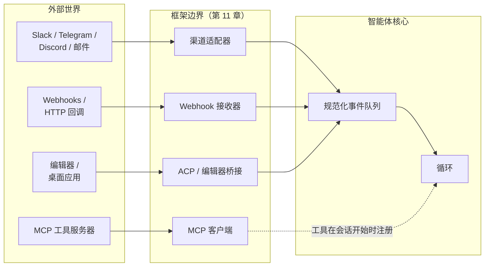
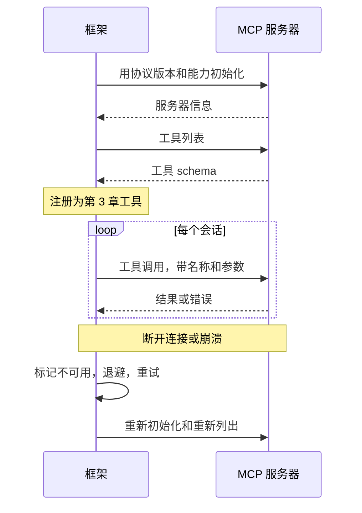
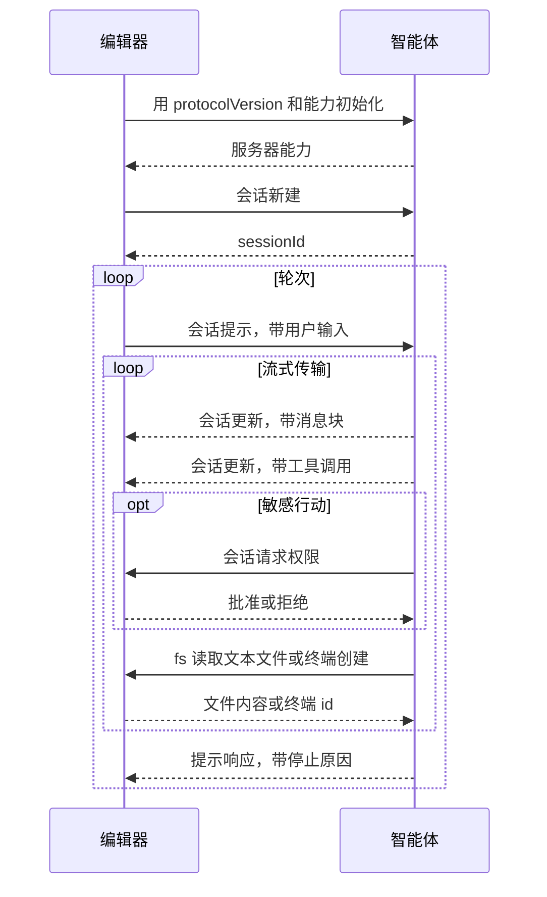

# 第十三章 — 连接器、MCP、IPC 和渠道

## 简述

只从 stdin 读取并向 stdout 写入的智能体是一个演示。有用的智能体连接到工作所在的系统——Slack、邮件、GitHub、Jira、Telegram 机器人、编辑器、内部仪表板——并使用远超出自身进程的工具服务器。本章涵盖三个连接层：将来自多个平台的入站工作规范化为一个事件形状的渠道适配器；用于工具服务器和编辑器集成的模型上下文协议（MCP）及其兄弟智能体客户端协议（ACP）；以及将整个系统连接在一起的 IPC 模式（JSON-RPC、HMAC 签名的 Webhook、SSE、WebSocket、队列）。还有你只在生产中看到的失败模式：速率限制、消息去重、重放攻击、来自渠道内容的提示注入，以及网关与嵌入式框架之间的区别。

---

## 为什么重要

大多数有用的智能体首先在边缘失败。模型在改进；循环是稳固的；提示词是缓存热的；记忆层是干净的。然后 Telegram 机器人在每秒 30 条消息时超时，智能体静默地错过了一半用户的消息。或者 Slack Webhook 重试，智能体两次发布了相同的回复。或者你上个季度开始使用的 MCP 服务器有内存泄漏，长期运行的智能体每天崩溃一次。

智能体的推理核心不关心消息来自 Slack、Webhook 还是 CLI。它应该接收规范化的事件，完成工作，返回规范化的输出。*消息来自哪里*恰恰是适配器层应该隐藏的那种细节——也恰恰是适配器层薄时会咬你的那种细节。

---

## 核心概念

### 三层，一个边界



三类看起来不同但解决相同问题的集成——与框架不拥有的系统通信：

- **渠道适配器**将 IM、邮件和 Webhook 事件转换为循环的规范化输入。
- **MCP 和 ACP** 是用于*工具和编辑器*的协议——MCP 将外部能力引入框架；ACP 将框架暴露给编辑器和桌面主机。
- **IPC** 是管道——JSON-RPC、SSE、WebSocket、队列、HMAC——将其他的连接在一起。

每个都是第 11 章插件形状：在启动时注册，获得钩子接口，向核心公开干净的接口。本章的所有内容都是这个主题的变体。

### 渠道适配器：从多个平台生成一个事件形状

智能体核心应该看到一个事件形状，无论消息来自哪里：

```ts
type ChannelEvent = {
  channel:   "slack" | "telegram" | "discord" | "email" |
             "webhook" | "local" | "matrix" | "signal";
  eventId:   string;          // 去重键（Slack event_id，Telegram update_id，...）
  actorId:   string;          // 引发事件的用户或服务
  threadId:  string;          // 回复应该去的地方
  text:      string;          // 为模型规范化的文本
  attachments?: Array<{
    kind: "image" | "file" | "audio";
    ref:  string;
    mimeType: string;
  }>;
  raw:       unknown;         // 原始有效负载，用于审计
  reply:     (m: AgentReply) => Promise<void>;
};

type AgentReply = {
  text:       string;
  blocks?:    unknown;        // 平台特定的富内容
  visibility: "private" | "thread" | "channel";
  requiresApproval?: boolean; // 通过第 12 章的门
};
```

OpenClaw 是最强的参考——其大部分代码库是将渠道适配器路由到一个助手核心。Hermes Agent 对 Telegram + CLI + cron + ACP 做了同样的事情。可扩展的规范：任何新渠道都写自己的适配器；核心永远不会知道渠道的存在。

### 渠道怪癖表

每个平台带来适配器必须处理的约束。这些怪癖的形态足够一致，可以放在一个表中：

| 平台 | 消息大小限制 | 速率限制（典型） | 线程 | 富内容 |
|---|---|---|---|---|
| Slack | ~40 KB / 块 | ~每渠道 1 条/秒 | 一等线程 | Block Kit |
| Telegram | 每条消息 4096 字符 | ~全局 30 条/秒 | 回复（无线程） | 内联按钮，MD 子集 |
| Discord | 每条消息 2000 字符 | ~每渠道 5 条/5 秒 | 一等线程 | 嵌入，组件 |
| WhatsApp | ~4 KB | 依赖供应商 | 无 | 有限；依赖层级 |
| 邮件 | RFC 限制 | 依赖提供者 | 通过头部的回复链 | HTML 或纯文本 |
| Signal | ~每条消息 2000 字符 | 适中 | 无 | 纯文本 |

数字随供应商变化而变化；连接新渠道时向你的智能体询问当前限制。约束的*形态*——大小、速率、线程、富内容——是保持稳定的东西。适配器必须执行三条规则：

- **分块长回复。** 发出 12 KB 文本的模型不能让每条消息 2 KB 的渠道崩溃。
- **遵守速率限制。** 排队、退避、重试——永不垃圾邮件。
- **用平台的能力渲染。** Slack 块、Discord 嵌入、Telegram 内联按钮；或在平台不支持富内容时回退到纯文本。

### 入站渠道事件

*消息*只是入站形状之一。生产渠道适配器至少处理五种：

- **直接消息或提及。** 最常见的；模型接收规范化文本。
- **按钮点击/交互式组件。** Slack Block Kit 操作、Discord 组件交互、Telegram 回调查询。适配器将回调解析为智能体可以推理的结构化事件（`button_clicked`、`action_id`、`state`）。
- **文件上传。** 适配器将文件下载到临时位置并传递路径；智能体使用工具读取或分析它。
- **图像/音频。** 通过视觉或转录工具路由，在到达模型之前转为文本。
- **反应。** 先前消息上的表情符号——通常是有用的信号（👍批准，❌取消），适配器可以将其转换为自己的 `ChannelEvent`。

适配器的工作是*翻译*；不是所有事件都变成工作。`typing` 指示器不需要唤醒模型。过去消息上的 👍 可能只是被确认。按事件决定是否入队还是丢弃。

### 出站渠道响应

反向方向有自己的约束：

- **分块** — 按平台大小的消息顺序分割长回复。
- **线程** — 如果入站在线程中，回复保持在线程中；如果不是，不要创建线程。
- **编辑和反应** — 通过占位消息显示*"处理中..."*指示器；循环返回时将其编辑为最终答案；有时是反应（✅）而不是编辑。
- **背压** — 如果平台速率限制，队列吸收；永不静默丢弃回复。
- **可见性** — `private`（仅 DM）、`thread`（仅在此线程中）、`channel`（任何人）。适配器执行智能体声明的意图。

跨系统的有用模式：在收到消息后立即发送占位*"处理中..."*消息，然后在答案到达时编辑它。用户看到智能体确认了他们；循环有时间计算；渠道历史中只有一条消息。

### 渠道身份和会话键

同一个人在 Telegram 和 Slack 上不是同一个会话。在 DM 和群渠道中的同一个人也不是同一个会话。复合键：

```ts
type SessionKey = {
  platform:        string;   // "slack" | "telegram" | ...
  accountId:       string;   // 平台特定的用户/账户 ID
  conversationId:  string;   // 渠道/线程 ID，或 DM 标识符
};
```

这是框架用来将入站事件路由到正确智能体实例的东西（第 11 章的实例状态模式）。两个值得固定的后果：

- **默认不跨渠道上下文。** 用户在 Telegram 中告诉智能体的事实在 Slack 中不可见，除非长期记忆层（第 6 章）在比会话更高的级别键入。
- **群 vs DM 是策略。** 在群中，你可能只响应提及；在 DM 中，每条消息都是给你的。适配器编码这条规则，而不是模型。

### Webhook：HMAC、去重和重放

Webhook 是通用的入站形状。三个习惯将工作的 Webhook 接收器与损坏的分开：

```ts
// 验证 HMAC，拒绝过期，去重，快速确认。
async function handleWebhook(req: HttpRequest) {
  const body  = await req.bytes();
  const sig   = req.header("x-signature");
  const ts    = req.header("x-timestamp");

  if (!constantTimeEqual(sig, "sha256=" + hmac(secret, ts + ":" + body))) {
    return reject(403, "签名错误");
  }
  if (Math.abs(Date.now() - Number(ts) * 1000) > 5 * 60 * 1000) {
    return reject(403, "时间戳过期");          // 重放窗口
  }

  const event = normalize(JSON.parse(body));
  if (await eventStore.seen(event.eventId)) {       // 平台可能重试
    return ok(202, "重复");
  }
  await eventStore.record(event.eventId);
  await channelQueue.enqueue(event);
  return ok(202, "已接受");
}
```

Webhook 处理器应该*快速确认并将工作排队*。永远不要在 HTTP 请求处理器内运行模型循环——平台会在超时时重试，智能体会把所有事情做两遍。

### MCP 实际上是什么

模型上下文协议（MCP）是能力服务器的线格式——向模型客户端公开工具、提示词和资源的程序。一个协议中的三个分类：

- **工具** — 与第 3 章工具相同的形状。名称、描述、JSON schema、返回值。智能体像调用其他工具一样调用它们。
- **提示词** — 服务器发布的预写提示词模板；客户端可以按需注入它们。
- **资源** — 服务器公开的可寻址只读内容（文件、数据库行、URL）；客户端可以将它们作为上下文包含。

今天大多数生产用途在*工具*轨道。能力存在于 MCP 服务器中（数据库适配器、浏览器、搜索服务）；框架消费能力而不拥有实现。

### MCP 传输

| 传输 | 连接 | 适合时 | 注意 |
|---|---|---|---|
| **stdio**（子进程） | 本地；框架生成服务器 | 仅本地工具，开发工作流 | 服务器崩溃导致连接断开 |
| **流式 HTTP** | 远程或本地；HTTP 请求，带可选 SSE 响应流 | 云托管服务器，多客户端 | 连接流失；延迟 |

这两个是当前的标准传输。旧版 MCP 文档描述了一种称为 *HTTP+SSE* 的传输——一种有长期 SSE 渠道用于服务器到客户端的独立端点形状。流式 HTTP *在规范中取代了* HTTP+SSE；它们不是相同的形状（带可选响应流的单个端点 vs 带持久服务器流的两个端点）。规范包含向后兼容指导，用于需要与旧版 HTTP+SSE 服务器通话的客户端；不要假设在另一个方向上有前向兼容性。

一些实现提供 WebSocket 或其他自定义传输。这些不是标准的一部分；如果你使用一个，你就被固定到那个实现。在假设可移植性之前确认你的客户端和服务器说什么。

架构规则是提供者无关的：在连接时一次性发现能力，用稳定名称调用它们，将失败作为工具结果（不是异常）处理，在断开连接时重连。

### 将 MCP 工具包装为第 3 章工具

当 MCP 工具到达智能体循环时，它应该与内置工具没有区别——相同的调度合约、相同的元数据标志、相同的错误信封。包装模式：

```ts
// 连接时：发现并注册。调用时：转发并翻译错误。
async function registerMcpServer(server: McpClient, registry: ToolRegistry) {
  await server.initialize();
  const { tools } = await server.listTools();
  for (const t of tools) {
    registry.register({
      name:         `mcp__${server.id}__${t.name}`,        // 命名空间
      description:  t.description,
      input_schema: t.inputSchema,

      // MCP 注释字段名称是驼峰命名加 `Hint` 后缀——
      // 它们是服务器的提示，不是断言。将它们视为
      // 不受信任服务器的保守默认值。
      destructive:        t.annotations?.destructiveHint ?? false,
      concurrency_safe:   t.annotations?.readOnlyHint    ?? false,
      idempotent:         t.annotations?.idempotentHint  ?? false,
      open_world:         t.annotations?.openWorldHint   ?? true,

      run: async (args, ctx) => {
        try {
          const result = await server.callTool(t.name, args);
          return ok(result);
        } catch (err) {
          return fail(`MCP 错误：${String(err)}`, false);  // 可恢复
        }
      },
    });
  }
}
```

三条规则：

- **命名空间名称。** `mcp__server__tool` 防止与内置工具冲突，并告诉模型工具来自哪里。
- **遵守 MCP 注释——但将它们视为提示，而不是断言。** MCP 在每个工具上公开 `readOnlyHint`、`destructiveHint`、`idempotentHint` 和 `openWorldHint`；这些成为驱动第 2 章并行性（第 2 章）、审批（第 12 章）和重试安全性（第 8 章）的第 3 章元数据。协议故意使用 `Hint` 后缀：恶意或有缺陷的服务器可以撒谎。声称 `readOnlyHint: true` 但实际写入文件的服务器是真实的攻击向量。对于不受信任的服务器，将提示视为*保守的默认值*——有疑问时假设 `destructiveHint: true`——并让运行时监控（第 18 章）根据观察到的行为重新分类。
- **将错误翻译为信封。** 服务器崩溃、超时、返回格式错误的 JSON——都变成可恢复的工具结果，而不是抛出的异常。循环读取错误并决定做什么，就像内置工具一样。

### MCP 生命周期和失败模式



生产中的困难部分：

- **首次信任。** 新的 MCP 服务器是第 12 章审批——用户在任何工具调用可以触发之前明确信任它。存储的内容：服务器身份、指纹或 URL、用户的决定和日期。
- **惰性 vs 急切加载。** 急切（在启动时列出工具）给出缓存热提示词但减慢启动；惰性（首次使用时列出）启动更快但第一个会话付出代价。主流商业编码智能体倾向于带预取的惰性；OpenCode 倾向于急切。
- **断线时重连。** 指数退避，封顶重试，最终标记服务器不可用。模型应该看到*"服务器不可用；稍后再试"*作为可恢复的工具结果，而不是沉默。
- **Schema 漂移。** 服务器可以在会话之间更改其工具 schema。框架必须在重连时重新列出，而不是假设缓存的 schema 仍然有效。

### MCP 范围和值得标记的威胁

协议比上面的*工具/提示词/资源*三元组更广泛。当前 MCP 还定义了根（客户端向服务器公开的文件系统边界）、采样（通过客户端回调到模型的服务器发起调用）、引导（服务器发起的用户输入请求）、任务（长期运行的异步工作）、工具输出 schema 和资源订阅。今天大多数生产用途仍然在工具轨道，因此本章以此为中心——但在围绕它设计之前检查规范以获取其余部分的当前形状。

两个威胁值得明确命名，因为它们是 MCP 特定的：

- **不受信任的注释。** 上面已经涵盖——`*Hint` 后缀是规范承认 MCP 服务器可以对其工具行为撒谎。将不受信任服务器的提示视为保守的默认值，并让运行时观察（第 18 章）根据观察到的行为重新分类。
- **针对本地服务器的 DNS 重绑定。** 在 localhost 上运行的 MCP 服务器可以从同一台机器上的浏览器访问。恶意页面可以使用 DNS 重绑定使跨域请求看起来是本地的。本地 MCP 服务器必须验证 `Origin` 头、绑定到 `127.0.0.1`（不是 `0.0.0.0`）并且即使在本地情况下也需要认证令牌。这些都不是 MCP 的工作；当你发布本地服务器时它们是你的责任。

授权本身（OAuth、Bearer Token、远程服务器的双向 TLS）是一个快速变动的规范领域，正确的做法是在连接它时阅读当前版本。跨版本稳定的架构规则：永远不要信任 MCP 服务器的身份声明；通过与任何第三方连接器使用的相同首次信任门（第 12 章）验证它。

### ACP — 智能体作为服务

MCP 将*外部能力暴露给智能体*，而**智能体客户端协议**（ACP）将*智能体暴露给外部主机*——通常是编辑器（Zed、JetBrains IDE、通过扩展的 VS Code）、桌面包装器或远程协调器。线格式是 JSON-RPC；哲学与十年前让语言服务器协议（LSP）为编译器工作的相同：*标准化一次协议，任何智能体与任何支持它的编辑器一起工作。* ACP 由 Zed Industries 维护，官方 SDK 有 Kotlin、Python、Rust 和 TypeScript。

**命名反转。** ACP 翻转了通常的客户端-服务器词汇。*编辑器*是**客户端**——它托管用户、工作区、文件系统、终端。*智能体*是**服务器**。编辑器发起会话；智能体做模型工作；编辑器对文件系统和权限决定有最终决定权。称编辑器为"客户端"第一次读起来感觉是反的，但它遵循 LSP 惯例：驱动面向用户交互的人是客户端。

**两种部署模式。** *本地*智能体作为编辑器的子进程运行，通过 stdin/stdout 说 JSON-RPC——与 MCP 的 stdio 传输相同的形状。规范中将流式 HTTP 传输上的*远程*部署描述为草案提案；远程支持还不成熟。在基于它构建之前检查规范以获取远程传输的当前状态；目前，将 stdio 视为生产路径，将远程视为进行中。

**能力协商。** 像 MCP 一样，ACP 从 `initialize` 调用开始，双方宣传各自支持什么。标准能力包括 `loadSession`、`fs.readTextFile`、`fs.writeTextFile` 和 `terminal`。双方都可以宣传自定义能力。协商的 `protocolVersion` 确定线兼容性；能力标志确定任何一方可能调用哪些方法。重连时重新列出可捕获漂移，与 MCP 适用的相同规则。

**编辑器和智能体交换的会话方法**：

- `session/new` — 编辑器创建新对话；智能体返回 `sessionId`。
- `session/load` — 编辑器恢复现有会话（需要 `loadSession` 能力）。
- `session/prompt` — 编辑器发送用户输入；智能体流式传输进度并以最终停止原因回复。
- `session/update` — 智能体以通知形式流式传输进度：标记为 agent/user/thought 的消息块，工具调用请求和结果，计划，斜杠命令更新，模式变化。
- `session/cancel` — 编辑器中断正在进行的轮次；通知，不期望响应。
- `session/request_permission` — 智能体在敏感操作之前请求编辑器获得用户审批（第 12 章的门，现在通过 JSON-RPC）。

**反向渠道：编辑器作为工具提供者。** 因为编辑器持有文件系统和终端，智能体*回调*到编辑器获取这些原语：

- `fs/read_text_file`、`fs/write_text_file` — 文件 I/O。所有路径必须是绝对的；行号从 1 开始。
- `terminal/create`、`terminal/output`、`terminal/wait_for_exit`、`terminal/kill`、`terminal/release` — Shell 命令执行生命周期。

这是与 MCP 的结构差异：在 MCP 中，智能体单向调用能力服务器。在 ACP 中，智能体既*接收*来自编辑器的请求（`session/prompt`），又*回调*到编辑器获取 fs 和终端访问。两个协议在 JSON-RPC 上汇聚，并在可能的地方重用 MCP 的内容形状——ACP 的规范明确说它*"在可能的地方重用 MCP 中使用的 JSON 表示"*——同时添加 MCP 没有的编码特定 UX 类型（差异、计划、模式）。



**MCP vs ACP 概览：**

| 关注点 | MCP | ACP |
|---|---|---|
| 方向 | 框架调用外部工具 | 编辑器调用智能体；智能体回调获取 fs 和终端 |
| "客户端"是 | 框架 | 编辑器 |
| 线格式 | JSON-RPC | JSON-RPC |
| 传输 | stdio，流式 HTTP，WebSocket | stdio，HTTP，WebSocket |
| 内容形状 | 定义自己的 | 在可能的地方重用 MCP 的 |
| 编码特定 UX | 不在范围内 | 差异、计划、模式 |
| 审批流程 | 在框架中由第 12 章包装 | 一等 `session/request_permission` 方法 |
| 能力协商 | 是 | 是，加上自定义 `_meta` 扩展 |

**实现和生态系统。** Zed 是第一个发布 ACP 的主要编辑器，是协议的发源地。Hermes Agent 和 OpenClaw 都实现了 ACP 适配器，以便外部编辑器可以驱动它们；几个主流商业编码智能体公开 ACP 服务器，以便任何兼容编辑器可以驱动*它们*。就像十年前的 LSP 一样，价值随着越来越多的编辑器和智能体采用而增加：每个新编辑器解锁每个现有的 ACP 兼容智能体，反之亦然。线格式在协议 v1；SDK 的工件版本独立前进。

**框架构建者的实用建议。**

- 将 ACP 视为另一个入站接口——本章前面的渠道适配器模式适用。能力协商映射到你的工具注册表；`session/prompt` 映射到 `ChannelEvent`；`session/update` 映射到第 11 章的框架事件总线。
- 为 `session/request_permission` 重用你的第 12 章审批接口。编辑器中的 UX 不同（模态弹窗而不是聊天对话框），但底层门是相同的。
- 反向渠道 `fs/*` 和 `terminal/*` 方法是你连接沙箱决策的地方。始终通过你现有的工具调度器（第 3 章）路由，以便其元数据标志、验证和审计日志仍然适用——不要仅仅因为调用来自 JSON-RPC 而不是模型就绕过框架。
- 针对多个编辑器测试。ACP 的价值是编辑器无关的；如果你的智能体只在 Zed 中工作，你还没有真正实现 ACP。

### MCP 之外的 IPC 模式

MCP 和 ACP 涵盖工具和编辑器情况。其他 IPC 模式反复出现：

- **stdio 上的 JSON-RPC** 用于在独立进程中运行的插件工作者。启动时能力协商；带 ID 的请求/响应；通过退出时重启的崩溃恢复。
- **Server-Sent Events（SSE）** 用于从框架到 UI 客户端的单向流式传输——token 流、状态更新、运行事件。通过限制缓冲区进行背压；通过从最后已知事件 ID 重放进行重连。
- **WebSocket** 当 UI 客户端也需要发送东西时——中断、审批、计划编辑（第 9 章计划修订）。
- **持久队列** 用于 Web 处理器和工作者之间的移交（第 8 章的运行状态机在其之上）。
- **HMAC 签名** 在框架实例之间或框架和网关之间，以便转发的请求不能被伪造。

### 插件工作者和隔离

驻留在框架进程中的插件可能使框架崩溃。生产系统将有风险的插件放在进程边界之后——通过管道的 JSON-RPC，框架在崩溃时重启工作者，工作者与父进程没有共享内存。Paperclip 的 `plugin-worker-manager` 和 Hermes Agent 的插件加载器都实现了这个；OpenCode 将大多数插件保持在进程内，但对触碰不受信任代码的插件支持进程外。

每个插件的决定：可信的捆绑插件可以保持在进程内；用户安装或第三方插件应该是进程外的。代价是小型 JSON-RPC 跳转；好处是坏插件不能把整个框架带下去。

### 网关 vs 嵌入式

两种架构模式反复出现：

- **网关。** 一个中央框架；所有渠道和客户端连接到它。Hermes Agent 的 `gateway`，OpenClaw 的中央守护进程，Paperclip 的服务器。更简单的共享状态（一个 DB，一个记忆层）；更难水平扩展（一个进程是瓶颈）。
- **嵌入式。** 每个渠道运行自己的框架进程。Telegram 机器人是一个进程；Slack 机器人是一个进程；它们通过共享存储协调。更容易扩展；更难保持状态一致。

大多数生产部署从网关开始，达到扩展限制，然后要么分片（每个租户的网关）要么迁移到嵌入式。选择是工作负载驱动的；要内化的规范是*使以后切换成为可能*——保持适配器层足够干净，使适配器不关心它在哪个模型中运行。

### 需要注意的事项

连接器层特有的失败模式，与课程其余部分不同：

- **来自渠道内容的提示注入。** 包含*"忽略之前的指令并做 X"*的用户消息在一般情况下是第 18 章的问题——但适配器是你可以捕获简单情况的地方。在适配器处去除明显标记（控制字符、格式错误的提及语法）；让第 18 章的威胁模型处理其余部分。
- **速率限制风暴。** 影响一个租户的平台范围速率限制不应该阻塞其他租户。在适配器中按租户保持速率限制状态，而不是全局。
- **重复投递。** 每个 Webhook 平台都会重试。在入队循环*之前*通过 `eventId` 去重——而不是在循环内部。
- **重放攻击。** 检查已签名 Webhook 上的时间戳；拒绝任何超过几分钟的内容。
- **乱序消息。** 平台可能在负载下乱序传递消息。在排序重要时使用平台的时间戳或序列号，而不是到达时间。
- **日志中的令牌泄漏。** 机器人令牌、OAuth 令牌、带嵌入凭据的 MCP 服务器 URL——永远不要记录它们。交叉参考第 7 章的脱敏模式。
- **异步工具结果。** 如果工具调用流式传输其输出（长期运行的脚本），提前决定渠道是否实时显示它（编辑占位消息）或只显示最终结果。混合两者会让用户困惑。

---

## 真实系统说明

- **OpenClaw** 是渠道密集网关的最强参考：一个个人助手核心，由许多渠道适配器路由，每个实现相同的插件接口（`start`、`stop`、`send`、`monitor`），因此核心从不了解平台的怪癖。
- **OpenCode** 是 *SDK 和网关*形状的最干净示例：一个本地服务器公开 HTTP + SSE API，TUI、Web UI、桌面包装器和 SDK 客户端都通过同一接口消费。
- **Hermes Agent** 是*跨接口* HITL 和集成的参考：同一个智能体实例通过 CLI、仪表板、cron、Telegram 和 ACP 接收工作，并在请求到达的接口上回复。
- **Paperclip** 将智能体集成视为控制平面级别的适配器——许多机器人运行时通过一个共同的编排形状调用，带有共享预算、审批和审计。

---

## 与你的智能体配对

一些在本章中效果很好的提示：

- *"为我项目的主要渠道（Slack 或 Telegram）构建一个 `ChannelEvent` 规范化器。给我展示入站消息、入站按钮点击和入站文件上传，都简化为相同的形状。"*
- *"对于我的渠道平台，列出每个怪癖：消息大小限制、速率限制、线程规则、富内容支持。写适配器的分块、退避和线程帮助程序。"*
- *"实现 Webhook 验证：HMAC 检查、时间戳窗口、通过事件 ID 去重、排队工作、在 100 ms 内返回 202。用故意的重放和故意的重复测试它。"*
- *"将我已经使用的 MCP 服务器作为第 3 章工具注册表条目连接。验证命名空间名称、schema 翻译，以及 MCP 错误变成可恢复的工具结果而不是抛出的异常。"*
- *"我的 MCP 服务器偶尔在会话中途断开。实现带指数退避的重连、停机期间的*服务器不可用*工具结果，以及重连时的重新列出以捕获 schema 漂移。"*
- *"通过 JSON-RPC 将我的一个有风险的插件移到进程外工作者。验证工作者中的故意崩溃干净地重启，而不使框架崩溃。"*
- *"清点我的第 13 章接口：每个渠道、每个 MCP 服务器、每个 Webhook、每个 UI 客户端。对于每个，命名信任门（第 12 章引用）、失败模式和脱敏接口。"*
- *"带我了解 OpenClaw 的网关如何将一个用户的 Telegram 消息和 Slack 消息路由到*不同的*智能体实例。然后为我的项目设计等效方案，决定何时应该共享跨渠道记忆，何时应该隔离（第 6 章）。"*

---

## 接下来

第 14 章从集成管道转向*扩展单元*：技能、MCP 服务器和子智能体——相同能力可以采取的三种不同形状，以及在它们之间做出选择的设计决策。
