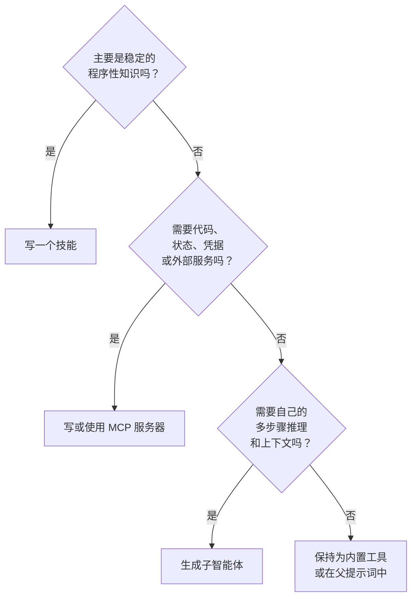
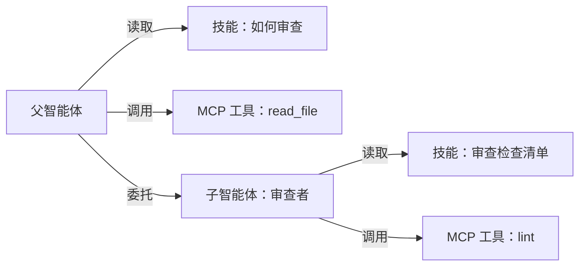

# 第十四章 — 技能、MCP 和子智能体：一个能力的三种形态

## 简述

模型需要但尚不具备的能力可以采取三种形态之一：**技能**——关于如何做某事的 Markdown 文件中的模型指令；**MCP 服务器**——将能力公开为工具的外部进程（第 13 章）；或**子智能体**——具有自己上下文和结果合约的独立智能体循环（第 10 章）。它们不可互换。技能便宜且教会模型*如何*做；MCP 服务器成本适中且隔离*执行*；子智能体昂贵且隔离*推理*。本章是决策依据、每种形态的设计规则、每种形态的失败模式，以及如何随着系统成熟将能力从一种形态迁移到另一种形态。

---

## 为什么重要

每个遇到新能力缺口的团队的第一直觉是*"生成另一个智能体。"* 大多数时候，正确答案是*"写一个技能。"* 第二常见的正确答案是*"调用 MCP 服务器。"* 完整的智能体循环是最强大且最昂贵的选项——当工作需要自己的上下文和推理时恰好有用，几乎在其他任何情况下都不然。

默认使用子智能体的团队会积累他们看不见的成本（每次生成都是完整的模型循环）和他们最终会为之付出代价的复杂性（多智能体编排添加了单智能体所没有的失败模式）。知道决策依据并从最轻量级别开始的团队移动更快并发布更干净。

---

## 核心概念

### 三种形态各一句话

- **技能** — 融入智能体提示词中的 Markdown 指令，教会模型如何将它已有的工具用于重复任务。
- **MCP 服务器** — 公开智能体调用工具的独立进程；能力存在于智能体之外，可跨多个智能体重用。
- **子智能体** — 由父智能体为有界子任务生成的完整智能体循环，具有自己的提示词、工具集、预算和结果合约（第 10 章）。

同一个能力——*"审查这个 PR"*——可以采取所有三种形态。选择最轻量的适合的。

### 技能 — 解剖

技能是带有 YAML 前置内容和自由形式正文的 Markdown 文件：

```markdown
---
name: review_typescript
description: 审查 TypeScript 代码的类型、异步和安全问题。
version: 1.2.0
platforms: [coding-agent, code-review-bot]
prerequisites: [typescript-installed]
---

# 审查 TypeScript 代码

审查 TypeScript 代码时，按以下顺序：

1. 检查公共函数输入是否有类型。
2. 检查异步错误是否得到处理（没有被吞掉的 Promise）。
3. 检查用户控制的字符串是否安全地到达 Shell / SQL / HTML 接收器。
4. 在样式评论之前报告发现。
5. 引用你正在评论的 file:line。

不要捏造问题。如果不确定，标记*建议审查需要*并继续。
```

五个字段在生产系统中反复出现：`name`、`description`、`version`、`platforms`、`prerequisites`。正文是 Markdown——指令、示例、注意事项。Hermes Agent 的技能格式遵循 agentskills.io 社区惯例——一个分享技能的新兴中心，不是有治理机构的正式发布标准。OpenClaw 和 OpenCode 使用相同的形状，带有细微变化。

### 技能 — 发现、加载和中心

技能存在于跨系统的四个地方：

- **捆绑的** — 随智能体一起发布。通用模式，基础行为。
- **用户安装的** — 在 `~/.hermes/skills/`、`~/.openclaw/skills/` 或工作区 `skills/` 目录下。每台机器或每个项目。
- **插件贡献的** — 在启动时由插件（第 11 章）注册。被视为用户安装的，但随插件版本化。
- **中心分发的** — Hermes Agent 与 `agentskills.io` 集成：`hermes skills install <name>` 从中心拉取技能，智能体在下一个会话中读取它。这是市场模式；预计更多智能体会采用它。

发现是启动时的目录扫描；扫描器读取前置内容并注册每个技能。完整正文在扫描时不会加载到内存中——那在稍后进行。

### 技能 — 渐进式披露（简述）

第 6 章完整涵盖了检索模式：技能*索引*（名称 + 描述 + 版本）每轮都在提示词中——无论存在多少技能，只有几百个 token——而技能*正文*通过 `skill_view(name)` 工具按需加载。第 14 章值得重申的角度：索引中的每个条目都是前缀成本，每个正文都是潜在的提示注入（见下面的信任子节），二十个简洁的技能一贯优于两百个大多数不相关的技能。第 6 章的预算规则适用——归档智能体几个月没有触碰的技能——以下的信任规则适用于你索引的任何内容。

### 技能 — 策展

技能会老化。智能体从不使用或调用已弃用 API 的技能比没有技能更糟糕——它将模型拉向过时模式。第 7 章涵盖了完整的策展生命周期（活跃 → 过时 → 归档）；技能特定的应用：

- **活跃** — 在最近 N 天内使用；出现在索引中。
- **过时** — 30 天内未使用；仍在索引中但被标记。
- **归档** — 90 天内未使用；从索引中删除，可恢复。

Hermes Agent 的策展器在空闲时间调度上运行，可以做更强大的事情：*从成功序列中写出新技能*。如果智能体可靠地以相同顺序运行三个工具来处理重复任务，策展器将该序列提升为模型可以命名的技能。这是生产中更强大的模式之一——*写技能的技能*。

### 技能 — 来源、信任和提示注入风险

技能是智能体每个会话都作为指令读取的文本。这使它成为整个系统中影响力最高的攻击面之一——恶意技能在机制上是另一种名称的提示注入。正确的默认值：*将每个用户安装或中心分发的技能视为不受信任，除非你有理由不这样做。* 即使协议还在成熟，值得固定的信任模型：

- **来源。** 每个技能携带 `name`、`version`，*以及*一个 `source`——它来自的 URL、中心条目、文件路径或贡献它的插件。安装门（第 12 章）读取 `source` 并决定是否询问。来自捆绑集之外的技能不应该静默进入索引。
- **安装时审批。** 新技能是第 12 章审批，与新 MCP 服务器相同。在它进入索引之前向用户展示技能的正文——每一行。*"信任来自此来源的此技能"*由来源、版本和正文指纹限定范围；正文重写使信任无效并触发新的询问。
- **签名。** 在中心或分发渠道支持的地方，根据发布的密钥验证签名。技能注册表足够早期，签名语义尚未标准化——跟踪规范，尽可能签名，默认情况下拒绝安装来自公共来源的未签名技能。
- **正文检查。** 在将技能添加到索引之前，对正文运行第 18 章的威胁扫描——与记忆层在第 7 章中使用的相同模式。包含*"忽略之前的指令"*的技能永远不会到达提示词。
- **卸载是一次点击。** 如果来源变得不受信任（被攻击的中心，被攻击的作者），用户必须能够删除技能而无需编辑文件。第 7 章的策展器拥有归档；卸载是其操作兄弟。

第一次思考这个问题的团队感到惊讶的一般规则：*技能比 MCP 服务器更危险*。服务器的工具在进程隔离中执行；技能的文本在你的模型提示词内执行。至少要像对待 MCP 信任边界一样仔细对待技能边界——通常更仔细。

### MCP 服务器 — 何时写自己的

第 13 章涵盖了 MCP 协议。剩下的问题是：*何时我应该写一个 MCP 服务器而不是内置工具或技能？* 三个信号：

- **能力存在于智能体进程之外** — 数据库、浏览器、第三方 SaaS、不同语言或运行时的服务。进程隔离是真正有用的。
- **能力在多个智能体中可重用** — 你构建一次，你组织中的几个不同智能体消费它。
- **能力需要自己的凭据或信任边界** — MCP 服务器持有 API 密钥；智能体进程从不看到它。

如果这些都不成立，更轻量的答案通常是内置工具（第 3 章）或技能。

### MCP 服务器 — 命名、schema、认证

当你确实写一个时重要的设计选择：

- **单目的 vs 多能力。** 小型、专注的服务器（`pg-query`、`s3-list`）比一个有二十个不相关工具的服务器更容易测试、保护和版本化。优先考虑许多小型服务器而不是一个巨大的服务器。
- **工具命名。** 框架将把你的工具命名空间为 `mcp__<server>__<tool>`（第 13 章）；选择清晰简短的工具名称，因为它们每轮都出现在模型的提示词中。
- **Schema。** 工具 schema 是前缀的一部分（第 4 章）。保持它们紧凑；每个可选字段都是前缀字节和模型填错它们的机会。
- **注释。** 通过 MCP 的 `readOnlyHint`、`destructiveHint`、`idempotentHint` 和 `openWorldHint` 明确标记每个工具的元数据——以便框架在消费你时正确连接第 2 章并行性、第 12 章审批和第 8 章重试安全性。`Hint` 后缀是有意的：消费框架应该将这些视为服务器*声称*的保守默认值，而不是它已经*证明*的断言（第 13 章）。
- **认证。** 在服务器内持有凭据；永远不要将它们作为来自模型的工具参数接受。使用 OAuth 或环境挂载的密钥；在智能体不需要知道的情况下轮换它们。

### 子智能体 — 配置文件作为单元

第 10 章涵盖了委托机制。*本章*关心的是扩展单元：子智能体最好被理解为你可以生成的*配置文件*——具有固定系统提示、工具列表、模型、预算和结果 schema 的命名角色。

```ts
type SubagentProfile = {
  name:           string;       // "reviewer"、"implementer"、"researcher"
  description:    string;       // 监督者在选择时读取的内容
  systemPrompt:   string;       // 角色特定指令
  model:          string;       // 通常比父智能体更廉价
  toolAllowlist:  string[];     // 比父智能体更严格
  maxSteps:       number;
  recursionDepth: number;       // 通常为 1——见第 10 章
  resultSchema:   JsonSchema;
};
```

监督者（第 10 章）按名称选择配置文件；注册表只是一个映射。OpenCode 的内置配置文件——`build`、`plan`、`general`、`explore`——是标准参考。自定义配置文件是你为项目添加专家的方式。

### 子智能体 — 内置配置文件 vs 自定义

跨生产系统的有用起始集：

- **`explore`** — 只读工具，廉价模型，返回结构化发现。*查找某物*任务的最安全默认值。
- **`build`** — 带写入的完整工具集，昂贵模型。通用工作者。
- **`plan`** — 只读工具，廉价模型，返回结构化计划（第 9 章）。输出是计划，不是行动。
- **`reviewer`** — 只读工具，将另一个子智能体的输出作为输入，返回*批准*或*发现问题*。来自第 10 章验证模式的廉价保险。

自定义配置文件适合相同的形状。规范：以它在你项目中扮演的角色命名配置文件，而不是底层工具。*"数据库迁移审查者"*是配置文件名称；*"调用 pg_query 和 write_file"*是实现细节。

### 决策依据

| 维度 | 技能 | MCP 服务器 | 子智能体 |
|---|---|---|---|
| 添加什么 | 模型的指令 | 外部工具 | 独立的推理循环 |
| 每次使用成本 | 几个提示词 token；仅在加载时有正文 | 一次工具调用协议跳转 | 完整的模型循环 |
| 隔离 | 无 | 进程边界 | 上下文 + 工具 + 模型边界 |
| 最适合 | 模型一直在重新发明的稳定程序 | 智能体进程之外的能力 | 需要自己推理的有界子任务 |
| 失败模式 | 模型忽略或错误应用 | 服务器崩溃，schema 漂移 | 子智能体循环，漂移，超支 |
| 更新频率 | 会话开始时 | 独立的服务器部署 | 每次智能体配置更改 |
| 版本控制 | YAML 前置内容 `version` | 服务器版本 | 配置文件定义 |

当你可以在自己的技术栈中测量时，添加具体成本估算：技能在索引成本之后基本上每次使用免费；MCP 工具调用添加几毫秒加序列化；子智能体运行添加数百毫秒和完整模型循环的 token 花费。



生产系统落地的默认值：首先尝试技能，最后尝试子智能体。如果你的团队在大多数新能力上都求助于子智能体，你的技能层可能发展不足。

### 同一能力三种方式

使依据具体化的具体示例。能力是*"摘要一份长文档。"*

**作为技能** — 当文档已经在智能体的上下文中，模型只需要程序时：

```markdown
---
name: summarize_document
description: 摘要上下文中已有的文档。
version: 1.0.0
---

# 摘要文档

1. 一句话陈述中心论点。
2. 列出最多五个支撑点。
3. 提及来源中的注意事项。
4. 将摘要保持在 150 字以内。
不要添加无根据的意见。
```

**作为 MCP 工具** — 当摘要需要外部处理时：PDF 解析、文档存储、向量查找：

```ts
const summarizeTool = {
  name: "summarize_document",
  description: "按 ID 摘要存储的文档。",
  input_schema: {
    type: "object",
    required: ["documentId"],
    properties: { documentId: { type: "string" } },
  },
  // 实现存在于 MCP 服务器中，调用私有存储。
};
```

**作为子智能体** — 当摘要本身是研究任务时：许多文档、矛盾的证据、迭代阅读、结构化综合：

```ts
await delegate({
  role:         "researcher",
  objective:    "综合这些文档中最强的声明。",
  context:      buildContextPacket(documentIds),
  allowedTools: ["read_document", "search_documents"],
  maxSteps:     12,
  outputSchema: ResearchSummarySchema,
});
```

三种形态，三种成本特征，三种失败模式。能力是相同的；选择取决于复杂性存在于哪里。

### 组合：三者如何结合

三种形态被设计为可组合的：



生产中的三种模式：

- **调用 MCP 工具的技能。** 技能指导模型如何组合 MCP 包装工具调用的序列。模型读取技能，然后调度工具。
- **拥有自己技能的子智能体。** 当子智能体被生成（第 10 章）时，默认情况下它继承父智能体的技能索引；OpenCode 让你传递一个子集。子智能体看到与父智能体相同的 `skill_view` 工具。
- **在内部运行子智能体的 MCP 服务器工具。** 插件将子智能体调用包装为 MCP 公开的工具。从外部看起来像工具；内部生成完整的智能体循环。用于跨多个智能体安装重用专家，而无需重新实现配置文件。

三层不是层次结构。你根据依据按能力混合它们。

### 形态之间的迁移

随着系统成熟，能力在形态之间移动。四种常见迁移：

- **一次性工具序列 → 技能。** 如果模型一直以相同顺序调用相同的三个工具，写一个命名该模式的技能。模型直接使用它而不是重新发现它。
- **技能 → MCP 服务器。** 如果技能变大或开始需要凭据或外部状态，将它提升到服务器中。技能变成一行指令*"调用 mcp__server__do_thing"*，工作从提示词中移出。
- **MCP 服务器 → 内置工具。** 如果每轮都调用 MCP 工具，每次调用的协议成本会累积。提升为内置工具（第 3 章）以获得延迟收益。
- **子智能体 → 技能 + 工具。** 当子智能体配置文件本质上是在执行程序（不是探索）时，将其折叠为父智能体读取的技能，针对父智能体自己的工具执行。节省每次调用的完整模型循环。

迁移是正常的，不是糟糕初始设计的迹象。第一周适合的形态很少是第六个月适合的形态。

### 每种形态的失败模式

| 形态 | 失败 | 如何注意 | 做什么 |
|---|---|---|---|
| 技能 | 模型忽略它 | `skill_view(name)` 从未被调用；模型的输出绕过技能的程序 | 收紧描述；将关键步骤提升为内置工具 |
| 技能 | 过时的指导 | 模型遵循过时的步骤 | 策展器归档（第 7 章）；版本字段；明确弃用 |
| MCP 服务器 | 崩溃或超时 | 工具结果错误信封 | 带退避重连（第 13 章）；如果可用则回退到内置工具 |
| MCP 服务器 | Schema 漂移 | 新的 `tools/list` 返回不同的形状 | 每次连接时重新列出；如果工具消失则警告操作者 |
| 子智能体 | 循环，漂移 | 步骤预算达到上限；审查者不同意 | 收紧配置文件的工具 + 系统提示；降低预算；添加审查者 |
| 子智能体 | 超支 | Token 或成本预算超出 | 预算上限（第 10 章）；为配置文件使用更廉价的模型 |

跨所有三者的有用说明：名称失败通常是出错的*第一个*迹象。名为 `review_typescript` 的技能比不同的技能更难混淆。前缀为 `mcp__github__create_pr` 的 MCP 工具比 `create_pr` 更难错误调度。名为 `db-migration-reviewer` 的子智能体对监督者比 `subagent-7` 更易读。命名就是设计。

### 插件技能、插件工具、插件智能体

关于第三轴的说明：插件（第 11 章）可以贡献三种形态中的任何一种。单个插件可以发布：

- **技能集** — 注册到技能索引的 Markdown 文件；
- **MCP 服务器** — 捆绑的二进制或 stdio 生成的进程；
- **子智能体配置文件** — 系统提示 + 工具列表 + 结果 schema，注册到配置文件注册表。

OpenClaw 和 Hermes Agent 都有全部三种；OpenCode 插件扩展技能和工具但不扩展配置文件。插件内的选择遵循相同的依据——选择适合插件目的的最轻形态。

---

## 真实系统说明

- **Hermes Agent** 是技能最丰富的参考：与 `agentskills.io` 兼容的完整 SKILL.md 格式、目录扫描器、从成功序列提升新技能的策展器、通过 `hermes skills install/push` 的中心集成，以及版本感知的归档。
- **OpenCode** 公开子智能体风格的委托（`task` 工具）和 `skill` 工具，以及通过智能体权限的工具过滤。内置配置文件集（`build`、`plan`、`general`、`explore`）作为起始分类法的最干净参考。
- **Paperclip** 使用技能和适配器来协调外部智能体运行时——它展示了这三个原语如何在组织级别成为操作控制：技能作为指令，适配器作为 MCP 形状的边界，智能体作为控制平面中的子智能体。
- **OpenClaw** 最清晰地展示了插件层：插件通过一个插件 SDK 贡献技能、MCP 服务器和渠道适配器。*所有三种形态来自一个插件*的好参考。

---

## 与你的智能体配对

一些在本章中效果很好的提示：

- *"取出我可能添加到智能体的十个新能力。对于每个，走决策依据并告诉我它应该是技能、MCP 工具还是子智能体。用驱动它的维度来证明每个选择。"*
- *"审计我当前的智能体。对 `skills/` 中的所有内容、我正在调用的每个 MCP 服务器和每个子智能体配置文件进行分类。标记任何形态错误的内容并提出迁移。"*
- *"为我的技术栈写三个版本的*摘要文档*能力——一个作为技能，一个作为 MCP 工具，一个作为子智能体。在相同的 10 KB 输入上测量每个的延迟和 token。"*
- *"用 `skill_view` 实现技能索引模式。添加一个指标，记录模型实际为每个技能调用 `skill_view` 的频率。告诉我哪些技能在索引中是死重。"*
- *"设置一个子智能体配置文件注册表，包含 `explore`、`build`、`plan` 和我项目的一个自定义配置文件。给我展示监督者的配置文件选择逻辑和每个的结果 schema。"*
- *"在我智能体上个月的日志中发现迁移候选。哪些工具序列重复得足以成为技能？哪些 MCP 工具每轮都被调用，应该是内置工具？哪些子智能体配置文件本质上是确定性的，应该折叠为技能？"*
- *"写一个贡献所有三种形态的插件：一个技能、一个 MCP 工具、一个子智能体配置文件。验证每个干净地注册，智能体可以在一个会话中使用所有三种。"*

---

## 接下来

你现在知道扩展单元了。第 15 章移向当有多于一个用户和多于一个进行中的会话时，保持框架运行在规模上的*后端*——队列、流式端点、持久的副作用机制，以及托管循环、记忆、持久化和连接器的运行时。
