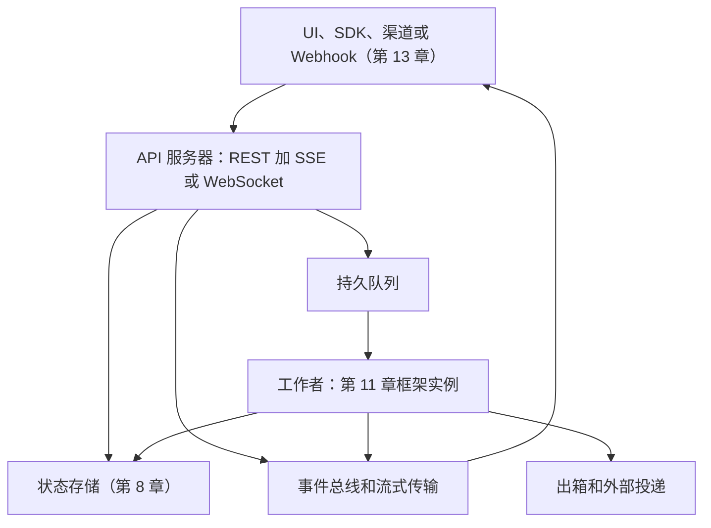
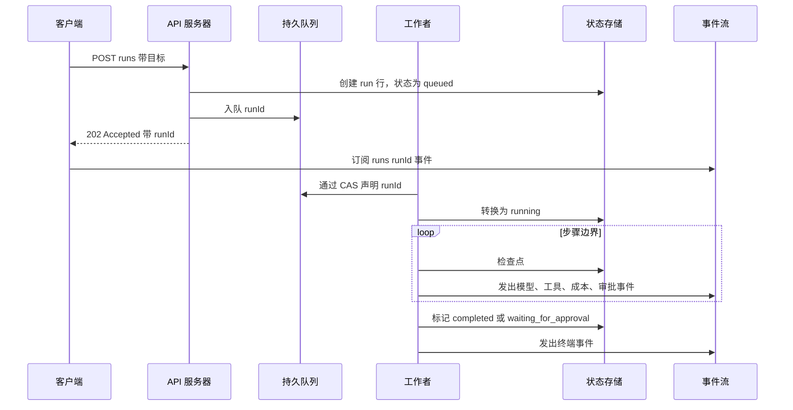

# 第十五章 — 智能体后端基础设施

## 简述

Web 请求只存活几毫秒。智能体运行可以存活分钟、小时或多次唤醒。因此生产后端将请求接受与执行分离：接受工作、入队、流式传输进度、存档状态，并使副作用幂等。本章涵盖扩展角度——第 11 章的框架如何成为多用户服务：API 接口（REST + SSE + WebSocket）、队列和工作者形态、唤醒到期工作的心跳式调度器、从嵌入式到多机器的部署拓扑、多租户隔离、密钥、备份、速率限制、预算、操作接口，以及在多台机器上运行时悄然失效的单用户假设。

---

## 为什么重要

最简单的智能体后端是一个同步调用模型并返回最终答案的 HTTP 端点。这适用于单轮演示。一旦智能体需要工具、审批、重试、长上下文或后台工作就会失败。三种失败很快出现：

- **客户端超时。** 工作者仍在运行时请求超时。
- **重复执行。** 客户端重试；现在两个副本可能执行副作用。
- **无可见性。** 用户看到的是转轮而不是进度、工具调用、审批和错误。

修复不是更长的超时。修复是不同的架构——专为超出任何单个请求的工作设计的架构。

---

## 核心概念

### 后端的形态

生产智能体后端通常有五层：



每一层都是你已经见过的东西。第 11 章的框架是在每个工作者内部运行的内容。状态存储是第 8 章。总线和流式接口是第 11 章的管道。渠道适配器和 Webhook 是第 13 章。本章是当*一个用户*变成*多个用户*，*一个进程*变成*多台机器*时，这些现有部件如何组合在一起。

### API 接口

API 公开三种操作形态：

- **变更** — `POST /runs`、`POST /messages`、`POST /sessions`。改变状态并快速返回的短 HTTP 请求。它们从不在请求路径中调用模型。
- **实时流** — `GET /runs/:id/events`（SSE）或 `WS /runs/:id`（WebSocket）。向客户端传递进度事件的长连接。SSE 用于单向；WebSocket 用于客户端也需要发送时——中断、运行中审批、计划编辑（第 9 章）。
- **轮询读取** — `GET /runs/:id`、`GET /runs/:id/transcript`。用于无法维持长连接的客户端。

OpenCode 正好公开这种形态：REST 变更，SSE 用于实时事件，用于希望将其作为库的调用者的类型化 SDK。Paperclip 在其之上分层一个控制平面 API——问题创建、智能体列表、审批路由——以便操作者有自己的接口与智能体的分开。Hermes Agent 进一步提供了 OpenAI 兼容端点，使现有 OpenAI 客户端无需更改就可以驱动它。

### 入队、流式传输、完成

长期运行智能体运行的规范请求流：



原则，都在前面介绍过：

- API 处理器**从不调用模型。** 它写入持久状态并入队。在 100 ms 内返回 202。
- 工作者用 CAS（第 8 章）声明，因此两个工作者从不运行同一个作业。
- 每个步骤边界写入检查点（第 8 章）并向总线发出事件。
- 向客户端的流式传输通过总线与工作者解耦，因此即使客户端断开并重连，工作者的进度也是可见的。

### 队列和工作者模式

| 后端 | 最适合 | 主要限制 |
|---|---|---|
| 内存队列 | 本地演示，单进程 | 重启时丢失——不要假装这是持久的 |
| SQLite 原子 UPDATE | 单机，单租户 | 单写入者；无法跨机器扩展 |
| Postgres `SELECT ... FOR UPDATE` | 多机器，中等规模 | 随着工作者数量增长，注意锁竞争和队列声明策略；阈值取决于 schema 和工作负载 |
| Redis Streams 或 NATS JetStream | 更高吞吐量，你运行中间件 | 运营开销——中间件是需要运行的服务 |
| SQS 或 Pub/Sub | 托管持久移交，云原生 | 云锁定；供应商特定语义 |
| Temporal、Restate、DBOS | 内置重试的分布式长期运行工作流 | 更多概念；平台承诺 |

从简单开始。大多数生产智能体在需要 Kafka 之前就在 SQLite 或 Postgres 上运行了。无论后端如何，模式是相同的：每个作业是一个有状态列的持久行，工作者原子地声明（第 8 章的 CAS 模式），工作者写入事件和检查点，工作者转换为终端状态。

```ts
// 工作者循环。无论队列后端如何，控制流都是相同的。
async function workerLoop(ctx: WorkerContext) {
  for await (const job of ctx.queue.claimRuns()) {       // 基于 CAS 的声明
    try {
      await ctx.db.runs.update(job.runId, { status: "running" });
      await executeAgentRun(job.runId, ctx);              // 第 11 章框架
      await ctx.db.runs.update(job.runId, { status: "completed" });
      await job.ack();
    } catch (err) {
      await ctx.db.runs.update(job.runId, { status: "failed" });
      await ctx.db.runEvents.insert({
        runId: job.runId,
        type:  "run.failed",
        payload: { message: String(err) },
      });
      await job.releaseOrDeadLetter(err);                 // 有界重试
    }
  }
}
```

将工作者池调整为模型提供者的速率限制，而不是机器的 CPU。大多数智能体后端在模型 API 上是 I/O 绑定的；如果模型能跟上，在一个 CPU 上运行十个工作者是没问题的。

### 心跳调度器

有些工作没有入站请求——cron 作业、定时审查、带退避的重试、重复的智能体任务。跨系统的模式是*心跳*：单个调度器进程按间隔唤醒，查询状态存储以寻找到期的工作，并将其入队。

```ts
// 单个调度器滴答，每 N 秒。
async function heartbeat(ctx: SchedulerContext) {
  const due = await ctx.db.query(`
    SELECT id FROM runs
     WHERE status = 'scheduled'
       AND wake_at <= now()
     LIMIT 100
  `);
  for (const row of due) await ctx.queue.enqueue(row.id);

  await ctx.reaper.reapOrphanedRuns();      // 第 8 章
  await ctx.curator.maybeRunCurator();      // 第 7 章
}
```

Paperclip 的心跳就是这种形态——它查询到期的 `heartbeat_runs`，运行孤儿收割者，并在空闲时触发后台策展器。调度器是少数在规模上必须是*单例*的组件之一：运行两个调度器，你会得到双重调度，除非你添加分布式锁。大多数团队通过第 8 章的相同 CAS 行模式选举调度器领导者（一个 `service_locks` 表，每几秒声明并刷新）。

### 部署拓扑谱


选择适合你流量的最左边的形态，而不是你的同事正在使用的最右边的形态。迁移故事：

- **嵌入式** — Hermes CLI，OpenCode 本地。所有内容都在一个进程中；磁盘上的 SQLite。完美适合一个用户。
- **单机多进程** — Hermes 网关，OpenClaw。一个父进程（网关 + 调度器），每个智能体的子进程。带 WAL 的 SQLite 处理并发读取。扩展直到一个 CPU 成为瓶颈。
- **多机** — 标准配置中的 Paperclip。负载均衡器后的多个无状态服务器；共享 Postgres；单个选举的调度器。添加机器以获得吞吐量。
- **控制平面 + 工作者池** — Paperclip 在规模上的完整形态。控制平面（API + 调度器）与工作者池分开（可能在不同区域或由不同团队拥有）。工作者向控制平面注册，声明工作，报告状态。

两种反模式。*过早分发*：在只有一个租户时从多机开始——运营复杂性没有扩展收益。*卡在嵌入式*：当你已经有五十个并发用户时仍然保持内存状态——请求和工作者之间的状态漂移带来的静默正确性 bug。

### 嵌入式 vs 外部数据库

生产存储选择跟踪部署形态：

- **SQLite + WAL**（OpenCode，Hermes CLI）——嵌入式；数据与进程相邻；备份是文件副本。适合嵌入式和单机。Hermes Agent 的 `apply_wal_with_fallback` 通过回退到日志模式处理 NFS/SMB 情况（WAL 不兼容）。
- **嵌入式 Postgres**（Paperclip 的零配置选项）——捆绑的；不需要安装外部服务；Postgres 形状的查询，没有运营团队。在 SQLite 和完整 Postgres 之间很有用。
- **外部 Postgres**（生产中的 Paperclip）——一旦有多台服务器就需要。schema 在一个地方；多台服务器连接；迁移在启动时运行；通过定时 `pg_dump` 备份。

SQLite 和 Postgres 都承载着真实的生产权重。从 SQLite 迁移到 Postgres 的正确时机*不是*用户数量阈值——而是第二个写入者需要协调的时刻。在那之前，SQLite + WAL 更快、更简单、更容易备份。

### 多租户隔离

三个隔离层，每个都有清晰的成本：

| 层 | 隔离什么 | 成本 | 何时使用 |
|---|---|---|---|
| **行范围** | 带 `tenant_id` 标记的行 | 最低 | 大多数 B2C 和小团队 B2B |
| **每租户数据库** | 每个租户一个 DB | 运营 | 严格的法规要求 |
| **每租户计算** | 每个租户一个 Pod 或容器 | 最高 | 敏感数据或合规要求 |

Paperclip 在 `company_id` 级别使用行范围——每个表都有 `company_id`，每个查询都过滤它。风险：一个缺少 `WHERE` 子句会泄露跨租户。缓解措施：

- **存储层的默认拒绝。** 没有租户上下文的查询应该报错，而不是返回所有内容。
- **生产中的合成租户测试。** 一个持续测试，在租户 A 中创建假数据并从租户 B 查询（期望零结果），在用户发现之前很久就捕获泄漏。
- **审计日志也是租户范围的。** 第 5 章的仅追加日志获得自己的 `tenant_id` 列；操作者视图默认为范围，而不是全局。

行范围是默认的；每租户 DB 和每租户计算是法规或信任要求迫使时的升级层。

### 密钥管理

密钥在生产智能体后端的三个地方存在：

- **环境变量或本地文件**（OpenCode，Hermes CLI）——适用于单用户、单机。不适用于多租户。
- **OS 密钥链**（用于凭据的 OpenCode）——系统级，静态加密，通过 OS API 访问。
- **Vault 或密钥管理器**（带 `local_encrypted` 或 `aws_secrets_manager` 的 Paperclip）——多租户规模时需要。每个租户的密钥是隔离的；在运行时解析；永不写入日志。

跨所有三者的规范：密钥在配置中被*引用*（例如 `$secret:slack_token`），在运行时*解析*，且*永不记录日志*。磁盘上的配置文件不应该包含已解析的密钥——序列化器始终重新发出引用。第 7 章的脱敏层处理日志路径；密钥层处理存储路径。

轮换通常是手动的。Hermes Agent 的 `credential_pool` 在速率限制错误时在多个 API 密钥之间轮换，但不生成新的；那是操作者的工作。

### 备份、恢复、灾难恢复

未备份的状态最终会丢失。三种实践：

- **定时快照。** Paperclip 默认定期 `pg_dump`，保留 7 天。SQLite 后端系统应该按计划运行 `VACUUM INTO` 并将文件复制出去。每天是最低要求；如果成本允许则每小时。
- **恢复演练。** 第一次从备份恢复不应该在事故期间。安排季度演练：停止暂存实例，恢复昨天的快照，验证状态机是一致的（第 8 章）。
- **Schema 迁移是单向的。** 第 8 章涵盖了规则；在规模上它被强制执行——生产从不回滚 schema。可加性迁移（带默认值的新列）是安全的；破坏性的等到最后一个消费者之后两个版本。

### 后端的数据治理

多租户行和加密密钥是安全故事的一部分，不是全部。一旦后端处理真实用户的真实数据，就会出现五个关注点：

- **API 认证和授权。** 每个 API 调用都需要身份（会话令牌、API 密钥、OAuth Bearer）*以及*授权检查（这个主体对这个租户、这个运行、这个资源有权限吗？）。缺少身份时默认拒绝。授权决策存在于在任何处理器之前运行的中间件中，而不是分散在路由体中——这是防止遗漏检查变成跨租户泄漏的方法。
- **加密。** 传输中（边缘的 TLS *以及*内部服务之间，不仅仅是在负载均衡器）和静态时（状态存储的数据库级加密；高敏感度列如消息正文或记忆条目的字段级加密）。磁盘级加密是底线，不是上限。
- **数据驻留。** 一些用户受法规约束，规定数据必须留在特定区域（EU GDPR 是标准案例；许多部门监管机构类似）。状态存储、模型提供者和对象存储都必须在正确的区域。在部署拓扑中解决这个问题，而不是在运行时——必须跨区域边界才能找到其会话的请求已经不合规了。
- **模型供应商数据控制。** 一些模型 API 默认在你的输入上训练；一些让你选择退出；一些完全禁止你发送某些数据类。在接入之前阅读供应商的数据使用政策；选择适合数据类的端点（允许训练 vs 零保留），并在运行旁边的审计日志中记录选择。
- **存储层的保留和删除。** 第 7 章拥有*写入端*机制（删除标记，supersedes 链）；第 18 章拥有*策略*（同意，被遗忘权，审计保留）。第 15 章的工作是在存储中实现两者：实际级联的 `tenant_id` 删除，不会在恢复时复活已删除数据的备份保留策略（第 8 章的重放隐私规则），以及区域范围的备份，以便驻留在灾难恢复期间保持。

这五个是后端与监管机构、安全团队和用户的合约。第 18 章端到端涵盖了威胁模型；本章是*实现*合约的存储和路由决策所在的地方。

### 水平 vs 垂直扩展

随着增长，瓶颈迁移。典型路径：

- **1 台服务器。** CPU 绑定于循环和工具执行。修复：那台机器上更多 CPU。
- **10 台服务器（粗略数量级）。** Postgres 竞争可能开始显现——`SELECT ... FOR UPDATE` 锁等待，连接池饱和。确切阈值取决于 schema、索引策略、锁粒度和读/写混合；某些工作负载更早感受到，其他的扩展到数百台才会。修复：连接池（PgBouncer），分区队列（按租户或队列名称分片），或移动到 `SELECT ... FOR UPDATE SKIP LOCKED`，以便工作者不会相互序列化。
- **100 台服务器。** Postgres 不再足够作为队列。修复：专用分布式队列（Kafka、Redis Streams、NATS JetStream）。
- **1000+ 台服务器。** 调度器心跳本身成为规模问题。修复：按租户或区域分片调度器。

诚实的框架：大多数智能体后端从未达到 10 台服务器。在有 10 台之前优化 1000 台是作为消遣的工程。

### 负载均衡和粘性会话

三种均衡策略：

- **轮询。** 每个请求去不同的服务器。无状态，简单。代价：任何内存缓存（系统提示，工作集）在第二个请求时都会未命中。如果你走这条路，与数据库支持的缓存配对。
- **粘性会话。** 将会话 ID 哈希到服务器；相同会话的后续请求落在那里。保持缓存热。代价：当服务器死亡时，其所有粘性绑定会话在负载均衡器重新路由它们之前都会遭遇缓存未命中。
- **按租户哈希。** 租户 A 的所有流量到服务器 X，租户 B 的到服务器 Y。可预测；失败限于受影响的租户。当租户在负载上是异构的时候很合适。

第 4 章的缓存规则决定这个选择。如果你的提示词缓存是提供者端（Anthropic 前缀缓存），任何重建相同提示词字节的服务器都会命中缓存——轮询有效。如果你的缓存在进程中，你需要粘性。

### 速率限制和准入控制

两层：

- **API 边界的每租户速率限制。** 每个租户的令牌桶，按匹配其订阅层的速率补充。当桶为空时拒绝（429），而不是永远排队。保持桶每租户，而不是全局——嘈杂的租户不应该阻塞安静的租户。
- **模型调用点的提供者速率限制级联。** 当提供者返回 429 时，轮换密钥，回退到不同的提供者，或回退到更小的模型（第 17 章拥有路由细节）。Hermes Agent 和 Paperclip 都实现了在 429 时轮换的凭据池。

一个有用的生产细节：将速率限制作为*一等运行状态*呈现，而不是静默重试。用户应该在流式事件中看到*"等待速率限制"*，而不是空白转轮。

### 后端的成本分类账

每次智能体运行都消耗 token，这花钱。在规模上，成本分类账是运营的，不是可选的：

- **每次运行成本**在运行终止时记录——输入 token、输出 token，按提供者和模型分类。
- **每租户汇总** — 每日和每月聚合，以便计费或成本分摊有效。
- **预算门。** 在每次运行之前，检查租户的剩余预算；如果会超出则拒绝运行。Paperclip 的 `budgets.getInvocationBlock()` 是标准模式。
- **操作者覆盖。** 管理员可以授予一次性信用或在月中提高上限；操作被审计。

分类账是持久的（第 8 章），因此消息日志的部分压缩不会丢失成本数据。将分类账与追踪管道（第 16 章）配对；成本是每租户绘制的最有用信号之一。

### 副作用持久性：规模上的出箱

第 8 章介绍了出箱模式。在规模上，三个细节很重要：

```ts
type OutboxRow = {
  id:              string;
  runId:           string;
  action:          string;        // "post_slack_message"，"send_email"，...
  idempotencyKey:  string;
  payload:         unknown;
  status:          "pending" | "dispatching" | "dispatched" | "failed";
  attemptCount:    number;
  nextAttemptAt:   string;
};

async function checkpointWithOutbox(ctx, input) {
  await ctx.db.transaction(async (tx) => {
    await tx.checkpoints.upsert(input.checkpoint);
    await tx.outbox.insert({ ...input.row, status: "pending" });
  });
}

async function dispatchOutbox(ctx) {
  const rows = await ctx.db.outbox.claimPending({ limit: 50 });
  for (const row of rows) {
    try {
      await ctx.externalActions.dispatch(row.action, row.payload, {
        idempotencyKey: row.idempotencyKey,
      });
      await ctx.db.outbox.markDispatched(row.id);
    } catch (err) {
      await ctx.db.outbox.scheduleRetry(row.id, backoff(row.attemptCount));
    }
  }
}
```

- **在副作用之前写入意图。** 检查点和出箱行在一个事务中提交；如果工作者在副作用之前崩溃，出箱行仍然存在供调度器重试。
- **至少一次是现实的语义；实际上一次是目标。** 跨网络的真正精确一次投递不是你可以做出的分布式系统承诺——工作者可能在副作用落地和标记被写入之间崩溃，没有协议能防止这一点。你能构建的是*实际上一次*：调度器可能在恢复时多次尝试副作用，但下游（Stripe、GitHub、大多数现代 HTTP API、每个构建良好的队列）通过幂等键去重，因此*观察到的*效果是一次。对于少数不接受幂等键的下游，在你这边保留一个去重表，在调度之前查找。
- **出箱本身是扩展关注点。** 出箱中的积压是你的下游 API 比智能体吞吐量慢的信号。监控出箱深度；当它增长时发出警报。

### 在规模下失效的单用户假设

一些对一个用户工作良好但对多个用户静默失效的模式列表：

- **模块级全局变量** — 单例 `sessionState`，全局工具注册表。一旦两个请求共享一个进程，它们就共享全局。将状态移入 `tenantContext` 参数或每请求范围。
- **渠道事件的顺序调度。** *"一次处理一个 Slack 消息"*对一个用户来说没问题；有一百个租户时，你有队头阻塞。并行处理，带每租户排序。
- **所有东西都用基于文件的会话存储。** 磁盘上的 JSON 文件很棒，直到 10,000 个文件共享一个目录，文件系统索引器开始抱怨。超过几千个会话后使用数据库。
- **进程内调度器。** 每台服务器运行自己的 `setInterval`；你得到 N 倍的工作。选举一个单例调度器（第 8 章的 CAS 行）或移动到托管调度器。
- **进程内缓存。** 本地内存；不跨服务器共享；重启时丢失。移动到 Redis，或接受每服务器成本。

每个对一个用户来说都是一个小 bug，在规模上是一类生产事故。在发布第二台服务器之前审计你的框架。

### 冷启动、热池和无服务器

三种延迟特征，每种都有用途：

- **冷启动。** 请求到达时进程启动——schema 迁移检查，插件加载，第一次模型调用。通常需要几秒，有时在大型捆绑包上更长。对于 cron 驱动的工作可以接受；对交互式聊天来说很痛苦。
- **热池。** 保持 N 个空闲工作者运行，准备好声明工作。延迟降至大约一百毫秒。持续消耗内存。Hermes Agent 以这种方式缓存网关智能体；Paperclip 按需生成。
- **无服务器**（Lambda，Cloud Run，类似的）。每次都有冷启动，除非你配置了并发。每个平台对执行时间都有自己的硬限制——远低于一小时，因供应商而异；在围绕它设计之前检查当前文档。对无状态工具服务器有用；通常对智能体循环本身来说是错误的形态，它需要超出单个函数调用。

每种工作负载的正确形态：交互式聊天需要热池；cron 和批处理需要可接受冷启动的工作者；工具服务器可以在 MCP 后面是无服务器的（第 13 章）。

### 存储层和缓存

生产系统收敛的三个存储层：

- **热**（Postgres 或 SQLite）：最近的会话状态，最近的转录，运行表。100 ms 以下读取。
- **温**（对象存储如 S3）：大型工件，文件上传，过大的工具输出（第 5 章的裁剪并存储模式）。数百毫秒；每 GB 便宜。
- **冷**（Glacier 或磁带）：超过保留期的旧运行，审计归档。小时级恢复；仅用于合规。

加上用于每次请求都重新计算的事物的缓存层（Redis，进程内）：速率限制桶，会话元数据，第 4 章的提示词指纹。缓存*不是*持久的；将未命中视为正常，而不是异常。

### 操作接口

超过前一百个并发用户后，你需要一个面向操作者的 UI。生产智能体后端收敛到五个视图：

- **运行检查器** — 特定运行的输入，完整事件流，调用的工具，成本，最终状态。对于*"为什么智能体这样做？"*问题必不可少。
- **会话查看器** — 跨运行的对话历史：重试，审批，评论，谁做了什么。
- **审批队列** — 跨租户的待处理审批（操作者视图）或特定用户的（第 12 章）。
- **手动重试或取消** — 失败或卡住运行上的按钮；操作记录到审计。
- **预算和信用视图** — 每租户成本和剩余预算，带操作者覆盖按钮。

Paperclip 在其 Web UI 中提供所有五个。模式：操作者视图默认只读；每个改变状态的操作都写入审计日志，以便事后审查可以回答*谁点击了这个运行的重试？* 第 5 章的日志规范和第 8 章的持久性是使这值得信赖的东西。

---

## 真实系统说明

- **OpenCode** 是 SDK + 嵌入式服务器形态的最干净参考：带 REST + SSE 的本地服务器，包装它的 TypeScript SDK，SQLite + WAL 用于存储，以及每个项目的 `InstanceState`。阅读它以了解*干净的单机后端是什么样的*。
- **Hermes Agent** 是网关 + 调度器形态的参考：网关从多个渠道接受入站（第 13 章），进程内调度器滴答处理 cron 和后台审查，智能体在带 1 小时 TTL 的 LRU 中缓存，SessionDB 为重放持久化所有内容。
- **Paperclip** 是多租户控制平面形态的参考：带行级 company 范围的 Postgres，带收割者的心跳调度器（第 8 章），`cost_events` 和 `budget_policies` 表，结构化运行检查器 UI，定时 `pg_dump` 备份，多适配器作为子进程生成，`local_encrypted` 和 `aws_secrets_manager` 密钥提供者。
- **OpenClaw** 提供了这些模式的渠道密集网关版本——研究网关/框架边界在大多数流量是入站渠道事件时如何扩展的有用参考。

---

## 与你的智能体配对

- *"为我当前的后端绘制层图。识别每层映射到第 1-14 章的哪一章，并标记任何缺失或重复的内容（例如，既是队列也是状态存储的队列，既是工作者也是调度器的工作者）。"*
- *"将我代码中的任何内存队列替换为持久的（SQLite 原子 UPDATE 或 Postgres `SELECT ... FOR UPDATE`）。添加 CAS 声明和第 8 章的收割者。用三次故意的工作者崩溃进行压力测试。"*
- *"通过第 8 章的 CAS 模式设置单个选举的调度器。运行我服务器的两个实例；验证在任何时候只有一个在调度 cron 和心跳工作。杀死领导者；验证另一个在 30 秒内接管。"*
- *"审计我的代码中的模块级全局变量、进程内缓存、基于文件的会话和进程内调度器。对于每个，提出多服务器替代方案（每请求上下文、Redis、DB、选举的调度器）。"*
- *"在我的 API 边界添加每租户速率限制，作为每租户令牌桶。将*等待速率限制*作为 SSE 流中的一等运行状态呈现。"*
- *"为一个特定的破坏性副作用（发送 Slack 消息）连接出箱模式。在事务提交和出箱调度之间崩溃工作者；验证消息被*实际上一次*投递在恢复时——调度器可能尝试两次，但下游 API 的幂等键必须确保用户只看到一条消息。如果你的下游不接受幂等键，在你这边添加去重表并验证相同属性。"*
- *"设置我的 SQLite 数据库的定时 `VACUUM INTO` 快照，每小时带 7 天保留。安排季度恢复演练并现在走一遍。"*
- *"添加操作接口：运行检查器（事件、工具、成本、最终状态），手动重试按钮，带操作者覆盖的每租户成本视图。在第 5 章的仅追加日志中审计每个操作者操作。"*
- *"从行级多租户迁移到为一个特定高合规租户的每数据库多租户。给我展示连接池、迁移和备份中有什么变化。"*

---

## 接下来

你现在有了一个能经受多用户、多机器以及某天部署中断十个进行中智能体会话的后端。下一章添加*可见性*——第 16 章涵盖可观测性：追踪、指标、作为信号的审计日志，以及记录什么以便事后审查可以回答你最终需要回答的问题。
