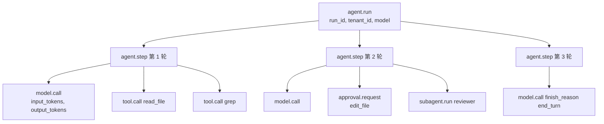
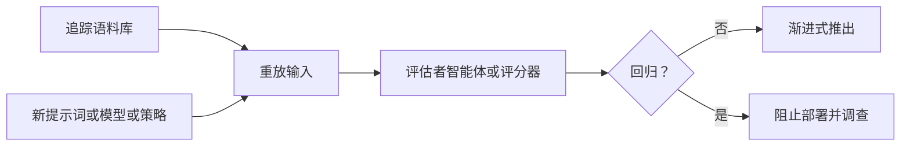

# 第十六章 — 可观测性

## 简述

仅靠日志很难调试智能体。你需要一个追踪树，显示哪个模型调用导致了哪个工具调用，哪个工具结果改变了下一个提示词，使用了多少 token，延迟出现在哪里，以及运行为什么停止。本章涵盖智能体可观测性的四个支柱（追踪、指标、日志、评估），LLM 操作的 OpenTelemetry 属性约定，将所有内容联系在一起的关联 ID 链，整合每个前面章节植入的每个可观测性信号的指标目录，采样和脱敏规则，以及关键 vs 可选的分割——每个智能体从第一天就必须检测什么，以及什么等到规模迫使它。

---

## 为什么重要

没有追踪，*"智能体困惑了"*是无法操作的。有了追踪，你可以打开一次运行并检查：提示词组装、检索的记忆、工具参数、工具输出大小、停止原因、重试次数、审批决定、成本。可观测性不会让智能体变得可靠。它使失败足够可见以便修复。

还有另一个重要原因：每个前面的章节（第 4 章到第 15 章）都植入了依赖这一层的特定指标。缓存命中率（第 4 章）。压缩方法直方图（第 5 章）。检索到达率（第 6 章）。策展器操作直方图（第 7 章）。运行状态转换计数（第 8 章）。重规划率（第 9 章）。子智能体成功率（第 10 章）。审批漏斗（第 12 章）。成本分类账（第 15 章）。本章是那些分散的信号获得共同形状的地方——收集、关联和可查询。

---

## 核心概念

### 四个支柱，不是三个

经典的可观测性框架是三个支柱：追踪、指标、日志。对于智能体，*评估*是同等重要的第四个支柱——因为*"智能体做了正确的事吗？"*这个问题仅凭延迟和 token 无法回答。

| 支柱 | 它回答的问题 | 量 | 形状 |
|---|---|---|---|
| **追踪** | 这次特定运行发生了什么？ | 每次运行一个 | Span 树 |
| **指标** | 所有运行中发生了什么？ | 持续 | 时间序列 |
| **日志** | 系统在特定时刻说了什么？ | 高 | 结构化行 |
| **评估** | 智能体产生了正确的结果吗？ | 采样 | 通过/失败带评分 |

每个支柱在成熟部署中有不同的受众。追踪用于调试事故的工程师；指标用于看仪表板的 SRE；日志用于取证审查和审计跟踪（第 5 章）；评估用于负责智能体质量的团队。

### 智能体运行的追踪树

自然单元是运行。运行变成根 span；下面的所有内容都是子节点：



树是调试单元。日志和指标指回追踪 ID；追踪是当出错时你打开的东西。

### OpenTelemetry 属性约定

OpenTelemetry GenAI 语义约定是智能体遥测最接近标准的东西。这些字段中的许多仍处于 OpenTelemetry 的*开发*稳定性——semconv 表示*预期重命名*的方式——但形状足够稳定，现在可以承诺，以后再迁移。相关属性：

| 属性 | 携带什么 |
|---|---|
| `gen_ai.provider.name` | `anthropic`、`openai`、`bedrock` 等 |
| `gen_ai.request.model` | 请求的模型 ID |
| `gen_ai.response.model` | 实际服务的模型 ID（回退时可能不同） |
| `gen_ai.usage.input_tokens` | 计费的输入 token |
| `gen_ai.usage.output_tokens` | 计费的输出 token |
| `gen_ai.usage.cache_read_input_tokens` | 缓存命中（第 4 章） |
| `gen_ai.usage.cache_creation_input_tokens` | 缓存写入（第 4 章） |
| `gen_ai.response.finish_reasons` | `end_turn`、`tool_use`、`max_tokens`、... |
| `gen_ai.tool.name` | 模型调用的工具 |

在你自己的命名空间中添加智能体特定属性：

```ts
function modelAttributes(call, result) {
  return {
    "gen_ai.provider.name":              call.provider,
    "gen_ai.request.model":              call.modelId,
    "gen_ai.response.model":             result.modelId,
    "gen_ai.usage.input_tokens":         result.usage.inputTokens,
    "gen_ai.usage.output_tokens":        result.usage.outputTokens,
    "gen_ai.usage.cache_read_input_tokens":     result.usage.cacheRead     ?? 0,
    "gen_ai.usage.cache_creation_input_tokens": result.usage.cacheCreation ?? 0,
    "gen_ai.response.finish_reasons":    [result.finishReason],
    "agent.profile":                     call.profile,
    "agent.run_id":                      call.runId,
    "agent.session_id":                  call.sessionId,
    "agent.tenant_id":                   call.tenantId,
    "agent.parent_run_id":               call.parentRunId,        // 子智能体
  };
}
```

将属性字符串保存在一个地方。将它们分散在代码库中会使最终的重命名变得痛苦，而且重命名肯定会来。

### 关联 ID：将所有内容联系在一起的链

三个 ID 必须贯穿每个日志行、指标标签和 span：

- **`run_id`** — 智能体运行。每次调用一个。在整个树中稳定。
- **`session_id`** — 对话线程（第 5 章）。每个进行中的会话一个；每个会话多次运行。
- **`step_id`** — 循环的一次迭代（第 2 章）。区分同一运行中的第 3 轮和第 7 轮。

加上可选的：`tool_call_id`（匹配第 1 章的往返），`subagent_run_id`（委托时，第 10 章），`parent_run_id`（反向）。

没有这条链，调试生产事故需要猜测哪个日志行属于哪次运行——通常通过时间戳，一旦两次运行重叠就失效了。有了这条链，单个 `grep run_id=abc123` 带回该运行的每个日志、指标和 span。

### 检测循环、模型调用和工具调用

赚得其 span 的三个地方：

```ts
async function invokeAgent(input, ctx) {
  return ctx.tracer.startActiveSpan("agent.run", async (span) => {
    span.setAttributes({
      "agent.run_id":     input.runId,
      "agent.session_id": input.sessionId,
      "agent.tenant_id":  input.actor.tenantId,
    });
    try {
      const result = await runLoop(input, ctx);
      span.setAttribute("agent.status", "completed");
      return result;
    } catch (err) {
      span.setAttribute("agent.status", "failed");
      span.recordException(err);
      throw err;
    } finally {
      span.end();
    }
  });
}

async function callModel(call, ctx) {
  return ctx.tracer.startActiveSpan("model.call", async (span) => {
    const start = performance.now();
    let firstTokenAt;
    const result = await ctx.modelProvider.stream(call, {
      onToken: (token) => {
        if (firstTokenAt === undefined) {
          firstTokenAt = performance.now();
          span.addEvent("model.first_token", {
            ttft_ms: Math.round(firstTokenAt - start),
          });
        }
        ctx.stream.emit(call.runId, { type: "token", token });
      },
    });
    span.setAttributes(modelAttributes(call, result));
    return result;
  });
}

async function executeTool(call, ctx) {
  return ctx.tracer.startActiveSpan("tool.call", async (span) => {
    span.setAttributes({
      "gen_ai.tool.name":   call.name,
      "agent.tool.call_id": call.id,
      "agent.run_id":       call.runId,
    });
    const result = await ctx.tools.dispatch(call.name, call.input, ctx.toolContext);
    span.setAttributes({
      "agent.tool.ok":           result.ok,
      "agent.tool.fatal":        result.ok ? false : result.fatal,
      "agent.tool.result_chars": result.ok ? JSON.stringify(result.result).length : 0,
    });
    return result;
  });
}
```

首个 token 的时间是流式传输智能体中最受关注的 UX 指标。总持续时间是最受关注的容量指标。两者都要记录。

### 指标目录——组合每个前面的章节

每个前面的章节至少植入了一个可观测信号。它们共同形成智能体特定的指标目录：

| 指标 | 来源章节 | 它告诉你什么 |
|---|---|---|
| `cache_hit_ratio` | 第 4 章 | 提示词缓存有没有发挥作用？工作负载相关——稳定的多轮工作负载合理的起始目标是超过一半，但查看第 4 章获取完整信息。 |
| `compaction_method_count{method}` | 第 5 章 | 哪种压缩技术在做工作？ |
| `compaction_compression_ratio` | 第 5 章 | 每次压缩我们节省了多少？ |
| `retrieval_empty_hand_rate` | 第 6 章 | 查询是否返回空结果？糟糕的记忆或糟糕的查询。 |
| `retrieval_reach_rate` | 第 6 章 | 模型实际使用我们注入的内容吗？ |
| `memory_write_rejection_rate` | 第 7 章 | 安全过滤器是否在起作用？ |
| `curator_action_count{action}` | 第 7 章 | 策展器是否在修剪任何东西？ |
| `run_state_transition_count{from,to}` | 第 8 章 | 运行在什么状态中花费时间？ |
| `replan_rate` | 第 9 章 | 计划需要多频繁更新？ |
| `subagent_success_rate{role}` | 第 10 章 | 每个专家是否尽职？ |
| `health_check_success_rate{probe}` | 第 11 章 | 框架是否健康？ |
| `approvals{state}` | 第 12 章 | 按终端状态的审批漏斗。 |
| `channel_inbound_count{channel}` | 第 13 章 | 每渠道的流量。 |
| `cost_usd{tenant,model}` | 第 15 章 | 按模型的每租户花费。 |
| `outbox_depth` | 第 15 章 | 副作用投递延迟。 |
| `queue_depth{queue}` | 第 15 章 | 积压。 |
| `ttft_ms` | 本章 | 首个 token 的时间。 |
| `tokens_per_run` | 本章 | 每次运行的成本驱动因素。 |

这不是愿望清单——它是前面章节中每个*"这也是可观测性"*节拍的联合。如果你按上述方式检测追踪树，它们都不难连接；一旦指标移动并且你问为什么，它们都会回报。

### 成本作为一等指标

成本出现在追踪中（每个 `model.call` span）和指标中（每租户、每模型、每天）。公式从第 4 章的属性集机械导出：

```ts
function costFromUsage(usage, model) {
  const r = pricing[model];                  // 向你的智能体询问当前费率
  return (usage.inputTokens               * r.input)
       + (usage.cacheReadInputTokens      * r.cache_read)
       + (usage.cacheCreationInputTokens  * r.cache_creation)
       + (usage.outputTokens              * r.output);
}
```

聚合为每租户每天，在操作者仪表板中呈现（第 15 章），对预算设门（第 17 章拥有路由决策）。生产智能体中最有用的单一警报是每租户每日成本的*异常检测*。一个合理的起始规则：当租户的每日成本超过滚动 7 天平均值的 3 倍时发出页面。Hermes Agent 和 Paperclip 在其仪表板中都呈现这种信号；阈值是工作负载相关的，值得调整。

### 日志 vs 指标 vs 追踪——何时使用哪个

三个角色：

- **追踪**是*因果的*。用它们回答*为什么这次特定运行这样做？* 对于一目了然的仪表板来说太冗长。
- **指标**是*聚合的*。用它们回答*所有运行中我们做得怎么样？* 它们丢失了个人故事。
- **日志**是*细粒度事件*。用于取证审查（第 5 章的审计日志是标准示例）和不适合 span 的事物——启动错误、定期后台任务、第 7 章策展器的操作日志。

跨所有三者的规则：每个日志行、指标数据点和 span 都携带相同的关联 ID，因此你可以从一个支柱转向另一个。点击指标峰值，获得贡献的追踪 ID；打开一个追踪，查看其时间窗口中的日志。

### 智能体追踪的采样策略

在规模上，记录每个 span 会变得昂贵。一个务实的采样策略：

- **始终开启（100%）** — 任何出错的运行，任何超出预算的运行，任何有审批的运行，任何触碰破坏性工具的运行，任何子智能体生成。
- **基于尾部（100%）** — 如果树中的任何 span 出错，追溯地捕获完整树。需要缓冲收集器（带 `tail_sampling_processor` 的 OpenTelemetry Collector）。
- **基于头部（10-25%）** — 其他所有事情，在会话开始时用 `run_id` 的确定性哈希采样，以便会话的运行要么全部采样要么全部不采样。

最大的错误是以低速率均匀采样。有趣的运行是例外；以 1% 的速率均匀采样会丢弃大多数例外。对错误和昂贵运行始终开启，对其余的基于头部。

### 追踪边界的脱敏

遥测可以泄漏。三类在到达追踪接收器*之前*必须脱敏：

- **密钥** — API 密钥、OAuth 令牌、从第 15 章 `$secret:` 引用解析的值。模式匹配并替换为 `[REDACTED_<KIND>]`。
- **PII** — 邮件、电话号码、SSN、支付细节。相同方法；一些团队维护每租户可持久化字段的白名单。
- **模型输入和输出** — 默认情况下，在 span 上记录 token *计数*，而不是完整文本。将完整文本存储在单独的有严格访问控制的门控审计存储中（第 5 章的仅追加审计日志是正确的归宿）。

Hermes Agent 的 `RedactingFormatter` 在日志格式化器级别处理这个；在追踪管道中正确的地方是*导出器*或 OpenTelemetry Collector 中的流内处理器。事后脱敏——在 span 已经发送到第三方后端之后——太晚了。

### 评估作为可观测性

追踪变成了回归数据集。在更改系统提示、模型配置文件、工具 schema 或路由策略之前，重放代表性追踪并评分结果。



架构很简单：收集生产追踪，针对候选更改重放它们，评分结果（语义相似性、结构化字段比较、来自第 10 章验证模式的评估者子智能体），门控推出。评估套件是你对抗静默回归的安全网——通过测试、在抽查中看起来合理、只在一周后在生产中出现的那种回归。

对于更丰富的设置，持续运行较小的评估：每小时，采样 50 个最近的生产运行，针对基线配置重新运行它们，在发散时发出警报。Hermes Agent 有一个执行此操作的后台模式；Paperclip 通过其 `heartbeat_runs` 审计日志有构建块。

### 评估方法——评什么以及如何评

前面的子节涵盖了*门控*——重放、比较、推进。这个涵盖*方法*——实际评什么，用什么评判者，输入来自哪里。你需要发布和改进智能体而不是盲目飞行的最小评估工具包。

**四个评分维度。** 大多数智能体评估归结为这四个，大致按主观性递增顺序：

- **功能正确性** — 智能体做了被要求的事吗？对于封闭形式的任务是二元的（测试通过，值匹配），对于部分正确是渐变的。最重要的维度，当任务有基准真相时最容易自动化。
- **步骤效率** — 需要多少轮次、工具调用或 token？与用户感知延迟和账单相关的成本代理。从上面的追踪树便宜计算。
- **输出质量** — 格式良好性、准确性、有用性。通常需要评判者（可能时确定性，否则 LLM 作为评判者）。
- **用户满意度** — 明确反馈（点赞/点踩，接受/拒绝差异），或隐式的（接受到接受时间，用户是否重试）。最重要的信号，也是最难大量收集的。

可以时对所有四个评分；按用户实际支付的内容加权。

**三种评判者模式。** 大致按偏好顺序：

- **确定性检查** — 正则表达式、JSON Schema 验证、代码执行、与已知答案的等价。最便宜、最快、最可靠。首先使用；任何可以是确定性的都应该是。
- **LLM 作为评判者** — 更廉价的模型根据评分标准为智能体的输出评分。非确定性任务的标准。三种需要设计对抗的偏见：*冗长偏见*（评判者偏好更长的输出），*位置偏见*（评判者偏好他们首先看到的选项），以及*自我偏好*（来自同一模型系列的评判者对其自己系列评分更高）。缓解措施：将评判者与严格的评分标准配对，随机化位置，使用与智能体不同的模型系列。
- **成对比较** — 向评判者展示两个输出（基线 vs 候选），并询问哪个更好。对于模糊任务比绝对评分更可靠——*"A 比 B 好吗？"*是模型比*"这好吗？"*更一致地回答的问题。

对于高风险评估，集成两三个评判者并取多数。不一致本身就是一个有用的信号——评判者不同意的案例是值得人工查看的案例。

**评估语料库的来源。** 三个来源，按对生产智能体的有用性顺序：

- **生产追踪语料库。** 第 5 章的审计日志加上本章前面的追踪树是你拥有的最便宜、最相关的评估集。采样 50-100 个最近的运行；针对候选重放；评分。总是代表性的，因为它是真实流量。
- **合成数据集。** 使用更强的模型生成测试输入，涵盖你的生产流量尚未命中的边缘案例。对覆盖率有用；对分布不太可靠。
- **公共基准测试。** 对定向和与领域对话有用，对直接生产门控无用。使用它们了解最先进水平在哪里，而不是决定是否发布。

**值得了解的基准测试（供定向）。** 对于理解什么是难的以及领域的标准在哪里很有用。这些都不能替代在你自己工作负载上的评估，但了解这些名称值得花几分钟：

- **SWE-bench / SWE-bench Verified** — 编码智能体解决真实 GitHub 问题。*"智能体能发布修复吗？"*的领先参考。
- **τ-bench** — 跨现实领域（航空、零售）的工具使用。测试针对目标完成的多轮工具调用。
- **GAIA** — 复杂现实世界问题上的通用 AI 助手。端到端检索加推理加工具使用。
- **WebArena** — Web 导航任务。浏览器使用智能体的参考。
- **AgentBench** — 跨 OS、代码、Web 和知识任务的广泛能力基准测试。

还有更多，每季度都有新的。与你一起阅读本课程的智能体可以命名当前排行榜前列；上面的名称足够稳定，值得记住以供定向。

**发布的最小评估工具包。** 你不需要任何上述内容就可以开始。最低要求：

- 一个小型固定语料库——10 到 50 个真实工作负载输入，检入仓库。
- 一个评分函数——如果可能的话确定性，如果不可能的话 LLM 评判。
- 一个基线 vs 候选运行器，为每边生成单个数字。
- 当数字超过某个阈值回归时发出警报。

就这些。超出这些的任何内容——评判者集成、公共基准测试集成、合成生成、奖励模型——是当工作负载证明时你成长到的东西。发布最有用智能体的团队通常是那些拥有*实际在每次更改时运行*的最小评估工具包的团队，而不是那些从不阻止部署的最精心设计的评估框架的团队。

### 评估治理——保持评估管道诚实

评分生产运行的评估管道本身就是一个生产系统。运行它的团队拥有四个关注点：

- **数据集版本控制。** 评估语料库会变化——你添加边缘案例，淘汰过时的，修复标签。固定一个版本，记录哪个数据集版本产生了每个分数；相对于 `eval_set@v3` 的回归不一定是相对于 `eval_set@v4` 的回归。
- **评分标准版本控制。** LLM 作为评判者的评分标准也是移动目标。版本化它们，记录哪个版本评分了每次运行。*"模型退化了"*和*"我们收紧了评分标准"*在没有这个的情况下看起来是一样的。
- **评判者漂移。** 更改评判者模型——更廉价的版本、不同系列、新版本——即使智能体没有变化也会改变绝对分数。当评判者移动时重新建立基线；偏好*相对*评分（在同一评判者处基线 vs 候选）而不是绝对阈值。
- **重放隐私。** 追踪语料库包含用户数据。重放追踪会重新处理可能受第 7 章删除标记或第 8 章恢复隐私规则约束的内容。在重放之前过滤语料库；评估管道不能成为复活用户要求删除的内容的方式。

对评估管道应用与它评估的智能体相同的版本控制、审计和隐私规范。否则它声称提供的门就是虚构的——一个没有人能重建其原因的移动数字。

### 追踪重放调试接口

面向操作者的指标仪表板的补充是打开单个运行并内联查看它。

Paperclip 和 OpenCode 收敛的模式：

- 顶部带关键属性（模型、token、成本、状态、持续时间）的根 span。
- 下面缩进的子 span 树——步骤、模型调用、工具调用、子智能体运行。
- 点击任何 span 查看属性、该时间窗口的日志、错误和堆栈跟踪。
- 一个*重放*按钮，用相同输入针对当前代码重新运行相同轮次。
- 显示挂钟花在哪里的时间轴视图（模型等待 vs 工具执行 vs 队列等待）。

这是智能体调试中单一最有价值的操作者工具。构建好底层追踪树，这个 UI 就很简单；构建不好，没有 UI 能拯救你。

### 关键 vs 可选——第一天检测什么

本章并非所有指标都是强制的。诚实的分类：

**关键——每个智能体从第一天起：**

- 带 `run_id`、`tenant_id`、`status`、总 token、成本的根 `agent.run` span。
- 每次 LLM 调用一个带 OpenTelemetry token 属性的 `model.call` span。
- 每次调度一个带名称、ok/fatal、result_chars 的 `tool.call` span。
- 每个日志行上的关联 ID。
- 每个未捕获异常的错误日志。
- 缓存命中率指标（第 4 章——太便宜了不能跳过）。
- 每租户每日成本指标（第 15 章——运营的，不是可选的）。

**早期高价值：**

- 运行状态转换计数（第 8 章）。
- 审批漏斗（第 12 章）。
- TTFT 和总持续时间直方图。
- 基于尾部的错误采样。
- 导出器处的结构化脱敏。

**可选，直到规模迫使它们：**

- 持续评估套件。
- 成本异常检测。
- 每工具延迟直方图。
- 追踪属性的 schema 版本控制。
- 追踪重放 UI。
- 超出第 2 章运行时检测的死循环警报。

要避免的陷阱：在关键层之前构建可选层。有二十个没有人信任的图表的仪表板比捕获每次事故的一个图表更糟糕。从关键列表的顶部开始，只有在上面的层是稳固的情况下才添加层。

### 追踪属性的 schema 版本控制

你今天发布的属性需要更改。三个习惯：

- **命名空间你的自定义属性**（`agent.*`），以便重命名是有范围的。
- **添加新属性；不要重新利用旧的。** 如果含义改变，给它一个新名字。
- **用根 span 上的 `trace_schema_version` 属性明确版本化追踪 schema。** 查询变成*给我 `schema=v2` 且 ... 的运行*——旧运行不会破坏查询。

OpenTelemetry GenAI 约定本身也在演变。将它们视为今天的规范名称，以及一年后迁移的候选。

---

## 真实系统说明

- **OpenCode** 从其服务器流式传输结构化会话事件，将会话和消息部分持久化到 SQLite，并向 SSE 客户端公开总线——作为编码智能体的实用可观测性接口，也作为你插入的任何 OTLP 导出器的追踪种子。
- **Paperclip** 记录 `heartbeat_run_events`、`cost_events`、`issue_approvals` 和适配器执行状态，为操作者提供直接映射到本章指标目录的控制平面视图。追踪重放 UI 模式的最强参考。
- **Hermes Agent** 为结构化日志提供了 `RedactingFormatter`，通过 FTS5 进行审计的会话搜索，以及可以运行持续评估的后台模式——源头脱敏和评估作为可观测性模式的有用参考。
- **OpenClaw** 是提醒追踪必须包含*渠道*和*适配器*元数据的提醒：相同的智能体行为可能因平台而异，将 Slack 和 Telegram 合并在一起的可观测性会掩盖真实失败。

---

## 与你的智能体配对

- *"用 `gen_ai.*` 属性约定将 OpenTelemetry 接入我的框架。验证每次模型调用、工具调用和审批都发出 span。在我的 OTLP 后端打开一次运行，确认追踪树与实际发生的事情匹配。"*
- *"向每个日志行、span 和指标添加关联 ID（`run_id`、`session_id`、`step_id`、`tool_call_id`）。给我展示一个 `grep run_id=...`，它跨所有三个支柱带回一次运行的完整故事。"*
- *"将本章的指标目录实现为单个 Prometheus 或 OTLP 指标集。为每个租户构建一个仪表板：今日成本、缓存命中率、运行状态分布、审批漏斗、按错误率排名的顶级工具。"*
- *"设置采样策略：对错误和昂贵运行（超过 $0.10）始终开启，对任何错误 span 基于尾部 100%，对其他所有事情基于头部 10%。用压力测试验证。"*
- *"在 OTLP 导出器或收集器中添加脱敏。以 Hermes 的 `RedactingFormatter` 规则为模型。在工具参数中注入故意的密钥，并验证它从不到达追踪后端。"*
- *"建立评估作为可观测性循环：每小时，采样 50 个生产运行，针对我的当前配置重放，用评估者子智能体（第 10 章）评分，如果发散超过 5% 则发出警报。"*
- *"为一次运行构建追踪重放 UI：树、属性、日志和一个重新运行相同轮次的*重放*按钮。使用我的 OTLP 后端的 API。"*
- *"添加成本异常检测：当租户的每日成本超过其滚动 7 天平均值的 3 倍时发出页面。从一个月的历史数据调整倍数。"*
- *"带我了解本章目录中哪些指标在我的智能体中*尚未*连接。按关键/高价值/可选的分割确定优先级。"*

---

## 接下来

你现在可以看到你的智能体在做什么了。下一章使用这些测量来决定使用*哪个模型*和*哪个提供者*，何时回退，何时限流，以及如何实时执行每租户预算。第 17 章是成本和延迟策略。
