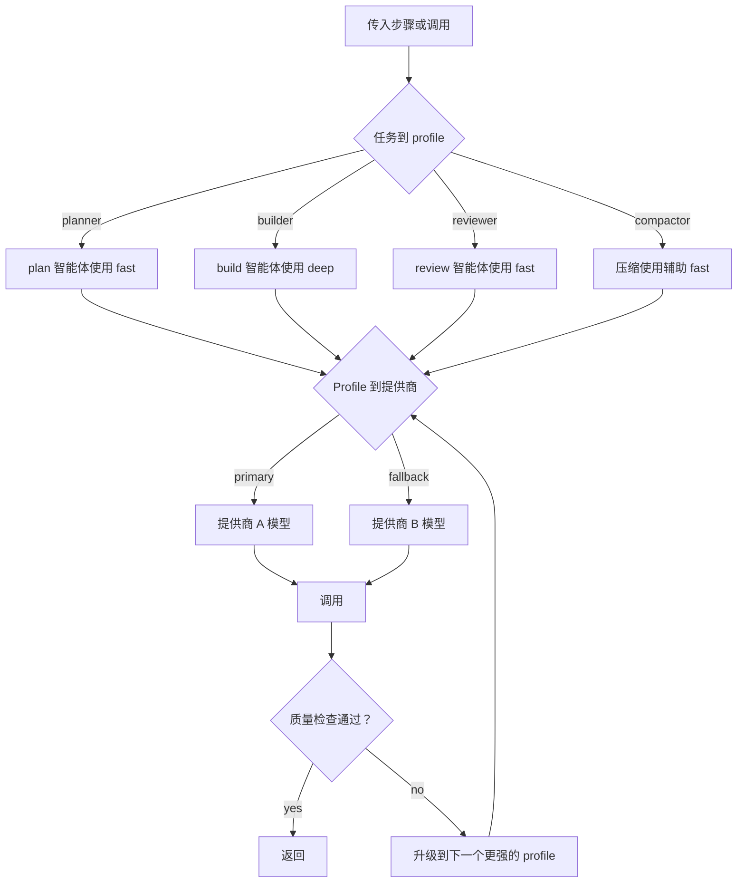
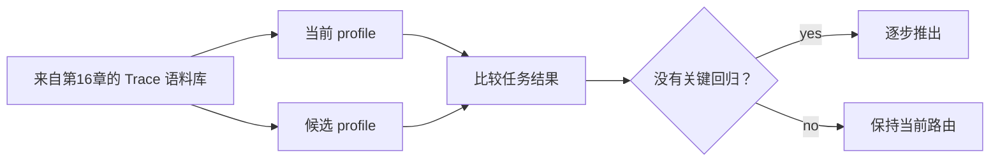

# 第17章 — 成本、延迟与模型策略

## TL;DR

模型选择是一个架构决策，而不是文件顶部的一个常量。生产级智能体会跨模型 profile（快速、平衡、深度、嵌入）路由工作，强制执行每个租户的预算，重试瞬态故障，并仅在质量需要时才进行升级。然而最大的成本杠杆不是选择正确的模型——而是在确定性工具、正则表达式、BM25 索引或经典 ML 库能够更快、更便宜、更可靠地回答时，*完全不调用模型*。本章涵盖路由级联、辅助模型层、不调用 LLM 的启发式规则、调用前 token 预算、流式 vs 批处理的权衡、prompt 缓存作为每租户摊销杠杆、评估门控的 profile 晋升、成本预测、异常响应策略以及运营者覆盖机制。

---

## 为什么重要

智能体循环会放大模型调用次数。单个工作流可能为规划、工具选择、检索综合、最终响应、评估通过和记忆整理步骤分别调用一次模型。如果每次调用都使用最昂贵的模型，系统将在经济上变得脆弱。如果每次调用都使用最便宜的模型，质量会在关键时刻以微妙的方式失败。而如果这个调用本可以用正则表达式解决，你就花了 LLM 的价格去做一项 1980 年代的文本处理器能在微秒内免费完成的工作。

核心技能是路由——而路由始于*是否应该调用模型？*，然后才是*调用哪个模型？*

---

## 核心概念

### 三向权衡

每次模型调用都受到三种力量的拉扯：

- **质量** — 输出是否达标？
- **延迟** — 是否足够快以满足请求的形态？
- **成本** — 租户的预算是否能覆盖它？

没有哪个模型能同时赢得三项。生产级路由的原则是为每次调用选择这个三角形上的正确点，而不是全局选择一个赢家。

### 模型 profile，而非模型名称

在代码和配置中使用命名 profile。在一个地方将它们映射到具体的提供商模型 ID。课程可以说*"为压缩使用 `fast` profile"*而不会在底层模型更改时失效——并且定价快照保存在一个带有日期戳的文件中。

```ts
type ModelProfileName =
  | "fast"            // 小型、快速、便宜；常规分类和摘要
  | "balanced"        // 默认的主力模型
  | "deep"            // 昂贵，具备推理能力；用于难题和最终审查
  | "embedding"       // 检索索引；不是聊天模型
  | "local-private";  // 设备端或 VPC 内；敏感内容

type ModelProfile = {
  name:                ModelProfileName;
  provider:            "anthropic" | "openai" | "bedrock" | "local" | string;
  modelId:             string;
  contextWindowTokens: number;
  maxOutputTokens:     number;
  pricingSnapshot?: {
    retrievedAt:                 string;       // 日期戳
    inputPerMillionTokens:       number;
    outputPerMillionTokens:      number;
    cacheReadPerMillionTokens?:  number;
    cacheWritePerMillionTokens?: number;
    sourceUrl:                   string;
  };
};
```

五个 profile 几乎涵盖所有情况。更多 profile 意味着更大的团队认知负担，以及更多当价格变化时容易遗忘的地方。

### 路由级联

生产系统在三个层次上按顺序路由：



- **第一层 — 任务到 profile。** 智能体或步骤类型选择 profile。OpenCode 将模型绑定到*智能体*（build、plan、explore、compaction）。Paperclip 将适配器选择绑定到问题类型；适配器再有自己的模型。Hermes Agent 在会话开始时选择并保持固定。
- **第二层 — Profile 到提供商（带回退）。** 每个 profile 都有一个主要提供商/模型和一个回退链。遇到 429、配额错误或 5xx 时，轮换密钥（Hermes Agent 的凭证池）或回退到下一个提供商。这是第15章的限流级联。
- **第三层 — 质量升级。** 如果便宜的调用产生了不通过自动质量检查的输出，则使用下一个更强的 profile 重新运行。将此视为与基础设施重试不同的机制——*质量升级*和*瞬态重试*是不同的机制。

### 每次调用 vs 每步骤 vs 每次运行的选择

一个微妙但代价高昂的陷阱：在会话中途更改模型通常会破坏第4章的 prompt 缓存。三种策略，按成本友好度大致降序排列：

- **每次运行**（大多数生产系统）。模型在会话开始时选定，并在整个运行过程中保持固定。缓存命中在多个轮次中累积。
- **每步骤**（实践中少见）。每个步骤可以选择不同的模型。对于辅助层（下一节）很有用，其中一个独立的便宜模型处理压缩或摘要；但如果*主*模型按步骤轮换，则每次都要付出缓存未命中的代价。
- **每次调用**（对主智能体少见；对路由器和辅助层正常）。每个单独的调用独立路由。跨调用的缓存摊销基本上消失了，因此只有当架构明确以缓存换取路由灵活性时才有意义——对每个请求进行分类和路由的 LLM 路由服务，或者调用短暂且缓存复合本不在预期中的辅助层。

规则：**主智能体模型是每次运行的；辅助模型和路由器形状的调用可以是每步骤或每次调用的。** 让主智能体按调用轮换是智能体系统中最常见的成本爆炸；解决方法通常是明确哪些调用是*路由器形状*（无缓存假设），哪些是*会话形状*（缓存累积）。

### 辅助模型层

生产系统不会将所有模型调用都通过主智能体运行。它们为狭窄、便宜、无工具的任务保留一个独立的*辅助*层：

- **压缩**（第5章）— Hermes Agent 的 `auxiliary_client` 为 `ContextCompressor` 调用更便宜的模型；OpenCode 的专用 `compaction` 智能体在没有工具和固定预算的情况下运行。
- **摘要** — 将长工具结果转换为片段；将 50 轮的对话记录转换为交接块。
- **分类** — *"这是问题还是命令？"* — 带有严格 schema 的便宜调用。
- **标题和 slug 生成** — OpenCode 为会话标签运行 `title` 智能体。
- **嵌入生成** — 根本不是聊天模型；是完全不同的形状。

辅助层是仅次于缓存的第二大成本杠杆。在与主智能体相同的昂贵模型上运行压缩，可能会将一次会话的账单翻倍——而便宜的模型完全可以处理这项工作。

### 完全不调用 LLM

最大的成本杠杆也是最容易被忽视的：当确定性工具、库或正则表达式可以回答问题时，根本不应该涉及 LLM。生产系统对任何有明确答案的查询都坚决使用确定性方法。

| 任务 | 确定性选项 | 何时添加 LLM |
|---|---|---|
| 按名称模式查找文件 | `glob`、`ripgrep` | 从不 |
| 按精确字符串查找代码 | `ripgrep`、FTS5 | 从不 |
| 查找语义相似的文本 | 嵌入 + ANN（`sqlite-vec`、`pgvector`）| 仅当模糊查询需要重排序时 |
| 解析 JSON、YAML、CSV | 解析器库 | 从不 |
| 提取结构化字段 | 正则表达式、查找表、经典 NER | 仅当输入格式无界时 |
| 检测语言/意图 | 快速分类器（fastText、正则规则）| 仅当模糊边缘很重要时 |
| 计算、计数、聚合 | 代码、SQL | 从不——模型不擅长算术 |
| 渲染 diff | `diff` 库 | 从不 |
| 验证 schema | Schema 验证器 | 从不 |
| 格式化输出（JSON、markdown）| 序列化器 | 仅当输出 schema 是开放式时 |
| 摘要已知结构 | 模板、槽位填充 | 仅用于自由文本 |
| 从封闭列表中选择类别 | 分类器或规则引擎 | 仅用于模糊边缘 |

OpenCode 的工具层是最清晰的参考：文件搜索使用 `ripgrep` 和 `glob`，绝不使用 LLM。Hermes Agent 的 `session_search` 首先使用 FTS5，只有在需要摘要结果时才调用 LLM。Paperclip 的心跳*不会*自己进行任何 LLM 调用——它将工作路由到可能或不可能使用 LLM 的适配器。

经验法则：*如果查询有确定性答案，使用确定性工具。LLM 用于主观判断。* 你跳过的每次模型调用都是在成本、延迟和模型编造答案的可能性上的节省。

```ts
// 一个优先选择确定性路径的路由器。
async function answer(query: Query, ctx: Context) {
  if (query.shape === "file_search")    return await ctx.tools.ripgrep(query);
  if (query.shape === "structured_get") return await ctx.db.get(query.key);
  if (query.shape === "parse_known")    return await ctx.parser.parse(query);
  if (query.shape === "classify_closed") {
    const result = ctx.classifier.predict(query.text);
    if (result.confidence > 0.9) return result.label;
    // 仅在置信度低时回退到 LLM
  }
  return await ctx.llm.call(query, { profile: "balanced" });
}
```

### 发送前的 token 估算

在调用模型之前，先计算 token 数量。这使三件事成为可能：

- **在账单产生前拒绝。** 如果请求会超出租户的预算，提前返回一个清晰的错误，而不是在提供商已经计费后才发现。
- **在溢出前压缩。** 如果请求会超出上下文窗口，先运行压缩（第5章）——比捕获 `prompt_too_long` 错误后重试更便宜。
- **选择正确的 profile。** 如果请求是 200 个 token，`fast` profile 就够了；如果是 50K token 且需要深度推理，无论预算如何都需要 `deep` profile。

Hermes Agent 的 `model_metadata.py` 缓存每个模型的上下文限制和成本乘数，正是为了这个调用前检查。OpenCode 的 `usable()` 计算 `context_limit − max_output − safety_buffer`，并在下次调用前触发压缩。两者都将 token 计数视为规范的调用前门控。

### 流式 vs 非流式：不仅仅是 UX 的成本杠杆

流式感觉像是 UX 选择（向用户实时输出 token），但它也影响成本形态：

- **流式** — 部分输出在几毫秒内开始到达；用户可以在响应中途打断。每 token 成本与非流式相同，但*感知*延迟要低得多。交互式聊天的正确默认值。
- **非流式** — 一次往返，完整响应在一次读取中返回。在规模上 HTTP 开销更低（同等负载一个连接 vs 多个）。允许在向用户展示之前对完整响应进行后处理。批处理任务、cron、定时工作的正确默认值。

Hermes Agent 通过 `streaming=True/False` 标志明确了这一点。Paperclip 适配器按适配器选择。规则：*交互式形态使用流式；非交互式形态不需要它。* 流式在规模上并非免费——每个开放连接都占用一个工作线程（第15章）。

### Prompt 缓存作为多租户摊销

第4章介绍了缓存机制；这里的成本角度不同。缓存节省可以在*跨*会话中累积，而不仅仅是在一个会话内——*当*一组条件满足时：

- 一次构建并在许多会话中重复使用的系统 prompt，会将其缓存创建成本摊销到所有会话上，前提是前缀在字节级别是稳定的（第4章），每次调用使用的模型相同（上面的每次运行原则），提供商应用的租户或组织范围一致，提供商的缓存保留窗口在两次使用之间未过期，以及请求的节奏足够密集以保持条目温热。删除其中任何一个前提条件，摊销就会停止。在公开缓存的提供商上，缓存输入 token 的计费通常是新鲜输入的一小部分；乘数因供应商而异且会变化——阅读当前定价页面，永远不要硬编码比率。
- Hermes Agent 在 `SessionDB` 中持久化渲染好的系统 prompt，这样在网关驱逐后跟随一条新用户消息时会重播字节相同的字节——只要保留窗口未过期，缓存就能在驱逐后存活。
- OpenCode 的两部分系统数组（模型族规则 + 智能体特定覆盖）的形状允许模型族的一半在许多智能体之间缓存命中。

对路由的影响：尽可能在会话内保持模型不变，并在会话间保持系统 prompt 字节稳定（第4章的规则）。在会话中途切换模型，或使用时间戳重建 prompt，都会丢弃多会话摊销。

### 重试 vs 升级

生产系统区分两类失败；它们不是同一种机制：

```ts
async function routeAndCall(step: AgentStep, ctx: ModelContext) {
  const profile = chooseProfile(step);

  // 瞬态：带退避的基础设施重试。
  const result = await callWithRetry({ ...step, profile }, ctx);

  // 质量升级：不同的机制。
  if (await passesQualityCheck(step, result)) return result;

  const stronger = nextStrongerProfile(profile);
  if (!stronger) return result;

  await ctx.trace.event("model.escalated", {
    from: profile, to: stronger, reason: "quality_check_failed",
  });
  return callWithRetry({ ...step, profile: stronger }, ctx);
}
```

- **瞬态重试**处理 429、5xx、网络错误。退避、重试，最终回退到不同的提供商（第15章的级联）。模型输出是同一个目标。
- **质量升级**处理成功的调用但其输出未能通过下游检查（schema 验证、评估器子智能体、基本完整性检查）。使用更强的 profile 重新运行。第二次的模型输出*更好*。

将质量失败视为重试是一个常见的 bug：用相同的 prompt 重试相同的便宜模型会产生相同的不足答案。

### 每租户成本预测

反应式预算门控（第15章）在运行开始后拒绝它。预测在*运行之前*进行门控，并相应地路由：

- **从会话形态估算每次运行成本。** 同一租户的类似任务的最近运行提供了一个基线；乘以模型的每 token 成本。
- **与剩余预算比较。** 如果预测 > 剩余，响应取决于租户的*预算策略*，而不是硬编码的默认值。一些租户——高风险的法律审查工作流、受监管的数据部署——更愿意*阻止*并请求预算批准，而不是默默获得更便宜的答案。其他租户——交互式聊天、探索性编码——更愿意*降级*：路由到更便宜的 profile，启用更积极的压缩，在 UI 中展示权衡。路由器读取策略；降级是*一种*有效策略，不是默认。在没有明确策略选择的情况下混合质量合同和成本合同，是降级超支系统默默违反受监管数据协议的方式。
- **在重要时向用户展示预测。** *"此任务预计在当前设置下花费 $2.40；切换到 fast profile 预计为 $0.30？"* — 运营者覆盖（下文）处理这个选择。

Paperclip 的 `budget_policies` 表保存租户层级；预测层在分发前读取它。Hermes Agent 不进行预测；它在事后做出反应。如果你能一次性完成仪器化，预测模式是更便宜的发布路径。

### 成本异常响应

第16章介绍了成本异常*检测*——3× 滚动 7 天警报。第17章拥有*响应策略*：

- **软响应。** 将租户路由到接下来 N 次运行的更便宜的 profile；启用更严格的压缩；通知用户他们的支出异常。
- **硬响应。** 暂停该租户的新运行；在恢复前需要运营者确认；将任何进行中的运行标记为 `scheduled_retry`（第8章），以便在人工审查后继续。
- **分层响应。** 首次峰值：软响应。持续两天的峰值：硬响应。手动覆盖：绕过两者。

在生产中有效的模式是*自动软响应，手动硬响应*。软响应是可逆的，出错代价低；硬响应会阻碍真实工作，需要人工决策。

### 运营者覆盖

路由必须有逃生通道。两种模式：

- **每次运行的模型提升。** *"此任务至关重要；无论策略如何，在 `deep` 上运行它。"* 记录在审计日志（第5章）中；成本从运营者拥有的覆盖预算中扣除。
- **每会话固定。** 在调查或调试会话期间将特定会话锁定到特定模型。

Paperclip 的 issue 上的 `assigneeAdapterOverrides` JSONB 正是这样——一个运营者设置的覆盖，心跳在分发时会尊重它。OpenCode 让用户通过 CLI 标志或 UI 每次会话选择一个智能体（因此也选择模型）。两者都是必要的；没有覆盖的纯自动路由会将一个糟糕的决定变成一个漫长的事故。

### 评估门控的晋升

在将步骤从 `balanced` 移动到 `fast`（为节省成本的*降级*）或从 `balanced` 移动到 `deep`（为提高质量的*晋升*）之前，重放有代表性的 trace 并比较结果：



这是第16章的评估即可观测性模式应用于路由。架构是提供商无关的：收集生产 trace（第16章），针对候选 profile 重放，用评估器子智能体（第10章的验证模式）或确定性比较对结果评分，对推出进行门控。尽可能按租户运行评估——对一个工作负载有效的 profile 可能在另一个上出现回归。

### 每请求类型的延迟预算

不同的请求形态有不同的延迟容忍度。尽早将其固化，让路由器知道要优化什么：

| 请求形态 | p50 预算 | p95 预算 | 兼容的 profile |
|---|---|---|---|
| 交互式聊天（TUI、Web）| <2 秒到首个 token | <10 秒总计 | `fast`、带流式的 `balanced` |
| 长期运行的编码任务 | <30 秒每步骤 | <2 分钟每步骤 | `balanced`、`deep` |
| 后台整理（第7章）| 不适用 | <5 分钟 | `fast` 辅助 |
| Cron / 定时工作 | 不适用 | 分钟到小时 | 任何 profile |
| 评估批处理 | 不适用 | 小时 | 任何 profile，通常是 `fast` |

将 profile 与预算匹配。在聊天请求上使用 `deep` profile 即使答案正确也是 UX 失败。在困难的编码任务上使用 `fast` profile 会浪费运营者一个下午在糟糕的输出上。

### 缓存感知的成本计算

定价数学必须考虑缓存输入 token 比新鲜 token 更便宜：

```ts
// 成本公式期望一个提供商标准化的 Usage 形状。
// 每个提供商适配器（第11章）产生此形状；成本层永远看不到
// 原始提供商响应。
type NormalizedUsage = {
  freshInputTokens:       number;   // 按全价计费的输入
  cacheReadInputTokens:   number;   // 按缓存读取价格计费的输入
  cacheWriteInputTokens:  number;   // 按缓存写入价格计费的输入（如有）
  outputTokens:           number;
};

function estimateCost(profile: ModelProfile, usage: NormalizedUsage): number {
  const p = profile.pricingSnapshot;
  if (!p) return 0;
  return (usage.freshInputTokens      * p.inputPerMillionTokens        / 1e6)
       + (usage.cacheReadInputTokens  * (p.cacheReadPerMillionTokens  ?? p.inputPerMillionTokens) / 1e6)
       + (usage.cacheWriteInputTokens * (p.cacheWritePerMillionTokens ?? p.inputPerMillionTokens) / 1e6)
       + (usage.outputTokens          * p.outputPerMillionTokens       / 1e6);
}
```

提供商使用报告在 `input_tokens` 包含什么上存在分歧——一些将缓存 token 计入输入总计，另一些单独报告，一些有额外的每请求行项目（推理 token、工具 token）。*在适配器边界进行标准化*：来自第11章的每个提供商适配器输出 `NormalizedUsage` 形状；成本公式永远看不到原始提供商响应。跳过这一步，你会在一个提供商上重复计算，在另一个提供商上少计算——每个下游成本决策都继承了这个错误。定价快照的每缓存字段故意是桩：缓存乘数和特殊用途 token 费率是供应商特定的且经常变化，因此快照的工作是*带有日期戳和源 URL 携带当前数字*，而不是编码默默过期的默认值。

### 超出每 token 定价的提供商经济学

每 token 的输入/输出定价是标题。生产级路由还必须考虑供应商提供的其他几个通道：

- **批处理/弹性层。** 许多提供商为具有较宽松延迟的异步工作提供折扣通道——通常比同步价格低相当大的比例，换取延迟的响应窗口。后台整理（第7章）、持续评估批处理（第16章）和隔夜 cron 工作是天然的适配场景。将通道作为每工作负载的开关呈现，而不是全局设置。
- **优先级层。** 相反的通道：在负载下保证吞吐量或更短延迟的溢价。对于有 SLA 的付费层流量很有用；很少值得为免费层工作付费。
- **重试成本是真实的。** 你重试的 429 是两次计费调用（如果第一次已经在失败前流式传输了 token），而如果重试落在更昂贵的回退上，成本还会复合。将重试作为第16章指标目录中的独立行项目跟踪，这样你就可以看到不健康提供商的二阶成本，而不是将其埋藏在原始调用中。
- **每提供商的特性。** 一些提供商在某些端点根本不对缓存输入计费；一些在第一次命中后收取消失的缓存创建溢价；一些对嵌入的定价相对于聊天大幅折扣；一些按地区不同定价。成本路由器需要每提供商的定价形状概念，而不是通用的每模型价格。

将所有这些作为路由层的策略旋钮呈现，而不是硬编码常量。供应商格局每季度变动；路由器的工作是知道哪些通道存在，并让运营者选择匹配工作负载的那个。

---

## 真实系统注释

- **Paperclip** 通过适配器清单暴露模型 profile，并在控制平面使用 `budget_policies` + `cost_events` 表。issue 上的 `modelProfileHint` 是运营者覆盖模式；心跳在分发前查阅它。是每租户成本预测和预算强制执行的最强参考。
- **OpenCode** 将模型绑定到智能体（build、plan、explore、compaction、title），每个都有自己的权限集。compaction 智能体是辅助模型的清晰示例——没有工具，便宜，专注于一项工作。提供商族特定的系统 prompt（`SystemPrompt.provider(model)`）保持每个族的缓存稳定性。
- **Hermes Agent** 维护带有上下文限制和成本乘数的模型元数据缓存（`model_metadata.py`），用比主智能体更便宜的模型为 `auxiliary_client` 提供压缩服务，并通过 `credential_pool` 在 429 时轮换 API 密钥。是不先检查 token 就不爆预算的最清晰参考。
- **OpenClaw** 提醒我们路由不仅仅是价格：渠道、隐私和后端可用性对于个人助手网关也很重要。即使云模型更便宜，本地模型对于敏感内容也是正确的选择。

---

## 与你的智能体配对

- *"清点我的智能体中的每次模型调用。对于每次，告诉我它应该使用哪个 profile（`fast`、`balanced`、`deep`、`embedding`、`local-private`）以及原因。标记任何当前使用错误 profile 的调用。"*
- *"遍历我的工具注册表。对于每个工具，决定它是否可以被确定性库（`ripgrep`、FTS5、嵌入、正则表达式、schema 验证器）替换或捷径。向我展示流量最高的工具的节省估算。"*
- *"添加辅助模型层：一个用于压缩（第5章）、摘要和分类的独立便宜模型。验证主智能体的模型在每次运行中保持不变，以便第4章的 prompt 缓存继续命中。"*
- *"实现调用前 token 预算：在调用前计算 token，如果超过上下文限制则压缩，如果超过租户的剩余预算则拒绝，向用户返回清晰的错误。用三个故意超大的 prompt 进行测试。"*
- *"将本章的路由级联构建为代码：第一层任务 → profile，第二层 profile → 提供商（带回退链），第三层在检查失败时的质量升级。将其接入我的循环并记录每个升级事件。"*
- *"设置每租户成本预测。使用我上个月的 `cost_events` 按任务类型估算每次运行成本。当预测超出剩余预算时，路由到更便宜的 profile 而不是阻止。向我展示三次真实运行及每次的路由决策。"*
- *"添加运营者覆盖：每次运行的类似 `assigneeAdapterOverrides` 的字段，只能为该次运行提升模型。将覆盖记录在审计日志（第5章）中；从单独的覆盖预算中扣费。"*
- *"建立评估门控的晋升循环：每周采样 50 次生产运行，针对下一个更便宜的 profile 重放，用评估器子智能体（第10章）评分，仅在没有关键回归时晋升。从一种特定步骤类型开始运行。"*
- *"绘制过去一周按新鲜输入、cache_read 输入、cache_write 输入和输出划分的每轮成本图。告诉我我的 prompt 缓存是否在发挥作用，以及我应该在哪里收紧前缀以扩大差距。"*

---

## 下一步

你现在拥有了一个路由层，它能为每次调用选择正确的模型，知道何时完全不调用模型，从提供商故障中恢复，并在不产生意外费用的情况下强制执行预算。下一章将从成本控制转向危害预防：第18章涵盖安全和对抗性输入——prompt 注入、记忆边界的威胁模型、工具范围界定，以及防止智能体被武器化来对抗用户的策略控制。
