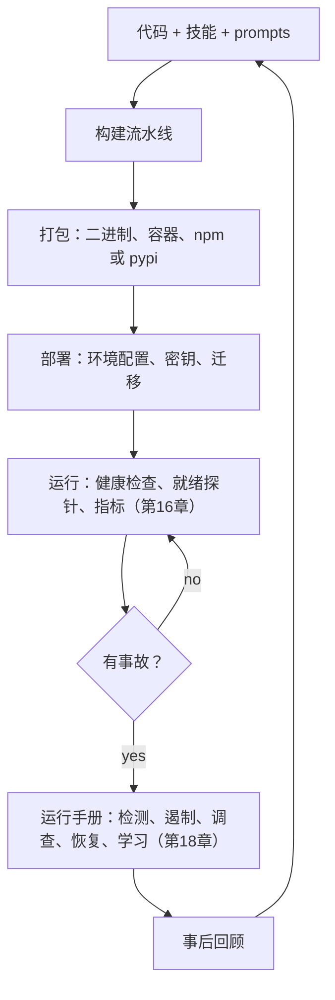

# 第19章 — 运维与前置部署智能体

## TL;DR

交付一个智能体只是运营它的开始。真实的部署要经历重启、密钥轮换、队列、备份、模型弃用、成本峰值和客户特定环境。本章涵盖使这些情况可以应对的运维原则：打包和分发、跨环境配置、部署时的 schema 迁移、优雅停机、运行手册目录、针对智能体规模的 SLO、prompt 和技能编辑的变更管理，以及*前置部署*模式（运营者随系统一起交付，近到可以当场修复）。读完本章，你会了解每个运营者都希望在凌晨三点被叫醒前就已经准备好的一切。

---

## 为什么重要

智能体 demo 在一个终端里用一个 API 密钥运行。真实的部署要服务于许多用户，经历重启，有密钥、队列、日志、审批、预算和数据边界。运维设计决定了一个有用的原型是否能在与真实用户的第一次接触中存活——以及团队能否在不每周疲于奔命的情况下迭代它。

这很重要的另一个原因：智能体运维与普通 Web 服务运维是真正不同的。模型是第三方依赖，其行为变化几乎没有通知。成本可能随使用量非线性增长。*Bug* 可能在 prompt、技能、工具、配置或模型升级中——而修复通常是一次 markdown 编辑，而不是代码部署。运行手册和值班形态必须反映这一点。

---

## 核心概念

### 运营智能体的形态



将其理解为一个闭合循环。代码变成包；包变成部署；部署运行并发出信号；事故触发运行手册；事后回顾反馈到代码中。每个框都有一个拥有它的章节——第19章的工作是将它们联系在一起的*运维原则*。

### 打包和分发

一个认真对待的智能体以三种形态之一交付：

- **单一二进制** — Bun 构建（OpenCode）、pip 可安装的 wheel（Hermes Agent）、npm 打包（OpenClaw）。最小的安装占用；最容易交付给不运行 Docker 的运营者。
- **容器镜像** — Hermes Agent、OpenClaw 和 Paperclip 都提供带有多阶段构建的 Dockerfile。服务器部署的正确默认值；可预测的运行时；易于更新。
- **桌面包装器** — 围绕本地服务器的 Electron、Tauri 或 SwiftUI shell。OpenCode 的桌面应用和 OpenClaw 的 iOS/macOS 客户端是参考。适合终端用户安装的形态。

跨平台比你想象的更重要。Hermes Agent 提供明确的 Windows 处理（MinGit 包、UTF-8 修补）；OpenCode 支持 macOS、Linux 和 Windows。正确的打包取决于工作负载——单个静态链接的二进制文件对 Go 和 Rust 智能体效果很好；容器通常是需要运行时的 Python 或 Node 智能体的正确默认值；桌面包装器适合终端用户安装。将包的形态与运营者的环境匹配，而不是匹配一个通用的*最快*。

更新机制——Sparkle（Mac 桌面）、`npm publish`、容器注册表或 `pip`——应该与安装路径匹配。混合它们会让运营者感到困惑（*"我应该 `apt upgrade` 还是 `pip install -U`？"*）。

### 跨环境配置

三层，按加载顺序：

```ts
type AppConfig = {
  environment:        "local" | "staging" | "production";
  databaseUrl:        string;
  queueUrl:           string;
  modelProfilesPath:  string;
  traceExporterUrl?:  string;
  secretsProvider:    "env" | "local_encrypted" | "cloud_secret_manager";
};

function loadConfig(env: Record<string, string>): AppConfig {
  // 1. 内置默认值。
  // 2. 基于文件：从已知路径读取 config.yaml 或 config.json。
  // 3. 环境变量覆盖。
  // 使用 schema 验证；对缺失的必填字段快速失败（第11章引导顺序）。
  return ConfigSchema.parse({
    environment:       env.NODE_ENV ?? "local",
    databaseUrl:       env.DATABASE_URL,
    queueUrl:          env.QUEUE_URL,
    modelProfilesPath: env.MODEL_PROFILES_PATH ?? "./model-profiles.json",
    traceExporterUrl:  env.OTLP_ENDPOINT,
    secretsProvider:   env.SECRETS_PROVIDER ?? "env",
  });
}
```

原则：每个必填字段都有 schema，验证在启动时失败（第11章的引导顺序），配置文件中永远不存在明文密钥——只有在运行时解析的 `$secret:` 引用（第15章）。Paperclip 的 `secret_access_events` 表跟踪每次解析，以便运营者可以审计*谁在何时读取了什么*。

每环境覆盖：单独的配置文件（`config.staging.yaml`、`config.prod.yaml`）签入源代码，加上实际密钥部分的环境变量覆盖。覆盖链是*默认值 → 文件 → 环境变量*，按此顺序，最后进行 schema 检查。

### 部署时的 Schema 迁移

第8章涵盖了数据原则。在部署时，三件事必须按顺序发生：

- 运行待执行的迁移（幂等的；对同一修订版重新运行是安全的）。
- 验证结果 schema 是否符合运行代码的期望（启动检查，而不是运行时假设）。
- 在部署*之前*而不是之后做快照。还原快照很容易；在破坏性迁移后还原则不然。

Drizzle 风格的工具（OpenCode、Paperclip）和 Alembic 风格的工具（Hermes Agent）都收敛到同一模式：迁移文件版本化，按顺序应用，记录在 `migrations` 表中，每个文件通过原子事务门控。加法迁移是安全的；破坏性迁移等到最后一个消费者后的两个版本（第15章）。

### 优雅停机

信号（SIGTERM、SIGINT）将工作进程切换到排空模式——第11章涵盖了生命周期，第15章涵盖了多机版本：

```ts
class WorkerRuntime {
  private shuttingDown = false;

  async start() {
    onSignal(["SIGTERM", "SIGINT"], () => { this.shuttingDown = true; });

    while (!this.shuttingDown) {
      const job = await this.queue.claim({ timeoutMs: 5_000 });
      if (!job) continue;
      await this.runJobWithCheckpointing(job);
    }

    await this.flushPendingWrites();
    await this.releaseAllLeases();
    await this.closeConnections();
  }
}
```

生产中的两条规则：优雅排空有一个截止时间（通常是几分钟）；截止时间后仍在运行的任何内容都在状态机（第8章）中被标记为 `cancelled`，以便收割器能干净地处理它。每次停机都写入相同的结构化*"停机原因"*事件，这样事后回顾可以回答*进程是因为我们告诉它停止而死亡，还是因为崩溃？*

### 运行手册——目录

运营智能体时使用最频繁的工件是运行手册。六个反复出现的事故及其运行手册形态：

| 事故 | 首检项目 | 可能的修复 | 回滚 |
|---|---|---|---|
| 提供商限流或配额耗尽 | 每租户成本仪表板（第16章）；凭证池状态（第15章）| 轮换 API 密钥；切换到回退模型（第17章）；提高租户速率限制 | 无——这是外部的 |
| 宣布模型弃用 | 提供商发布说明；新模型的评估套件结果 | 重新固定到特定版本；运行评估门；在 5% 上进行金丝雀（第17章）| 在配置中固定上一个版本 |
| 租户成本峰值（第16章异常）| 每租户成本 trace；最近的工具直方图 | 每租户速率限制或模型降级（第17章）；如果持续则暂停新运行 | 恢复之前的限制；退还额度 |
| MCP 服务器停机或被攻击 | MCP 连接日志；收割器状态 | 将服务器标记为不可用；向用户展示；轮换凭证（第13章）| 在配置中禁用 MCP 服务器 |
| Schema 迁移失败 | 迁移日志；数据库快照时间戳 | 回滚部署；从快照还原（第8章）| 还原部署前快照 |
| 疑似记忆污染 | Trace 重放（第16章）；审计日志（第5章）；supersedes 链 | 通过 supersedes 链回滚受影响的记忆条目（第7章）；用更新的威胁模式扫描（第18章）| 通过 `supersedes` 链回滚记忆 |

每一行都是 `RUNBOOK/` 目录下代码旁边的一个 markdown 文件。每个文件链接到确认症状的仪表板查询、拉取受影响运行的 trace 查询，以及回滚的确切命令。运行手册目录成为代码之外运营者编辑最频繁的文件。

### 前置部署工程

智能体运维中讨论最少的模式：*运营者随智能体一起交付。* 不是 SaaS 团队从远处运行服务，而是工程师嵌入在客户附近——为运行手册编辑、技能添加、成本峰值和系统日常运转值班。Anthropic 和 Palantir 推广了这个术语；这个模式比两者都更广泛。

当运营者前置部署时，智能体设计会发生什么变化：

- **本地优先的默认值。** OpenCode、Hermes Agent 和 OpenClaw 都在运营者的机器上运行单用户守护进程——无需云账户，无外部状态。运营者可以从自己的文件系统恢复、检查和回退。
- **运行手册与代码一起提交。** `RUNBOOK.md`、`SOUL.md`、`AGENTS.md`——凌晨三点阅读，第二天编辑。运营者的代码仓库*就是*部署。
- **技能和记忆在磁盘上积累**（第6章、第7章）。随着运营者使用，智能体变得更聪明，无需外部知识库。当运营者将系统交给同事时，技能目录就是交接工件。
- **配置是运营者代码仓库中的一个文件**（或私有 gist），密钥在 OS 钥匙串或加密的本地存储中。没有云配置 UI；没有需要同步的单独部署仪表板。
- **可观测性是可配置的，而不是假设存在的。** 敏感部署自主托管 trace（第16章）；离线模式优雅降级。运营者决定什么离开机器。
- **运营者对行为而非基础设施值班。** 云 SRE 监控 CPU 和内存。前置部署的运营者监控*智能体做了什么*——当智能体卡住时编辑技能，当事故重复出现时添加运行手册，当 API 密钥轮换时轮换认证令牌。

当客户重视控制权胜过便利性、数据不能离开客户边界、或工作流足够定制化以至于一刀切的 SaaS 无法工作时，这个模式就适用。大多数内部工具部署适合。许多企业部署适合。多租户消费应用通常不适合——第15章的 Paperclip 控制平面形态在那里是正确的模型。

### 智能体运营者角色

谁来监控智能体？他们需要什么技能？这个角色不能干净地映射到 *SRE* 或*开发者*。一个有用的职位描述：

- **流畅地阅读日志和 trace**（第16章）——解读智能体尝试做什么以及为什么停止。
- **无需代码部署地编辑 prompt、技能和配置**——智能体的行为主要是*配置*的，而不是编码的。
- **管理密钥和 API 密钥**（第15章）——轮换、审计、撤销。
- **理解任务领域**——判断智能体的工作是否正确，而不仅仅是它是否完成。
- **监控成本和设置预算**（第17章）——防止失控支出；与利益相关者重新协商限制。
- **分类事故**——收集复现步骤，附上会话 JSONL，撰写事后回顾。

这个角色更接近于*领域 SRE*，而不是传统 SRE。大多数团队要么从喜欢智能体的高级工程师那里培养它，要么雇用已经拥有领域知识的人。最不奏效的分工：通用运营团队监控 CPU 仪表板，而独立的 ML 团队监控模型。两者都错过了智能体实际*做了什么*。

### 运维成熟度进展

大多数智能体部署经历四个阶段，有时在一个团队内：


阶段之间的迁移本身就是信号：

- *阶段1 → 2：* 不止一个人需要可靠地运营系统。是时候将其放入容器并添加运行手册了。
- *阶段2 → 3：* 需要不止一台机器（第15章的部署拓扑谱开始适用）。Postgres 替换 SQLite；预算成为硬门控；警报路由到真正的值班轮换。
- *阶段3 → 4：* 系统对业务至关重要。多区域、可观测性栈、金丝雀部署、专职 SRE 覆盖。

大多数智能体部署在阶段1或2生存和发展。在工作负载不足以支撑之前推进到阶段3是一种常见的工程娱乐形式。

### 智能体行为的变更管理

Prompt、技能和工具的变更与代码的部署方式不同：

- **Prompt 变更**会使 Anthropic 前缀缓存失效（第4章）。成本影响估算应该是变更审查的一部分。
- **技能添加**通常是免费的——模型在下一个会话通过索引模式发现它们（第6章）。可以无停机地推送。
- **工具变更**可能与正在进行的会话不兼容（期待旧 schema 的旧运行）。要么归档正在进行的会话，要么在滚动窗口期间支持两种 schema（第8章的加法迁移规则）。
- **模型升级**在晋升前需要评估门控（第16章）——将最近生产运行的便宜 trace 针对新模型重放，对比旧模型评分。
- **回滚原则。** 每次变更无需部署即可回滚：prompt、技能和工具应该在代码仓库中（或在版本化配置中），这样 `git revert` 就能把智能体放回原来的位置。

### 模型生命周期

你的智能体下面的模型是一个按供应商时间表老化的第三方依赖，而不是你的时间表。原则：

- **固定版本。** 在配置中引用特定的模型快照——带日期后缀或版本锁定 ID——而不是未固定的别名。默默路由到新快照的别名与 Docker 镜像上的 `latest` 是同类 bug：你没有部署的行为变更。别名的行为变化几乎没有通知是真实的；你的生产配置不应该如此。
- **跟踪弃用日历。** 提供商发布弃用时间表。未监控的弃用会在端点返回最终调用错误时变成凌晨三点的停机事故。每周检查提供商模型列表与你的配置的差异，并对计划在六十天内弃用的条目发出警告，这只需要几行代码，是智能体运营中最便宜的胜利之一。
- **通过评估门控模型变更。** 模型版本升级是一个部署事件，而不是配置编辑。对候选快照运行评估套件（第16章），与当前版本比较，在没有关键回归的情况下门控推出。本章前面的模型弃用运行手册是原则的一半；评估门控是另一半。
- **全局前先金丝雀。** 先将新模型推出到一部分流量——按租户、按智能体 profile 或随机采样——并监控第16章的指标目录。没有回归则晋升；任何指标移动则回滚。

像对待任何其他有发布周期的依赖项一样对待模型：固定、监控、门控、金丝雀。

### 智能体的 SLO 和错误预算

对智能体 SLO 重要的指标是*智能体形状*的，而不是 Web 形状的。以下数字是*起始示例*，而不是默认值——从你自己工作负载的基线测量中选择目标（*目标 = 基线 + 改进*，而不是*目标 = 教科书中的数字*）：

| SLO | 测量内容 | 起始目标示例 |
|---|---|---|
| **任务成功率** | 到达最终答案的运行 / 总运行 | 交互式工作负载上的高稳态百分比；从基线数据设置你的目标 |
| **任务完成时间** | p50 / p95 轮次持续时间 | 取决于工作负载 |
| **每任务成本** | 每个完成任务的平均 token 支出 | 每月设置和审查 |
| **缓存命中率** | 缓存读取 / 总输入（第4章）| 取决于工作负载——第4章有完整说明 |
| **审批漏斗完成率** | 已批准 / 已请求（第12章）| 急剧下降是智能体询问过于频繁的信号；健康的系统趋向高值 |
| **可用性** | 已执行的心跳 / 已调度的心跳（第15章）| 你的交互式用户对可比 SaaS 的期望 |

错误预算与普通服务相同：每季度失败运行的预算，由事故消耗。当预算耗尽时，功能工作暂停，直到可靠性工作赶上。破坏团队的形态：在基础设施指标（CPU、RAM）上设置 SLO，而用户可见的指标（任务成功率）未被监控。

### 来自生产的反馈循环

信号通过五条路径流回开发团队：

- **用户报告。** 运营者捕获附有会话 JSONL 的问题。成本最低，信号最高。
- **评估套件偏差**（第16章）。持续评估标记生产 trace 何时偏离基线。
- **成本趋势**（第17章）。成本账本标记支出增长的租户或模型。
- **Trace 异常**（第16章）。新的错误模式、新的工具失败、新的死循环签名（第2章）。
- **技能和记忆洞察**（第7章）。策展人展示值得提升为技能的序列，以及要归档的记忆条目。

原则：每个渠道都路由到一个开发团队按固定节奏审查的队列——每周是一个有用的起点。从许多渠道进行分类而没有聚合，是回归隐藏在众目睽睽之下的方式。

### 凌晨三点也会被阅读的运行手册格式

有效的运行手册是某人在被呼叫时真正阅读的那个。生产中的五条规则：

- **Markdown，不是 PDF。** 存在于智能体代码仓库中代码旁边；可以 grep；在运营者的编辑器中渲染。
- **决策树，不是段落。** *"如果症状 X，检查 Y；如果 Y 是问题，修复 Z。"*
- **复制粘贴命令。** 运行手册应该让疲惫的运营者可以粘贴，而不是阅读。
- **链接，不是重复。** 链接到仪表板查询、trace 查询、回滚脚本。不要重复会过时的上下文。
- **无指责的语气。** *"速率限制是设计的一部分，而不是危机。"* 运行手册也是新运营者了解系统失败模式的方式。

一个有用的测试：在工作时间将运行手册交给新团队成员，让他们解决一个模拟事故。任何让他们困惑的东西，都是凌晨三点值班人员会感到困惑的。

一个符合规则的具体模板：

```markdown
# 运行手册：<简短的症状形状的标题>

**严重性：** P0 / P1 / P2 — 哪种用户影响可以触发呼叫。

**检测：** 触发你的警报或仪表板面板。包含
确切的查询，这样你可以一键验证症状。

**首检项目：** 三到五个带有复制粘贴命令
或仪表板链接的具体步骤。决策树，不是段落。

**可能的修复：** 两到三个最常见的原因及其修复方法。
*"试过了；仍然有问题"* 路由回首检项目。

**回滚：** 如果上面的修复不成立，使系统
回到上次已知良好状态的明确命令或 PR。

**通信：** 在什么渠道、按什么时钟告知谁什么。包括
内部（工程、值班）和——对于用户可见的事故——
面向客户的状态更新。隐私事故有额外的时钟
（监管通知、受影响用户通知）；这些运行手册
明确命名截止时间，这样值班人员不必在事故中途推导。
参见第18章的威胁模型以了解触发它们的情况。

**事后回顾触发器：** 高于此阈值的事故需要
书面事后回顾，而不仅仅是运行手册执行。
```

七个字段是每个运行手册都应该回答的；模板足够短，疲惫的运营者可以在一次坐下来中为新事故类别填写它。原则不是模板——而是*每次都有一个并使用它*。不一致的运行手册比没有的更糟糕：值班人员学会不信任它们，并停止阅读。

---

## 真实系统注释

- **Paperclip** 是运维最重的参考：带计划 `pg_dump` 的 Postgres、带 `secret_access_events` 审计的加密密钥、插件工作进程隔离、适配器级配置和预算、兼作审计跟踪的运行日志，以及用于运行检查的控制平面 UI。阅读它了解*一个运维级别的智能体服务是什么样的*。
- **OpenCode** 展示了带有嵌入式服务器、桌面包装器、TUI 和启动时 Drizzle 迁移的本地优先分发。是前置部署单用户形态的强参考。
- **Hermes Agent** 是无人值守操作的参考：cron 触发工作、消息渠道触发、带有可选额外功能（网关、MCP、Web）的 Python wheel，以及明确的 Windows 处理。
- **OpenClaw** 是自主托管渠道运营的参考：插件和配置管理、无需重启即可启用或禁用的每渠道适配器，以及运营者可以在单台 VPS 上运行的个人助手网关模式。

---

## 与你的智能体配对

- *"清点我的智能体拥有的每个运维面：打包、配置、密钥、部署、迁移、停机、运行手册、SLO、反馈循环。对于每个，标记我拥有哪些，缺少哪些，并为每个缺口提出最小的第一步。"*
- *"将本章的运行手册目录写成 `RUNBOOK/` 中的 markdown 文件。每个文件：症状、首检项目、可能的修复、回滚。链接到我的 OTLP 后端中的实际仪表板或 trace 查询。"*
- *"设置变更管理原则：每个 prompt、技能或工具变更都经过包含评估门检查（第16章）和成本影响估算（第17章）的审查。向我展示 PR 模板。"*
- *"为我的智能体定义 SLO：任务成功率、任务完成时间、每任务成本、缓存命中率。从我上个月的生产数据设置目标。在 SLO 有风险在季度内未达到时触发警报。"*
- *"审计我的部署是否符合前置部署模式：技能和记忆是否在运营者的机器上？配置是否在他们的代码仓库中？密钥是否在钥匙串中，而不是配置文件中？如果该模式对我的工作负载有意义，提出最小的变更以符合该模式。"*
- *"引导我了解四阶段运维成熟度进展。确定我当前的阶段和下一步要做的*最有用的单一*迁移。"*
- *"构建反馈循环聚合器：用户报告、评估偏差、成本峰值、trace 异常和技能策展人建议全部路由到一个每周审查队列。向我展示上周的队列作为样本。"*
- *"压力测试我的优雅停机：在有两个待处理工具调用和一个部分发件箱写入的正在进行的运行中发送 SIGTERM。验证下一个实例通过第8章的收割器干净地拾取，而不重新发出副作用。"*

---

## 下一步

你现在可以随时间在生产中运行智能体，用有文档的动作从事故中恢复，并将信号反馈到智能体的行为中。第20章探索一个密切相关的角度：*智能体主动采取行动。* 主动智能体——cron 调度工作、事件驱动唤醒、看门狗、后台整理——改变了失败模式集，并增加了自己的设计原则（选择加入语义、升级阶梯、*没有用户在看*规则）。第21章随后接起*智能体在运行之间改善自己的行为*——自我进化的记忆、技能、prompt 和权重。第22章以一个设计画布结束课程，帮助你决定你自己的项目实际需要什么形态的智能体。
