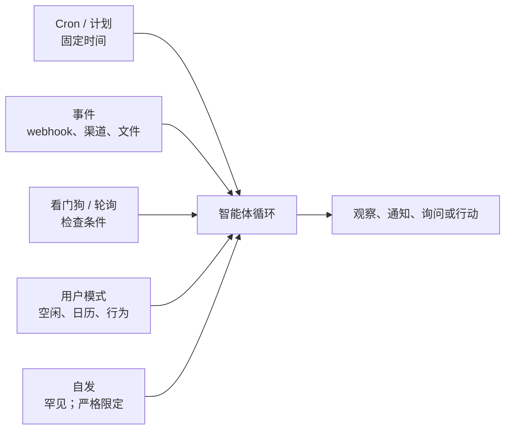

# 第20章 — 主动智能体

## TL;DR

本课程的大部分内容假设了反应式形态：用户消息到达，智能体循环运行，响应返回。主动智能体在*没有用户请求时*执行工作——定时 cron 任务、事件驱动的唤醒、对外部状态变化做出反应的看门狗、后台整理，以及罕见的自发任务。机制大多在前面的章节已经熟悉了（第8章的运行状态机、第13章的渠道适配器、第15章的心跳调度器），但设计原则是真正新颖的：何时打断 vs 排队 vs 摘要，如何设计选择加入语义使主动性有帮助而非烦人，从通知到询问再到行动的升级阶梯，无人看管时工作特有的失败模式，以及主动性是用户*按类别*授予的权限——永远不是默认值。

---

## 为什么重要

反应式智能体最糟糕的失败是一个错误答案。主动智能体最糟糕的失败是三件事之一：*错误的行动*没有人在场阻止，*成本螺旋*没有人在监控，或*通知洪流*训练用户忽视来自智能体的一切。每种都是在同步请求-响应系统中不会出现的事故类别；如果不使用本章的原则就发布主动功能，每种都是可预测的失败模式。

它重要的另一个原因：主动功能是"用户想起时打开的工具"和"成为用户工作方式一部分的智能体"之间的区别。每天早上九点的简报、标记部署失败的看门狗、总结本周 PR 的 cron 任务——这些是智能体赢得其位置的时刻。做得好，它们会复合用户的信任。做得不好，它们会在一周内挥霍掉信任。

---

## 核心概念

### 反应式 vs 主动式——何时适用

大多数智能体从反应式开始并保持反应式。只有当以下条件之一成立时才添加主动形态：

- 用户有**反复出现的需求**，每次不需要他们的注意——每日报告、每周摘要、定期健康检查。
- 世界上的某事**发生了变化**，用户需要在几分钟内（而不是几小时内）知道——部署失败、指标越过阈值、来自被监控发件人的电子邮件到达。
- 工作本身在用户*不在*时做最好——后台整理、评估运行、空闲窗口训练（第21章会接起这个话题）。

如果以上都不成立，就不要添加主动形态。*主动性是功能；空转运行是成本。*

### 触发类型

五种触发类型几乎涵盖了所有生产主动工作：



- **Cron / 计划。** 固定时间——每个工作日早上九点，每小时整点。最简单最可预测；适用于常规反复任务。
- **事件驱动。** webhook 触发（第13章）、渠道消息到达、文件改变、日历事件触发。最响应迅速；感觉智能，因为它对世界而不是时钟做出反应。
- **看门狗 / 轮询。** 智能体定期检查条件（价格、队列深度、状态页面），只在满足条件时才行动。当源系统不发送事件时有用。
- **用户模式触发。** 智能体注意到行为模式——用户空闲、有日历空档、N 小时未回应——并提供帮助。最难做对；最容易令人烦恼。
- **自发。** 罕见。智能体在没有触发的情况下自行决定某事值得做。保留给严格限定的、低风险的操作（第7章的后台策展人就是一个）。

大多数真实系统组合了两种或多种。*Cron + 事件*是最常见的组合：检查某事的 cron 任务，加上特定事情发生时触发的事件处理器。

### Cron——主力

三件事将有效的 cron 与无效的 cron 区分开来：

- **持久化的任务定义。** Hermes Agent 将 cron 任务存储在调度器每次 tick 读取的 `~/.hermes/cron/jobs.json` 文件中。Paperclip 将例程存储在能在重启后存活的 Postgres `routines` 表中。OpenClaw 将它们保存在配置中。存储必须在进程重启后存活——其他任何方式都会在重新部署时丢失已调度的工作。
- **未触发策略。** 当任务的调度时间在进程停机期间过去时会发生什么？三个选项——*恢复时触发一次*（立即运行）、*跳过*（视为已运行）、*触发每个错过的实例*（通过对每个错过的窗口运行一次来追赶）。明确选择一个；许多 cron 库中的默认值是实现定义的，令人困惑。
- **幂等性。** 在执行中途崩溃后重新触发的 cron 任务不应该做两次工作。使用从 cron 表达式加计划时间派生的运行键；在执行前对其进行去重。第8章的发件箱模式在这里可以直接应用。

```ts
// 在重启后存活并避免重复触发的 Cron 任务形态。
type CronJob = {
  id:           string;
  agent:        string;          // 哪个智能体 profile 运行该任务
  schedule:     string;          // cron 表达式
  missedFire:   "skip" | "once_on_recovery" | "fire_each";
  payload:      unknown;         // 智能体应该做什么
  enabled:      boolean;
  createdAt:    string;          // 第一个调度窗口的锚点
  lastFiredAt?: string;
  ownerUserId:  string;          // 用于租户范围和审计（第5章、第15章）
};

function runKey(job: CronJob, scheduledFor: Date): string {
  return sha256(`${job.id}:${scheduledFor.toISOString()}`).slice(0, 32);
}

async function maybeFireCron(job: CronJob, now: Date, ctx: SchedulerCtx) {
  // 从最后触发的窗口锚定下一个，或者对于从未触发的任务——
  // 从 createdAt 锚定。从 `now` 计算会默默跳过从创建
  // 到现在之间本应触发的每个窗口，这对于"跳过"以外的
  // 任何未触发策略都是错误的。
  const anchor = job.lastFiredAt ?? job.createdAt;
  const next   = nextScheduledTime(job.schedule, anchor);
  if (next > now) return;

  const key = runKey(job, next);

  // 原子声明：去重记录、队列插入和 lastFiredAt
  // 更新在一个事务中提交。没有原子性，崩溃在
  // 入队和记录之间会在恢复时重新触发任务——
  // 这是一个可能不安全重复的副作用的双重执行
  // （第8章的发件箱模式是同样的形态，但更通用）。
  await ctx.db.transaction(async (tx) => {
    const claimed = await tx.dedup.tryClaim(key);   // 如果键已存在则为 false
    if (!claimed) return;
    await tx.runs.enqueue({ agent: job.agent, payload: job.payload, runKey: key });
    await tx.cron.markFired(job.id, next);
  });
}
```

锚点与未触发策略交互：`fire_each` 从 `createdAt` 向前走，并为每个错过的窗口声明一个键；`once_on_recovery` 声明一个，无论错过了多少窗口；`skip` 将 `lastFiredAt` 推进到最近的过去窗口而不触发。每租户隔离在这里也很重要：租户 A 的 cron 任务针对租户 A 的数据运行，计入租户 A 的预算（第15章），记录在租户 A 的日志中（第5章）。一个租户的失控 cron 永远不应该阻塞另一个租户的。

### 事件驱动的唤醒

事件触发器基于第13章的连接器层。三种形态：

- **Webhook 触发器。** 平台在事件发生时触发 HTTP 回调——Slack 消息、Stripe 事件、GitHub 推送。来自第13章的 webhook 处理器（HMAC + 去重 + 先202再排队）将事件传递给智能体循环。智能体将其视为 `ChannelEvent`——与用户消息形态相同，语义不同。
- **渠道事件订阅。** Discord WebSocket、Slack 事件 API、IMAP 推送通知。渠道适配器保持开放连接，事件到达时排队。
- **文件系统或存储监听器。** `inotify`、S3 桶通知、云存储触发器。当文件被创建或修改时监听器触发；智能体检查并决定是否行动。

跨所有三种情况保持的原则：事件通过与用户消息相同的队列（第15章），这样智能体的循环、可观测性和预算执行统一工作。*事件只是用户没有键入的消息。*

### 看门狗和轮询

当源系统不发送事件时，智能体进行轮询。三条规则：

- **将节奏与波动性匹配。** 每秒轮询一次的价格监控者是浪费；每小时轮询一次的部署状态轮询器太慢。选择与源变化率和消费者延迟预算匹配的节奏。
- **在稳定时退避。** 当被监控的值一段时间没有变化时，增加轮询间隔。当它改变时，回落到基线。节省源系统免受不必要的负载。
- **将监控本身作为指标展示。** 第16章的可观测性模式适用——轮询器为每次检查发出一个 span，一个*值改变*的计数器，一个轮询延迟的直方图。静默的轮询器是你无法信任的轮询器。

Paperclip 的 `scanSilentActiveRuns`（第15章）是看门狗应用于智能体*本身*的——检查输出超过阈值的运行并升级。同样的模式外部应用：智能体监控系统，在某些东西偏离时升级。

### 选择加入语义——主动性是一种权限

最重要的一条规则：*主动性是用户按类别授予的权限，不是默认值。* 用户不应该需要静音他们的智能体；他们应该需要选择加入被打断。

```ts
// 粗粒度的权限记录。按类别，不按消息。
type ProactivePermission = {
  category:       string;        // "daily_brief"、"deploy_alerts"、"weekly_summary"
  enabled:        boolean;
  channel:        "inline" | "email" | "slack" | "push";
  frequencyCap?:  { count: number; per: "hour" | "day" | "week" };
  quietHours?:    { start: string; end: string; timezone: string };
  snoozeUntil?:   string;
};

// 在发送主动通知之前，检查所有门控。
async function shouldNotify(
  user: User,
  category: string,
  now: Date,
  ctx: ProactiveCtx,
): Promise<boolean> {
  const perm = await ctx.permissions.get(user.id, category);
  if (!perm?.enabled)                                           return false;
  if (perm.snoozeUntil && now < new Date(perm.snoozeUntil))    return false;
  if (perm.quietHours && isInQuietHours(now, perm.quietHours)) return false;
  if (perm.frequencyCap) {
    const sent = await ctx.notifyLog.countRecent(
      user.id, category, perm.frequencyCap.per,
    );
    if (sent >= perm.frequencyCap.count) return false;
  }
  return true;
}
```

类别是粗粒度的，不是每消息的——用户选择加入*部署警报*一次，不是加入每次部署。渠道是每类别的——紧急的内联，摘要的电子邮件。频率上限和安静时间防止智能体在启用类别内违反隐含期望。

诚实的框架：每个主动功能默认*禁用*，该功能的智能体第一项工作是询问用户是否想要它。*惊喜是信任的敌人。*

### 时机智能——打断、排队或摘要

对于每个主动事件，三种时机选择：

| 模式 | 何时使用 | 成本 | 示例 |
|---|---|---|---|
| **立即打断** | 高紧迫性、有时限价值 | 用户注意力 | 生产部署失败 |
| **排队到下一个会话** | 有用但不紧急 | 小认知待办 | 周一要审查的新 PR |
| **摘要** | 聚合有用，单独价值低 | 每个项目为零 | 每日邮件摘要 |

大多数主动功能的默认应该是*摘要*。只对用户明确告诉你值得打断的事情进行打断。即使在会话内，也将相关通知批量处理——五个一起发送的 PR 评论比五个单独的 ping 干扰更少。

MetaClaw 的空闲窗口调度器（第21章的自我进化章节会更深入）是应用于训练的时机智能：繁重工作在睡眠时间、键盘空闲时、日历空档运行。同样的原则适用于任何主动工作——*在用户不关注其他任何事情时做它。*

### 升级阶梯

对于任何类别的主动行动，智能体有四个台阶可以选择：


- **观察。** 只是记录事件。没有用户可见的面。对于构建后续台阶的数据集很有用。
- **通知。** 在摘要或低优先级渠道中呈现。用户看到了；没有代表他们采取行动。
- **询问。** 作为主动提示呈现。用户决定是否行动；智能体的工作是让决策变得容易。
- **行动。** 智能体直接采取行动。只有当用户之前选择加入了此类别的自主行动、行动可逆，且审计日志记录了它（第5章）时才有效。

一个有用的规则：*从观察开始，赢得攀登的权利。* 新的主动功能仅以观察模式交付，直到你有数据表明用户想要下一个台阶。然后通知。然后询问。然后——只有明确选择加入和回滚原则——行动。

### 通知设计和洪水问题

主动智能体最可预测的失败是通知洪流。三个防御：

- **每类别的频率上限。** 每小时五个 Slack ping 是烦人的；一个是受欢迎的。上限化并将其余的排进摘要。
- **自适应节奏。** 当用户连续 N 次忽略通知时，放慢速度。明确询问是否继续启用此类别。
- **暂停和静音作为一等操作。** 每个通知都携带一个*安静到稍后*控件。用户选择暂停是信息——记录它并让它影响节奏。

成熟通知系统（Slack、GitHub、Linear）的模式：每次用户不参与时通知获得更少关注。从非参与中学习的主动智能体是用户保留的；不学习的是用户静音并忘记的。

### 无人值守工作的权限和审批

第12章的审批门控假设用户在那里点击。主动工作打破了这个假设。三种策略：

- **预审批类别。** 用户明确启用的任何内容（上面的选择加入）每次执行不需要进一步审批——*前提是*行动是有边界的、无破坏性的、可逆的。类别级别的*是*永远不会绕过第12章对破坏性行动的审批门控（删除、发送、扣费、部署）；即使在预审批类别内，这些仍然是每实例的。参见下面的*不应该主动化的事情*以了解始终升级的残余列表。
- **异步审批。** 智能体提议行动，通过允许延迟响应的渠道（Slack、电子邮件、手机推送）呈现，在行动前等待审批。有界的——如果 N 小时内没有响应，默认为*不行动*并记录超时。
- **默认拒绝。** 任何不在预审批类别中且未询问并回答的内容都不运行。句号。

要避免的陷阱是*隐含同意*——*"用户一周都在忽略我的主动邮件，这意味着没问题。"* 不对。缺乏异议不是批准。如果一个类别没有产生价值，向用户呈现这一点，并询问是否禁用它。

### "没有用户在看"的失败模式

主动工作特有的三类失败：

- **静默错误。** 一个 cron 任务已经失败了两周；没有人注意到，因为没有人手动运行它。防御：每个主动运行发出一个 span（第16章），连续失败时发出警报。
- **成本螺旋。** 看门狗每30秒轮询一年；没有人看到账单，直到它到来。防御：每租户预算门控（第15章）同样适用于主动运行*和*交互式运行。在成本仪表板中展示趋势（第16章）。
- **失控循环。** 自发智能体产生产生更多子智能体的子智能体。第10章的递归上限和第2章的步骤上限适用，但对于主动工作，限制应该比交互式*更严格*——用户不在那里打断。

一个有用的生产细节：每个主动运行在其 trace 上携带一个标签（`triggered_by: cron | event | watchdog | pattern | self`）。仪表板按触发类型分割。当出现问题时，你知道是用户启动了它还是系统启动了它。

### 不应该主动化的事情

反向列表，按风险类别：

- **破坏性行动。** 任何删除、发送、扣费、部署的操作。即使在预审批类别内，也始终要求每实例的明确用户决策。
- **跨租户操作。** 租户 A 的主动运行永远不应该触及租户 B 的数据。第6章的命名空间规则是不可商量的。
- **不可逆的副作用。** 如果无法回滚，就不要让智能体自行做。
- **用户没有先看到的任何事情。** 如果一个类别从未向用户演示过，且没有用户明确的*是的，请自行运行*，它就不应该自行运行。

一个有用的规则：*如果行动在用户看到结果时会让合理的用户说"等等，什么？"，它就不应该主动运行。*

---

## 真实系统注释

- **Hermes Agent** 是文件支持的 cron 和后台策展人模式的最强参考：带文件锁定 tick 调度器的 `~/.hermes/cron/jobs.json`、用于轮次后主动整理的 `spawn_background_review_thread`，以及用于空闲时技能生命周期管理的 `maybe_run_curator`。在执行前会扫描 cron 任务是否有 prompt 注入模式——主动运行比交互式运行有更严格的安全门控（第18章）。
- **Paperclip** 是编排级主动调度的参考：心跳调度器每30秒 tick 一次，`routineService.tickScheduledTriggers` 触发到期的基于 cron 的例程，`scanSilentActiveRuns` 看门狗检测卡住的智能体，重试延迟从2分钟升级到2小时。每公司预算门控适用于所有运行，无论触发类型。
- **OpenClaw** 是渠道事件驱动的主动工作参考：渠道插件持有自己的订阅（Discord WebSocket、Slack 事件、Telegram 轮询），事件通过与用户消息相同的网关。默认情况下，cron 任务以完整工具访问权限运行——这是一个有用的对比，说明当主动运行需要更严格的信任边界时*不应该*做什么。
- **OpenCode** 主要是反应式的（用户发起的编码会话），但其会话事件 SSE 流和快照系统是学习如何向连接的 UI 展示主动活动的有用研究。

---

## 下一步

你现在拥有了主动设计的框架——触发分类法、选择加入原则、升级阶梯、时机模式，以及无人看管时工作特有的失败模式。第21章从相关角度接起：与其*智能体自行行动*，如果*智能体自行改善自己*呢？自我进化的智能体——记忆整合、技能学习、prompt 优化、LoRA 个性化——是主动调度的自然补充，具有相同的门控原则和第7章的回滚路径。
