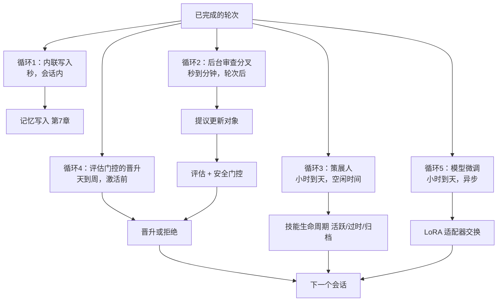
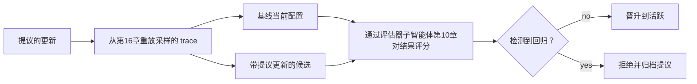
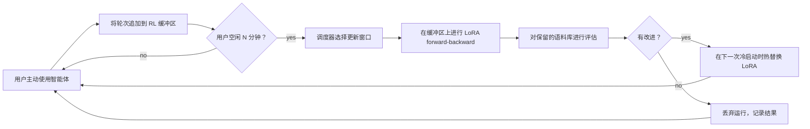

# 第21章 — 自我进化的智能体

## TL;DR

自我进化的智能体在运行之间更新自己的记忆、技能、prompt、工具描述或甚至模型权重——将昨天的经验转化为明天的能力。做得好，智能体在循环中不需要人工干预就能稳定提升。做得不好，它会偏离、污染自己的记忆，或悄悄重写安全控制。使这一切安全的原则完全由早期章节构建的模式组成：提议更新对象而非直接写入、评估器子智能体审查提议、supersedes 链回滚、评估门控的晋升，以及*允许进化的内容*与*保持在人工变更控制下的内容*之间的严格界限。本章涵盖完整的循环、最近的研究面（MetaClaw、Tinker、agentskills.io 联合技能库和基于 LoRA 的个性化），以及防止进化变成突变的规则。

---

## 为什么重要

永远不学习的智能体会重复其错误——在每个会话中重新发现相同的项目约定，重新失败相同的工具调用，重新运行相同的搜索。没有护栏地更新自己的智能体更糟糕：它可以污染自己的记忆，削弱工具，从一次糟糕的轮次中学到错误的教训，或悄悄积累相互冲突的技能。

目标是*受控的适应，而不是自主的突变。* Hermes Agent 的后台审查分叉是受控版本的最清晰生产参考——以下的循环1到3，现在已在发布中。MetaClaw（2025年的框架，用持续 LoRA 微调和技能进化包裹个人智能体）是更雄心勃勃的版本之一的最早参考——循环5，研究级别，在少数系统中发布。两者都有效——都有效是因为每次更新都经过人类或框架控制的门控。

---

## 核心概念

### 进化实际上意味着什么

智能体有五层可以进化，各自以自己的节奏，有自己的门控。前两层在生产中是通用的；后三层在2026年是研究级别的，在少数系统中发布。

| 层次 | 改变的内容 | 节奏 | 门控 | 示例 |
|---|---|---|---|---|
| **记忆** | `MEMORY.md`、`USER.md`、结构化事实 | 每会话或后台 | 安全过滤器（第7章）；策展人 | Hermes Agent 后台审查 |
| **技能** | 模型可以调用的命名过程（第14章）| 后台策展人 | 策展人生命周期（第7章）| Hermes 的 `skill_manage`；MetaClaw 技能库 |
| **Prompt 段落** | 项目上下文、词汇表、偏好 | 手动或策展人提议 | 评估门控（第16章、第17章）| OpenCode 的 `plan.md`；智能体 profile 覆盖 |
| **工具描述** | 措辞、示例、"不用于"行 | 手动；很少自动化 | 缓存失效（第4章）；变更审查（第19章）| 每工具描述编辑 |
| **模型权重** | LoRA 适配器、RL 微调权重 | 小时到天，异步 | 评估套件 + 金丝雀 | MetaClaw + Tinker；在策略蒸馏 |

其他一切——安全策略、工具注册表组合、密钥访问、审批阈值——保持在明确的人工变更下（第19章变更管理）。界限是明确的：*低爆炸半径、可逆输出可以进化；任何扩展权限的东西都不行。*

### 五循环进化架构

自我进化不是一个循环，而是在不同时间尺度上的五个重叠循环。生产系统有意地组合它们。



- **循环1 — 内联写入。** 智能体在会话中调用 `memory.write`。最便宜，最有风险。保留给用户刚刚陈述的事实。
- **循环2 — 后台审查分叉。** 守护子智能体（Hermes Agent 的规范模式）审查刚完成的记录，并提议记忆或技能更新。非阻塞；写入在*下一个会话*可见。
- **循环3 — 策展人。** 一个独立进程在空闲时运行，整理技能库（第7章的活跃 → 过时 → 归档），整合重复项，并修剪索引。
- **循环4 — 评估门控的晋升。** 来自循环2或3的任何提议更新在被激活前都必须通过一个小型评估套件。门控防止*看起来合理但错误*的更新生效。
- **循环5 — 模型微调。** 最新的循环。对话成为训练样本；LoRA 适配器（Tinker、MinT、Weaver）更新模型权重本身。异步；在空闲窗口期间发生。

你不需要所有五个。大多数智能体发布循环1到3。循环4是将生产级进化与聪明的演示进化区分开来的因素。循环5是前沿。

### 后台审查分叉——规范模式

Hermes Agent 的 `spawn_background_review_thread` 是循环2最清晰的参考。在满足推送阈值的成功、未中断的轮次后，框架用三个约束分叉一个守护子智能体：

- **受限工具白名单** — 通常只有 `{memory, skill_manage, skills_list, skill_view}`。审查分叉不能执行、在记忆之外写入或调用外部 API。
- **接收已完成的记录**加上审查 prompt（Hermes 的 `_MEMORY_REVIEW_PROMPT` 和 `_SKILL_REVIEW_PROMPT`）。
- **写入原子地写到磁盘，在下一个会话可见，而不是这个**——第4章缓存规则的再次应用于写入：正在运行的 prompt 不能在飞行中改变。

```ts
// 后台审查分叉——非阻塞；写入在下一个会话可见。
async function spawnBackgroundReview(completed: CompletedTurn, ctx: HarnessContext) {
  if (!completed.successful || completed.interrupted)            return;
  if (!ctx.policy.meetsNudgeThreshold(completed))                return;

  spawnDaemon(async () => {
    const reviewer = ctx.subagents.fork({
      profile:        "memory_curator",                          // 第10/14章
      tools:          ["memory", "skill_manage", "skills_list", "skill_view"],
      model:          "auxiliary_cheap",                          // 第17章
      systemPrompt:   ctx.prompts.memoryReviewPrompt,
      maxSteps:       5,
    });
    const proposals = await reviewer.run({ transcript: completed.transcript });
    for (const p of proposals) await ctx.evolution.submitProposal(p);
  });
}
```

这个模式*在构建上就是低爆炸半径的。* 即使审查者对每个提议都是错的，框架仍然在应用每个提议前对其进行门控。即使提议通过了门控，它也可以通过 supersedes 链回滚。主循环继续畅通——用户永远不会等待进化。

### 技能编译——将观察到的过程转化为命名技能

当智能体可靠地以相同顺序运行三四个工具来处理反复出现的任务时，这个序列就是一个*等待被命名的技能*。这个模式现在在编码和助手智能体中是标准的：

- 在多次运行中观察一个成功的过程。
- 命名它：清晰的 `name`、`description`、有序步骤、先决条件。
- 将其保存为带有 YAML 前置数据的 markdown 技能文件（第14章的形态）。
- 加载到下一个会话的技能索引中；模型在需要时调用 `skill_view(name)` 读取正文。

Hermes Agent 的策展人正是这样做的——它从观察到的序列提议新技能，评估门控决定它们是否晋升到活跃索引。MetaClaw 的*技能注入与进化*模块是同样的循环，带有明确的每会话摘要：每次对话都贡献潜在的技能候选，进化者 LLM 将其合成到库中。

使这一切安全的原则：技能是*添加*的，而不是编辑的。如果智能体想要更改现有技能，它提议带有版本升级前置数据的新版本；之前的版本被归档，而不是被覆盖。第7章的 supersedes 链直接适用。

### 提议更新对象

自我进化中最重要的一个模式：*智能体提议；框架处置。* 智能体不直接写入记忆或技能——它发出结构化提议，框架验证、门控，然后要么应用要么拒绝。

```ts
type ProposedUpdate = {
  id:                string;
  kind:              "memory" | "skill" | "prompt_section" | "tool_description" | "lora_weight";
  targetId?:         string;                            // 要更新的现有条目
  patch:             string;                            // diff 或新内容
  rationale:         string;                            // 智能体为什么提议这个
  proposedByRunId:   string;                            // 第5章审计日志链接
  proposedByLoop:    "inline" | "background_review" | "curator" | "fine_tune";
  risk:              "low" | "medium" | "high";
  reversibility:     "instant" | "next_session" | "requires_redeploy";
  evalRequired:      boolean;
  evalResults?:      { baseline: number; candidate: number; delta: number };
  status:            "proposed" | "evaluating" | "approved" | "rejected" | "applied" | "rolled_back";
};
```

这个原则重要的三个原因：

- **原子审计。** 每次更改都是一个明确的对象，有来源运行、理由和可逆性级别。事后检查可以在一次查询中回答*谁建议了这个，为什么？*
- **可组合的门控。** 同一个提议流经安全过滤器（第7章）、评估门控（第16/17章）和审批门控（第12章），而每个门控不了解其他的。
- **在构建上可逆。** 回滚是"将 `status` 设置为 `rolled_back`，并重新激活之前的版本"——无需考古，无需猜测，没有使存储处于不一致状态的风险。

### 评估门控的晋升

在提议更新激活之前，运行一个小型评估套件，将提议的配置与基线进行比较。这是第16章评估即可观测性模式特别应用于自我进化的。



来自生产的三条规则：

- **使用评估器子智能体**（第10章的验证模式）对固定的评估语料库，而不是对产生提议的相同 trace。否则你是在对提议者自己的例子进行评估。
- **逐步晋升。** 如果技能更新通过了评估，先在 5% 的会话中激活；一天后没有问题的信号扩大到 25%；只有在一周后才全面推出。
- **在回归时自动回滚。** 第16章的成本异常模式也适用于质量：如果晋升后的评估分数比基线下降超过 5%，回滚并将提议呈现给人工审查。

这个模式将智能体的自我改进与捕获模型升级和 prompt 编辑（第17章、第19章）的相同评估流水线对齐。重用流水线使进化在运维上可管理。

### 版本控制和回滚——supersedes 链

每个已应用的更新都获得一个版本、一个来源提议 ID，以及一个指向前一个版本的指针。第7章为记忆引入了 supersedes 链；同样的形态适用于技能、prompt 段落，甚至 LoRA 权重。

```ts
type VersionedArtifact = {
  artifactId:        string;          // 跨版本稳定
  version:           number;          // 单调递增
  content:           string;          // 实际的技能正文、记忆条目、prompt 段落
  createdAt:         string;
  createdBy:         "user" | "agent" | "curator" | "fine_tune";
  sourceProposalId?: string;          // 链接回 ProposedUpdate
  supersedes?:       string[];        // 这个版本替换的版本
  status:            "active" | "stale" | "archived";
};
```

回滚是机械的：重新激活前一个版本，将当前版本标记为 `archived`，记录操作。没有手术，没有特殊情况，没有使存储处于不一致状态的风险。*如果你不能回滚一个更新，你就不能让智能体自动提议它。*

### RL 个性化——新的前沿

2025-2026年使自我进化真正强大的发展：从生产对话异步进行的 LoRA 模型权重微调，在活跃会话之间运行。参考系统：

- **Tinker**（Thinking Machines Lab，2025年）——带有 `forward_backward` 和 `sample` 原语的参数高效微调 API。多个训练运行通过 LoRA 共享计算。支持带有多轮工具使用的自定义 RL 循环。
- **MetaClaw**（Aiming Lab，2025年）——位于用户和个人智能体之间的透明代理。三种模式：仅技能（无 GPU）、RL（持续微调）和自动（带空闲窗口调度的 RL）。过程奖励模型异步评分响应；LoRA 适配器无需重启即可热替换。
- **在策略蒸馏（OPD）**——将更大教师模型的每 token 对数概率蒸馏到更小的 LoRA 学生中，MetaClaw 用于廉价质量提升。

每个 RL 个性化系统收敛的架构：

- **对话成为训练样本。** 每个轮次——输入、输出、工具调用、结果——被记录到缓冲区中。
- **异步评判者对响应评分。** 一个独立的评估者（通常是更强的模型）用奖励信号标记每个样本。
- **LoRA 适配器离线微调。** 调度器定期从缓冲区拉取一批，运行 `forward_backward`，并写入更新的适配器权重。
- **适配器在会话边界热替换。** 智能体在下一次冷启动时加载新适配器；正在进行的会话保持其当前权重。

在这些系统中保持的两条安全规则：

- **微调后的适配器必须通过与任何其他提议更新相同的评估门控。** 评估分数下降会回滚适配器——与技能和记忆相同的 supersedes 链。
- **基础模型不变。** 个性化发生在适配器层；你总是可以回退到基础。想要这种控制的运营者应该使用 LoRA，而不是全量微调。

循环5的任何生产部署还有两个同等重要的同意和策略问题——它们不是架构性的，但对于任何生产部署都是非可选的：

- **用户对训练的同意。** 上面的每个个性化方案都将生产对话转化为训练数据。用户必须同意——在法律意义上明确地——在他们的内容被用于此目的之前。第20章的类别级别选择加入框架是捕获它的架构支柱；法律解释（在你的司法管辖区什么算作同意、是否必须是细粒度的、是否必须可以撤销并删除）是第18章的领域。将"我们将使用你的对话来改进智能体"视为第12章形态的明确询问，而不是隐藏条款。
- **提供商条款。** 一些模型 API 禁止使用其输出来训练其他模型——包括从这些输出派生的 LoRA 适配器。在围绕循环5设计之前，阅读底层模型的服务条款；违反上游提供商条款的个性化栈距离被关闭只有一次策略更新，而这不是你想在发布后才发现的失败模式。

### 元学习调度器——在空闲窗口期间更新

MetaClaw 最有趣的贡献是*元学习调度器*：微调在睡眠时间、键盘空闲时间或预定的日历空档期间发生。这防止用户等待训练，并避免始终在线 GPU 时间的成本。



对于在用户机器上运行的智能体（前置部署，第19章），空闲窗口调度是 RL 个性化在实践中可行的唯一方式——GPU 是用户的，训练不能阻塞他们的工作。对于云托管的智能体，同样的模式控制成本：在非高峰时段训练成本更低，与服务的竞争也更少。

### 联合技能库——agentskills.io 和市场

技能是带有前置数据的 markdown 文件。它们是非常容易分享的。将其变成真实模式的 2024-2025 年发展：`agentskills.io`，一个用于发布和拉取版本化技能的中心，GitHub App 认证，带有语义版本风格的版本固定。

Hermes Agent 提供一流集成：`hermes skills install <name>` 从中心拉取；`hermes skills push <name>` 将本地技能发布回来。使这一切安全使用的原则：

- **从中心导入的技能仍然是提议的更新。** 它们经过与智能体提议的相同门控——评估套件在激活新技能前运行。
- **固定版本，不浮动。** 安装中的 `version: 1.2.0`，而不是 `version: latest`。中心侧的回滚是一回事；你安装的版本才是真相。
- **来源在导入后存留。** 技能携带关于其来源的元数据；审计日志（第5章）记录安装操作；如果技能使用减少，策展人（循环3）以后可以将其归档。

同样的中心模式扩展到评估器子智能体、计划模板，以及（当 LoRA 适配器变得可以通过中心分发时）个性化权重本身。

### 不应该自动化的内容

自我进化应该使智能体在其工作上更好，而不是默认更强大。将这些保持在手动变更下（第19章的变更管理原则）：

| 层次 | 为什么不自我进化 |
|---|---|
| 安全和策略 | 约束的自我修改正是失败模式（第18章智能体失准）|
| 工具注册表组合 | 添加工具改变能力面；需要人工审查 |
| 权限规则和审批阈值 | 放松这些正是攻击者想要的 |
| 密钥访问模式 | 即使是读访问也改变了威胁模型 |
| 生产部署规则 | 在智能体的爆炸半径之外 |
| 模型提供商选择或回退链 | 运维决策，不是可学习的 |
| 成本预算执行 | 智能体总是想要更高的预算 |

一个有用的规则：*如果变更使智能体更谨慎、更窄或更透明，自动化就可以。如果它使智能体更广泛、更自信或更难审计，它就保持手动。*

### 漂移问题和漂移检测

已经自我进化了1000次会话的智能体是一个不同的智能体。它的记忆已经整合，它的技能已经增殖，它的 prompt 已经积累了上下文。没有检测，你只会在用户抱怨时才注意到。

三个具体防御，全都组合了前面章节：

- **在智能体初始化时对评估基线进行快照。** 对新鲜智能体运行评估套件（第16章）；保存分数。每N个会话，重新运行套件；如果分数下降超过阈值则发出警报。
- **限制技能和记忆增长。** 策展人（循环3）归档30/90天内未使用的条目（第7章）。记忆大小预算（第6章）将总存储在前缀的记忆限制在10-20 KB。如果任一上限绑定，则触发运营者审查。
- **定期基线重置选项。** 运营者应该有一个单命令*重置记忆并只重新导入固定技能*的路径。很少使用；没有版本控制就不可能。Hermes Agent 的策展人状态文件使这成为单一的归档操作。

诚实的框架：漂移不是要修复的 bug，而是要管理的属性。一些漂移是智能体在学习你的项目；一些漂移是智能体忘记了它应该做什么。评估门控和快照是你区分两者的方式。

### 影子进化——晋升前的并行测试

评估门控晋升的更保守版本：在N个真实会话中*并行*运行候选配置与生产智能体，比较结果，只在达成一致时晋升。这是评估门控离线近似的内容；影子进化在实时中做到。

OpenCode 的会话分叉原语给你提供了构建块：分叉会话，运行候选，对照实时智能体的输出进行评分（特定 API 随时间推移有所变化；在项目的会话模块中检查当前方法名称）。Hermes Agent 和 OpenClaw 可以针对同一网关建立并行智能体实例。这个模式在今天的生产中不常见——运维复杂性是非微不足道的——但对于高风险进化来说，它是离线评估门控之后的自然下一步。

### 基于种群的进化——罕见，但值得了解

谱系的远端：维护一个智能体变体的*种群*——不同的 prompt、不同的技能集、不同的微调适配器——让它们在真实工作负载上竞争。得分高的变体传播；得分低的退役。ADAS 等研究论文和更广泛的"智能体即基因组"文献探索了这一点；生产系统尚未实现它，主要是因为运维复杂性超过了当前工作负载的收益。

值得在第22章的设计画布中了解——如果你的工作负载真正多样化，且你有工程预算，基于种群的进化可以超越单智能体进化。对于其他所有人，上面的五循环架构是实际的视野。

---

## 真实系统注释

- **Hermes Agent** 是循环1到3加技能中心集成的最强生产参考：`spawn_background_review_thread` 用于轮次后审查分叉，`agent/curator.py` 用于空闲时技能生命周期管理器，`agentskills.io` 中心集成用于联合技能，记忆边界处的威胁模式扫描（第7章），以及固定版本的技能安装。它目前*不*发布循环5（模型权重进化）；那个前沿位于 MetaClaw 和基于 Tinker 的栈中。
- **MetaClaw**（Aiming Lab，2025年；查看项目 README 了解当前状态）是循环5的最早开放参考之一：个人智能体前面的透明代理，三种模式（仅技能 / RL / 自动），通过 Tinker/MinT/Weaver 风格后端的 LoRA 微调，用于廉价质量提升的在策略蒸馏，将训练推迟到空闲窗口的元学习调度器。值得作为迄今最发达的脑启发持续学习表达来阅读——但将其视为研究级别架构，而不是生产默认值。
- **OpenCode** 提供了基础原语——用于影子进化的会话分叉、带父会话链的会话压缩（第5章）、用于版本化 schema 的 Drizzle 迁移——但默认不运行自我进化循环。是建立一个的强大基础。
- **Paperclip** 是治理角度：每个自提议的更新都是带有 `approval` 流程的 `issue`，经过审计、可逆，并在运营者仪表板中可见。对于自我进化需要明确签署而非只是评估门控的组织来说，这是正确的形态。

课程外的一个指针：Anthropic 关于*后训练*的写作和 Thinking Machines Lab 对*Tinker* 的公告是了解基于 LoRA 的个性化走向何方的最佳简短读物。

---

## 与你的智能体配对

- *"清点我的智能体中当前进化的内容 vs 硬编码的内容。对于五循环架构中的每一层（记忆、技能、prompt 段落、工具描述、模型权重），告诉我我拥有哪些，缺少哪些，以及我明确*不*应该自动化哪些。"*
- *"实现 Hermes Agent 的后台审查分叉模式：在满足推送阈值的每次成功轮次之后，使用工具白名单 `{memory, skill_manage, skills_list, skill_view}` 产生一个守护子智能体，让它提议更新，并通过本章的提议更新对象提交它们。"*
- *"构建带有所有字段的提议更新对象：id、kind、patch、rationale、来源运行 ID、风险、可逆性、评估结果、状态。将安全过滤器（第7章）、评估门控（第16章）和审批门控（第12章）作为提议流上的可组合中间件接入。"*
- *"连接评估门控的晋升：对于每个提议，从我的第16章语料库通过基线和候选配置重放20个 trace。用评估器子智能体（第10章）评分。只在没有 > 5% 的回归时晋升。逐步推出（5% → 25% → 100%），在质量下降时自动回滚。"*
- *"将 supersedes 链添加到技能和 prompt 段落。验证回滚是一次操作。端到端运行一次*提议 / 应用 / 检测回归 / 回滚*演练。"*
- *"设置漂移检测：在智能体初始化时对评估基线进行快照，每50个会话重新运行，当最近的平均值比基线下降5%时发出警报。将*重置记忆并只重新导入固定技能*作为单命令运营者操作呈现。"*
- *"如果我想用 Tinker 或 MetaClaw 尝试 LoRA 个性化，引导我完成集成：对话如何进入缓冲区，评判者如何评分，调度器如何选择空闲窗口，适配器如何在会话边界热替换。向我展示防止糟糕适配器被晋升的评估门控。"*
- *"审计我即将让智能体自我修改的内容。对于每一层，应用*更谨慎、更窄、更透明 vs 更广泛、更自信、更难审计*规则。标记任何失败的内容。"*

---

## 下一步

你现在拥有了完整的智能体 + 集成 + 扩展 + 可见性 + 经济 + 安全 + 运维 + 主动性 + 进化脊梁。二十一章之后，问题变成了：你自己的智能体需要什么来发布？第22章以设计画布结束课程——一种将第1到21章的所有内容转化为你的项目的具体形态的结构化方式：类型、有边界的工具集、规划模式、记忆层、部署拓扑、安全控制、主动触发器、进化策略。减少阅读；多做决策。
