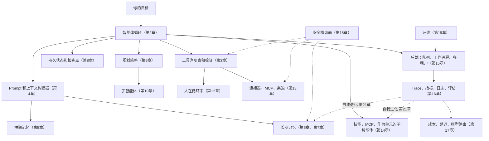

# 第22章 — 设计你自己的智能体

你已经阅读了二十一章。这一章不同于其他章节。它是一个设计画布——一种将第1章到第21章的所有内容转化为*你的*项目具体形态的方式。以意图为先，而非架构：用例、目标、范围、预算、用户、成功标准、最坏情况的错误。一旦意图清晰，架构在很大程度上只是选择哪些前面章节的组件是承重的，哪些可以等待。

教程项目通常让每个人构建同样的东西。这对评分有用；对于品味、所有权或交付你真正关心的东西则没有用。智能体系统是广泛的——个人助手、编码智能体、研究智能体、工作流控制平面、内部工具、企业自动化、尚无类别的事物。课程给了你构建块；本章帮助你决定你的项目实际需要哪些。

本章还有意做了另一件事：它停止编写代码。前面每一章都是一张地图；这一章是一个指南针。最小可信的第一个版本有一个明确的工作、少数工具、基本的可观测性和一个停止条件。代码将来自你与智能体的对话，针对你的问题。

---

## 核心概念

### 整个系统在一个框架中

将其理解为*可能是承重的*清单，而不是*必须存在*的蓝图。你的第一个构建可能使用其中四个框——循环、几个工具、基本记忆、一个 trace 接收端。大多数其余部分是你在工作负载证明它们时添加的层。第11章是将所有这些联系在一起的组合层；第19章是它如何随时间运行；第20章涵盖智能体主动采取行动；第21章关闭从可观测性回到智能体在下一个会话使用的记忆和技能的反馈边缘。

如果你能说出每个框并向朋友解释它做什么，你就准备好构建了。

### 意图优先——项目画布

在任何架构决策之前，先回答这些问题。这个画布中没有一个问题是关于*如何*的；所有问题都是关于*什么*和*为什么*的。

- **用例。** 用一句话，智能体执行什么具体的反复出现的任务？*"它对传入的支持票据进行分类，并为人工审查起草回复"* 是一个用例。*"它是一个 AI 助手"* 不是。
- **目标。** 对用户来说，成功是什么样子的？节省时间？更快的周转？更少的错误？要具体。
- **范围。** 第一个版本的范围内和范围外是什么？要毫不留情。范围外的任何内容都是*下一个*版本。
- **预算。** 每次运行可以花多少钱？每用户每月多少？如果你无法回答这个问题，智能体会用你意想不到的账单告诉你答案。
- **用户。** 多少？他们是谁？支持模型是什么？有五个同事的一个运营者与一万个陌生人是不同的系统。
- **成功标准。** 你怎么知道它在工作？指标是什么？谁来衡量它？
- **最坏情况的错误。** 智能体最坏的合理情况是什么？*"发送了一封错误的邮件"* 是可恢复的；*"删除了客户的数据"* 不是。这里的答案决定了你的第12章审批和第18章控制。

七个问题，十分钟写作。如果有任何一个模糊，随后的架构决策也会模糊。如果它们都清晰，架构大多自行组合。

### 架构画布——与你的智能体一起走过这些

一旦意图确定，与你的智能体坐下来一起走过这些。每个条目指向有完整处理的章节；智能体可以根据需要与你一起阅读这些章节。目标不是现在回答所有问题——而是知道你已经回答了哪些问题，哪些你推迟了，哪些你甚至还没有考虑过。

- **循环形态（第2章、第9章）。** 任务是一次性的、多步骤的还是长期运行的？它是否需要明确的计划，还是工具选择就足够？什么停止条件证明运行完成了？
- **工具和权限（第3章、第12章）。** 智能体需要什么工具？哪些是只读的、破坏性的、幂等的？哪些需要审批门控？
- **记忆层（第5章、第6章、第7章）。** 它是否需要记住用户偏好、项目事实、之前的失败？文件支持、结构化、向量、混合？谁可以检查、编辑或删除记忆？
- **持久性（第8章）。** 运行是否需要在崩溃或部署后存活？恢复的故事是什么？
- **连接器（第13章）。** 哪些渠道——Slack、Telegram、Web、CLI、MCP 服务器、自定义？你需要写哪些适配器？
- **扩展形态（第14章）。** 智能体学到的什么应该成为技能（markdown）、MCP 工具（外部）或子智能体（它自己的循环）？
- **后端拓扑（第15章）。** 嵌入式单进程、网关还是多机器？10倍使用量时扩展是什么样的？
- **可观测性（第16章）。** 哪些指标重要？成功的 trace 是什么样的？你将发布的最小评估套件是什么？
- **成本策略（第17章）。** 你在哪里可以用确定性工具替代 LLM 调用？模型 profile 是什么？预算门控是什么？
- **安全（第18章）。** 哪个信任层级拥有每个输入源？哪些攻击对你的用例重要？纵深防御是什么？
- **运维（第19章）。** 运营者是谁？前置部署还是托管？第一天有哪些运行手册？
- **主动触发器（第20章）。** 智能体是否在没有用户请求的情况下做工作——cron、webhook、看门狗？哪些类别是选择加入的？升级阶梯是什么？
- **自我进化（第21章）。** 什么可以自动进化？什么保持在人工变更下？回滚路径是什么？

你不需要所有这些的答案。你需要知道你已经决定了哪些，推迟了哪些，以及根本没有考虑过哪些。与你一起阅读这个的智能体可以按需深入引导你了解其中任何一个。

### 选择一个类型

五种类型在生产智能体系统中反复出现。选择最接近你项目的那个；该类型的承重章节列在旁边。

- **个人助手网关** — 许多入站渠道馈送到一个自主托管的智能体。参考：OpenClaw、Hermes Agent。承重：连接器（第13章）、记忆（第5到7章）、安全（第18章）、可观测性（第16章）、前置部署运维（第19章）、主动触发器（第20章）、自我进化（第21章）。
- **编码智能体** — 读取、编辑、测试、推理代码。参考：OpenCode。承重：工具验证（第3章）、循环和停止条件（第2章）、状态和恢复（第8章）、权限和审批（第12章）、可观测性（第16章）、成本策略（第17章）。
- **工作流控制平面** — 协调许多智能体、任务、审批、预算、工作区。参考：Paperclip。承重：后端基础设施（第15章）、HITL 和治理（第12章）、连接器（第13章）、可观测性（第16章）、持久状态（第8章）、多租户安全（第18章）。
- **知识和研究智能体** — 检索、综合、引用、保持知识库更新。参考：Hermes Agent 的记忆模式、OpenCode 的压缩。承重：长期记忆（第6章）、上下文和缓存（第4章、第5章）、工具验证（第3章）、带有明确评估的可观测性（第16章）、知识库的自我进化（第21章）。
- **前置部署的企业智能体** — 定制化、本地优先，工程师随系统一起交付。参考：Hermes Agent、OpenClaw、部分 OpenCode。承重：运维（第19章）、带有严格信任边界的安全（第18章）、记忆隐私（第6章、第7章）、运行手册原则（第19章）、无人值守工作的主动触发器（第20章）、自我进化门控（第21章）。

这些是视角，不是必须的构建。大多数真实项目混合了两种——带有工作流控制平面编排的编码智能体、带有知识库检索的个人助手网关。选择更接近的那个，让第二个在你超越第一个时进来。

---

## 最后的想法

课程的目的从来不是让你复制别人的产品或记忆一个框架。而是给你一张系统地图。一旦你能说出循环、边界、prompt、记忆、持久性、规划器、委托、框架、审批门控、连接器、技能、后端、trace、路由、安全策略、运行手册和进化反馈边缘，你就可以用更好的直觉设计自己的东西——你的智能体可以填补其余的内容。

去构建你真正想要存在的东西。与你一起阅读这个的智能体随时准备好了。
